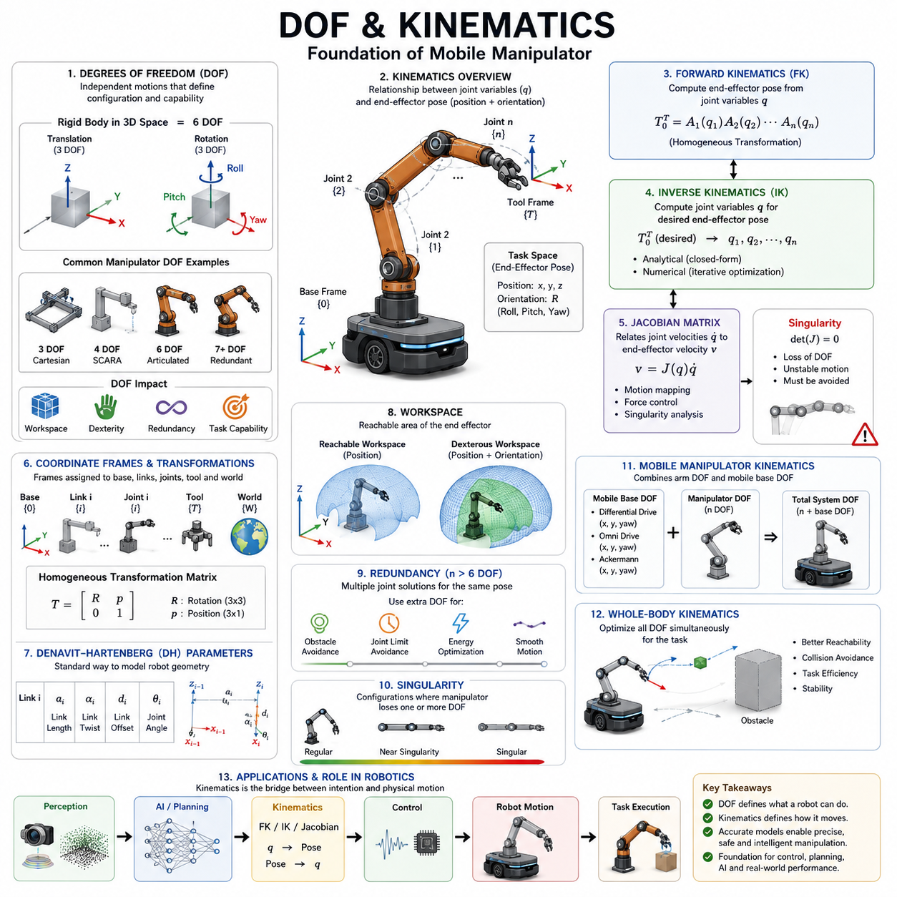
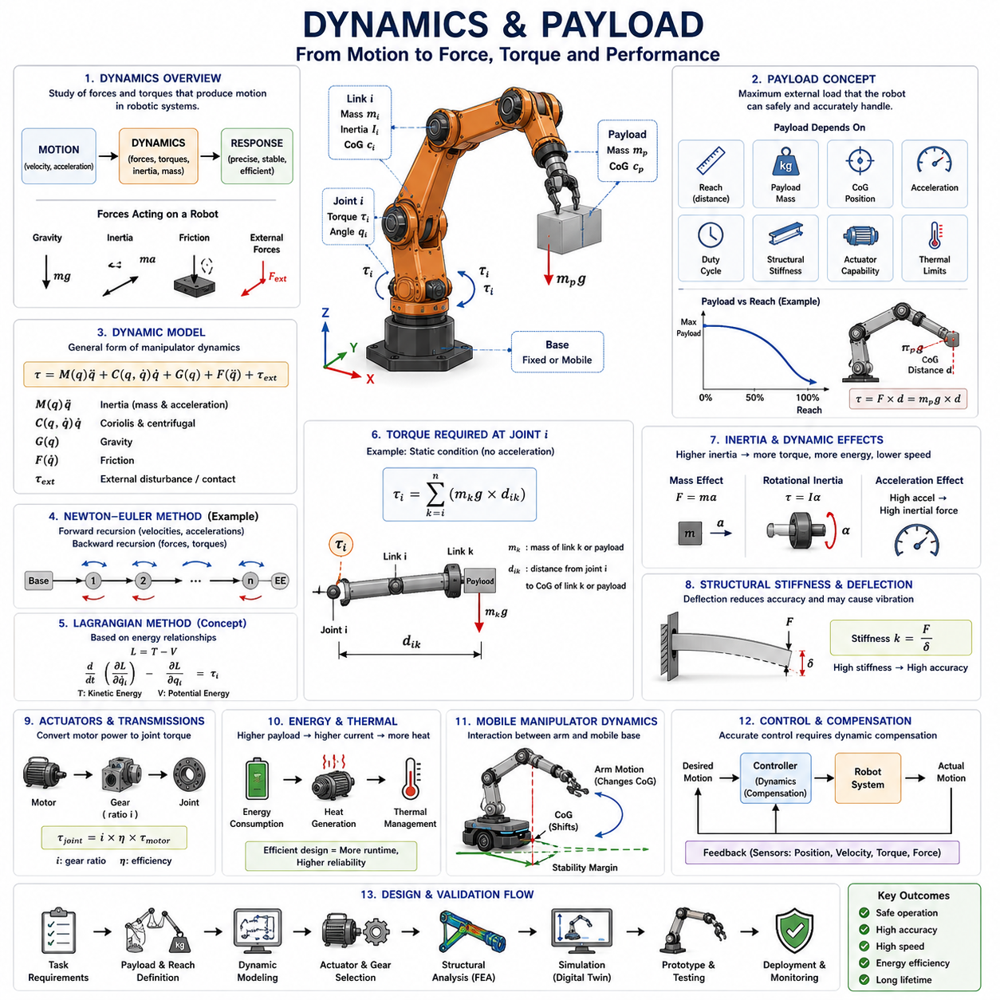
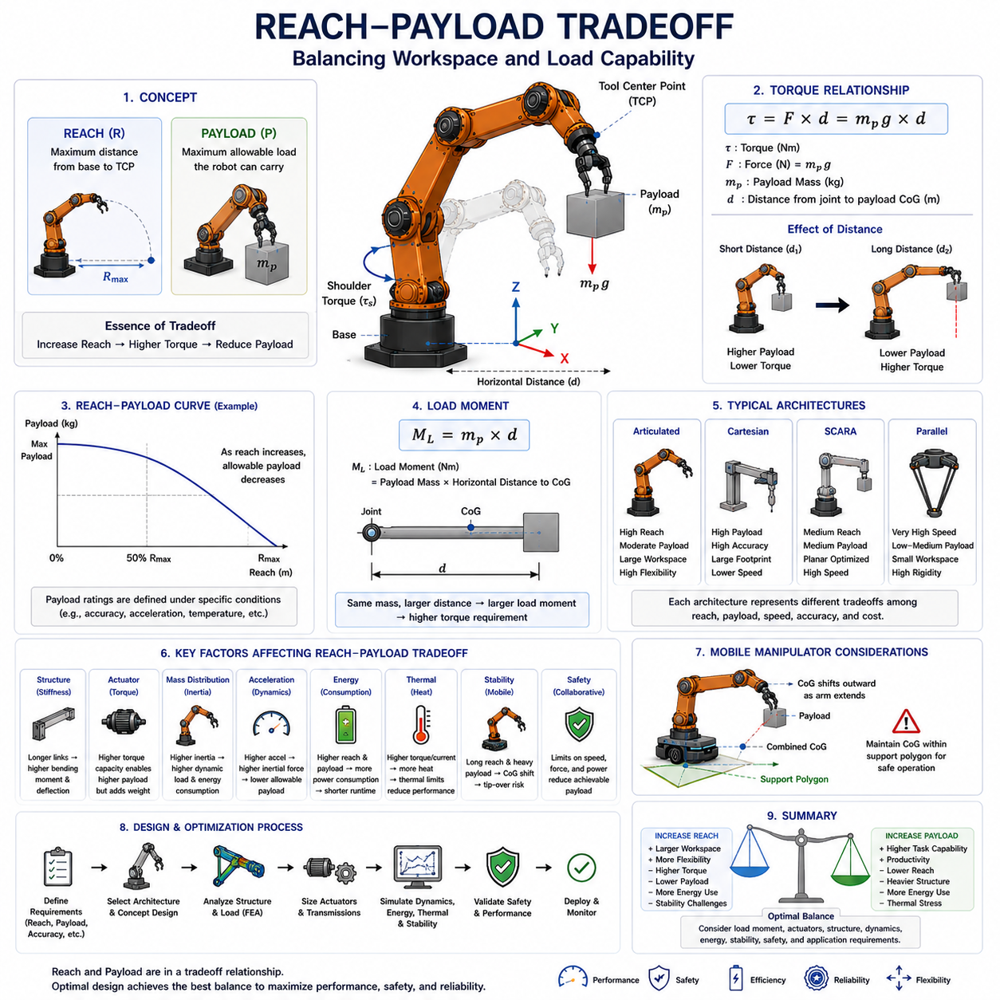
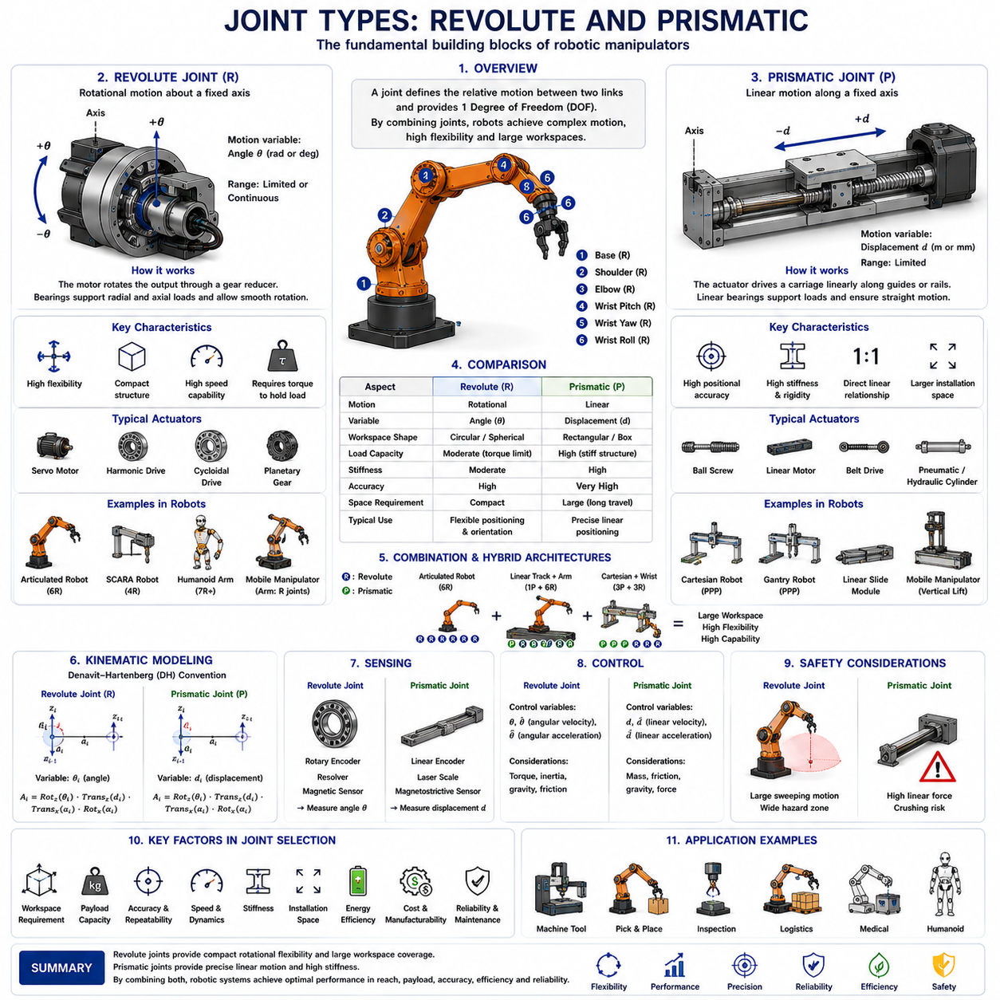
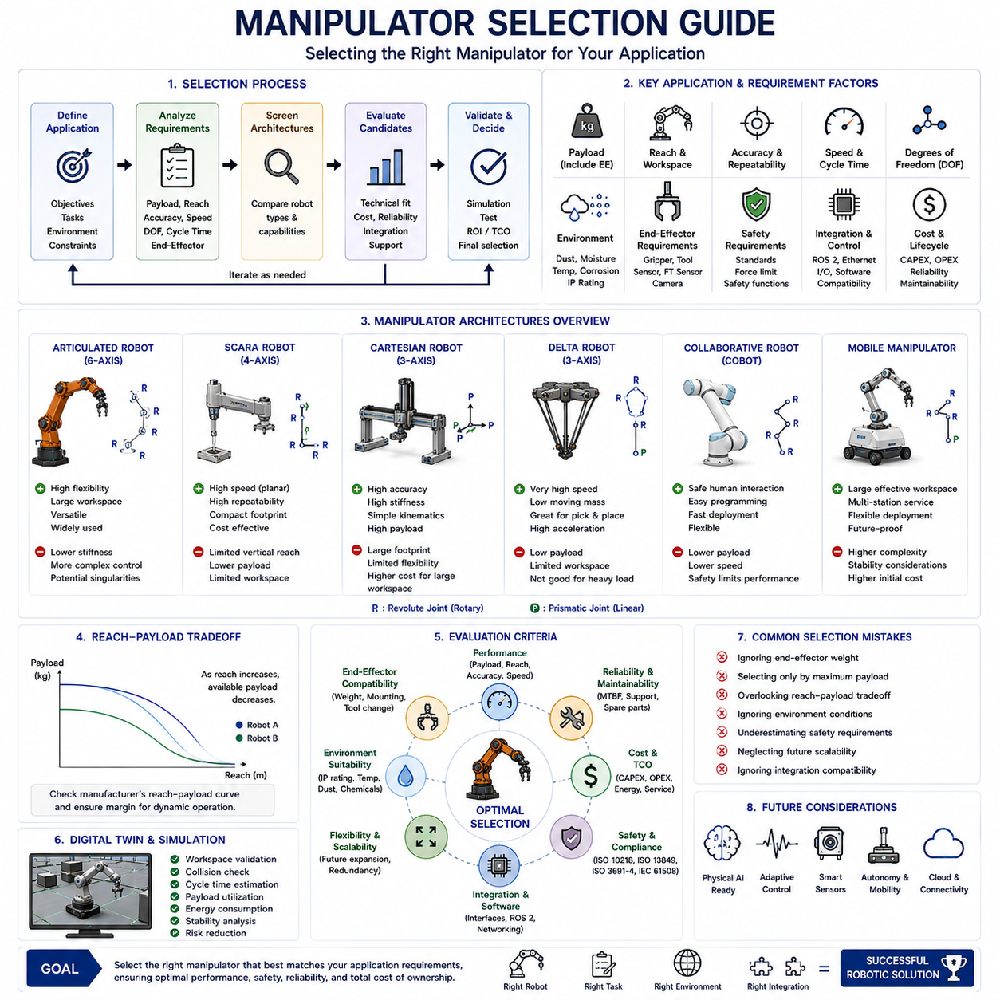

**Volume 14 Mobile Manipulator Architecture**


# Chapter 1. Manipulator Fundamentals

##  

## 1.1 DOF and Kinematics

{width="7.268055555555556in" height="7.268055555555556in"}

Degree of Freedom (DOF) and kinematics form the mathematical and physical foundation of every robotic manipulator. Whether the system is a small collaborative robot, a heavy industrial arm, a humanoid upper body, or a mobile manipulator mounted on an Autonomous Mobile Robot (AMR), the ability to describe and control motion begins with a precise understanding of how many independent motions a system can perform and how those motions relate to the position and orientation of the robot's end effector. Within the Hills Robotics Mobile Manipulator Architecture, DOF and kinematics represent the first layer of manipulator fundamentals because all higher-level functions such as motion planning, trajectory generation, collision avoidance, force control, visual servoing, and AI-based manipulation depend upon an accurate kinematic model.

A degree of freedom is defined as an independent variable that describes the configuration of a mechanical system. In robotics, each movable joint typically contributes one or more degrees of freedom. A revolute joint contributes rotational motion, while a prismatic joint contributes linear motion. The total number of degrees of freedom of a manipulator determines the range of motion that the robot can achieve and directly influences workspace size, dexterity, redundancy, and task capability. A simple Cartesian robot may possess three degrees of freedom corresponding to X, Y, and Z translation. A typical industrial robot arm possesses six degrees of freedom, allowing independent control of position and orientation in three-dimensional space. More advanced robots may contain seven or more degrees of freedom to provide redundancy and improved obstacle avoidance capabilities.

The concept of degrees of freedom originates from classical mechanics. In three-dimensional space, a rigid body possesses six fundamental degrees of freedom. Three correspond to translational movement along the X, Y, and Z axes. Three correspond to rotational movement around those same axes, commonly known as roll, pitch, and yaw. To completely define the pose of an object in space, all six variables must be specified. Therefore, a manipulator intended to position and orient a tool arbitrarily in a three-dimensional environment generally requires at least six controllable degrees of freedom.

In practical robotics applications, the number of degrees of freedom significantly affects system performance. A robot with fewer than six degrees of freedom may be capable of reaching a target position but may lack sufficient orientation control. For example, a four-axis SCARA robot is highly efficient for planar assembly operations but cannot achieve arbitrary tool orientations. A six-axis articulated robot can achieve most industrial manipulation tasks because it provides full positional and rotational control. A seven-axis manipulator introduces redundancy, meaning that multiple joint configurations can produce the same end-effector pose. This redundancy enables obstacle avoidance, singularity mitigation, joint limit avoidance, and improved ergonomic motion planning.

The workspace of a manipulator is closely related to its degree of freedom configuration. Workspace refers to the set of all positions that the end effector can reach. Reachable workspace describes every possible location that can be physically accessed, while dexterous workspace refers to positions where the robot can achieve arbitrary orientations. Increasing the number of degrees of freedom generally expands the dexterous workspace and improves manipulation flexibility. However, additional degrees of freedom also increase computational complexity, control requirements, mechanical cost, weight, and energy consumption.

Kinematics is the branch of mechanics that describes motion without considering the forces that cause it. In robotic systems, kinematics focuses on the relationship between joint variables and end-effector position and orientation. Kinematic analysis provides mathematical equations that determine where a robot will move when joints are commanded and conversely determine what joint motions are required to achieve a desired pose.

Robot kinematics is generally divided into forward kinematics and inverse kinematics. Forward kinematics calculates the end-effector pose based on known joint positions. Inverse kinematics calculates the required joint positions needed to achieve a desired end-effector pose. Together, these two functions form the basis of robot control systems.

Forward kinematics is conceptually straightforward. Given a set of joint angles and linear displacements, the position and orientation of the tool center point can be calculated through a sequence of coordinate transformations. Every joint contributes a transformation between adjacent coordinate frames. By multiplying these transformations together, the final position and orientation of the end effector can be determined relative to the robot base frame.

Coordinate systems play a critical role in kinematic analysis. Every robot consists of multiple coordinate frames attached to links, joints, sensors, tools, and work environments. The base frame defines the robot reference coordinate system. Intermediate frames are attached to each link. The tool frame defines the coordinate system at the end effector. World coordinates define the external environment. Transformations between these frames enable the robot to understand its own geometry and interact accurately with surrounding objects.

Homogeneous transformation matrices provide the standard mathematical framework for coordinate transformation. A homogeneous transformation matrix combines rotation and translation into a single matrix representation. By chaining transformation matrices along the kinematic chain, a robot can calculate the position and orientation of any link relative to any other coordinate frame.

One of the most widely used methods for describing robot geometry is the Denavit-Hartenberg (DH) convention. The DH convention provides a systematic approach for assigning coordinate frames and defining geometric relationships between robot links. Each link is described using four parameters: link length, link twist, link offset, and joint angle. Using these parameters, transformation matrices can be constructed efficiently for forward kinematic calculations.

Although the DH convention remains widely used in industrial robotics, modern robotics frameworks increasingly employ alternative representations such as Product of Exponentials (PoE), screw theory, and Lie group formulations. These methods provide improved mathematical consistency and better integration with advanced optimization algorithms used in contemporary robotic systems.

Inverse kinematics is generally more challenging than forward kinematics. While forward kinematics involves straightforward matrix multiplication, inverse kinematics requires solving nonlinear equations. A desired end-effector position may correspond to multiple valid joint configurations. In some cases, no solution may exist due to workspace limitations. In other cases, infinite solutions may exist due to kinematic redundancy.

Analytical inverse kinematics solutions can be derived for robots with specific geometric structures. Industrial six-axis robots often use analytical methods because they provide exact solutions with minimal computational cost. However, complex robots such as humanoids, dual-arm manipulators, and mobile manipulators frequently require numerical optimization techniques because analytical solutions become impractical.

Numerical inverse kinematics methods iteratively search for joint values that minimize pose error. Techniques such as Jacobian transpose, Jacobian pseudoinverse, damped least squares, gradient descent, and nonlinear optimization are commonly employed. These methods allow real-time operation even in highly redundant systems but require careful tuning to ensure stability and convergence.

The Jacobian matrix occupies a central position in robotic kinematics. The Jacobian relates joint velocities to end-effector velocities. It describes how small changes in joint motion affect tool motion. The Jacobian enables velocity control, force control, singularity analysis, and dynamic modeling. In mobile manipulator systems, Jacobians often combine arm kinematics and mobile platform kinematics into a unified representation.

Singularities represent critical configurations where the Jacobian loses rank. At a singularity, certain end-effector motions become impossible or require extremely large joint velocities. Singularities can cause unstable control behavior, degraded accuracy, and unexpected robot motion. Industrial robot controllers continuously monitor singularity proximity and adjust trajectories accordingly to maintain safe operation.

Redundancy plays an increasingly important role in modern robotics. A redundant manipulator possesses more degrees of freedom than are strictly necessary to achieve a task. For example, a seven-axis arm performing a six-dimensional pose task contains one extra degree of freedom. This additional freedom can be used to optimize secondary objectives such as obstacle avoidance, energy minimization, joint limit avoidance, cable management, or operator safety.

Mobile manipulators introduce additional complexity because the manipulator arm is mounted on a moving base. The mobile platform itself contributes degrees of freedom to the overall system. A differential-drive AMR may contribute planar translation and rotation capabilities, while an omnidirectional platform may contribute additional motion flexibility. Consequently, the overall kinematic model combines base motion and arm motion into a unified framework.

Whole-body kinematics is frequently employed in advanced mobile manipulation systems. Rather than treating the base and arm separately, the controller optimizes all available degrees of freedom simultaneously. This approach improves reachability, collision avoidance, and task execution efficiency. Whole-body control is particularly important in logistics automation, warehouse picking, service robotics, and humanoid systems.

Manipulator performance is heavily influenced by kinematic structure. Link lengths determine reach capability. Joint placement affects dexterity and workspace coverage. Mechanical offsets influence singularity locations. Therefore, kinematic design is often performed early in system architecture development to ensure that the manipulator can satisfy operational requirements before detailed mechanical design begins.

Payload capacity and kinematic performance are also interconnected. Longer links increase workspace but reduce stiffness and payload capability. Shorter links improve rigidity but limit reach. Engineers must balance reach, payload, accuracy, speed, and cost during manipulator architecture design. These tradeoffs become particularly important for mobile manipulators where vehicle stability and center-of-gravity management must also be considered.

In modern AI-enabled robotic systems, kinematic models remain essential despite advances in machine learning. Vision-based manipulation, reinforcement learning, imitation learning, and foundation-model-based robotics all ultimately rely on accurate geometric representations. AI may generate high-level goals, but execution still depends on precise kinematic calculations that convert intentions into physically achievable motions.

Simulation environments such as Gazebo, Isaac Sim, MuJoCo, Webots, and digital twin platforms utilize kinematic models extensively. Virtual robots use forward and inverse kinematics to generate realistic motion and validate task feasibility before deployment. Accurate kinematic modeling significantly reduces development risk and shortens commissioning time in industrial installations.

Within the Hills Robotics Mobile Manipulator Architecture, DOF and kinematics serve as the foundational engineering discipline that connects mechanical design, control systems, perception systems, AI planning frameworks, and industrial applications. Every manipulator configuration, from compact indoor logistics robots to large outdoor autonomous service platforms, begins with a rigorous definition of degrees of freedom and a mathematically robust kinematic model. As robotic systems evolve toward Physical AI, humanoid robotics, and autonomous mobile manipulation, the importance of kinematics continues to increase because it provides the essential bridge between digital intelligence and physical motion. Accurate kinematic modeling enables robots to understand their bodies, interact safely with the environment, optimize task execution, and ultimately perform complex manipulation tasks with the precision, reliability, and adaptability required by next-generation autonomous systems.

# 01_01 자유도(DOF, Degree of Freedom)와 운동학(Kinematics)

자유도(DOF, Degree of Freedom)와 운동학(Kinematics)은 모든 로봇 매니퓰레이터(Manipulator)의 수학적·물리적 기초를 형성하는 핵심 개념이다. 소형 협동로봇(Collaborative Robot), 대형 산업용 로봇, 휴머노이드(Humanoid)의 상체, 또는 자율이동로봇(AMR, Autonomous Mobile Robot)에 장착된 모바일 매니퓰레이터(Mobile Manipulator)에 이르기까지, 로봇의 움직임을 기술하고 제어하는 모든 과정은 시스템이 수행할 수 있는 독립적인 운동의 수와 이러한 운동이 말단효과기(End Effector)의 위치 및 자세와 어떤 관계를 갖는지에 대한 이해에서 시작된다. 힐스로보틱스(Hills Robotics)의 모바일 매니퓰레이터 아키텍처(Mobile Manipulator Architecture)에서 자유도와 운동학은 가장 기본적인 계층으로 정의된다. 이는 모션 플래닝(Motion Planning), 궤적 생성(Trajectory Generation), 충돌 회피(Collision Avoidance), 힘 제어(Force Control), 비전 서보잉(Vision Servoing), 인공지능 기반 조작(AI-Based Manipulation)과 같은 모든 상위 기능이 정확한 운동학 모델(Kinematic Model)을 기반으로 하기 때문이다.

자유도는 기계 시스템의 상태를 설명하는 독립 변수의 개수로 정의된다. 로봇에서는 일반적으로 각 관절(Joint)이 하나 이상의 자유도를 제공한다. 회전 관절(Revolute Joint)은 회전 운동을 제공하며, 직선 관절(Prismatic Joint)은 선형 운동을 제공한다. 매니퓰레이터의 전체 자유도 수는 로봇이 수행할 수 있는 동작 범위를 결정하며 작업 공간(Workspace), 기민성(Dexterity), 중복성(Redundancy), 그리고 작업 수행 능력(Task Capability)에 직접적인 영향을 미친다.

예를 들어 단순한 직교형 로봇(Cartesian Robot)은 X축, Y축, Z축 이동에 해당하는 3개의 자유도를 가진다. 일반적인 산업용 로봇 팔은 6개의 자유도를 가지며 이를 통해 3차원 공간에서 위치와 자세를 독립적으로 제어할 수 있다. 보다 발전된 로봇은 7개 이상의 자유도를 보유하여 장애물 회피 능력과 자세 선택의 유연성을 향상시킨다.

자유도의 개념은 고전역학(Classical Mechanics)에서 유래하였다. 3차원 공간에 존재하는 강체(Rigid Body)는 기본적으로 6개의 자유도를 가진다. 이 중 3개는 X축, Y축, Z축 방향의 병진 운동(Translation)에 해당하며, 나머지 3개는 각 축을 중심으로 한 회전 운동(Rotation)에 해당한다. 일반적으로 이를 롤(Roll), 피치(Pitch), 요(Yaw)라고 부른다. 공간상 물체의 자세(Pose)를 완전히 정의하기 위해서는 이 6개의 변수 모두가 필요하다. 따라서 임의의 위치와 방향으로 공구를 배치해야 하는 로봇은 최소 6개의 제어 가능한 자유도를 필요로 한다.

실제 로봇 시스템에서 자유도의 수는 성능에 직접적인 영향을 미친다. 자유도가 6개 미만인 로봇은 특정 위치에 도달할 수는 있지만 원하는 방향으로 공구를 배치하지 못할 수 있다. 예를 들어 4축 스카라(SCARA) 로봇은 평면 조립 작업에 매우 효율적이지만 임의의 자세 제어는 어렵다. 반면 6축 산업용 로봇은 대부분의 제조 공정에 필요한 위치와 자세 제어를 모두 수행할 수 있다. 7축 로봇은 동일한 말단효과기 자세를 여러 관절 조합으로 구현할 수 있는 중복 자유도(Redundant DOF)를 제공한다. 이러한 중복성은 장애물 회피, 특이점(Singularity) 회피, 관절 한계(Joint Limit) 회피, 그리고 보다 자연스러운 동작 생성을 가능하게 한다.

작업 공간은 자유도 구성과 밀접한 관계가 있다. 작업 공간은 말단효과기가 도달할 수 있는 모든 위치의 집합이다. 도달 가능 작업 공간(Reachable Workspace)은 물리적으로 접근 가능한 모든 영역을 의미하며, 기민 작업 공간(Dexterous Workspace)은 임의의 자세를 구현할 수 있는 영역을 의미한다. 일반적으로 자유도가 증가할수록 기민 작업 공간은 확대되며 조작 능력이 향상된다. 하지만 자유도가 증가하면 제어 복잡도, 계산량, 기구부 비용, 무게, 전력 소비도 함께 증가한다.

운동학은 힘이나 토크를 고려하지 않고 물체의 움직임만을 연구하는 역학 분야이다. 로봇 공학에서 운동학은 관절 변수와 말단효과기 위치 및 자세 사이의 관계를 분석한다. 운동학 모델은 특정 관절 명령이 주어졌을 때 로봇이 어디로 이동하는지 설명하며, 반대로 원하는 위치에 도달하기 위해 어떤 관절 움직임이 필요한지를 계산한다.

로봇 운동학은 크게 순기구학(Forward Kinematics)과 역기구학(Inverse Kinematics)으로 나뉜다. 순기구학은 관절 각도와 위치가 주어졌을 때 말단효과기의 위치와 자세를 계산한다. 역기구학은 원하는 말단효과기 자세를 달성하기 위해 필요한 관절 값을 계산한다. 이 두 기능은 모든 로봇 제어기의 핵심 기반이 된다.

순기구학은 개념적으로 비교적 단순하다. 각 관절의 위치와 각도가 알려져 있으면 일련의 좌표 변환(Coordinate Transformation)을 통해 말단효과기의 위치와 방향을 계산할 수 있다. 각 관절은 인접한 링크(Link) 사이의 변환을 제공하며, 이러한 변환 행렬을 순차적으로 곱하면 최종 말단효과기의 자세를 구할 수 있다.

좌표계(Coordinate Frame)는 운동학에서 매우 중요한 역할을 한다. 로봇은 베이스 좌표계(Base Frame), 링크 좌표계(Link Frame), 공구 좌표계(Tool Frame), 센서 좌표계(Sensor Frame), 그리고 월드 좌표계(World Frame)와 같은 다양한 좌표계를 가진다. 이러한 좌표계 간의 관계를 정확히 정의해야 로봇이 자신의 위치를 이해하고 환경과 정확하게 상호작용할 수 있다.

동차변환행렬(Homogeneous Transformation Matrix)은 회전과 이동을 하나의 행렬로 표현하는 표준적인 방법이다. 로봇은 여러 개의 변환 행렬을 연결하여 어떤 링크의 위치와 자세를 다른 좌표계 기준으로 계산할 수 있다.

로봇 기하구조를 표현하는 가장 널리 사용되는 방법 중 하나는 DH 규약(Denavit-Hartenberg Convention)이다. DH 규약은 각 링크와 관절의 관계를 체계적으로 표현하기 위한 방법으로 링크 길이(Link Length), 링크 비틀림(Link Twist), 링크 오프셋(Link Offset), 관절 각도(Joint Angle)의 네 가지 매개변수를 사용한다. 이를 통해 복잡한 로봇 구조도 일관된 방식으로 모델링할 수 있다.

최근에는 DH 규약 외에도 PoE(Product of Exponentials), 스크류 이론(Screw Theory), 리 군(Lie Group) 기반 방법이 사용되고 있다. 이러한 접근법은 현대 최적화 알고리즘 및 AI 기반 로봇 제어 시스템과 더욱 자연스럽게 통합될 수 있다.

역기구학은 일반적으로 순기구학보다 훨씬 복잡하다. 순기구학은 단순한 행렬 연산으로 계산할 수 있지만 역기구학은 비선형 방정식(Nonlinear Equation)을 풀어야 한다. 하나의 목표 자세에 대해 여러 개의 관절 해(Solution)가 존재할 수 있으며, 경우에 따라서는 해가 존재하지 않을 수도 있다. 또한 중복 자유도가 있는 경우 무한히 많은 해가 존재할 수 있다.

특정 구조의 산업용 로봇은 해석적 역기구학(Analytical Inverse Kinematics)을 사용할 수 있다. 이는 정확한 해를 매우 빠르게 계산할 수 있는 장점이 있다. 그러나 휴머노이드, 양팔 로봇(Dual-Arm Robot), 모바일 매니퓰레이터와 같이 복잡한 구조에서는 수치해석 기반 역기구학(Numerical Inverse Kinematics)이 주로 사용된다.

수치적 역기구학은 목표 자세와 실제 자세의 오차를 최소화하는 방향으로 반복 계산을 수행한다. 야코비안 전치(Jacobian Transpose), 야코비안 의사역행렬(Jacobian Pseudoinverse), 감쇠 최소자승법(Damped Least Squares), 경사하강법(Gradient Descent), 비선형 최적화(Nonlinear Optimization) 등의 기법이 널리 사용된다.

야코비안 행렬(Jacobian Matrix)은 운동학에서 가장 중요한 수학적 도구 중 하나이다. 야코비안은 관절 속도(Joint Velocity)와 말단효과기 속도(End-Effector Velocity)의 관계를 표현한다. 이를 통해 속도 제어(Velocity Control), 힘 제어(Force Control), 특이점 분석(Singularity Analysis), 동역학 모델링(Dynamic Modeling)을 수행할 수 있다.

특이점은 야코비안의 랭크(Rank)가 감소하는 특수한 자세를 의미한다. 특이점에서는 특정 방향의 움직임이 불가능해지거나 매우 큰 관절 속도가 요구된다. 이는 제어 불안정, 정확도 저하, 예기치 않은 동작을 유발할 수 있기 때문에 산업용 로봇 제어기에서는 항상 특이점 근처를 감시하고 회피 경로를 생성한다.

중복성은 현대 로봇 시스템에서 매우 중요한 개념이다. 작업 수행에 필요한 자유도보다 더 많은 자유도를 가진 로봇은 추가 자유도를 활용하여 에너지 소비 최소화, 장애물 회피, 케이블 보호, 관절 마모 감소, 안전성 향상과 같은 부가 목표를 동시에 달성할 수 있다.

모바일 매니퓰레이터는 이동 플랫폼(Mobile Base)과 로봇 팔이 결합된 시스템이다. 따라서 이동 플랫폼 자체도 자유도를 제공한다. 차동구동(Differential Drive) 플랫폼은 평면 이동과 회전을 제공하며, 전방향 이동 플랫폼(Omnidirectional Platform)은 더욱 유연한 움직임을 제공한다. 따라서 모바일 매니퓰레이터의 운동학은 로봇 팔과 이동 플랫폼을 하나의 통합 모델로 표현해야 한다.

이를 위해 전신 운동학(Whole-Body Kinematics)이 사용된다. 전신 운동학은 로봇 팔과 이동 플랫폼의 모든 자유도를 동시에 고려하여 최적의 동작을 생성한다. 이는 창고 피킹(Warehouse Picking), 물류 자동화(Logistics Automation), 서비스 로봇(Service Robot), 휴머노이드 로봇(Humanoid Robot)에서 매우 중요한 기술이다.

매니퓰레이터 성능은 운동학 구조에 의해 크게 결정된다. 링크 길이는 작업 반경을 결정하며, 관절 배치는 기민성과 작업 공간을 결정한다. 기계적 오프셋(Mechanical Offset)은 특이점의 위치에 영향을 준다. 따라서 운동학 설계는 기계 설계 초기 단계에서 수행되어야 하며, 로봇이 요구된 작업 범위와 성능을 만족하는지 검증해야 한다.

페이로드(Payload)와 운동학의 관계도 중요하다. 긴 링크는 작업 공간을 증가시키지만 강성(Stiffness)을 감소시키고 페이로드 능력을 제한할 수 있다. 반대로 짧은 링크는 강성과 정밀도를 향상시키지만 도달 범위를 감소시킨다. 따라서 설계자는 작업 반경, 하중, 정밀도, 속도, 비용 간의 균형을 고려해야 한다.

최근의 AI 기반 로봇 시스템에서도 운동학은 여전히 필수적이다. 비전 기반 조작(Vision-Based Manipulation), 강화학습(Reinforcement Learning), 모방학습(Imitation Learning), 파운데이션 모델 로보틱스(Foundation Model Robotics) 모두 최종적으로는 정확한 기하학적 모델을 필요로 한다. AI는 목표를 생성할 수 있지만, 실제 관절 명령으로 변환하는 과정은 운동학 모델이 담당한다.

시뮬레이션(Simulation) 환경에서도 운동학은 핵심 역할을 수행한다. Gazebo, Isaac Sim, MuJoCo, Webots, 디지털 트윈(Digital Twin) 플랫폼은 모두 순기구학과 역기구학을 이용하여 현실적인 로봇 동작을 생성한다. 정확한 운동학 모델은 개발 위험을 줄이고 실제 현장 구축 시간을 단축시킨다.

결론적으로 자유도와 운동학은 모바일 매니퓰레이터 설계의 가장 기본적인 토대이다. 이는 기계 설계(Mechanical Design), 제어 시스템(Control System), 인지 시스템(Perception System), AI 계획 시스템(AI Planning System), 산업 응용(Industrial Application)을 연결하는 핵심 기술이다. 미래의 피지컬 AI(Physical AI), 휴머노이드, 자율 모바일 매니퓰레이션(Autonomous Mobile Manipulation) 기술이 발전할수록 운동학의 중요성은 더욱 커질 것이다. 운동학은 디지털 지능(Digital Intelligence)을 실제 물리적 움직임(Physical Motion)으로 변환하는 다리 역할을 하며, 로봇이 자신의 신체를 이해하고 환경과 안전하게 상호작용하며 복잡한 작업을 정밀하게 수행할 수 있도록 하는 근본적인 기술이다.

##  

## 1.2 Dynamics and Payload

{width="7.268055555555556in" height="7.268055555555556in"}

Dynamics and payload are among the most important engineering considerations in manipulator design because they determine how a robotic arm behaves under real-world operating conditions. While kinematics describes motion without considering forces, dynamics describes the relationship between motion, force, torque, inertia, mass distribution, energy transfer, and external loads. In practical robotic systems, every movement of a manipulator requires the generation of torque by actuators, the transmission of mechanical power through joints and gear systems, and the management of inertial effects caused by moving links and payloads. Therefore, an accurate understanding of dynamics is essential for achieving high precision, high speed, high reliability, and safe operation in industrial automation, logistics robotics, collaborative robots, mobile manipulators, and future Physical AI systems. Within the Hills Robotics Mobile Manipulator Architecture, dynamics and payload analysis form the foundation for manipulator sizing, actuator selection, structural design, control system development, and safety verification.

Robot dynamics can be defined as the study of forces and torques that produce motion in robotic systems. Unlike kinematics, which focuses only on position, velocity, and acceleration, dynamics examines the causes of motion and the physical interactions between robot components and the environment. Dynamic analysis allows engineers to determine how much torque is required to move a robotic arm, how much power must be delivered by motors, how external loads influence performance, and how the system will respond to disturbances during operation.

Every manipulator consists of multiple rigid bodies connected by joints. Each link possesses mass, center of gravity, and moment of inertia. When a manipulator moves, all of these physical properties contribute to the overall dynamic behavior of the system. The torque required at each joint is influenced not only by the payload being carried but also by the mass and inertia of every upstream and downstream link. Consequently, dynamic analysis becomes increasingly important as manipulator size, speed, and payload capacity increase.

Payload refers to the maximum external load that a manipulator can safely and accurately handle under specified operating conditions. Payload is often one of the first specifications examined when selecting a robot because it directly determines the range of applications that can be performed. However, payload is frequently misunderstood as a simple weight limit. In reality, payload capacity depends on a complex interaction among reach, acceleration, duty cycle, center of gravity, structural stiffness, actuator capability, thermal limits, and safety requirements.

A manipulator that can lift 20 kilograms at a short reach may not be able to lift the same load at full extension. As the arm extends outward, the distance between the payload and the robot base increases, creating a larger moment arm. This increases gravitational torque and significantly increases the load experienced by the shoulder joints. Therefore, payload specifications are typically defined under specific reach conditions and operating envelopes.

The center of gravity of the payload plays a critical role in manipulator performance. A payload positioned close to the wrist flange generates lower torque than an identical payload mounted farther away. This is because torque is proportional to force multiplied by distance. Even a relatively light tool can create substantial joint loading if its center of gravity is located far from the robot wrist. Engineers must therefore evaluate both payload mass and payload geometry during system integration.

In robotic systems, forces arise from multiple sources. Gravitational forces act continuously on all robot links and payloads. Inertial forces arise when links accelerate or decelerate. Friction forces occur within bearings, gears, and transmission mechanisms. External forces may be generated by contact with workpieces, fixtures, tools, or human operators. The dynamic control system must compensate for all of these effects to achieve precise motion.

Newton's laws of motion provide the foundation for robotic dynamics. The first law describes the tendency of objects to maintain their current state of motion. The second law relates force to mass and acceleration. The third law describes equal and opposite reaction forces. These principles govern every robotic movement and serve as the basis for dynamic modeling techniques used in manipulator design.

Dynamic models are generally developed using two major approaches. The Newton-Euler method calculates forces and torques by propagating motion and force information through the kinematic chain. This method is computationally efficient and widely used in real-time robot controllers. The Lagrangian method formulates dynamic equations using energy relationships. Although mathematically more abstract, the Lagrangian approach provides valuable insights into system behavior and is commonly used in academic research and advanced robotic analysis.

The dynamic equation of a robotic manipulator can generally be expressed as a combination of inertial effects, Coriolis effects, centrifugal effects, gravitational loading, frictional effects, and external disturbances. Together these terms describe the complete relationship between joint motion and required actuator torque. Modern robot controllers continuously solve these equations in real time to generate accurate motor commands.

Inertia is one of the most influential parameters in manipulator dynamics. Inertia describes the resistance of an object to changes in motion. Larger masses and longer link lengths produce higher inertia. As a result, heavy robotic arms require more powerful actuators and more sophisticated control algorithms. Inertia also affects stopping distance, acceleration capability, vibration characteristics, and energy consumption.

Moment of inertia describes rotational resistance around an axis. For robotic joints, moment of inertia often becomes more significant than simple mass because most manipulator motion involves rotational movement. The distribution of mass throughout the robot structure strongly influences the rotational inertia experienced by each joint. Lightweight structural materials such as aluminum alloys, carbon fiber composites, and high-strength polymers are often used to reduce inertia while maintaining structural rigidity.

Acceleration requirements significantly influence payload capacity. A manipulator moving slowly can often handle heavier payloads than the same robot operating at high speed. Rapid acceleration creates large inertial forces that increase joint loading and structural stress. Consequently, manufacturers often specify both maximum payload and maximum acceleration limits to ensure safe operation.

Structural stiffness is another key consideration. When a manipulator carries a payload, the links experience elastic deformation. Excessive deflection reduces positioning accuracy and may introduce vibration. High-stiffness structures maintain accuracy under load but typically increase weight and cost. Engineers must therefore balance stiffness, weight, manufacturability, and payload requirements during mechanical design.

Deflection becomes especially important in precision applications such as semiconductor manufacturing, metrology, laser processing, and industrial inspection. Even small structural deformations can result in significant positioning errors at the tool center point. Finite Element Analysis (FEA) is commonly used during design to evaluate structural behavior under dynamic loading conditions.

Payload also directly affects energy consumption. Larger payloads require higher motor torque and increased electrical power. The relationship between payload and power consumption is particularly important in battery-powered mobile manipulators. Excessive payload demand can reduce operating time, increase thermal stress, and accelerate battery degradation. Therefore, payload optimization often becomes a critical system-level design objective.

Thermal effects represent another important aspect of payload management. Motors, gearboxes, drives, and power electronics generate heat during operation. As payload increases, actuator current increases, causing higher thermal loading. If temperatures exceed safe operating limits, performance degradation or component failure may occur. Industrial robot controllers often incorporate thermal protection algorithms that reduce speed or torque when temperature thresholds are approached.

Servo motors form the primary actuation mechanism in most modern manipulators. The selection of servo motors requires detailed analysis of payload requirements, peak torque demands, continuous torque requirements, acceleration profiles, and duty cycles. Oversized motors increase cost and weight, while undersized motors reduce performance and reliability. Therefore, dynamic simulation is frequently employed to optimize actuator sizing before hardware development begins.

Gear reduction systems are commonly used to amplify motor torque. Harmonic drives, cycloidal reducers, planetary gear systems, and strain wave gears are widely employed in robotic manipulators. Gear ratios influence torque capability, positioning resolution, efficiency, backlash characteristics, and dynamic response. The choice of transmission technology must align with payload and performance objectives.

Dynamic balancing techniques can significantly improve manipulator efficiency. Counterweights, springs, gas struts, and passive balancing mechanisms reduce the torque required to overcome gravity. By compensating for gravitational loading, these systems decrease motor power requirements and improve energy efficiency. Dynamic balancing is particularly valuable in large manipulators carrying heavy payloads.

Mobile manipulators introduce additional complexity because the manipulator is mounted on a moving platform. Payload motion affects vehicle stability, wheel loading, suspension behavior, and tipping resistance. As the arm extends, the combined center of gravity of the system shifts. Dynamic interactions between the arm and the mobile base must therefore be considered during system design and control.

Tip-over stability is a major concern in mobile manipulation. A heavy payload positioned at maximum reach may move the center of gravity outside the vehicle support polygon, causing instability. Stability analysis evaluates worst-case operating conditions to ensure safe operation. Outriggers, wider wheelbases, lower battery placement, and active stability control systems are commonly employed to improve stability margins.

Collaborative robots require additional payload considerations because human safety becomes a primary design objective. Impact energy, contact forces, joint torque limits, and dynamic response characteristics must comply with safety standards. Payload limitations in collaborative robots are often determined not only by mechanical capability but also by allowable human interaction forces.

Force-controlled manipulation introduces further dynamic challenges. Applications such as assembly, polishing, grinding, welding, and surface finishing require precise regulation of contact forces. In these applications, the manipulator must simultaneously manage payload dynamics and environmental interaction forces. Advanced impedance control and admittance control strategies are frequently employed to achieve stable and compliant behavior.

Artificial intelligence is increasingly being integrated into dynamic control systems. Machine learning algorithms can predict payload characteristics, estimate dynamic parameters, compensate for modeling errors, and optimize energy consumption. AI-based controllers may continuously adapt to changing payload conditions and improve performance over time through data-driven learning.

Digital twin environments have become valuable tools for dynamic analysis and payload validation. Simulation platforms such as Isaac Sim, Gazebo, MuJoCo, and industrial digital twin systems enable engineers to evaluate payload performance before physical deployment. Dynamic simulation can identify structural weaknesses, actuator limitations, thermal bottlenecks, and stability concerns early in the development process.

Future Physical AI systems will place even greater emphasis on dynamic intelligence. Humanoid robots, autonomous service robots, warehouse automation systems, logistics manipulators, and mobile inspection platforms will increasingly operate in unstructured environments where payload conditions vary continuously. These systems must understand not only geometric relationships but also dynamic interactions involving force, momentum, energy, and contact behavior.

Ultimately, dynamics and payload engineering represent the bridge between theoretical motion and practical robotic performance. Kinematics determines where a robot can move, while dynamics determines whether the robot can move there safely, efficiently, accurately, and repeatedly. Every successful manipulator design depends upon a comprehensive understanding of mass distribution, inertia, force generation, structural behavior, actuator capability, energy consumption, and payload management. Within the Hills Robotics Mobile Manipulator Architecture, dynamics and payload analysis provide the engineering framework that enables reliable manipulation across industrial automation, logistics handling, inspection robotics, collaborative robotics, and next-generation Physical AI applications. By accurately modeling and controlling dynamic behavior, robotic systems can achieve higher productivity, improved safety, greater energy efficiency, and enhanced operational intelligence in increasingly demanding real-world environments.

# 01_02 동역학(Dynamics)과 페이로드(Payload)

동역학(Dynamics)과 페이로드(Payload)는 매니퓰레이터(Manipulator) 설계에서 가장 중요한 공학적 요소 중 하나이다. 이는 로봇 팔이 실제 환경에서 어떻게 동작하는지를 결정하기 때문이다. 운동학(Kinematics)이 힘(Force)을 고려하지 않고 움직임(Motion)만을 설명한다면, 동역학은 움직임을 발생시키는 힘, 토크(Torque), 관성(Inertia), 질량(Mass), 에너지(Energy), 그리고 외부 하중(External Load) 간의 관계를 설명한다. 실제 로봇 시스템에서 모든 움직임은 액추에이터(Actuator)가 토크를 생성하고, 기어 시스템(Gear System)을 통해 동력을 전달하며, 링크(Link)와 페이로드에 의해 발생하는 관성 효과를 극복하는 과정이다. 따라서 동역학에 대한 정확한 이해는 고정밀, 고속, 고신뢰성, 그리고 안전한 로봇 시스템을 구축하기 위한 필수 조건이다. 힐스로보틱스(Hills Robotics)의 모바일 매니퓰레이터 아키텍처(Mobile Manipulator Architecture)에서는 동역학과 페이로드 분석이 매니퓰레이터 크기 선정, 액추에이터 선정, 구조 설계, 제어기 개발, 안전성 검증의 핵심 기반이 된다.

동역학은 로봇 시스템에서 운동을 발생시키는 힘과 토크를 연구하는 분야이다. 운동학이 위치(Position), 속도(Velocity), 가속도(Acceleration)에 집중한다면, 동역학은 왜 그러한 움직임이 발생하는지를 설명한다. 이를 통해 특정 동작을 수행하기 위해 필요한 토크, 모터 출력, 외부 하중의 영향, 그리고 외란(Disturbance)에 대한 시스템의 반응을 예측할 수 있다.

모든 매니퓰레이터는 여러 개의 강체(Rigid Body)가 관절(Joint)로 연결된 구조이다. 각 링크는 질량(Mass), 무게중심(Center of Gravity), 관성모멘트(Moment of Inertia)를 가진다. 로봇이 움직일 때 이러한 물리적 특성들은 전체 시스템의 동적 특성(Dynamic Behavior)에 영향을 미친다. 특정 관절에서 필요한 토크는 단순히 페이로드의 무게뿐만 아니라 링크 자체의 질량과 관성에도 영향을 받는다. 따라서 로봇의 크기와 속도, 그리고 페이로드가 증가할수록 동역학 분석의 중요성은 더욱 커진다.

페이로드는 로봇이 지정된 조건에서 안전하고 정확하게 취급할 수 있는 최대 외부 하중을 의미한다. 페이로드는 로봇 선택 시 가장 먼저 검토되는 사양 중 하나이지만 단순한 무게 제한을 의미하지는 않는다. 실제 페이로드 능력은 작업 반경(Reach), 가속도, 사용 주기(Duty Cycle), 무게중심 위치, 구조 강성(Stiffness), 액추에이터 성능, 열적 한계(Thermal Limit), 그리고 안전 요구사항에 의해 결정된다.

예를 들어 20kg을 들어 올릴 수 있는 로봇이라도 팔이 완전히 펼쳐진 상태에서는 동일한 무게를 취급하지 못할 수 있다. 이는 하중이 로봇 베이스(Base)에서 멀어질수록 모멘트 암(Moment Arm)이 증가하기 때문이다. 모멘트 암이 증가하면 중력 토크(Gravitational Torque)가 증가하고, 특히 어깨 관절(Shoulder Joint)에 큰 부하가 발생한다. 따라서 제조사는 일반적으로 특정 작업 반경에서의 페이로드를 기준으로 성능을 정의한다.

페이로드의 무게중심은 매우 중요한 변수이다. 동일한 무게라도 손목 플랜지(Wrist Flange)에 가까이 장착된 경우와 멀리 장착된 경우의 토크 요구량은 크게 다르다. 토크는 힘과 거리의 곱으로 정의되기 때문이다. 따라서 시스템 통합(System Integration) 시에는 단순한 무게뿐만 아니라 공구(Tool)의 형상과 무게중심 위치도 반드시 고려해야 한다.

로봇 시스템에는 다양한 힘이 작용한다. 중력(Gravity)은 모든 링크와 페이로드에 지속적으로 작용한다. 관성력(Inertial Force)은 가속과 감속 과정에서 발생한다. 마찰력(Friction Force)은 베어링(Bearing), 기어(Gear), 감속기(Reducer) 내부에서 발생한다. 또한 공작물(Workpiece), 공구, 작업 환경과의 접촉에 의해 외력이 발생할 수 있다. 제어 시스템은 이러한 모든 힘을 보상해야 정밀한 움직임을 구현할 수 있다.

뉴턴 운동 법칙(Newton\'s Laws of Motion)은 로봇 동역학의 기본이 된다. 제1법칙은 물체가 현재 상태를 유지하려는 성질을 설명하며, 제2법칙은 힘과 질량, 가속도의 관계를 정의한다. 제3법칙은 작용과 반작용의 원리를 설명한다. 이러한 법칙은 모든 로봇 동작의 근본적인 물리 법칙이다.

동역학 모델은 일반적으로 뉴턴-오일러 방법(Newton-Euler Method)과 라그랑주 방법(Lagrangian Method)을 사용하여 구축된다. 뉴턴-오일러 방법은 링크를 따라 힘과 운동 정보를 전달하면서 토크를 계산하는 방식으로 실시간 제어기에 널리 사용된다. 라그랑주 방법은 운동에너지(Kinetic Energy)와 위치에너지(Potential Energy)를 기반으로 동역학 방정식을 유도하는 방법으로, 학술 연구와 고급 모델링에 자주 활용된다.

로봇의 동역학 방정식은 일반적으로 관성 항(Inertia Term), 코리올리 항(Coriolis Term), 원심력 항(Centrifugal Term), 중력 항(Gravity Term), 마찰 항(Friction Term), 외란 항(Disturbance Term)으로 구성된다. 현대 로봇 제어기는 이러한 방정식을 실시간으로 계산하여 정밀한 모터 명령을 생성한다.

관성은 동역학에서 가장 중요한 요소 중 하나이다. 관성은 물체가 운동 상태의 변화를 저항하는 정도를 의미한다. 질량이 크고 링크가 길수록 관성은 증가한다. 따라서 대형 로봇은 더 강력한 액추에이터와 정교한 제어 알고리즘이 필요하다. 관성은 가속 능력, 정지 거리, 진동 특성, 에너지 소비에도 직접적인 영향을 미친다.

관성모멘트는 회전에 대한 저항 정도를 의미한다. 대부분의 로봇 관절은 회전 운동을 수행하기 때문에 단순 질량보다 관성모멘트가 더 중요한 경우가 많다. 따라서 알루미늄 합금(Aluminum Alloy), 탄소섬유 복합재(Carbon Fiber Composite), 고강도 폴리머(High-Strength Polymer)와 같은 경량 재료가 널리 사용된다.

가속도 요구사항은 페이로드 능력에 직접적인 영향을 준다. 동일한 로봇이라도 저속으로 움직일 때는 더 무거운 하중을 처리할 수 있지만, 고속 동작 시에는 큰 관성력이 발생하여 허용 페이로드가 감소한다. 따라서 제조사는 최대 페이로드뿐만 아니라 최대 가속도 조건도 함께 명시한다.

구조 강성은 또 다른 핵심 요소이다. 매니퓰레이터가 하중을 지지할 때 링크는 탄성 변형(Elastic Deformation)을 겪는다. 과도한 변형은 위치 정밀도(Position Accuracy)를 저하시킨다. 높은 강성은 정밀도를 향상시키지만 무게와 비용을 증가시킨다. 따라서 설계자는 강성, 무게, 제조성, 비용 간의 균형을 고려해야 한다.

반도체 제조(Semiconductor Manufacturing), 계측(Metrology), 레이저 가공(Laser Processing), 산업 검사(Industrial Inspection)와 같은 고정밀 응용 분야에서는 구조 변형이 매우 중요하다. 작은 변형도 말단효과기(Tool Center Point)의 큰 위치 오차로 이어질 수 있기 때문이다. 이를 분석하기 위해 유한요소해석(FEA, Finite Element Analysis)이 널리 사용된다.

페이로드는 에너지 소비에도 직접적인 영향을 준다. 무거운 하중을 처리하기 위해서는 더 큰 토크와 전력이 필요하다. 특히 배터리 기반 모바일 매니퓰레이터에서는 페이로드 증가가 운용 시간 감소, 배터리 열화, 발열 증가로 이어질 수 있다. 따라서 시스템 설계 시 에너지 최적화는 중요한 목표가 된다.

열 관리(Thermal Management)도 중요한 요소이다. 모터(Motor), 감속기, 서보 드라이브(Servo Drive), 전력 전자장치(Power Electronics)는 동작 중 열을 발생시킨다. 페이로드가 증가하면 모터 전류가 증가하고 열 발생량도 증가한다. 온도가 허용 한계를 초과하면 성능 저하 또는 장비 손상이 발생할 수 있다. 따라서 산업용 로봇은 열 보호 알고리즘(Thermal Protection Algorithm)을 포함하는 경우가 많다.

서보 모터(Servo Motor)는 대부분의 현대 매니퓰레이터에서 사용되는 핵심 액추에이터이다. 서보 모터 선정 시에는 최대 토크(Peak Torque), 연속 토크(Continuous Torque), 가속도 프로파일(Acceleration Profile), 사용 주기(Duty Cycle), 페이로드 조건을 모두 고려해야 한다. 과대 설계는 비용 증가를 초래하고, 과소 설계는 성능 저하와 신뢰성 문제를 유발한다.

감속기(Gear Reducer)는 모터 토크를 증폭하기 위해 사용된다. 하모닉 드라이브(Harmonic Drive), 사이클로이드 감속기(Cycloidal Reducer), 유성기어 감속기(Planetary Gear Reducer) 등이 널리 활용된다. 감속비(Gear Ratio)는 토크 성능, 위치 분해능(Position Resolution), 효율(Efficiency), 백래시(Backlash), 응답성(Response)에 영향을 준다.

동적 평형(Dynamic Balancing)은 효율을 크게 향상시킬 수 있다. 카운터웨이트(Counterweight), 스프링(Spring), 가스 스트럿(Gas Strut) 등을 이용하여 중력 하중을 보상하면 모터 부하를 줄이고 에너지 효율을 향상시킬 수 있다.

모바일 매니퓰레이터는 이동 플랫폼(Mobile Base)에 로봇 팔이 장착되어 있기 때문에 더욱 복잡하다. 팔의 움직임은 차량 안정성(Vehicle Stability), 바퀴 하중(Wheel Loading), 전복 안정성(Tip-Over Stability)에 영향을 준다. 팔이 전개될수록 시스템 전체의 무게중심이 이동하기 때문이다.

전복 안정성은 모바일 매니퓰레이터에서 가장 중요한 안전 요소 중 하나이다. 무거운 페이로드를 최대 작업 반경에서 취급할 경우 무게중심이 지지 다각형(Support Polygon) 밖으로 이동할 수 있다. 이를 방지하기 위해 넓은 휠베이스(Wheelbase), 아웃리거(Outriggers), 저중심 배터리 배치, 능동 안정화 제어(Active Stability Control)가 사용된다.

협동로봇(Collaborative Robot)은 추가적인 고려가 필요하다. 사람과 직접 상호작용하기 때문에 충돌 에너지(Impact Energy), 접촉력(Contact Force), 관절 토크 제한(Joint Torque Limit) 등이 안전 규격을 만족해야 한다. 따라서 협동로봇의 페이로드는 단순한 기계적 능력뿐 아니라 인간 안전성 기준에 의해 결정된다.

조립(Assembly), 연마(Polishing), 용접(Welding), 가공(Machining)과 같은 힘 제어 기반 작업에서는 더욱 복잡한 동역학 문제가 발생한다. 이러한 작업에서는 환경과의 접촉력을 정밀하게 제어해야 하므로 임피던스 제어(Impedance Control)와 어드미턴스 제어(Admittance Control)가 사용된다.

최근에는 인공지능(AI)이 동역학 제어에도 적용되고 있다. 머신러닝(Machine Learning)은 페이로드 추정, 동역학 파라미터 식별, 모델 오차 보상, 에너지 최적화에 활용된다. AI 기반 제어기는 변화하는 하중 조건에 적응하며 시간이 지남에 따라 성능을 개선할 수 있다.

디지털 트윈(Digital Twin)과 시뮬레이션(Simulation) 플랫폼 역시 중요한 역할을 한다. Isaac Sim, Gazebo, MuJoCo와 같은 환경에서는 실제 제작 전에 페이로드 성능, 구조 강도, 열 특성, 안정성 문제를 검증할 수 있다. 이는 개발 비용과 위험을 크게 줄여준다.

미래의 피지컬 AI(Physical AI) 시스템에서는 동역학의 중요성이 더욱 커질 것이다. 휴머노이드(Humanoid), 물류 로봇(Logistics Robot), 서비스 로봇(Service Robot), 검사 로봇(Inspection Robot)은 끊임없이 변화하는 환경에서 다양한 하중을 다루어야 한다. 이러한 시스템은 단순히 위치를 계산하는 수준을 넘어 힘, 운동량(Momentum), 에너지, 접촉 행동(Contact Behavior)을 이해해야 한다.

결론적으로 동역학과 페이로드는 이론적인 움직임과 실제 로봇 성능을 연결하는 핵심 기술이다. 운동학이 로봇이 어디까지 움직일 수 있는지를 정의한다면, 동역학은 그 움직임을 안전하고 효율적이며 정확하게 수행할 수 있는지를 결정한다. 질량 분포(Mass Distribution), 관성, 힘 생성, 구조 거동, 액추에이터 성능, 에너지 소비, 페이로드 관리는 모든 성공적인 매니퓰레이터 설계의 핵심 요소이다. 힐스로보틱스 모바일 매니퓰레이터 아키텍처에서 동역학과 페이로드 분석은 산업 자동화(Industrial Automation), 물류 로봇(Logistics Robotics), 검사 자동화(Inspection Automation), 협동로봇(Collaborative Robotics), 그리고 차세대 피지컬 AI 시스템을 구현하기 위한 핵심 공학 프레임워크를 제공한다. 이를 통해 로봇은 더욱 높은 생산성(Productivity), 안전성(Safety), 에너지 효율(Energy Efficiency), 그리고 지능형 자율성(Intelligent Autonomy)을 달성할 수 있다.

##  

## 1.3 Reach Payload Tradeoff

{width="7.268055555555556in" height="7.268055555555556in"}

Reach and payload are two of the most fundamental performance parameters in manipulator engineering, and the relationship between them represents one of the most important design tradeoffs in robotics. Every robotic arm, regardless of whether it is an industrial manipulator, collaborative robot, mobile manipulator, service robot, humanoid arm, or autonomous inspection system, operates within physical limitations imposed by mechanical structure, actuator capability, dynamic performance, energy consumption, and safety requirements. The reach-payload tradeoff describes the inherent engineering compromise between how far a manipulator can extend and how much weight it can safely and accurately handle. Within the Hills Robotics Mobile Manipulator Architecture, understanding this relationship is essential for selecting manipulator configurations, defining application requirements, sizing actuators, optimizing structural design, and ensuring safe operation under all working conditions.

Reach refers to the maximum distance that a manipulator can extend from its base to its tool center point. It is typically measured as the maximum radial distance between the robot base coordinate frame and the end-effector coordinate frame. Reach determines the physical workspace that the robot can access and directly influences operational flexibility. A manipulator with greater reach can access larger work areas, serve multiple workstations, interact with wider environments, and perform tasks that would otherwise require repositioning of either the robot or the workpiece.

Payload refers to the maximum allowable load that a manipulator can carry while maintaining specified performance criteria. Payload includes the workpiece, tooling, grippers, sensors, adapters, cabling, and any additional equipment attached to the robot wrist. Payload specifications are typically defined under specific operating conditions and include considerations for positioning accuracy, repeatability, acceleration capability, thermal limits, and long-term reliability.

At first glance, it may appear desirable to maximize both reach and payload simultaneously. However, fundamental principles of mechanics make this objective difficult to achieve. As reach increases, the mechanical leverage acting on the manipulator joints also increases. The longer the distance between the payload and the robot base, the greater the torque required to support and move that payload. Consequently, extending reach without reducing payload demands larger actuators, stronger structures, heavier components, and greater energy consumption.

The origin of the reach-payload tradeoff can be understood through basic torque relationships. Torque is defined as force multiplied by distance. When a payload is positioned farther from the base, the moment arm increases. Even if the payload mass remains constant, the required joint torque increases proportionally with reach. For example, a payload positioned one meter from a joint generates twice as much torque as the same payload positioned only half a meter away. This simple relationship becomes one of the dominant constraints in manipulator design.

The shoulder joint of an articulated robot typically experiences the greatest impact from reach-payload interactions. When the arm extends outward, the shoulder must support not only the payload but also the weight of all downstream links, joints, cables, sensors, and tooling. The resulting torque demand can increase dramatically as extension increases. Consequently, shoulder actuator sizing often becomes the primary factor limiting overall manipulator performance.

Structural loading also increases as reach increases. Longer links experience greater bending moments and larger deflections under load. Even if actuators can generate sufficient torque, structural deformation may reduce positioning accuracy and repeatability. Excessive deflection can introduce vibration, oscillation, resonance, and dynamic instability. Therefore, manipulator designers must consider both actuator capacity and structural stiffness when evaluating reach-payload requirements.

The concept of load moment is frequently used to evaluate manipulator performance. Load moment is calculated as payload mass multiplied by the horizontal distance between the payload center of gravity and the supporting joint. This parameter provides a more meaningful representation of mechanical loading than payload mass alone because it captures the influence of reach. Two payloads with identical mass may create very different loading conditions depending on their center-of-gravity locations.

Payload ratings published by robot manufacturers often reflect reach-payload tradeoffs. A manipulator may be capable of lifting a heavy load at short reach but may require payload reduction when operating near maximum extension. Consequently, many manufacturers provide payload curves rather than a single payload value. These curves illustrate the allowable payload across different reach distances and operating conditions.

Center-of-gravity location plays a critical role in reach-payload analysis. Payload specifications assume a particular center-of-gravity distance from the robot flange. If the actual payload center of gravity is located farther from the flange, the effective load moment increases. This can reduce safe payload capacity even when total payload mass remains unchanged. Therefore, payload evaluation must always include geometric considerations in addition to weight measurements.

Manipulator architecture strongly influences reach-payload performance. Industrial articulated robots generally achieve high reach and moderate payload capability through optimized joint placement and lightweight structures. Cartesian robots often provide high payload capability but may require larger installation footprints. SCARA robots excel in planar operations but are optimized for specific reach and payload ranges. Parallel robots achieve high speed but typically operate within relatively limited workspaces. Each architecture reflects different engineering compromises between reach, payload, speed, accuracy, and cost.

Material selection has a significant impact on reach-payload optimization. Lightweight materials reduce self-weight and inertia, allowing a greater proportion of actuator capacity to be allocated to payload handling. Aluminum alloys remain widely used due to their favorable strength-to-weight ratio. Carbon fiber composites offer even greater weight reduction and stiffness improvements but introduce higher manufacturing costs. Advanced materials increasingly play a key role in next-generation robotic systems where performance demands continue to increase.

Actuator selection is directly influenced by reach-payload requirements. Motors must generate sufficient continuous torque to support static loading while also providing sufficient peak torque for dynamic motion. Larger motors increase payload capability but also increase system weight and inertia. The additional weight of larger actuators can partially offset the benefits they provide, creating a recursive design challenge that requires careful optimization.

Gear reduction systems are often employed to increase torque capacity without requiring excessively large motors. Harmonic drives, strain-wave gears, cycloidal reducers, and planetary gear systems allow compact actuators to generate substantial output torque. However, higher reduction ratios may reduce speed, introduce compliance, and influence dynamic responsiveness. Therefore, transmission design becomes another critical element in managing reach-payload tradeoffs.

Dynamic performance introduces additional complexity. A manipulator carrying a payload while stationary experiences primarily gravitational loading. However, during acceleration and deceleration, inertial forces add significantly to joint loading. A robot capable of carrying 20 kilograms at low speed may not safely handle the same payload during aggressive motion profiles. Consequently, payload specifications often vary according to acceleration limits and duty-cycle requirements.

Energy consumption is closely linked to reach-payload relationships. Increased reach and increased payload both require higher actuator torque, which translates directly into greater electrical power consumption. In mobile manipulators powered by onboard batteries, this relationship becomes particularly important. Excessive payload demands can significantly reduce operational endurance and increase charging frequency. Energy-efficient manipulator design therefore requires careful balancing of workspace requirements and payload capability.

Thermal performance represents another limiting factor. As torque demands increase, motor current increases. Higher current generates additional heat within motors, gearboxes, drives, and power electronics. Sustained operation near maximum payload capacity can result in thermal saturation and reduced performance. Thermal constraints often define practical operating limits even when mechanical structures and actuators are theoretically capable of handling larger loads.

Reach-payload tradeoffs become especially important in mobile manipulation systems. Unlike stationary industrial robots, mobile manipulators must consider vehicle stability in addition to arm performance. As reach increases, the combined center of gravity of the robot and payload moves outward from the vehicle base. Heavy payloads at maximum extension may create tipping hazards, particularly during acceleration, turning, or operation on uneven terrain.

The stability margin of a mobile manipulator is directly affected by reach and payload. Engineers evaluate the position of the combined center of gravity relative to the support polygon formed by the vehicle wheels or tracks. Safe operation requires maintaining the center of gravity within this support polygon under all expected operating conditions. Wider wheelbases, lower battery placement, active stabilization systems, and intelligent motion planning algorithms are commonly used to improve stability margins.

Collaborative robots present unique reach-payload challenges because safety requirements limit actuator power and allowable contact forces. Increasing reach often increases kinetic energy during motion, which can affect human safety compliance. Consequently, collaborative robot designers must carefully balance reach, payload, speed, and safety performance within regulatory constraints.

Humanoid robots face even more complex reach-payload optimization challenges. Human-like arm proportions provide versatile workspace coverage but introduce substantial leverage effects. To maintain efficient operation, humanoid systems often rely on lightweight structures, distributed actuation architectures, advanced motion planning, and whole-body coordination strategies. The reach-payload relationship in humanoid robotics extends beyond individual arms and influences the overall balance and mobility of the system.

Artificial intelligence is increasingly being applied to reach-payload optimization. Machine learning algorithms can estimate payload characteristics in real time, predict dynamic loading conditions, optimize trajectories, and adjust motion parameters to maximize efficiency. AI-based controllers may dynamically adapt speed, acceleration, and posture according to current payload conditions, improving both safety and performance.

Digital twin technologies provide powerful tools for evaluating reach-payload relationships before physical deployment. Virtual simulation environments such as Isaac Sim, Gazebo, MuJoCo, and industrial engineering platforms allow engineers to evaluate structural loading, actuator utilization, energy consumption, thermal behavior, and stability margins under various operating scenarios. Simulation-driven design significantly reduces development risk and enables more effective optimization.

Modern industrial applications increasingly require flexible reach-payload capabilities. Logistics automation systems may handle lightweight packages one moment and heavy containers the next. Inspection robots may carry sophisticated sensor payloads while maintaining large operational workspaces. Mobile manipulators operating in warehouses, factories, hospitals, ports, and smart cities must continuously adapt to changing payload conditions while preserving safe and efficient operation.

Future Physical AI systems will place even greater emphasis on intelligent reach-payload management. Autonomous robots will be expected to understand not only the geometry of their environment but also the dynamic implications of carrying different objects. These systems will continuously evaluate reach requirements, payload characteristics, stability margins, energy consumption, and task priorities while generating optimal motion strategies in real time.

Ultimately, the reach-payload tradeoff represents one of the most fundamental engineering constraints in manipulator design. Increasing reach expands workspace and operational flexibility, while increasing payload expands task capability and productivity. However, both objectives compete for limited mechanical, electrical, structural, thermal, and energetic resources. Successful manipulator architecture requires a carefully balanced approach that considers load moments, actuator capacity, structural stiffness, dynamic performance, energy efficiency, stability, safety, and application requirements. Within the Hills Robotics Mobile Manipulator Architecture, reach-payload tradeoff analysis serves as a critical design discipline that guides manipulator selection, system integration, and operational optimization, ensuring that robotic systems achieve the highest possible performance while maintaining reliability, safety, and long-term operational effectiveness.

# 01_03 작업반경(Reach)과 페이로드(Payload)의 상충관계(Tradeoff)

작업반경(Reach)과 페이로드(Payload)는 매니퓰레이터(Manipulator) 설계에서 가장 중요한 성능 지표 중 두 가지이며, 이들 간의 관계는 로봇 공학에서 가장 대표적인 설계 상충관계(Design Tradeoff)를 형성한다. 산업용 로봇(Industrial Robot), 협동로봇(Collaborative Robot), 모바일 매니퓰레이터(Mobile Manipulator), 서비스 로봇(Service Robot), 휴머노이드(Humanoid), 자율 검사 로봇(Autonomous Inspection Robot) 등 모든 로봇 팔은 기계 구조(Mechanical Structure), 액추에이터 성능(Actuator Capability), 동적 성능(Dynamic Performance), 에너지 소비(Energy Consumption), 안전 요구사항(Safety Requirement)이라는 물리적 한계 안에서 동작한다. 작업반경과 페이로드의 상충관계는 로봇이 얼마나 멀리 도달할 수 있는지와 얼마나 무거운 하중을 안전하고 정확하게 다룰 수 있는지 사이에서 발생하는 필연적인 공학적 타협을 의미한다. 힐스로보틱스(Hills Robotics)의 모바일 매니퓰레이터 아키텍처(Mobile Manipulator Architecture)에서는 이 관계를 이해하는 것이 매니퓰레이터 선정, 응용 분야 정의, 액추에이터 크기 결정, 구조 최적화, 안전성 확보의 핵심이 된다.

작업반경은 로봇 베이스(Base)로부터 공구 중심점(TCP, Tool Center Point)까지 도달할 수 있는 최대 거리를 의미한다. 일반적으로 로봇 베이스 좌표계(Base Coordinate Frame)와 말단효과기(End Effector) 좌표계 사이의 최대 반경 거리로 정의된다. 작업반경은 로봇이 접근할 수 있는 작업 공간(Workspace)의 크기를 결정하며 운용 유연성(Operation Flexibility)에 직접적인 영향을 준다. 작업반경이 큰 로봇은 더 넓은 영역에 접근할 수 있고, 여러 작업 스테이션(Workstation)을 커버할 수 있으며, 더 다양한 환경과 상호작용할 수 있다.

반면 페이로드는 로봇이 지정된 성능 조건을 유지하면서 운반할 수 있는 최대 허용 하중(Maximum Allowable Load)을 의미한다. 여기에는 공작물(Workpiece), 공구(Tooling), 그리퍼(Gripper), 센서(Sensor), 어댑터(Adapter), 케이블(Cable) 등 손목(Wrist)에 장착되는 모든 장비가 포함된다. 페이로드는 단순히 무게만을 의미하는 것이 아니라 위치 정확도(Position Accuracy), 반복 정밀도(Repeatability), 가속 능력(Acceleration Capability), 열 한계(Thermal Limit), 장기 신뢰성(Long-Term Reliability) 등을 포함한 종합적인 성능 지표이다.

처음에는 작업반경과 페이로드를 동시에 최대화하는 것이 이상적으로 보일 수 있다. 그러나 기계공학(Mechanics)의 기본 원리상 이것은 매우 어렵다. 작업반경이 증가하면 관절(Joint)에 작용하는 레버 효과(Leverage Effect)가 커지게 된다. 페이로드가 로봇 베이스에서 멀어질수록 이를 지탱하고 움직이기 위해 필요한 토크(Torque)가 증가한다. 따라서 작업반경을 늘리기 위해서는 더 큰 액추에이터, 더 강한 구조물, 더 무거운 부품, 그리고 더 많은 에너지가 필요하게 된다.

이러한 상충관계는 토크의 기본 원리로 설명할 수 있다. 토크는 힘(Force)과 거리(Distance)의 곱으로 정의된다. 페이로드가 베이스로부터 멀어질수록 모멘트 암(Moment Arm)이 증가한다. 페이로드 질량이 동일하더라도 거리가 증가하면 필요한 토크도 비례적으로 증가한다. 예를 들어 동일한 하중이 관절에서 1m 떨어져 있을 경우, 0.5m 떨어져 있을 때보다 약 두 배의 토크를 요구한다. 이러한 단순한 관계가 매니퓰레이터 설계의 가장 중요한 제약 조건 중 하나가 된다.

관절형 로봇(Articulated Robot)의 경우 어깨 관절(Shoulder Joint)이 이러한 영향을 가장 크게 받는다. 팔이 앞으로 완전히 뻗어 있을 때 어깨 관절은 페이로드뿐 아니라 그 아래에 위치한 링크(Link), 관절, 케이블, 센서, 공구의 무게까지 모두 지지해야 한다. 따라서 팔이 펼쳐질수록 요구 토크는 급격히 증가하며, 결국 어깨 액추에이터의 크기가 전체 로봇 성능을 제한하는 주요 요소가 된다.

구조 하중(Structural Loading) 역시 작업반경 증가에 따라 커진다. 긴 링크는 더 큰 굽힘 모멘트(Bending Moment)를 받게 되며 처짐(Deflection)도 증가한다. 액추에이터가 충분한 토크를 생성할 수 있더라도 구조 변형이 발생하면 위치 정확도와 반복 정밀도가 저하될 수 있다. 과도한 처짐은 진동(Vibration), 공진(Resonance), 동적 불안정성(Dynamic Instability)을 유발할 수 있기 때문에 구조 강성(Stiffness)은 매우 중요한 설계 요소이다.

이러한 평가를 위해 자주 사용되는 개념이 로드 모멘트(Load Moment)이다. 로드 모멘트는 페이로드 질량과 무게중심(Center of Gravity)까지의 수평 거리의 곱으로 계산된다. 이는 단순한 무게보다 실제 하중 상태를 더 정확하게 나타낸다. 동일한 무게의 물체라도 무게중심 위치에 따라 관절에 가해지는 부하는 크게 달라질 수 있다.

로봇 제조사가 제공하는 페이로드 사양 역시 이러한 관계를 반영한다. 대부분의 로봇은 짧은 작업반경에서는 높은 페이로드를 처리할 수 있지만, 최대 작업반경 근처에서는 허용 페이로드가 감소한다. 따라서 제조사들은 단일 페이로드 값 대신 작업반경에 따른 페이로드 곡선(Payload Curve)을 제공하는 경우가 많다.

무게중심 위치는 작업반경-페이로드 분석에서 매우 중요한 변수이다. 일반적인 페이로드 사양은 특정 무게중심 거리를 기준으로 정의된다. 만약 실제 장착된 공구의 무게중심이 더 멀리 위치한다면 로드 모멘트가 증가하고 안전한 페이로드 용량은 감소한다. 따라서 단순히 무게만 보는 것이 아니라 형상과 무게중심도 반드시 고려해야 한다.

매니퓰레이터 구조 자체도 작업반경과 페이로드 성능에 큰 영향을 준다. 관절형 로봇은 비교적 높은 작업반경과 중간 수준의 페이로드를 제공한다. 직교형 로봇(Cartesian Robot)은 높은 페이로드 능력을 가지지만 설치 공간이 크다. 스카라(SCARA)는 평면 작업에 최적화되어 있으며, 병렬형 로봇(Parallel Robot)은 매우 빠른 속도를 제공하지만 작업 공간은 제한적이다. 각각의 구조는 작업반경, 페이로드, 속도, 정확도, 비용 사이에서 서로 다른 균형점을 가진다.

재료 선택(Material Selection) 역시 매우 중요하다. 가벼운 재료는 자체 무게(Self Weight)와 관성(Inertia)을 줄여 더 많은 액추에이터 용량을 페이로드 처리에 사용할 수 있게 한다. 알루미늄 합금(Aluminum Alloy)은 우수한 강도 대비 무게 비율 때문에 널리 사용된다. 탄소섬유 복합재(Carbon Fiber Composite)는 더욱 가볍고 강성이 높지만 제조 비용이 증가한다.

액추에이터 선정 역시 작업반경과 페이로드 요구사항에 직접적으로 영향을 받는다. 모터(Motor)는 정적 하중을 지지할 수 있는 연속 토크(Continuous Torque)와 동적 움직임을 위한 최대 토크(Peak Torque)를 모두 제공해야 한다. 더 큰 모터는 페이로드 능력을 향상시키지만 동시에 시스템 무게와 관성을 증가시킨다. 따라서 설계자는 최적화를 통해 균형을 찾아야 한다.

감속기(Gear Reducer)는 작은 모터로도 큰 토크를 생성할 수 있게 한다. 하모닉 드라이브(Harmonic Drive), 스트레인 웨이브 기어(Strain-Wave Gear), 사이클로이드 감속기(Cycloidal Reducer), 유성기어 감속기(Planetary Gear Reducer)가 대표적이다. 하지만 감속비(Gear Ratio)가 증가하면 속도 저하와 응답성 감소가 발생할 수 있기 때문에 적절한 선택이 필요하다.

동적 성능(Dynamic Performance)은 작업반경과 페이로드 관계를 더욱 복잡하게 만든다. 정지 상태에서는 주로 중력 하중만 고려하면 되지만, 가속(Acceleration)과 감속(Deceleration)이 발생하면 관성력이 추가된다. 따라서 정지 상태에서는 20kg을 처리할 수 있는 로봇이라도 고속 동작에서는 동일한 페이로드를 안전하게 다루지 못할 수 있다.

에너지 소비(Energy Consumption) 역시 중요한 요소이다. 작업반경과 페이로드가 증가하면 요구 토크가 증가하고, 이는 곧 전력 소비 증가로 이어진다. 특히 배터리 기반 모바일 매니퓰레이터에서는 과도한 페이로드가 운용 시간(Operation Time)을 크게 감소시킬 수 있다.

열 성능(Thermal Performance)도 제한 요소가 된다. 높은 토크는 높은 전류를 요구하며, 이는 모터, 감속기, 드라이브, 전력 전자장치에서 더 많은 열을 발생시킨다. 장시간 최대 하중 상태로 운전할 경우 열 포화(Thermal Saturation)가 발생할 수 있으며 성능 저하와 부품 수명 감소를 초래할 수 있다.

모바일 매니퓰레이터에서는 작업반경과 페이로드가 차량 안정성(Vehicle Stability)에도 영향을 준다. 팔이 앞으로 뻗어 나갈수록 시스템 전체의 무게중심이 차량 외곽으로 이동한다. 무거운 하중을 최대 작업반경에서 취급할 경우 전복(Tip-Over)의 위험이 발생할 수 있다.

안정성 여유(Stability Margin)는 지지 다각형(Support Polygon) 내부에 전체 무게중심이 유지되는지로 평가된다. 넓은 휠베이스(Wheelbase), 낮은 위치의 배터리(Battery Placement), 능동 안정화 시스템(Active Stabilization System), 지능형 경로 계획(Intelligent Motion Planning)은 안정성을 향상시키기 위해 자주 사용된다.

협동로봇은 사람과 함께 작업하기 때문에 더욱 엄격한 제한을 가진다. 작업반경이 증가하면 운동 에너지(Kinetic Energy)가 증가할 수 있으며 이는 안전 규격 준수에 영향을 미친다. 따라서 협동로봇 설계자는 작업반경, 페이로드, 속도, 안전성 간의 균형을 신중하게 조정해야 한다.

휴머노이드 로봇은 더욱 복잡한 문제를 가진다. 인간과 유사한 팔 길이는 넓은 작업 공간을 제공하지만 동시에 큰 레버 효과를 발생시킨다. 이를 해결하기 위해 휴머노이드는 경량 구조, 분산형 액추에이터(Distributed Actuation), 전신 제어(Whole-Body Control), 고급 모션 플래닝(Motion Planning)을 사용한다.

최근에는 인공지능(AI)이 작업반경-페이로드 최적화에도 활용되고 있다. 머신러닝(Machine Learning)은 실시간으로 페이로드를 추정하고, 동적 하중을 예측하며, 최적 경로를 생성하고, 에너지 효율을 향상시킬 수 있다. AI 기반 제어기는 현재 하중 상태에 따라 속도, 가속도, 자세를 자동 조정하여 성능과 안전성을 동시에 개선할 수 있다.

디지털 트윈(Digital Twin)과 시뮬레이션(Simulation)은 작업반경-페이로드 관계를 분석하는 강력한 도구이다. Isaac Sim, Gazebo, MuJoCo와 같은 플랫폼은 구조 하중, 액추에이터 사용률, 에너지 소비, 열 특성, 안정성을 사전에 평가할 수 있게 해준다. 이를 통해 개발 위험을 줄이고 설계를 최적화할 수 있다.

현대 산업 환경에서는 유연한 작업반경-페이로드 성능이 점점 더 중요해지고 있다. 물류 자동화(Logistics Automation), 검사 로봇(Inspection Robot), 병원 로봇(Hospital Robot), 항만 로봇(Port Robot), 스마트 시티 로봇(Smart City Robot) 등은 끊임없이 변화하는 하중 조건에 대응해야 한다.

미래의 피지컬 AI(Physical AI) 시스템은 단순히 공간 기하학(Geometry)을 이해하는 것을 넘어, 물체를 들었을 때 발생하는 동적 영향(Dynamic Implication)까지 이해해야 한다. 이러한 시스템은 작업반경, 페이로드, 안정성, 에너지 소비, 작업 우선순위를 실시간으로 평가하면서 최적의 움직임을 생성하게 될 것이다.

결론적으로 작업반경과 페이로드의 상충관계는 매니퓰레이터 설계에서 가장 기본적인 공학적 제약 조건 중 하나이다. 작업반경을 늘리면 작업 공간과 유연성이 향상되지만, 페이로드 능력은 감소할 수 있다. 반대로 페이로드를 증가시키면 작업 능력은 향상되지만 더 강한 구조와 더 큰 액추에이터가 필요하다. 따라서 성공적인 매니퓰레이터 설계는 로드 모멘트(Load Moment), 액추에이터 용량(Actuator Capacity), 구조 강성(Structural Stiffness), 동적 성능(Dynamic Performance), 에너지 효율(Energy Efficiency), 안정성(Stability), 안전성(Safety), 응용 분야(Application Requirement)를 종합적으로 고려하여 균형을 찾는 과정이다. 힐스로보틱스 모바일 매니퓰레이터 아키텍처에서는 이러한 작업반경-페이로드 분석이 매니퓰레이터 선정, 시스템 통합, 성능 최적화의 핵심 설계 기준으로 활용되며, 궁극적으로 높은 성능과 안전성, 신뢰성을 동시에 달성하는 기반이 된다.

##  

## 1.4 Joint Types Revolute Prismatic

{width="7.268055555555556in" height="7.268055555555556in"}

Joint types represent the fundamental building blocks of every robotic manipulator. Regardless of whether a robot is an industrial manipulator, collaborative robot, mobile manipulator, service robot, humanoid arm, inspection robot, logistics robot, or future Physical AI system, its ability to move originates from the motion allowed by its joints. A joint defines the relative movement between two connected links and determines the degrees of freedom available within the mechanical structure. The selection, arrangement, and integration of joints directly influence workspace, payload capability, dexterity, stiffness, control complexity, energy consumption, manufacturing cost, and long-term reliability. Within the Hills Robotics Mobile Manipulator Architecture, understanding joint types is a foundational requirement because all manipulator kinematics, dynamics, motion planning, and control algorithms are ultimately built upon joint-level motion characteristics.

In robotics, a joint is a mechanical connection that allows controlled movement between two rigid bodies. Similar to biological joints found in the human body, robotic joints define how motion can occur within a mechanical system. The shoulder, elbow, wrist, hip, knee, and ankle of a humanoid robot are all examples of joint implementations. The fundamental purpose of a robotic joint is to provide predictable and controllable motion while transmitting force, torque, and structural loads throughout the robot.

The two most important joint types in robotics are the revolute joint and the prismatic joint. These two joint types form the basis of almost all industrial robotic architectures. More complex joints can often be modeled as combinations of revolute and prismatic motions. Consequently, a deep understanding of these two joint categories is essential for manipulator design and analysis.

A revolute joint provides rotational motion around a fixed axis. This type of joint is often referred to as a rotary joint because its primary movement is angular rotation. Revolute joints are the most common joint type found in industrial robotics because rotational motion can be generated efficiently using electric motors, gear systems, and rotary actuators. Most articulated industrial robot arms rely almost entirely on revolute joints to achieve high flexibility and large workspaces.

The motion of a revolute joint is typically described by an angular variable. This variable represents the rotation angle between two connected links. Depending on the mechanical design, the allowable rotation range may be limited or continuous. Some joints may rotate only within a specific angular range such as ±180 degrees, while others may provide continuous rotation without mechanical limits.

One of the primary advantages of revolute joints is their compact mechanical design. Electric motors naturally generate rotational motion, making revolute joints relatively simple to implement. Rotary encoders can measure joint position accurately, and high-ratio gear reductions can generate significant output torque while maintaining compact packaging. As a result, revolute joints dominate industrial automation systems.

Human anatomy provides an intuitive example of revolute motion. The elbow behaves approximately as a single-axis revolute joint. The knee exhibits similar rotational characteristics. Many robotic joints intentionally mimic biological motion because rotational movement offers efficient force transmission and flexible positioning capabilities.

Industrial articulated robots commonly employ six revolute joints arranged in a serial kinematic chain. The first three joints primarily position the arm within the workspace, while the final three joints orient the tool. This configuration provides six degrees of freedom and allows arbitrary positioning and orientation within a large operating envelope.

The shoulder joint of an industrial robot often represents the most heavily loaded revolute joint because it must support the weight of all downstream links and payloads. Consequently, shoulder joints typically employ large motors, high-capacity bearings, and substantial gear reduction systems. Dynamic analysis frequently identifies shoulder joint torque as one of the primary design constraints.

Wrist joints are also revolute joints but generally experience lower loading requirements. Instead of generating large positioning forces, wrist joints focus primarily on orientation control. Therefore, wrist actuators can often be smaller and lighter while still achieving high rotational speeds and positioning accuracy.

Revolute joints provide excellent workspace flexibility because rotational movement can cover large areas with relatively short links. By combining multiple revolute joints, complex trajectories and orientations become achievable. This capability explains why revolute joints remain the dominant solution for industrial manipulation tasks.

However, revolute joints also introduce certain challenges. As rotational motion accumulates through multiple links, kinematic analysis becomes more complex. Singularities may occur when joint axes align in specific configurations. Additionally, rotational inertia can significantly influence dynamic performance, particularly in high-speed applications.

Prismatic joints provide linear motion along a fixed axis. Unlike revolute joints, which generate rotational displacement, prismatic joints generate translational displacement. The motion of a prismatic joint is described by a linear variable that represents the distance between two connected links. This movement can be achieved through ball screws, lead screws, linear motors, pneumatic cylinders, hydraulic cylinders, belt drives, rack-and-pinion systems, or other linear actuation mechanisms.

Prismatic joints are commonly used when precise linear positioning is required. Cartesian robots provide one of the most recognizable examples of prismatic-joint architectures. In Cartesian systems, motion along the X, Y, and Z axes is generated through independent linear joints. This structure creates a highly intuitive coordinate system and simplifies motion planning for many industrial tasks.

The primary advantage of prismatic joints is positional accuracy. Because movement occurs directly along linear axes, kinematic calculations are often simpler than those associated with rotational systems. Workspace boundaries are easier to define, and end-effector positioning errors may be easier to predict and compensate.

Prismatic joints also provide high structural stiffness. Linear guide systems can support significant loads with minimal deflection. Consequently, prismatic architectures are frequently employed in machine tools, coordinate measuring machines, semiconductor manufacturing equipment, and precision automation systems where rigidity and accuracy are critical requirements.

Another advantage of prismatic joints is the direct relationship between actuator displacement and end-effector movement. In many cases, one millimeter of actuator movement produces one millimeter of output movement. This direct relationship simplifies calibration, control, and error compensation.

Despite these advantages, prismatic joints have limitations. Linear motion mechanisms often require larger installation space than equivalent revolute systems. Long travel distances necessitate extended guide rails, larger structural supports, and increased overall system footprint. Consequently, robots based entirely on prismatic joints may occupy significantly more floor space than articulated robots providing similar workspace coverage.

The dynamic performance of prismatic systems may also be affected by moving mass. Large linear axes often require the movement of heavy structural components, increasing inertia and reducing acceleration capability. Engineers must therefore balance stiffness, payload capacity, travel range, and dynamic response during system design.

In practical robotic systems, revolute and prismatic joints are often combined to achieve optimal performance. Hybrid manipulators leverage the strengths of both motion types while minimizing their respective weaknesses. For example, a robot may use a linear track to provide long-range translational movement while employing revolute joints for local positioning and orientation tasks.

Mobile manipulators provide another example of hybrid architectures. The mobile base itself generates translational movement within the environment, while the attached robotic arm uses revolute joints for manipulation tasks. Together, these systems create large effective workspaces without requiring excessively large mechanical structures.

Joint selection significantly influences workspace characteristics. Revolute joints generally create circular or spherical workspaces due to their rotational nature. Prismatic joints create rectangular or box-shaped workspaces because movement occurs along linear axes. The resulting workspace geometry affects task feasibility, equipment layout, and overall system productivity.

Payload capability is also strongly affected by joint type. Prismatic systems often provide higher payload capacity due to their inherently rigid structural configuration. Revolute systems provide greater flexibility and workspace efficiency but may experience higher torque loading as reach increases. Designers must carefully evaluate application requirements when choosing between these approaches.

Kinematic modeling treats revolute and prismatic joints differently. In Denavit-Hartenberg representations, revolute joints use joint angle as the variable parameter, while prismatic joints use linear displacement as the variable parameter. This distinction forms the mathematical foundation for forward kinematics, inverse kinematics, and dynamic analysis.

Joint sensing technologies vary according to joint type. Revolute joints commonly employ rotary encoders, resolvers, or magnetic sensors to measure angular position. Prismatic joints often use linear encoders, laser measurement systems, magnetostrictive sensors, or precision scales to measure linear displacement. Sensor selection directly influences positioning accuracy, repeatability, and control performance.

Control strategies also differ between revolute and prismatic systems. Rotary motion requires management of angular velocity, angular acceleration, and rotational inertia. Linear motion requires management of translational velocity, translational acceleration, and moving mass. Advanced controllers compensate for these differences through dynamic modeling and feedforward control techniques.

Safety considerations are closely related to joint type. Revolute joints can generate large sweeping motions that create wide hazard zones. Prismatic joints can generate high linear forces that may present crushing risks. Functional safety systems must account for these unique characteristics when designing protective measures.

Collaborative robots rely heavily on advanced joint technologies. Torque sensors integrated within revolute joints enable safe human-robot interaction by detecting unexpected contact forces. Similarly, force-limited linear actuators may be used in collaborative systems employing prismatic motion. Joint-level sensing therefore becomes a critical component of modern safety architectures.

The emergence of Physical AI is increasing the importance of intelligent joint systems. Future robotic joints will incorporate embedded sensing, self-diagnostics, adaptive control, predictive maintenance capabilities, and AI-assisted optimization. These smart joints will provide not only motion but also real-time awareness of their own operating conditions and performance characteristics.

Humanoid robotics introduces additional complexity because biological joints rarely correspond perfectly to simple revolute or prismatic models. Human shoulders exhibit multiple rotational degrees of freedom, while spinal structures combine numerous interconnected motions. Nevertheless, most humanoid systems still approximate these movements using combinations of revolute joints because of their practical engineering advantages.

Digital twin platforms increasingly incorporate detailed joint models to evaluate performance before physical deployment. Simulation environments such as Isaac Sim, Gazebo, MuJoCo, and industrial engineering platforms accurately represent revolute and prismatic joint behavior, enabling engineers to evaluate workspace coverage, payload capability, collision risk, energy consumption, and long-term durability.

As robotic systems continue evolving toward autonomous manipulation, embodied intelligence, and Physical AI, the fundamental importance of joint design remains unchanged. Every movement performed by a robot ultimately originates from joint motion. The choice between revolute and prismatic architectures influences nearly every aspect of system performance, including workspace geometry, payload handling, positioning accuracy, dynamic behavior, energy efficiency, manufacturability, maintenance requirements, and operational safety.

Ultimately, revolute and prismatic joints serve as the foundational motion primitives of robotic engineering. Revolute joints provide compact rotational flexibility and dominate articulated robot architectures. Prismatic joints provide precise linear motion and excel in applications requiring rigidity and accuracy. Together they form the core building blocks from which modern robotic systems are constructed. Within the Hills Robotics Mobile Manipulator Architecture, a thorough understanding of revolute and prismatic joint characteristics enables engineers to design manipulators that achieve optimal balance among reach, payload, precision, efficiency, reliability, and adaptability for current industrial applications and future Physical AI systems.

# 01_04 관절 유형: 회전 관절(Revolute Joint)과 직선 관절(Prismatic Joint)

관절(Joint)은 모든 로봇 매니퓰레이터(Manipulator)를 구성하는 가장 기본적인 기계 요소이다. 산업용 로봇(Industrial Robot), 협동로봇(Collaborative Robot), 모바일 매니퓰레이터(Mobile Manipulator), 서비스 로봇(Service Robot), 휴머노이드(Humanoid), 검사 로봇(Inspection Robot), 물류 로봇(Logistics Robot), 미래의 피지컬 AI(Physical AI) 시스템에 이르기까지 모든 로봇의 움직임은 관절에서 시작된다. 관절은 두 개의 링크(Link) 사이에서 허용되는 상대 운동(Relative Motion)을 정의하며, 기계 구조 내에서 가능한 자유도(DOF, Degree of Freedom)를 결정한다. 관절의 종류와 배치, 그리고 통합 방식은 작업 공간(Workspace), 페이로드(Payload), 기민성(Dexterity), 강성(Stiffness), 제어 복잡도(Control Complexity), 에너지 소비(Energy Consumption), 제조 비용(Manufacturing Cost), 장기 신뢰성(Long-Term Reliability)에 직접적인 영향을 준다. 힐스로보틱스(Hills Robotics)의 모바일 매니퓰레이터 아키텍처(Mobile Manipulator Architecture)에서 관절에 대한 이해는 매우 중요하며, 모든 운동학(Kinematics), 동역학(Dynamics), 모션 플래닝(Motion Planning), 제어(Control) 알고리즘은 결국 관절 수준의 운동 특성 위에 구축된다.

로봇 공학에서 관절은 두 개의 강체(Rigid Body)를 연결하여 제어 가능한 움직임을 허용하는 기계적 연결부를 의미한다. 인간의 어깨, 팔꿈치, 손목, 엉덩이, 무릎, 발목과 같은 생체 관절(Biological Joint)과 유사한 개념이다. 로봇 관절의 목적은 힘(Force), 토크(Torque), 구조 하중(Structural Load)을 전달하면서 예측 가능하고 제어 가능한 운동을 제공하는 것이다.

로봇 공학에서 가장 중요한 관절 유형은 회전 관절(Revolute Joint)과 직선 관절(Prismatic Joint)이다. 대부분의 산업용 로봇 구조는 이 두 가지 관절을 기반으로 구성된다. 더 복잡한 관절도 결국 회전 운동과 직선 운동의 조합으로 표현될 수 있기 때문에, 이 두 관절에 대한 이해는 매니퓰레이터 설계의 핵심이라 할 수 있다.

회전 관절은 고정된 축(Axis)을 중심으로 회전 운동(Rotational Motion)을 제공한다. 일반적으로 로터리 조인트(Rotary Joint)라고도 불리며, 각도 변화에 의해 움직임이 발생한다. 회전 관절은 전기 모터(Electric Motor), 감속기(Gear Reducer), 회전 액추에이터(Rotary Actuator)를 통해 효율적으로 구현할 수 있기 때문에 산업용 로봇에서 가장 널리 사용된다. 대부분의 산업용 다관절 로봇(Articulated Robot)은 거의 모든 관절을 회전 관절로 구성하고 있다.

회전 관절의 운동은 일반적으로 관절 각도(Joint Angle)로 표현된다. 이 값은 두 링크 사이의 상대 회전량을 의미한다. 기계 구조에 따라 ±180도와 같은 제한된 범위를 가질 수도 있고, 무한 회전(Continuous Rotation)이 가능하도록 설계될 수도 있다.

회전 관절의 가장 큰 장점 중 하나는 매우 컴팩트한 구조를 구현할 수 있다는 점이다. 전기 모터는 본질적으로 회전 운동을 생성하기 때문에 추가적인 변환 기구가 필요하지 않다. 또한 회전 엔코더(Rotary Encoder)를 통해 정밀한 위치 측정이 가능하며, 고감속비 감속기를 적용하여 큰 토크를 생성할 수 있다.

인체를 예로 들면 팔꿈치(Elbow)는 단일 축 회전 관절에 가깝고, 무릎(Knee) 역시 유사한 특성을 가진다. 많은 로봇 관절이 인간의 움직임을 모방하는 이유는 회전 운동이 힘 전달과 위치 제어에 매우 효율적이기 때문이다.

일반적인 산업용 6축 로봇은 여섯 개의 회전 관절로 구성된다. 처음 세 개의 관절은 작업 공간 내에서 위치를 결정하며, 나머지 세 개의 관절은 공구의 방향(Orientation)을 제어한다. 이러한 구조는 6자유도(6-DOF)를 제공하여 임의의 위치와 자세를 구현할 수 있게 한다.

산업용 로봇의 어깨 관절은 일반적으로 가장 큰 하중을 받는 회전 관절이다. 이는 하부 링크와 페이로드 전체의 무게를 지지해야 하기 때문이다. 따라서 대형 모터, 고강도 베어링(Bearing), 대용량 감속기가 사용된다.

반면 손목 관절(Wrist Joint)은 상대적으로 작은 하중을 담당한다. 손목의 주된 역할은 위치 이동보다는 방향 제어이므로 비교적 작은 액추에이터를 사용하면서도 높은 속도와 정밀도를 구현할 수 있다.

회전 관절은 짧은 링크로도 넓은 작업 공간을 확보할 수 있다는 장점이 있다. 여러 개의 회전 관절을 조합하면 매우 복잡한 경로와 자세를 생성할 수 있다. 이것이 산업용 로봇에서 회전 관절이 지배적인 이유이다.

하지만 회전 관절에도 단점이 존재한다. 여러 회전 관절이 연결되면 운동학 계산이 복잡해지고, 특정 자세에서는 특이점(Singularity)이 발생할 수 있다. 또한 회전 관성(Rotational Inertia)은 고속 동작 시 동적 성능에 큰 영향을 준다.

직선 관절은 고정된 축을 따라 직선 운동(Linear Motion)을 제공한다. 회전 관절이 각도 변화를 이용하는 반면, 직선 관절은 길이 변화에 의해 움직임을 생성한다. 운동은 선형 변위(Linear Displacement)로 표현된다.

직선 운동은 볼스크류(Ball Screw), 리드스크류(Lead Screw), 리니어 모터(Linear Motor), 공압 실린더(Pneumatic Cylinder), 유압 실린더(Hydraulic Cylinder), 벨트 구동(Belt Drive), 랙 앤 피니언(Rack and Pinion) 등의 다양한 기구를 통해 구현할 수 있다.

직선 관절은 정밀한 직선 위치 제어가 필요한 응용 분야에서 널리 사용된다. 대표적인 예가 직교형 로봇(Cartesian Robot)이다. 직교형 로봇은 X축, Y축, Z축 방향의 직선 관절을 사용하여 움직인다. 이 구조는 직관적인 좌표계를 제공하며 제어가 비교적 단순하다.

직선 관절의 가장 큰 장점은 높은 위치 정확도(Position Accuracy)이다. 움직임이 직접적으로 선형 축을 따라 발생하기 때문에 운동학 계산이 단순하며 위치 오차를 예측하고 보정하기 쉽다.

또한 직선 관절은 높은 구조 강성(Stiffness)을 제공한다. 리니어 가이드(Linear Guide)는 큰 하중을 매우 작은 처짐으로 지지할 수 있다. 따라서 공작기계(Machine Tool), 좌표 측정기(CMM, Coordinate Measuring Machine), 반도체 제조 장비(Semiconductor Equipment), 정밀 자동화 시스템(Precision Automation System)에서 널리 사용된다.

또 다른 장점은 액추에이터 이동량과 출력 이동량이 거의 동일하다는 점이다. 예를 들어 액추에이터가 1mm 이동하면 출력도 1mm 이동하는 경우가 많다. 이는 보정(Calibration)과 제어를 단순하게 만든다.

하지만 직선 관절도 단점이 있다. 동일한 작업 공간을 확보하기 위해 회전 관절보다 더 큰 설치 공간이 필요하다. 긴 이동 거리를 확보하려면 긴 가이드 레일과 큰 구조물이 필요하기 때문이다. 따라서 직선 관절만으로 구성된 로봇은 동일한 작업 공간을 가진 다관절 로봇보다 훨씬 큰 설치 공간을 차지할 수 있다.

또한 직선 축은 종종 큰 구조물을 함께 이동시켜야 하므로 이동 질량(Moving Mass)이 증가한다. 이는 관성 증가와 가속 성능 저하로 이어질 수 있다.

실제 로봇 시스템에서는 회전 관절과 직선 관절을 함께 사용하는 경우가 많다. 이러한 하이브리드 구조(Hybrid Architecture)는 두 방식의 장점을 동시에 활용한다. 예를 들어 직선 레일(Linear Rail)을 사용하여 장거리 이동을 수행하고, 로봇 팔은 회전 관절을 이용해 세밀한 작업을 수행할 수 있다.

모바일 매니퓰레이터 역시 대표적인 하이브리드 시스템이다. 이동 플랫폼(Mobile Base)은 병진 운동(Translational Motion)을 제공하고, 로봇 팔은 회전 관절을 통해 조작 작업을 수행한다. 이를 통해 매우 넓은 작업 공간을 확보할 수 있다.

관절 유형은 작업 공간 형상에도 큰 영향을 준다. 회전 관절은 원형(Circular) 또는 구형(Spherical) 작업 공간을 형성하는 반면, 직선 관절은 직육면체(Box-Shaped) 형태의 작업 공간을 형성한다.

페이로드 능력도 관절 유형에 따라 달라진다. 직선 관절 구조는 높은 강성 덕분에 일반적으로 더 큰 페이로드를 처리할 수 있다. 반면 회전 관절은 높은 유연성과 넓은 작업 공간을 제공하지만 작업반경(Reach)이 증가할수록 토크 요구량이 증가한다.

운동학 모델링에서도 두 관절은 다르게 표현된다. DH 파라미터(Denavit-Hartenberg Parameters)에서는 회전 관절은 관절 각도(Joint Angle)가 변수이며, 직선 관절은 링크 오프셋(Link Offset) 또는 선형 변위가 변수로 사용된다.

센서 기술도 관절 유형에 따라 다르다. 회전 관절은 회전 엔코더(Rotary Encoder), 리졸버(Resolver), 자기 센서(Magnetic Sensor)를 사용한다. 직선 관절은 리니어 엔코더(Linear Encoder), 레이저 측정 시스템(Laser Measurement System), 자기변형 센서(Magnetostrictive Sensor) 등을 사용한다.

제어 방식 역시 다르다. 회전 관절은 각속도(Angular Velocity), 각가속도(Angular Acceleration), 회전 관성을 관리해야 한다. 직선 관절은 선속도(Linear Velocity), 선가속도(Linear Acceleration), 이동 질량을 관리해야 한다.

안전성 측면에서도 차이가 존재한다. 회전 관절은 넓은 회전 궤적을 형성하기 때문에 넓은 위험 영역(Hazard Zone)을 만들 수 있다. 직선 관절은 높은 직선 힘을 생성할 수 있기 때문에 압착(Crushing) 위험이 존재한다. 따라서 기능 안전(Functional Safety) 설계 시 이를 고려해야 한다.

협동로봇에서는 관절 내부에 토크 센서(Torque Sensor)를 내장하는 경우가 많다. 이를 통해 사람과 충돌했을 때 비정상적인 힘을 감지하고 즉시 정지할 수 있다. 이러한 관절 수준의 센싱은 현대 안전 시스템의 핵심 요소가 되고 있다.

피지컬 AI 시대에는 지능형 관절(Intelligent Joint)의 중요성이 더욱 커질 것이다. 미래의 관절은 단순히 움직임만 제공하는 것이 아니라, 자체 상태 진단(Self-Diagnostics), 예지보전(Predictive Maintenance), 적응형 제어(Adaptive Control), AI 기반 최적화 기능을 포함하게 될 것이다.

휴머노이드 로봇에서는 인간의 관절이 단순한 회전 관절이나 직선 관절로 완벽하게 표현되지 않는다. 인간의 어깨는 다자유도 회전 구조를 가지며 척추(Spine)는 매우 복잡한 운동을 수행한다. 그럼에도 대부분의 휴머노이드는 실용적인 이유로 회전 관절을 조합하여 이러한 움직임을 구현한다.

최근에는 디지털 트윈(Digital Twin) 플랫폼에서 관절 모델링이 매우 중요해지고 있다. Isaac Sim, Gazebo, MuJoCo와 같은 시뮬레이션 환경은 회전 관절과 직선 관절의 특성을 정밀하게 모델링하여 작업 공간, 페이로드, 충돌 위험, 에너지 소비, 내구성을 사전에 평가할 수 있게 해준다.

결론적으로 회전 관절과 직선 관절은 로봇 공학의 가장 기본적인 운동 요소(Motion Primitive)이다. 회전 관절은 컴팩트한 구조와 높은 유연성을 제공하며 다관절 로봇의 핵심을 구성한다. 직선 관절은 높은 정밀도와 강성을 제공하며 정밀 자동화 분야에서 강점을 가진다. 현대 로봇 시스템은 이 두 가지 관절을 적절히 조합하여 작업반경(Reach), 페이로드(Payload), 정밀도(Precision), 효율(Efficiency), 신뢰성(Reliability), 적응성(Adaptability)의 균형을 달성한다. 힐스로보틱스 모바일 매니퓰레이터 아키텍처에서 회전 관절과 직선 관절에 대한 깊은 이해는 현재의 산업용 로봇뿐 아니라 미래의 피지컬 AI 로봇 시스템을 설계하는 핵심 기반이 된다.

##  

## 1.5 Manipulator Selection Guide

{width="7.268055555555556in" height="7.268055555555556in"}

Manipulator selection is one of the most critical engineering decisions in robotic system development because it determines the capabilities, limitations, performance characteristics, lifecycle cost, and long-term scalability of the entire automation solution. Whether the application involves industrial manufacturing, logistics automation, warehouse operations, inspection robotics, collaborative robotics, medical robotics, service robotics, mobile manipulation, or future Physical AI systems, the success of the project often depends on selecting the correct manipulator architecture at the earliest stages of system design. A manipulator that is oversized may result in unnecessary capital expenditure, excessive energy consumption, and increased maintenance requirements. Conversely, a manipulator that is undersized may fail to meet operational requirements, reduce productivity, create safety concerns, and limit future expansion opportunities. Within the Hills Robotics Mobile Manipulator Architecture, manipulator selection serves as the bridge between application requirements and engineering implementation, ensuring that robotic systems achieve the optimal balance among performance, cost, reliability, flexibility, and future scalability.

The process of manipulator selection begins with a clear understanding of the intended application. Before evaluating robot models, engineers must first understand the operational objectives, task requirements, environmental conditions, performance expectations, and business constraints associated with the project. A manipulator designed for palletizing heavy industrial products has fundamentally different requirements from a manipulator intended for laboratory automation, electronics assembly, warehouse picking, or collaborative human-robot interaction. Therefore, application analysis serves as the foundation of all manipulator selection activities.

Task analysis is typically the first step in the selection process. Engineers must determine exactly what actions the manipulator will perform during operation. Common robotic tasks include pick-and-place operations, assembly, welding, machine tending, packaging, inspection, painting, polishing, grinding, sorting, material handling, laboratory automation, and service interactions. Each task imposes unique requirements on payload, reach, precision, speed, stiffness, and end-effector design. Understanding these requirements allows engineers to establish quantitative performance criteria for manipulator evaluation.

Payload requirements represent one of the most important selection parameters. Payload includes not only the object being handled but also the weight of the gripper, tool, sensor package, adapters, cables, and any additional equipment attached to the robot wrist. Many selection errors occur because engineers consider only the workpiece weight while neglecting the contribution of tooling and accessories. Proper payload calculation requires evaluating the complete end-effector assembly and applying appropriate safety margins for dynamic operation.

Reach requirements are equally important. The manipulator must be capable of accessing all required positions within the workspace while maintaining sufficient dexterity and avoiding singularities. Reach should not be evaluated solely as a maximum distance specification. Engineers must analyze actual task locations, workstation geometry, equipment placement, obstacle locations, maintenance access requirements, and future expansion possibilities. In many applications, effective workspace coverage is more important than maximum reach.

The relationship between reach and payload forms one of the primary design constraints in manipulator selection. As reach increases, payload capacity typically decreases due to increased torque requirements. Therefore, engineers must evaluate payload requirements across the entire operating envelope rather than relying solely on manufacturer headline specifications. Reach-payload curves often provide a more accurate representation of real-world performance than single-value specifications.

Degrees of freedom play a major role in determining manipulator capability. Simple applications may require only three or four degrees of freedom, while complex manipulation tasks may require six or more. Industrial articulated robots typically employ six degrees of freedom to achieve arbitrary positioning and orientation. Seven-axis manipulators introduce redundancy that enables obstacle avoidance, improved accessibility, and more flexible motion planning. Selection of the appropriate degree-of-freedom configuration depends on task complexity, workspace constraints, and operational flexibility requirements.

Positioning accuracy and repeatability must be carefully evaluated during manipulator selection. Accuracy describes how closely a robot can reach a commanded position, while repeatability describes how consistently it can return to the same position. Many industrial applications prioritize repeatability because tasks are often taught relative to known reference points. However, inspection systems, metrology applications, precision assembly operations, and medical robotics may require both high accuracy and high repeatability. Understanding the distinction between these metrics is essential when comparing manipulator specifications.

Speed and cycle time requirements significantly influence manipulator selection. High-volume manufacturing environments often prioritize productivity and throughput. In these applications, acceleration capability, maximum joint velocity, path optimization performance, and controller responsiveness become important considerations. Conversely, applications involving delicate handling, force-controlled interaction, or collaborative operation may prioritize smoothness and safety over maximum speed.

Environmental conditions represent another critical factor. Manipulators operating in clean rooms, food processing facilities, pharmaceutical environments, outdoor installations, mining operations, chemical plants, ports, and industrial manufacturing sites face dramatically different environmental challenges. Dust, moisture, temperature extremes, vibration, corrosive chemicals, electromagnetic interference, and contamination requirements all influence manipulator design and selection. Environmental ratings such as IP protection levels must be evaluated carefully to ensure long-term reliability.

Manipulator architecture selection often begins by evaluating the major robot categories available in the market. Articulated robots represent the most versatile option and dominate industrial automation due to their large workspaces and high flexibility. SCARA robots excel in high-speed planar assembly applications. Cartesian robots provide exceptional accuracy and stiffness for linear positioning tasks. Delta robots offer extremely high speeds for lightweight pick-and-place operations. Collaborative robots emphasize safety and ease of deployment. Mobile manipulators combine robotic arms with autonomous mobility to expand workspace coverage. Each architecture offers unique advantages and limitations.

Articulated robots remain the most widely used manipulator type because they provide an effective balance among reach, payload, flexibility, and workspace efficiency. Their serial kinematic structure allows compact installation while covering large operating volumes. Articulated robots are commonly used in welding, assembly, material handling, machine tending, palletizing, and inspection applications. However, they may exhibit lower stiffness than Cartesian systems and can require more sophisticated motion planning algorithms.

SCARA robots are optimized for planar operations involving high-speed horizontal movement. Electronics manufacturing, semiconductor assembly, packaging, and light industrial automation frequently employ SCARA systems because of their excellent speed and repeatability characteristics. However, SCARA architectures provide limited workspace flexibility compared with six-axis articulated robots.

Cartesian robots excel in applications requiring high positional accuracy, large payload capacity, and simple kinematic structures. Their linear axes simplify motion planning and calibration. Machine tools, additive manufacturing systems, gantry automation platforms, and precision positioning systems often utilize Cartesian architectures. The primary disadvantage is the large physical footprint required to achieve extensive workspace coverage.

Delta robots provide exceptional dynamic performance and are among the fastest robotic architectures available. Food packaging, pharmaceutical handling, sorting systems, and lightweight assembly operations frequently employ Delta robots. However, their payload capacity and workspace volume are generally more limited than those of articulated robots.

Collaborative robots have emerged as a major category due to increasing demand for human-robot collaboration. These systems incorporate advanced sensing, force-limiting technologies, and safety functions that enable operation alongside human workers. Collaborative robots often reduce deployment complexity and integration cost. However, safety requirements may limit payload capacity, speed, and dynamic performance compared with traditional industrial robots.

Mobile manipulators represent an increasingly important category within modern automation systems. By combining an autonomous mobile base with a robotic arm, mobile manipulators can service multiple workstations, adapt to changing production environments, and perform tasks across large facilities. This flexibility makes them particularly attractive for logistics automation, warehouse operations, healthcare applications, inspection systems, and future Physical AI deployments.

End-effector requirements should always be considered during manipulator selection. The choice of gripper, tool, sensor package, force-torque sensor, camera system, or specialized tooling directly influences payload calculations, wrist loading, reach requirements, and dynamic performance. Manipulator selection should therefore be performed as part of a complete system-level evaluation rather than as an isolated component decision.

Control system compatibility is another important consideration. Modern robotic systems increasingly integrate vision systems, force control systems, machine learning algorithms, digital twins, fleet management software, and cloud-based monitoring platforms. The selected manipulator must support the required communication protocols, software interfaces, programming environments, and integration frameworks. Compatibility with ROS 2, EtherCAT, industrial Ethernet networks, and AI platforms may significantly influence long-term system flexibility.

Safety requirements often determine manipulator selection as much as technical performance requirements. Industrial robots operating behind protective barriers may prioritize speed and payload. Collaborative applications require force-limited operation and advanced safety monitoring. Mobile manipulators must consider vehicle stability, obstacle avoidance, and environmental interaction risks. Compliance with relevant safety standards such as ISO 10218, ISO 13849, ISO 3691-4, and IEC 61508 should be evaluated during system selection.

Reliability and maintainability play major roles in total cost of ownership. Mean Time Between Failures (MTBF), spare part availability, service network coverage, predictive maintenance capabilities, diagnostic tools, and software support all influence long-term operational success. A lower-cost manipulator with poor reliability may ultimately prove more expensive than a premium solution with superior uptime and support infrastructure.

Energy efficiency is becoming increasingly important as robotic deployments expand. Motor efficiency, transmission efficiency, regenerative braking capability, controller optimization, and overall system weight influence operational energy consumption. Battery-powered mobile manipulators are particularly sensitive to energy efficiency because power consumption directly affects operating endurance.

Digital twin technologies are transforming manipulator selection methodologies. Simulation environments such as Isaac Sim, Gazebo, MuJoCo, and industrial engineering platforms allow engineers to evaluate multiple manipulator options before hardware procurement. Virtual validation can assess workspace coverage, collision risks, payload utilization, cycle times, energy consumption, stability margins, and integration feasibility. This simulation-driven approach reduces project risk and improves decision quality.

Artificial intelligence is also influencing manipulator selection processes. Data-driven analysis can identify optimal robot configurations based on historical project performance, production requirements, and operational constraints. AI-assisted engineering tools may increasingly recommend manipulator architectures that maximize productivity while minimizing cost and implementation risk.

Future Physical AI systems will further expand the importance of manipulator selection. Robots operating in dynamic, unstructured environments will require higher levels of adaptability, perception integration, force interaction capability, and autonomous decision-making. Manipulator architectures must therefore be selected not only for current requirements but also for future software capabilities and system evolution.

Manipulator selection should ultimately be viewed as a multidisciplinary optimization problem rather than a simple specification comparison exercise. Payload, reach, accuracy, repeatability, speed, workspace geometry, environmental conditions, safety requirements, integration complexity, energy consumption, lifecycle cost, maintainability, scalability, and future technology roadmaps must all be evaluated simultaneously. No single manipulator is optimal for every application. The best solution is the one that most effectively balances all relevant engineering and business requirements.

Within the Hills Robotics Mobile Manipulator Architecture, the Manipulator Selection Guide serves as a structured framework for transforming application requirements into optimized robotic solutions. By systematically evaluating task demands, workspace characteristics, payload requirements, environmental constraints, safety considerations, integration requirements, and future scalability objectives, engineers can select manipulator architectures that maximize operational effectiveness while minimizing risk and total cost of ownership. As robotics continues evolving toward autonomous systems, embodied intelligence, and Physical AI, the importance of disciplined manipulator selection will only continue to increase, serving as a foundational step in the development of next-generation robotic platforms.

# 01_05 매니퓰레이터 선정 가이드(Manipulator Selection Guide)

매니퓰레이터 선정(Manipulator Selection)은 로봇 시스템 개발 과정에서 가장 중요한 공학적 의사결정 중 하나이다. 이는 전체 자동화 시스템의 성능, 한계, 수명주기 비용(Lifecycle Cost), 확장성(Scalability), 그리고 장기적인 경쟁력을 결정하기 때문이다. 산업 자동화(Industrial Automation), 물류 자동화(Logistics Automation), 창고 시스템(Warehouse System), 검사 로봇(Inspection Robot), 협동로봇(Collaborative Robot), 의료 로봇(Medical Robot), 서비스 로봇(Service Robot), 모바일 매니퓰레이터(Mobile Manipulator), 그리고 미래의 피지컬 AI(Physical AI) 시스템에 이르기까지 프로젝트의 성공 여부는 초기 단계에서 적절한 매니퓰레이터를 선택하는 데 크게 좌우된다.

과도하게 큰 매니퓰레이터를 선택하면 초기 투자 비용(CAPEX), 에너지 소비(Energy Consumption), 유지보수 비용(Maintenance Cost)이 증가한다. 반대로 지나치게 작은 매니퓰레이터를 선택하면 요구 성능을 만족하지 못하고 생산성(Productivity) 저하, 안전 문제(Safety Issue), 향후 확장성 제한과 같은 문제가 발생한다. 따라서 힐스로보틱스(Hills Robotics)의 모바일 매니퓰레이터 아키텍처(Mobile Manipulator Architecture)에서 매니퓰레이터 선정은 요구사항(Requirement)과 실제 시스템 구현(System Implementation)을 연결하는 핵심 과정이다.

매니퓰레이터 선정의 첫 단계는 응용 분야(Application)에 대한 명확한 이해이다. 특정 로봇 모델을 검토하기 전에 해당 시스템이 수행해야 할 작업(Task), 운영 환경(Environment), 기대 성능(Performance Expectation), 그리고 사업적 제약 조건(Business Constraint)을 먼저 정의해야 한다. 예를 들어 중량 제품을 팔레타이징(Palletizing)하는 로봇과 전자부품 조립(Electronics Assembly)을 수행하는 로봇은 전혀 다른 요구사항을 가진다.

작업 분석(Task Analysis)은 선정 과정의 출발점이다. 로봇이 수행해야 할 동작을 명확히 정의해야 한다. 대표적인 작업에는 피킹 앤 플레이스(Pick-and-Place), 조립(Assembly), 용접(Welding), 머신 텐딩(Machine Tending), 포장(Packaging), 검사(Inspection), 도장(Painting), 연마(Polishing), 분류(Sorting), 자재 이송(Material Handling), 실험실 자동화(Laboratory Automation), 서비스 작업(Service Task) 등이 있다. 각각의 작업은 서로 다른 페이로드, 작업반경, 정밀도, 속도, 강성, 그리고 엔드 이펙터(End Effector)를 요구한다.

페이로드는 가장 중요한 선정 요소 중 하나이다. 페이로드에는 단순히 작업물(Workpiece)의 무게만 포함되는 것이 아니다. 그리퍼(Gripper), 공구(Tool), 센서 패키지(Sensor Package), 어댑터(Adapter), 케이블(Cable) 등 손목(Wrist)에 장착되는 모든 장비의 무게를 포함해야 한다. 실제 프로젝트에서 자주 발생하는 실수는 작업물의 무게만 고려하고 그리퍼와 센서의 무게를 무시하는 것이다. 따라서 전체 엔드 이펙터 시스템의 무게를 계산하고 충분한 안전 여유(Safety Margin)를 적용해야 한다.

작업반경(Reach) 역시 매우 중요한 요소이다. 매니퓰레이터는 작업 공간 내의 모든 위치에 도달할 수 있어야 하며 동시에 충분한 기민성(Dexterity)을 제공해야 한다. 작업반경은 단순히 최대 거리만을 의미하지 않는다. 실제 작업 위치, 설비 배치(Layout), 장애물(Obstacle), 유지보수 공간(Maintenance Access), 미래 확장성까지 고려해야 한다.

작업반경과 페이로드는 서로 밀접하게 연결되어 있다. 일반적으로 작업반경이 증가하면 요구 토크(Torque)가 증가하므로 허용 가능한 페이로드는 감소한다. 따라서 매니퓰레이터를 선정할 때는 단일 페이로드 수치가 아니라 작업반경-페이로드 곡선(Reach-Payload Curve)을 확인해야 한다.

자유도(DOF, Degree of Freedom) 역시 중요한 고려 요소이다. 단순한 작업은 3\~4 자유도로 충분할 수 있지만 복잡한 조작 작업은 6자유도 이상의 시스템이 필요하다. 일반적인 산업용 로봇은 6자유도를 사용하여 임의의 위치와 방향을 제어한다. 7축(7-Axis) 매니퓰레이터는 중복 자유도(Redundancy)를 제공하여 장애물 회피, 접근성 향상, 유연한 모션 플래닝(Motion Planning)을 가능하게 한다.

위치 정확도(Accuracy)와 반복 정밀도(Repeatability)는 반드시 구분하여 평가해야 한다. 정확도는 명령된 위치에 얼마나 정확히 도달하는지를 의미하며, 반복 정밀도는 동일 위치를 얼마나 일관되게 반복할 수 있는지를 의미한다. 대부분의 산업용 응용에서는 반복 정밀도가 더 중요하지만, 검사 시스템(Inspection System), 계측(Metrology), 정밀 조립(Precision Assembly), 의료 로봇에서는 정확도와 반복 정밀도가 모두 중요하다.

속도(Speed)와 사이클 타임(Cycle Time)도 선정 과정에서 중요한 요소이다. 대량 생산 환경에서는 생산량(Throughput)을 극대화하기 위해 높은 가속도(Acceleration), 높은 관절 속도(Joint Velocity), 우수한 경로 최적화(Path Optimization)가 요구된다. 반면 협동로봇이나 정밀 작업에서는 최고 속도보다 안정성과 부드러운 움직임이 더 중요할 수 있다.

환경 조건(Environmental Condition)은 매니퓰레이터 수명과 신뢰성에 직접적인 영향을 미친다. 클린룸(Clean Room), 식품 공장(Food Processing Facility), 제약 공장(Pharmaceutical Facility), 광산(Mining Site), 화학 공장(Chemical Plant), 항만(Port), 실외 환경(Outdoor Environment)은 각각 매우 다른 환경적 요구사항을 가진다. 먼지(Dust), 수분(Moisture), 온도(Temperature), 진동(Vibration), 부식성 화학물질(Corrosive Chemical), 전자기 간섭(EMI) 등을 고려해야 하며 IP 등급(IP Rating)도 검토해야 한다.

매니퓰레이터 아키텍처 선택은 일반적으로 주요 로봇 유형을 비교하는 것에서 시작한다.

관절형 로봇(Articulated Robot)은 가장 범용적인 구조이며 산업 현장에서 가장 널리 사용된다. 넓은 작업 공간과 높은 유연성을 제공한다.

스카라(SCARA)는 고속 평면 작업에 최적화되어 있으며 전자부품 조립과 반도체 생산에 많이 사용된다.

직교형 로봇(Cartesian Robot)은 높은 정밀도와 강성을 제공하며 공작기계(Machine Tool), 갠트리 시스템(Gantry System), 적층 제조(Additive Manufacturing)에 적합하다.

델타 로봇(Delta Robot)은 매우 높은 속도를 제공하며 식품 포장(Food Packaging), 제약 산업(Pharmaceutical Industry), 분류 작업(Sorting System)에 자주 사용된다.

협동로봇(Collaborative Robot)은 사람과 함께 작업할 수 있도록 설계된 로봇으로 안전 센서(Safety Sensor)와 힘 제한 기능(Force Limitation Function)을 포함한다.

모바일 매니퓰레이터(Mobile Manipulator)는 이동 플랫폼(Mobile Base)과 로봇 팔을 결합하여 넓은 시설 내에서 다양한 작업을 수행할 수 있다. 물류 자동화, 병원 자동화, 검사 자동화, 미래의 피지컬 AI 응용에서 매우 중요한 플랫폼으로 평가된다.

엔드 이펙터 요구사항도 반드시 고려해야 한다. 그리퍼, 진공 흡착기(Vacuum Gripper), 힘-토크 센서(Force-Torque Sensor), 카메라 시스템(Camera System), 특수 공구(Specialized Tool)는 모두 페이로드와 동적 성능에 영향을 미친다. 따라서 매니퓰레이터 선정은 단순히 로봇 팔만 보는 것이 아니라 전체 시스템 관점(System-Level Perspective)에서 이루어져야 한다.

제어 시스템(Control System)과의 호환성도 중요하다. 현대 로봇은 비전 시스템(Vision System), 힘 제어 시스템(Force Control System), 머신러닝(Machine Learning), 디지털 트윈(Digital Twin), 플릿 관리(Fleet Management), 클라우드 모니터링(Cloud Monitoring)과 통합되는 경우가 많다. 따라서 ROS 2, EtherCAT, 산업용 이더넷(Industrial Ethernet), AI 플랫폼과의 호환성을 확인해야 한다.

안전 요구사항(Safety Requirement)은 기술 사양만큼 중요하다. 산업용 로봇은 생산성을 우선시할 수 있지만, 협동로봇은 사람과의 접촉을 고려해야 한다. 모바일 매니퓰레이터는 차량 안정성(Vehicle Stability), 장애물 회피(Obstacle Avoidance), 주변 환경과의 상호작용까지 고려해야 한다. ISO 10218, ISO 13849, ISO 3691-4, IEC 61508과 같은 안전 규격 준수 여부도 확인해야 한다.

신뢰성(Reliability)과 유지보수성(Maintainability)은 총소유비용(TCO, Total Cost of Ownership)에 직접적인 영향을 준다. 평균고장간격(MTBF, Mean Time Between Failures), 부품 공급성(Spare Part Availability), 서비스 네트워크(Service Network), 예지보전(Predictive Maintenance) 기능 등을 검토해야 한다.

에너지 효율(Energy Efficiency)은 점점 더 중요한 요소가 되고 있다. 모터 효율(Motor Efficiency), 감속기 효율(Transmission Efficiency), 회생 제동(Regenerative Braking), 시스템 중량(System Weight)은 모두 에너지 소비에 영향을 준다. 특히 배터리 기반 모바일 매니퓰레이터에서는 운용 시간(Operating Endurance)을 결정하는 핵심 요소이다.

최근에는 디지털 트윈 기술이 매니퓰레이터 선정 방식 자체를 변화시키고 있다. Isaac Sim, Gazebo, MuJoCo와 같은 시뮬레이션 플랫폼은 실제 장비 구매 전에 작업 공간, 충돌 위험(Collision Risk), 페이로드 사용률(Payload Utilization), 사이클 타임, 에너지 소비, 안정성을 평가할 수 있게 해준다.

인공지능 역시 매니퓰레이터 선정에 활용되고 있다. 데이터 기반 분석(Data-Driven Analysis)은 과거 프로젝트 데이터를 활용하여 최적의 로봇 구성을 추천할 수 있다. 미래에는 AI 기반 엔지니어링 도구가 생산성 극대화와 비용 최소화를 동시에 만족하는 매니퓰레이터를 자동 추천하게 될 것이다.

피지컬 AI 시대에는 매니퓰레이터 선정의 중요성이 더욱 커질 것이다. 미래의 로봇은 비정형 환경(Unstructured Environment)에서 작업해야 하며, 인지(Perception), 힘 상호작용(Force Interaction), 자율 의사결정(Autonomous Decision-Making) 능력을 요구받게 된다. 따라서 현재의 요구사항뿐 아니라 향후 소프트웨어 확장성과 AI 통합 가능성까지 고려해야 한다.

결론적으로 매니퓰레이터 선정은 단순히 카탈로그 사양을 비교하는 작업이 아니다. 페이로드, 작업반경, 정확도, 반복 정밀도, 속도, 작업 공간 형상, 환경 조건, 안전성, 통합 난이도, 에너지 소비, 유지보수성, 총소유비용, 확장성, 미래 기술 로드맵을 모두 고려하는 다학제적 최적화 문제(Multidisciplinary Optimization Problem)이다.

힐스로보틱스 모바일 매니퓰레이터 아키텍처에서 매니퓰레이터 선정 가이드는 응용 요구사항을 최적의 로봇 솔루션으로 변환하기 위한 체계적인 프레임워크를 제공한다. 작업 요구사항, 작업 공간, 페이로드, 환경 조건, 안전 요구사항, 통합 요구사항, 미래 확장성을 종합적으로 평가함으로써 최고의 성능, 안전성, 신뢰성, 비용 효율성을 달성할 수 있다. 미래의 자율 로봇(Autonomous Robot), 체화 지능(Embodied Intelligence), 피지컬 AI 시스템이 발전할수록 체계적인 매니퓰레이터 선정의 중요성은 더욱 커질 것이다.
