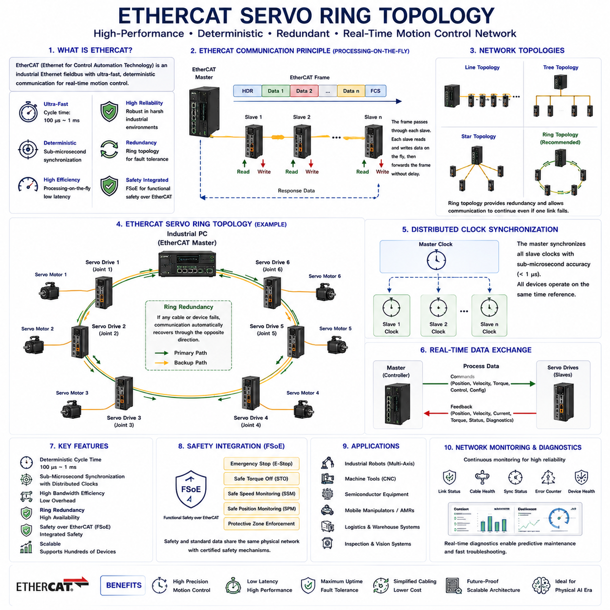
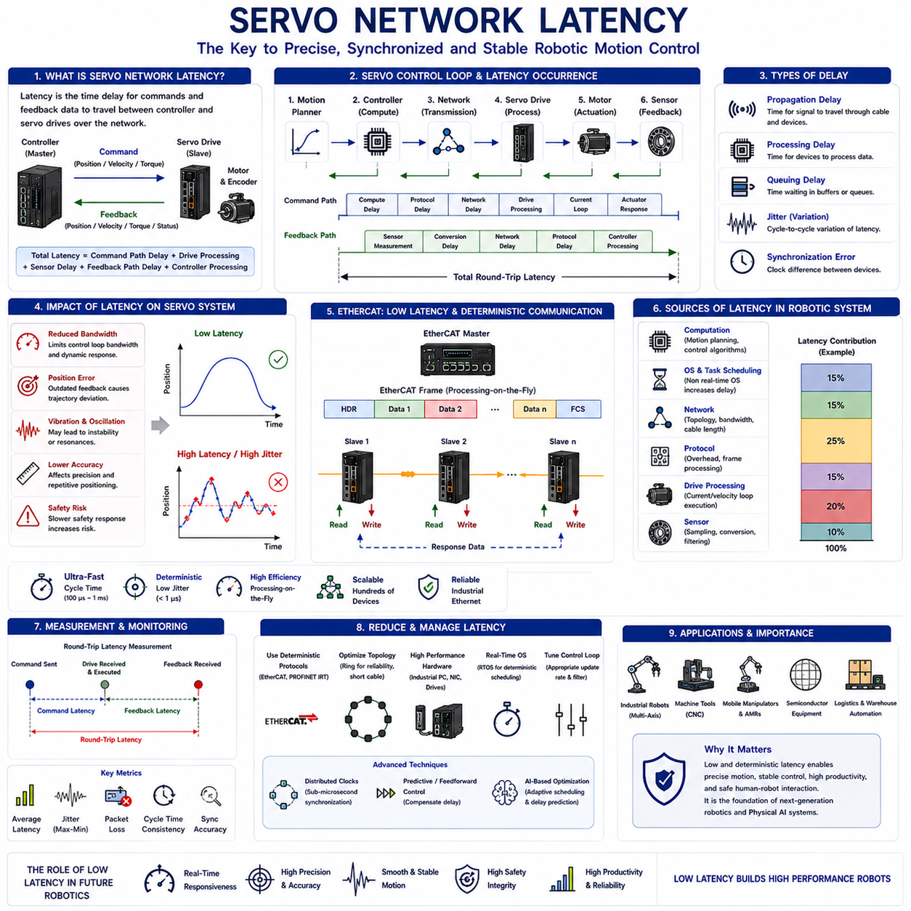
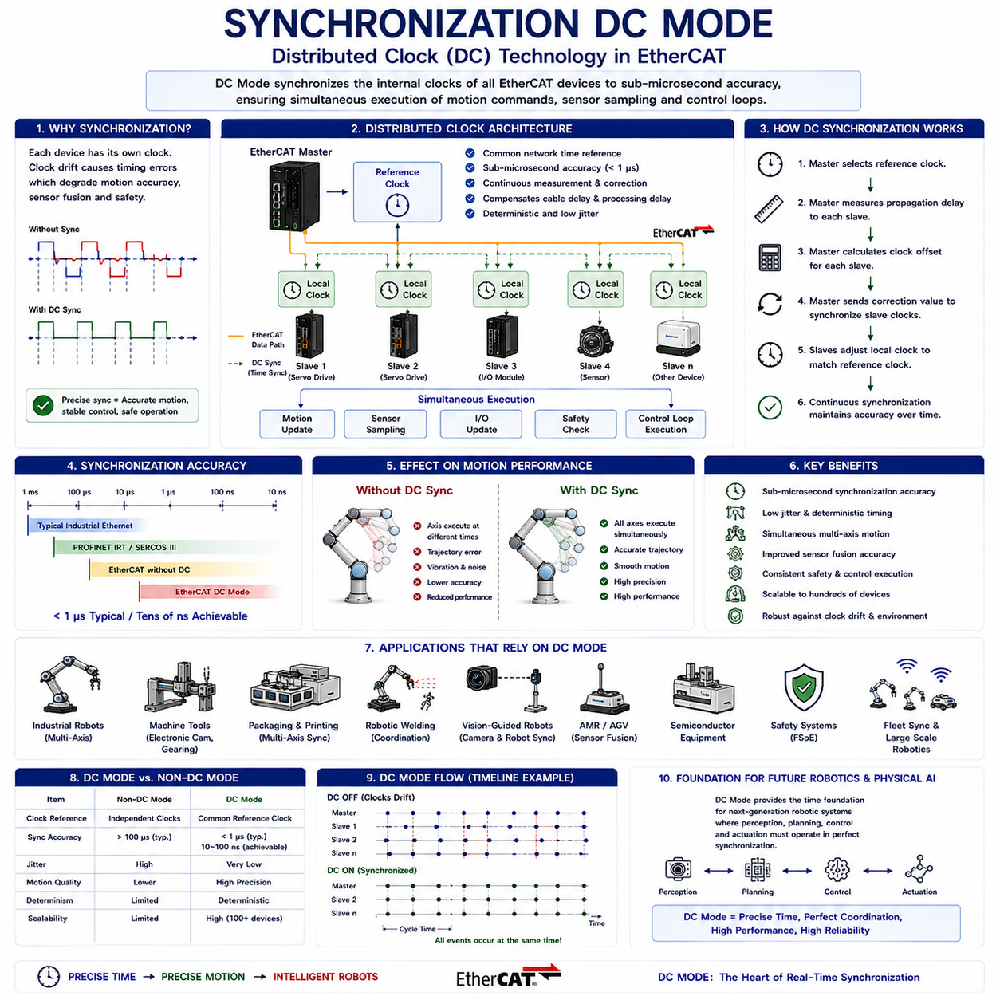
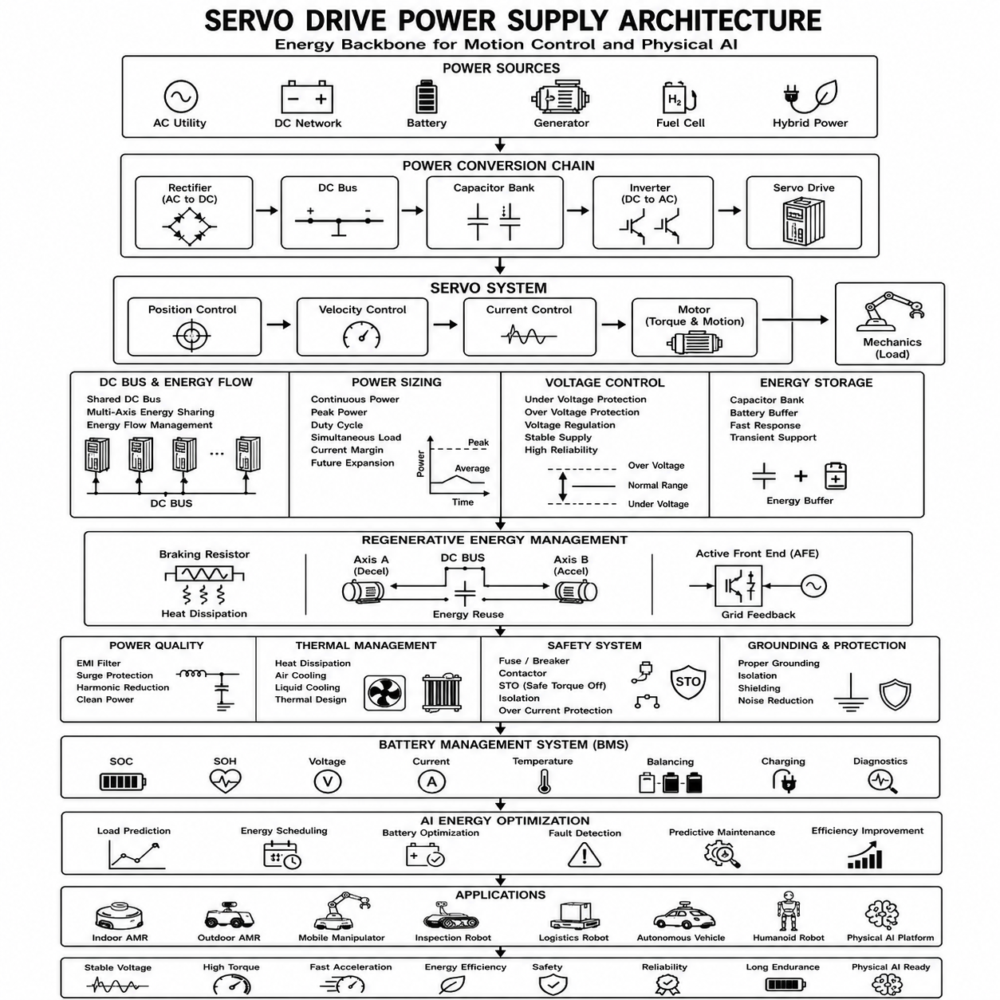
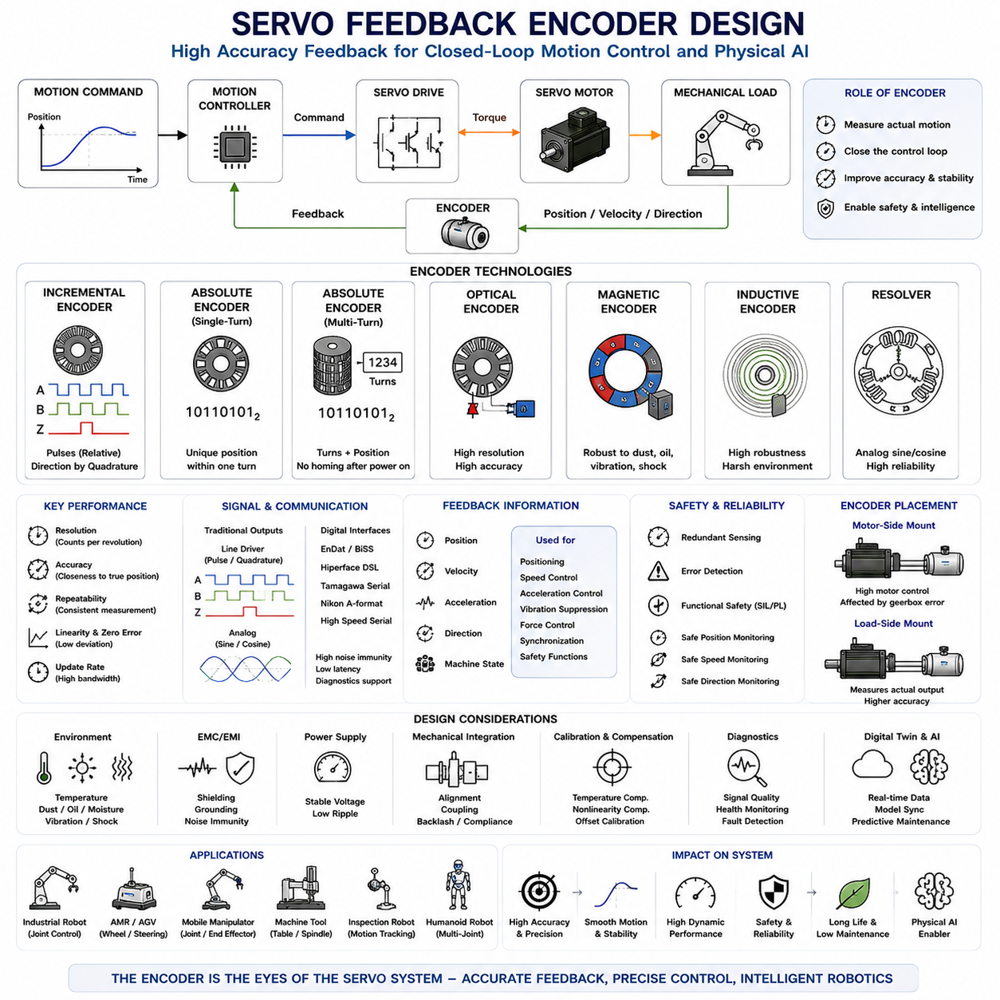

**Volume 14 Mobile Manipulator Architecture**

# Chapter 2. Servo Network Design

## 2.1 EtherCAT Servo Ring Topology

{width="7.268055555555556in" height="7.268055555555556in"}

EtherCAT Servo Ring Topology is one of the most widely adopted real-time communication architectures in modern industrial automation, robotics, autonomous mobile robots, machine tools, semiconductor manufacturing equipment, logistics systems, and advanced motion-control platforms. As robotic systems evolve toward higher precision, higher speed, greater synchronization accuracy, and increased system complexity, traditional fieldbus architectures often struggle to meet the deterministic communication requirements necessary for coordinated multi-axis motion. EtherCAT addresses these challenges by providing an ultra-fast Ethernet-based fieldbus capable of deterministic communication with microsecond-level synchronization. Within the Hills Robotics Motion Control Architecture, EtherCAT Servo Ring Topology serves as the fundamental communication backbone connecting industrial PCs, servo drives, motor controllers, I/O modules, safety controllers, sensors, and distributed robotic subsystems into a unified real-time control network.

The origin of EtherCAT can be traced to the growing demand for deterministic industrial Ethernet communication. Conventional Ethernet networks were originally designed for office automation and information technology applications rather than real-time motion control. While standard Ethernet provides high bandwidth, it cannot guarantee deterministic transmission timing because packets may experience unpredictable delays caused by network congestion, routing, buffering, and switching behavior. Industrial automation systems require predictable communication cycles measured in microseconds rather than milliseconds. Motion control applications involving multiple servo axes require every actuator to receive commands at precisely defined intervals. EtherCAT was developed specifically to address these requirements.

EtherCAT stands for Ethernet for Control Automation Technology. It was originally developed by Beckhoff Automation and later standardized through the EtherCAT Technology Group. Unlike conventional Ethernet communication protocols that process and forward complete Ethernet frames at each network device, EtherCAT employs a unique processing-on-the-fly mechanism. In this architecture, a single Ethernet frame passes through every slave device in sequence. Each slave reads and writes its process data while the frame continues moving through the network without significant delay. This approach dramatically reduces communication overhead and enables extremely high network efficiency.

In a typical robotic servo control system, multiple servo drives must operate in perfect synchronization. Consider a six-axis industrial manipulator. Each servo motor controls one joint, and all joints must move together according to a coordinated trajectory generated by the motion planner. If communication latency differs among servo drives, positional errors, vibration, trajectory distortion, and mechanical stress may occur. EtherCAT solves this challenge by ensuring deterministic communication timing and precise clock synchronization across all devices in the network.

Topology refers to the physical arrangement of communication devices within the EtherCAT network. EtherCAT supports multiple network topologies including line topology, tree topology, star topology, ring topology, and hybrid configurations. Among these, ring topology provides significant advantages for mission-critical robotic systems because it introduces network redundancy and fault tolerance while preserving deterministic communication performance.

In a conventional EtherCAT line topology, communication begins at the EtherCAT master and proceeds sequentially through all slave devices. The final slave terminates the communication path. While this structure is simple and cost-effective, a single cable failure or device malfunction may disconnect downstream devices and disrupt system operation. For industrial robots operating in continuous production environments, such interruptions can result in downtime, productivity loss, and safety concerns.

EtherCAT Ring Topology addresses this limitation by creating a closed communication loop. Instead of terminating at the final slave, the network returns to the master through an additional communication path. This configuration allows communication to continue even if one cable segment fails. The network automatically detects the failure and reconfigures communication paths to maintain operation. As a result, system availability and reliability increase significantly.

The EtherCAT master serves as the central coordinator of the network. In robotic systems, the master is typically implemented within an industrial computer running a real-time operating system. The master generates communication frames, schedules network cycles, distributes motion commands, collects feedback data, and manages synchronization among all connected devices. The master also monitors network health and automatically handles topology changes resulting from cable or device failures.

Servo drives represent the most common EtherCAT slave devices within robotic motion-control systems. Each servo drive receives position commands, velocity commands, torque commands, and configuration parameters from the master. At the same time, the drive transmits feedback information including encoder position, motor velocity, torque estimates, current consumption, temperature measurements, fault conditions, and diagnostic information. EtherCAT enables all of this data exchange within a deterministic communication cycle.

Distributed clock synchronization is one of EtherCAT's most important features. Every EtherCAT slave contains a high-precision local clock. The EtherCAT master continuously synchronizes these clocks using the Distributed Clocks mechanism. Synchronization accuracy typically reaches sub-microsecond levels, often below one microsecond. This capability is essential for coordinated multi-axis motion where even small timing differences can produce measurable trajectory errors.

In robotic manipulators, synchronized motion is fundamental. When a robot executes a complex trajectory, every joint must begin and end its motion at precisely coordinated times. EtherCAT Distributed Clocks ensure that all servo drives execute their commands simultaneously regardless of their physical location within the network. This synchronization capability directly contributes to improved motion smoothness, positioning accuracy, and dynamic performance.

Cycle time is another critical parameter within EtherCAT systems. Communication cycles define how frequently process data is exchanged between the master and slave devices. Modern EtherCAT systems commonly operate at cycle times ranging from one millisecond down to one hundred microseconds. High-performance motion-control systems may achieve even shorter cycle periods depending on network size and controller capability. Short cycle times enable faster control-loop updates and improved dynamic response.

Bandwidth efficiency distinguishes EtherCAT from many competing industrial communication protocols. Because slave devices process data while frames pass through the network, communication overhead remains extremely low. A single Ethernet frame can contain process data for dozens or even hundreds of devices. This efficient utilization of network bandwidth allows large robotic systems to operate with minimal communication latency.

Network redundancy is one of the primary reasons EtherCAT Ring Topology is favored in advanced robotic systems. Redundancy refers to the ability of the network to continue operating after a failure occurs. In ring topology, communication paths exist in multiple directions. If a cable becomes disconnected or a communication link fails, the EtherCAT master detects the interruption and automatically reroutes traffic through the remaining operational path. This process often occurs within milliseconds and may not interrupt robot operation.

Fault detection capabilities further enhance system reliability. EtherCAT continuously monitors communication quality, frame integrity, synchronization status, and device health. Diagnostic information is available in real time, enabling predictive maintenance and rapid troubleshooting. Network monitoring tools can identify cable degradation, synchronization issues, communication errors, and device faults before they cause operational failures.

Safety integration represents another important aspect of modern EtherCAT networks. Functional safety systems are increasingly integrated directly into the communication architecture through protocols such as Functional Safety over EtherCAT, commonly known as FSoE. FSoE enables safety-related communication including emergency stop commands, safe torque off functions, safe speed monitoring, safe position monitoring, and protective zone enforcement without requiring separate safety wiring networks.

In industrial robotic systems, safety communication must remain independent from standard process data while sharing the same physical network infrastructure. FSoE accomplishes this through certified safety mechanisms that satisfy international functional safety standards. This integration simplifies system architecture, reduces wiring complexity, and lowers installation costs while maintaining high safety integrity levels.

Multi-axis servo control represents one of the most demanding EtherCAT applications. Robotic manipulators, CNC machines, semiconductor wafer handlers, automated storage systems, and logistics robots often require synchronized control of many independent motion axes. EtherCAT enables centralized trajectory generation while maintaining deterministic communication among all servo drives. As a result, complex coordinated movements can be executed with exceptional precision.

The relationship between EtherCAT and robotic kinematics is particularly important. Motion planners calculate desired joint positions, velocities, and accelerations based on kinematic models. These commands must then be delivered to servo drives at precisely defined intervals. EtherCAT serves as the communication layer that bridges high-level motion planning and low-level motor control. Without deterministic communication, even the most sophisticated kinematic algorithms cannot achieve accurate physical execution.

Mobile manipulators introduce additional communication requirements because the robotic arm, mobile platform, sensors, and safety systems must all operate within a unified control architecture. EtherCAT Ring Topology provides an ideal solution by connecting distributed devices through a common deterministic network. Servo drives controlling manipulator joints, wheel motors, steering actuators, battery management systems, safety scanners, and distributed I/O modules can all communicate through the same EtherCAT infrastructure.

Industrial environments present numerous challenges for communication networks. Electromagnetic interference, vibration, temperature fluctuations, moisture exposure, mechanical stress, and long cable runs can degrade communication reliability. EtherCAT has been specifically designed for industrial environments and provides robust communication performance under demanding operating conditions. Ring topology further enhances reliability by providing redundant communication paths.

System scalability is another major advantage of EtherCAT architectures. As robotic systems grow in complexity, additional servo drives, sensors, I/O modules, safety devices, and control components can be integrated into the network without significant architectural changes. EtherCAT supports hundreds of devices within a single network while maintaining deterministic performance.

Digital twin technologies increasingly leverage EtherCAT-compatible architectures. Virtual simulations developed within environments such as Isaac Sim, Gazebo, and industrial digital twin platforms often mirror real-world EtherCAT network structures. This enables engineers to validate motion control architectures, communication timing, fault recovery behavior, and synchronization performance before physical deployment.

Artificial intelligence and advanced automation technologies are further increasing the importance of deterministic communication. Future Physical AI systems will require real-time coordination among perception systems, motion-control systems, force-control systems, planning algorithms, and distributed edge computing platforms. EtherCAT Ring Topology provides the communication infrastructure necessary to support these increasingly sophisticated robotic architectures.

Within the Hills Robotics platform architecture, EtherCAT Ring Topology is particularly valuable because it aligns with the company's strategy of building scalable indoor AMRs, outdoor autonomous platforms, inspection robots, logistics robots, mobile manipulators, and future humanoid and Physical AI systems. A unified EtherCAT-based communication backbone allows common hardware architectures, reusable software frameworks, simplified integration procedures, and consistent safety strategies across multiple robot families.

As robotic systems continue evolving toward greater autonomy, higher performance, and increased operational reliability, communication infrastructure becomes as important as mechanical design and control algorithms. EtherCAT Servo Ring Topology provides the deterministic communication, synchronization precision, fault tolerance, scalability, safety integration, and industrial robustness necessary for next-generation robotic platforms. By combining ultra-fast Ethernet communication with distributed clock synchronization and redundant ring architecture, EtherCAT enables robotic systems to achieve the accuracy, reliability, and real-time responsiveness required for advanced industrial automation, intelligent mobile robotics, and future Physical AI applications.

## 2.2 Servo Network Latency

{width="7.268055555555556in" height="7.268055555555556in"}

Servo Network Latency is one of the most critical performance factors in modern robotic motion-control systems. As industrial robots, mobile manipulators, autonomous mobile robots, machine tools, semiconductor manufacturing equipment, warehouse automation systems, and future Physical AI platforms become increasingly dependent on distributed real-time control architectures, the quality of communication between controllers and servo drives directly influences motion precision, synchronization accuracy, dynamic response, stability, safety, and overall system performance. While mechanical design, actuator selection, and control algorithms often receive significant attention, communication latency frequently determines whether a theoretically capable system can achieve its intended real-world performance. Within the Hills Robotics Motion Control Architecture, Servo Network Latency is treated as a fundamental engineering parameter because every motion command, feedback signal, synchronization event, and safety response must travel through the communication network before affecting physical robot behavior.

Latency refers to the time delay between the transmission of information and the reception of that information by its destination. In servo-control systems, latency represents the delay between command generation at the controller and command execution at the servo drive, as well as the delay associated with feedback information returning from the drive to the controller. Even small latency values can significantly affect high-performance robotic systems because motion-control loops operate continuously and depend upon timely information exchange.

To understand servo network latency, it is useful to examine the complete motion-control cycle. A motion planner generates a desired trajectory based on task requirements. The controller converts this trajectory into position, velocity, acceleration, or torque commands. These commands are transmitted through the communication network to servo drives. The servo drives then control motor current and generate mechanical motion. Simultaneously, feedback data including encoder position, motor velocity, torque estimates, current measurements, temperature values, and diagnostic information are transmitted back to the controller. This closed-loop process repeats continuously, often thousands of times per second.

Latency exists within every stage of this communication chain. Command generation requires computational time. Communication protocols introduce transmission delays. Network hardware contributes switching and processing delays. Servo drives require internal processing time. Sensors require measurement and conversion time. Controllers require computation time to process feedback and generate new commands. The cumulative effect of these delays defines overall system latency.

Servo networks differ significantly from conventional information technology networks. Office networks prioritize throughput, flexibility, and general-purpose connectivity. Motion-control networks prioritize determinism, predictability, synchronization, and minimal delay. In robotic systems, a communication delay of a few milliseconds may be unacceptable because servo loops frequently operate at update rates exceeding one thousand cycles per second.

One of the most important distinctions in latency analysis is the difference between latency and jitter. Latency refers to average communication delay, while jitter refers to variations in delay from one communication cycle to the next. Many robotic systems can tolerate small constant delays if those delays remain predictable. However, unpredictable delay variations often create more severe control problems because the controller cannot accurately compensate for changing timing behavior.

Deterministic communication is therefore a fundamental requirement for modern servo networks. Deterministic communication ensures that information arrives within a known time window during every communication cycle. Protocols such as EtherCAT, EtherNet/IP with CIP Motion, PROFINET IRT, SERCOS III, and TSN-based industrial networks have been specifically developed to provide deterministic performance suitable for motion-control applications.

EtherCAT has become one of the most popular solutions because it minimizes latency through its processing-on-the-fly architecture. Rather than receiving and retransmitting complete packets, EtherCAT slave devices read and write process data as communication frames pass through the device. This approach significantly reduces communication overhead and enables network cycle times measured in hundreds of microseconds.

The impact of latency becomes particularly important in multi-axis robotic systems. Consider a six-axis industrial manipulator executing a coordinated motion trajectory. Each servo axis must receive synchronized commands and provide synchronized feedback. If communication latency differs among axes, motion errors may occur. These errors can produce trajectory deviations, vibration, reduced accuracy, increased mechanical stress, and degraded dynamic performance.

Distributed clock synchronization mechanisms help address these challenges. EtherCAT Distributed Clocks, for example, synchronize local clocks across all network devices with sub-microsecond accuracy. Precise synchronization allows command execution to occur simultaneously even when communication paths differ slightly. This capability is essential for coordinated motion applications involving multiple servo axes.

Control-loop stability is directly influenced by latency. Every feedback control system relies on current information regarding system state. As latency increases, feedback becomes increasingly outdated. The controller bases its decisions on historical information rather than actual current conditions. Excessive latency may reduce control bandwidth, increase overshoot, introduce oscillation, and ultimately destabilize the system.

Position-control loops are particularly sensitive to latency effects. Modern servo systems often implement cascaded control architectures consisting of position loops, velocity loops, and current loops. The position controller generates velocity commands based on position error. The velocity controller generates torque-producing current commands. Each control layer depends upon accurate and timely feedback information. Latency reduces the effectiveness of this hierarchical control structure.

Velocity-control applications experience similar challenges. Accurate velocity regulation requires frequent feedback updates. Communication delays reduce the controller's ability to compensate for disturbances and changing load conditions. High-speed robotic applications therefore require extremely low-latency communication infrastructure to maintain stable and accurate velocity control.

Force-control and torque-control applications may be even more sensitive to latency. Collaborative robots, compliant manipulators, force-guided assembly systems, and advanced Physical AI platforms frequently interact directly with external environments. These systems must respond rapidly to changing contact forces. Excessive latency can degrade force-control performance and potentially create safety risks during human-robot interaction.

Mobile manipulators introduce additional complexity because latency affects both vehicle motion and manipulator motion simultaneously. Wheel motors, steering actuators, robotic arm joints, safety systems, localization modules, and sensor networks often share common communication infrastructure. Coordinated operation requires consistent low-latency communication throughout the entire robotic platform.

Sensor latency contributes significantly to overall system performance. Encoders, inertial measurement units, force sensors, vision systems, LiDAR units, radar systems, and safety scanners each introduce their own measurement delays. While network latency often receives the most attention, total system latency includes sensing latency, computation latency, communication latency, and actuator response latency. Effective robotic design requires consideration of the complete latency chain.

Vision-guided robotics provides a particularly challenging example. Camera systems capture images that require processing before motion commands can be generated. Image acquisition, image transfer, perception algorithms, object detection, tracking, localization, and motion planning all contribute latency. In high-speed applications, these delays must be carefully managed to ensure accurate interaction with moving objects.

Network topology influences latency characteristics. Line topologies, star topologies, tree topologies, and ring topologies each introduce different communication paths and processing requirements. EtherCAT Ring Topology provides redundancy and fault tolerance while maintaining deterministic communication performance. Proper topology selection therefore contributes both reliability and latency optimization.

Network size also affects latency. As the number of connected devices increases, communication cycles may require additional processing time. Fortunately, EtherCAT scales efficiently because process data is exchanged within a single frame traversing all devices. Even networks containing dozens or hundreds of devices can maintain low communication latency when properly configured.

Servo drive architecture influences effective latency as well. Modern servo drives often implement local current-control loops and velocity-control loops internally. This distributed control approach reduces the impact of communication delays because high-bandwidth control functions execute locally within the drive. Only higher-level position commands and feedback information require network communication.

Predictive control techniques help compensate for unavoidable latency. Model-based controllers estimate future system states and generate commands accordingly. Feedforward control algorithms anticipate motion requirements before feedback errors develop. These techniques improve performance when communication delays cannot be eliminated entirely.

Artificial intelligence is increasingly being applied to latency management. Machine learning algorithms can predict network conditions, estimate communication delays, optimize scheduling strategies, and compensate for latency-related performance degradation. Future AI-driven motion-control systems may continuously adapt control parameters based on real-time latency measurements.

Safety systems impose strict latency requirements. Emergency-stop commands, safe torque-off functions, collision detection mechanisms, and protective zone enforcement systems must respond within precisely defined time limits. Functional safety standards specify maximum allowable response times to ensure safe operation. Consequently, safety-related communication often receives priority treatment within industrial communication networks.

Real-time operating systems play a crucial role in minimizing latency. Standard desktop operating systems may introduce unpredictable scheduling delays unsuitable for motion-control applications. Real-time operating systems provide deterministic task scheduling, predictable interrupt handling, and precise timing control required for high-performance servo networks.

Hardware design significantly influences latency performance. Industrial computers, network interface cards, Ethernet controllers, communication processors, FPGA-based motion controllers, and dedicated servo-control hardware all contribute to overall timing characteristics. High-performance robotic systems often employ specialized hardware specifically designed for deterministic real-time communication.

Latency measurement and monitoring are essential engineering activities. Engineers typically evaluate round-trip communication time, command-to-response delay, synchronization accuracy, jitter characteristics, packet-loss rates, and cycle-time consistency. Advanced diagnostic tools continuously monitor network performance and identify potential communication bottlenecks before they affect system operation.

Digital twin environments increasingly incorporate communication modeling alongside mechanical simulation. Platforms such as Isaac Sim, Gazebo, MuJoCo, and industrial digital-twin frameworks allow engineers to evaluate latency effects before deploying physical systems. Virtual testing enables optimization of communication architecture, control-loop parameters, synchronization strategies, and fault-recovery behavior.

The emergence of Physical AI systems further elevates the importance of low-latency communication. Future intelligent robots will integrate perception, planning, manipulation, navigation, force interaction, and autonomous decision-making within unified real-time architectures. These capabilities require continuous information exchange among distributed computing resources, sensors, actuators, and safety systems. Communication latency directly influences the responsiveness and intelligence of the entire robotic platform.

Within the Hills Robotics ecosystem, including indoor AMRs, outdoor autonomous platforms, inspection robots, logistics robots, mobile manipulators, fleet-management systems, and future humanoid robotics programs, servo network latency is considered a foundational design parameter. EtherCAT-based architectures, distributed synchronization mechanisms, real-time operating systems, high-performance industrial computers, and optimized control software collectively minimize latency while ensuring deterministic communication performance across the entire robotic platform.

Ultimately, Servo Network Latency represents far more than a communication metric. It defines the temporal foundation upon which all robotic motion is built. Every position correction, velocity adjustment, force response, safety action, and synchronization event depends upon the timely delivery of information. Low and deterministic latency enables smooth motion, precise positioning, stable control, high productivity, and safe operation. As robotics continues evolving toward increasingly intelligent, autonomous, and physically interactive systems, effective latency management will remain one of the most important engineering disciplines supporting next-generation motion-control architectures and Physical AI platforms.

## 2.3 Synchronization DC Mode

{width="7.268055555555556in" height="7.268055555555556in"}

Synchronization DC Mode, commonly known as Distributed Clock Mode within EtherCAT networks, is one of the most important technologies enabling ultra-precise real-time motion control in modern robotics, industrial automation, machine tools, semiconductor manufacturing systems, logistics automation platforms, autonomous mobile robots, and future Physical AI architectures. As robotic systems continue to increase in complexity and performance requirements, achieving deterministic communication alone is no longer sufficient. Multiple servo drives, sensors, controllers, and distributed subsystems must not only exchange information rapidly but must also operate according to a common and highly accurate time reference. Synchronization DC Mode provides this capability by synchronizing the internal clocks of all EtherCAT devices to sub-microsecond precision, ensuring that motion commands, sensor measurements, safety functions, and feedback updates occur simultaneously across the entire system. Within the Hills Robotics Motion Control Architecture, Synchronization DC Mode serves as a foundational technology for coordinated multi-axis motion, sensor fusion, autonomous navigation, mobile manipulation, fleet synchronization, and future large-scale Physical AI systems.

In distributed robotic systems, every device contains its own internal clock. Servo drives, motion controllers, industrial PCs, safety controllers, vision systems, inertial measurement units, LiDAR sensors, and distributed I/O modules all maintain independent timing mechanisms. Although these clocks may initially appear synchronized, even high-quality oscillators experience small frequency deviations. Over time, these deviations accumulate and cause clocks to drift apart. In conventional systems, such clock drift may introduce timing errors that negatively affect synchronization accuracy. In high-performance robotic systems, even microsecond-level timing differences can produce measurable motion errors, sensor inconsistencies, and degraded system performance.

The challenge of synchronization becomes increasingly significant as the number of controlled devices grows. Consider a six-axis industrial manipulator. Every servo drive controlling a joint receives position, velocity, and torque commands from the motion controller. If one servo executes its command slightly earlier than another, the resulting motion may deviate from the intended trajectory. While such deviations may be insignificant at low speeds, they become increasingly problematic during high-speed coordinated motion. In systems containing dozens or hundreds of synchronized axes, precise timing becomes absolutely essential.

EtherCAT addresses this challenge through Distributed Clock technology. Unlike conventional synchronization approaches that rely on periodic broadcast messages or external synchronization signals, EtherCAT integrates clock synchronization directly into the communication architecture. Each EtherCAT slave contains a high-precision hardware clock implemented within the EtherCAT communication controller. These clocks form the basis of the Distributed Clock system.

The fundamental concept behind Distributed Clock synchronization is the establishment of a common network time reference. One device within the EtherCAT network becomes the reference clock. All other clocks continuously synchronize themselves to this reference. The EtherCAT master measures propagation delays throughout the network and calculates timing corrections for each slave device. These corrections compensate for physical cable lengths, device processing delays, and communication path variations.

One of the most remarkable characteristics of EtherCAT Distributed Clock technology is its synchronization accuracy. Typical synchronization precision is below one microsecond, with many systems achieving synchronization errors measured in tens of nanoseconds. This level of precision allows all servo drives within a robotic system to execute commands simultaneously, regardless of their physical location within the network.

Synchronization accuracy directly influences coordinated motion performance. In robotic manipulators, motion planners generate trajectories that assume simultaneous execution across all joints. If synchronization errors exist, the actual motion deviates from the planned trajectory. These deviations may produce vibration, reduced accuracy, increased mechanical stress, and lower dynamic performance. Distributed Clock synchronization minimizes these effects by ensuring that all axes operate according to the same time base.

The operation of Distributed Clock Mode begins during network initialization. When the EtherCAT network starts, the master identifies all slave devices and establishes communication relationships. The master then measures communication delays between devices. These measurements allow the master to determine the exact propagation time required for messages to travel through the network. Once propagation delays are known, the master calculates synchronization offsets for every slave clock.

Continuous synchronization occurs during normal operation. The EtherCAT master periodically exchanges timing information with slave devices and updates synchronization corrections. Because oscillator frequencies may drift due to temperature variations, aging effects, and manufacturing tolerances, synchronization must remain active throughout system operation. Continuous adjustment ensures long-term timing stability even under changing environmental conditions.

The synchronization process relies heavily on hardware implementation. Unlike software-based synchronization methods that may suffer from operating-system scheduling delays, EtherCAT Distributed Clocks operate directly within communication hardware. This hardware-based implementation eliminates many sources of timing uncertainty and enables exceptionally high synchronization precision.

Multi-axis servo systems represent one of the most important applications of Distributed Clock Mode. Industrial robots frequently execute coordinated trajectories involving simultaneous motion across all joints. During interpolation, position commands are calculated for specific time instants. If servo drives do not share a common clock reference, interpolation accuracy may degrade. Distributed Clock synchronization ensures that all drives apply motion commands at exactly the intended time.

Electronic camming applications also depend heavily on synchronization accuracy. Electronic camming replaces traditional mechanical cam mechanisms with electronically coordinated servo systems. Multiple axes must maintain precise phase relationships throughout operation. Even small synchronization errors can produce unacceptable deviations. Distributed Clock technology provides the timing precision necessary for accurate electronic cam implementation.

Electronic gearing applications similarly require precise synchronization. In electronic gearing, one servo axis follows another according to a predefined gear ratio. Motion relationships must remain consistent under changing speeds and operating conditions. Shared time references provided by Distributed Clock synchronization allow electronic gearing systems to maintain precise coordination.

Packaging machinery, printing systems, textile machinery, semiconductor manufacturing equipment, and high-speed assembly systems frequently rely on synchronized motion among numerous servo axes. These applications often operate at extremely high production rates where timing accuracy directly affects product quality and throughput. Distributed Clock synchronization enables these systems to achieve consistent and repeatable performance.

Robotic welding systems provide another important example. During coordinated welding operations, manipulator motion, welding current control, seam tracking systems, and sensor feedback must remain synchronized. Timing errors can affect weld quality, process consistency, and production efficiency. Distributed Clock technology supports precise coordination among all participating subsystems.

Vision-guided robotics increasingly depends on synchronized timing. Cameras capture images at specific moments, and those images must correspond accurately to robot position data. If camera timestamps and robot timestamps are misaligned, localization errors may occur. Distributed Clock synchronization enables accurate correlation between visual observations and robotic motion.

Sensor fusion systems also benefit significantly from synchronized clocks. Modern autonomous robots integrate data from LiDAR, cameras, radar, IMUs, GPS receivers, wheel encoders, and force sensors. Accurate sensor fusion requires precise timestamp alignment across all sensor sources. Distributed Clock technology provides a common timing framework that improves sensor-fusion accuracy and consistency.

Mobile robots and autonomous vehicles face additional synchronization challenges because navigation, localization, perception, and motion control subsystems operate simultaneously. Real-time decision-making depends on consistent timing relationships among these subsystems. Distributed Clock synchronization helps ensure that sensor observations, localization estimates, and control actions remain temporally aligned.

Safety systems increasingly leverage synchronized timing as well. Functional Safety over EtherCAT (FSoE) applications often require precise timing relationships among safety controllers, emergency stop systems, safe motion monitoring functions, and distributed safety devices. Synchronization accuracy contributes directly to predictable safety-system behavior.

Distributed Clock Mode also supports deterministic control-loop execution. In modern servo systems, control loops operate according to fixed update periods. Position loops, velocity loops, current loops, and advanced model-based controllers all depend on predictable timing intervals. Clock synchronization ensures that these control loops execute consistently throughout the network.

The concept of jitter is closely related to synchronization performance. Jitter refers to timing variations between successive communication cycles. Even when average latency remains low, excessive jitter can degrade motion quality. Distributed Clock synchronization significantly reduces timing jitter by providing a stable and shared time reference across all devices.

System scalability is another important advantage. As robotic systems grow in complexity, additional servo drives, sensors, safety modules, and distributed devices can be integrated into the EtherCAT network without sacrificing synchronization accuracy. Distributed Clock technology maintains precise synchronization even in large-scale installations containing hundreds of devices.

Digital twin environments increasingly incorporate synchronization modeling. Simulation platforms such as Isaac Sim, Gazebo, and advanced industrial digital twins replicate timing relationships found in physical EtherCAT networks. Engineers can evaluate synchronization behavior, communication performance, and motion quality before deploying hardware, reducing development risk and improving system validation.

Artificial intelligence and Physical AI systems place even greater demands on synchronization infrastructure. Future robots will integrate perception, planning, manipulation, navigation, force interaction, and distributed computing resources into unified architectures. These systems require precise temporal alignment among all computational and physical processes. Distributed Clock synchronization provides the timing foundation necessary for coordinated intelligent behavior.

Within the Hills Robotics ecosystem, including indoor AMRs, outdoor autonomous platforms, mobile manipulators, inspection robots, logistics automation systems, and future humanoid platforms, Synchronization DC Mode plays a critical role in ensuring consistent and coordinated operation. Multi-axis manipulators rely on synchronized servo execution. Autonomous vehicles require synchronized sensor fusion. Fleet management systems benefit from consistent timing across distributed robotic assets. A unified synchronization strategy simplifies architecture design and improves overall system performance.

As robotic systems continue evolving toward higher precision, greater autonomy, and more sophisticated Physical AI capabilities, synchronization becomes increasingly important. Deterministic communication alone cannot guarantee coordinated operation unless all devices share a common time reference. Synchronization DC Mode solves this challenge by establishing precise clock alignment throughout the EtherCAT network. By providing sub-microsecond synchronization accuracy, minimizing timing jitter, supporting deterministic control execution, and enabling coordinated operation across distributed devices, EtherCAT Distributed Clock technology serves as one of the foundational building blocks of modern robotic motion-control architectures. It transforms a collection of independent devices into a unified real-time system capable of executing complex, synchronized, and highly precise robotic behaviors across industrial automation, intelligent mobile robotics, and future Physical AI applications.

## 2.4 Servo Drive Power Supply

{width="7.268055555555556in" height="7.268055555555556in"}

Servo Drive Power Supply is one of the most fundamental yet frequently underestimated components of modern robotic motion-control systems. While significant engineering effort is often invested in servo motors, motion controllers, communication networks, trajectory generation algorithms, and advanced control strategies, the overall performance, stability, reliability, safety, and efficiency of the entire robotic platform ultimately depend upon the quality and capability of the power system that supplies electrical energy to the servo drives. Every motion command generated by a controller is eventually translated into electrical power delivered to a motor through a servo drive. If the power supply architecture is improperly designed, even the most sophisticated robotic system may experience degraded performance, instability, unexpected shutdowns, excessive thermal loading, reduced equipment lifespan, or catastrophic system failures. Within the Hills Robotics Motion Control Architecture, Servo Drive Power Supply design is treated as a core subsystem because it directly influences motion quality, payload capability, acceleration performance, energy efficiency, safety integrity, and long-term operational reliability across indoor AMRs, outdoor autonomous platforms, mobile manipulators, industrial robots, inspection systems, and future Physical AI platforms.

A servo drive functions as the interface between the electrical power system and the servo motor. The drive receives control commands from the motion controller and converts electrical energy into precisely regulated current, voltage, and frequency outputs required by the motor. To perform this task effectively, the servo drive requires a stable and properly sized power source capable of supporting dynamic load variations that may change dramatically within milliseconds. Unlike conventional electrical loads that consume relatively constant power, servo systems are highly dynamic. A motor may transition from idle operation to peak torque output almost instantaneously. Consequently, the power supply system must accommodate rapid changes in current demand while maintaining voltage stability.

Understanding servo drive power requirements begins with an understanding of energy flow within the motion-control system. Electrical energy originates from a primary power source such as an industrial AC utility connection, a battery system, a DC power distribution network, a generator, a fuel-cell system, or a hybrid energy source. This energy is delivered to the servo drive through various power-conversion stages. The servo drive then regulates motor current according to motion-control commands. The motor converts electrical energy into mechanical energy, generating torque and motion. Throughout this process, losses occur within cables, power electronics, magnetic components, switching devices, and motor windings. Effective power-supply design seeks to minimize these losses while ensuring stable operation under all expected operating conditions.

Industrial servo systems commonly operate from AC power sources. Three-phase AC supplies are particularly popular because they provide efficient power delivery for high-performance motion-control applications. Typical industrial servo drives operate from 200 VAC, 220 VAC, 380 VAC, 400 VAC, 480 VAC, or higher voltage levels depending on regional standards and application requirements. Three-phase systems provide smoother power transfer, reduced conductor size, lower current levels, and improved efficiency compared with equivalent single-phase systems.

Within the servo drive, incoming AC power is typically converted into a DC bus through a rectification stage. This DC bus serves as the primary energy reservoir for motor control operations. Capacitors within the DC bus store energy and help stabilize voltage during transient load conditions. The inverter stage then converts DC energy into controlled AC waveforms that drive the motor. Consequently, the DC bus voltage becomes one of the most important electrical parameters within the servo system.

The DC bus architecture provides several advantages. Because energy is stored centrally within the DC bus, rapid load fluctuations can be absorbed more effectively. Multiple servo drives may also share a common DC bus, enabling energy exchange among axes. During deceleration, one motor may regenerate energy back into the DC bus while another motor simultaneously consumes energy for acceleration. This shared-energy architecture improves overall system efficiency and reduces power-supply loading.

Battery-powered robotic systems increasingly utilize DC-based servo architectures. Autonomous mobile robots, mobile manipulators, outdoor autonomous platforms, agricultural robots, inspection robots, defense robots, and future humanoid systems frequently operate from battery sources rather than fixed industrial power networks. In these applications, servo drives often receive power directly from high-voltage battery systems. Common battery voltages include 24 VDC, 48 VDC, 72 VDC, 96 VDC, and higher voltages depending on power requirements and safety considerations.

Within the Hills Robotics platform ecosystem, 48 V lithium iron phosphate battery systems are commonly employed as the primary energy source for indoor and outdoor robotic platforms. The battery supplies power to wheel motors, steering actuators, manipulator joints, computing systems, sensors, safety systems, communication modules, and auxiliary electronics. Servo drive power architecture must therefore be designed to accommodate both continuous and transient load conditions while maintaining battery efficiency and operational endurance.

Power sizing represents one of the most important aspects of servo power-supply design. Engineers must evaluate continuous power requirements, peak power requirements, acceleration demands, duty cycles, simultaneous axis loading, regenerative behavior, thermal constraints, and future expansion requirements. Underestimating power requirements may lead to voltage collapse, drive faults, controller resets, or degraded motion performance. Oversizing the system excessively may increase cost, weight, physical volume, and energy losses.

Peak current demand often determines power-supply sizing more strongly than average power consumption. During rapid acceleration, servo motors may require several times their rated continuous current. These transient events may last only a few hundred milliseconds, but the power supply must still accommodate them without excessive voltage drop. Capacitive energy storage, battery buffering, and proper conductor sizing help address these challenges.

Voltage stability is critical for servo-drive performance. Servo drives continuously monitor input voltage levels and may generate fault conditions when voltages exceed specified limits or fall below minimum operating thresholds. Undervoltage conditions can reduce available motor torque, interrupt motion control, and trigger emergency shutdowns. Overvoltage conditions may damage electronic components and compromise system safety. Consequently, voltage regulation becomes a key design objective.

Regenerative energy management represents another important consideration. During deceleration, servo motors operate as generators. Mechanical kinetic energy is converted back into electrical energy and returned to the servo drive. If this regenerated energy cannot be absorbed or utilized, DC bus voltage may rise to dangerous levels. Several methods are commonly employed to manage regenerative energy.

Dynamic braking resistors dissipate excess regenerative energy as heat. When DC bus voltage exceeds predefined limits, braking circuits activate and divert energy into resistor banks. This approach is simple and widely used but reduces overall energy efficiency because valuable energy is discarded.

Shared DC bus systems improve efficiency by allowing regenerated energy from one axis to power another axis. This approach is particularly effective in multi-axis robotic systems where simultaneous acceleration and deceleration occur frequently. Industrial robots, machine tools, and packaging machinery often benefit significantly from shared-energy architectures.

Advanced regenerative power systems may return excess energy to the electrical grid through active front-end converters. These bidirectional power converters allow energy to flow both into and out of the servo system. While more expensive, such systems provide excellent energy efficiency and reduced thermal loading.

Power quality significantly influences servo-system reliability. Electrical disturbances including voltage sag, voltage swell, harmonic distortion, transient spikes, electromagnetic interference, and phase imbalance can negatively affect servo-drive operation. Industrial environments frequently contain large motors, welding equipment, switching devices, and power converters that generate electrical noise. Effective power-supply design therefore incorporates filtering, surge protection, grounding strategies, shielding techniques, and isolation methods.

Grounding architecture is particularly important for servo systems. Improper grounding may create ground loops, communication errors, measurement inaccuracies, electromagnetic interference, and safety hazards. Motion-control systems require carefully designed grounding schemes that provide low-impedance fault-current paths while minimizing unwanted noise coupling.

Power-distribution architecture influences overall system reliability and maintainability. Centralized power systems concentrate power-conversion equipment within a single enclosure and distribute energy to all servo drives. Decentralized architectures distribute power-conversion functions closer to individual drives. Hybrid architectures combine aspects of both approaches. The optimal solution depends upon system size, cable lengths, maintenance requirements, thermal constraints, and installation considerations.

Cable sizing plays a critical role in servo-drive power systems. Undersized conductors increase resistive losses, voltage drop, thermal loading, and efficiency reduction. Oversized conductors increase cost and weight unnecessarily. Proper conductor selection requires analysis of current levels, voltage drop limits, environmental conditions, installation methods, and applicable electrical standards.

Thermal management is closely related to power-supply design. Power electronics generate heat during operation due to switching losses, conduction losses, magnetic losses, and auxiliary power consumption. Excessive temperatures reduce efficiency, shorten component life, and increase failure rates. Effective cooling strategies may include passive cooling, forced-air cooling, liquid cooling, heat-pipe technologies, or advanced thermal-management systems depending on power density requirements.

Safety considerations are integral to servo power-supply design. Electrical hazards include shock risk, arc-flash risk, short circuits, overload conditions, insulation failures, thermal runaway events, and unexpected motion caused by power-system faults. Protective devices such as circuit breakers, fuses, contactors, isolation relays, residual-current devices, and safety-rated power disconnect mechanisms help mitigate these risks.

Functional safety standards increasingly influence power-system architecture. Safe Torque Off (STO), Safe Stop 1 (SS1), Safe Operating Stop (SOS), Safe Limited Speed (SLS), and other safety functions are frequently integrated directly into modern servo drives. Power-supply design must support these functions while maintaining compliance with applicable safety standards.

Battery management systems play an increasingly important role in mobile robotic platforms. Battery voltage, current, temperature, state of charge, state of health, balancing status, and fault conditions directly affect servo-drive operation. Effective integration between battery management systems and servo drives enables improved efficiency, enhanced reliability, predictive maintenance, and extended battery life.

Real-time monitoring capabilities continue to expand within modern servo power architectures. Voltage measurements, current measurements, temperature sensors, insulation monitoring devices, energy meters, and predictive diagnostic algorithms provide valuable operational insight. These capabilities support condition monitoring, fault prediction, preventive maintenance, and lifecycle optimization.

Digital twin technologies increasingly incorporate detailed electrical models alongside mechanical and control-system simulations. Platforms such as Isaac Sim, Gazebo, MATLAB/Simulink, and industrial digital-twin frameworks allow engineers to evaluate power consumption, regenerative behavior, thermal performance, fault scenarios, and battery endurance before physical deployment. This simulation-driven approach reduces engineering risk and improves design optimization.

Artificial intelligence is beginning to influence power-system management as well. AI-based energy-management algorithms can predict power demand, optimize battery utilization, schedule charging operations, balance regenerative energy flows, and detect emerging faults before failures occur. Future robotic platforms may continuously adapt power-distribution strategies based on mission objectives, environmental conditions, and system health.

Within future Physical AI systems, servo power architecture will become even more important. Humanoid robots, autonomous logistics systems, intelligent mobile manipulators, and distributed robotic fleets will require highly efficient, intelligent, fault-tolerant power infrastructures capable of supporting advanced perception, planning, interaction, and mobility functions. Energy availability will directly influence operational capability, mission duration, and system autonomy.

Within the Hills Robotics platform strategy, including indoor AMRs, outdoor autonomous vehicles, mobile manipulators, industrial inspection systems, logistics automation platforms, and future humanoid robotics, Servo Drive Power Supply architecture serves as the electrical foundation upon which all motion capability is built. Proper power-system design ensures stable voltage delivery, supports high-performance motion control, manages regenerative energy effectively, maintains safety compliance, maximizes energy efficiency, and provides the reliability required for continuous industrial operation.

Ultimately, Servo Drive Power Supply is far more than an electrical utility subsystem. It is the energy backbone of the robotic platform. Every acceleration event, positioning movement, force interaction, safety response, and autonomous behavior depends upon the availability of stable and intelligently managed electrical power. As robotic systems continue advancing toward higher performance, greater autonomy, and increasingly sophisticated Physical AI capabilities, servo-drive power architecture will remain one of the most important engineering disciplines enabling next-generation robotic motion-control systems.

## 2.5 Servo Feedback Encoder Design

{width="7.268055555555556in" height="7.268055555555556in"}

Servo Feedback Encoder Design is one of the most critical elements in modern motion-control systems because it determines how accurately a servo drive can measure motor position, velocity, acceleration, direction, and mechanical state. Regardless of how advanced the motion controller, servo amplifier, communication network, or trajectory planning algorithm may be, the performance of the entire control system ultimately depends on the quality of feedback information available to the control loop. In a closed-loop servo system, the encoder serves as the primary sensing device that continuously informs the controller about the actual state of the motor and mechanical load. Without accurate feedback, precise positioning, smooth motion, synchronized multi-axis control, force regulation, and advanced autonomous behaviors become impossible. Within the Hills Robotics Motion Control Architecture, encoder design is regarded as a foundational technology because it directly influences positioning accuracy, repeatability, velocity estimation, dynamic performance, safety integrity, predictive maintenance capability, and future Physical AI functionality across indoor AMRs, outdoor autonomous platforms, mobile manipulators, industrial robots, logistics systems, inspection robots, and humanoid robotic platforms.

The purpose of a servo feedback encoder is to convert mechanical motion into digital information that can be interpreted by a servo controller. Every movement of a motor shaft, gearbox output, wheel assembly, robotic joint, linear actuator, or rotating mechanism must be measured and represented as data. This data allows the control system to compare desired motion against actual motion and continuously calculate corrective actions. The quality of this measurement process determines the effectiveness of the entire servo control architecture.

The concept of feedback lies at the heart of modern control theory. In an open-loop system, commands are issued without verifying whether the desired action actually occurred. Such systems may function adequately under stable conditions but cannot compensate for disturbances, wear, mechanical variation, load changes, or environmental influences. Closed-loop servo systems solve this limitation by continuously measuring actual motion and adjusting control outputs accordingly. The encoder is therefore the sensor that closes the control loop.

Position measurement is the most fundamental function of a servo encoder. Every control cycle requires precise knowledge of motor shaft position. This information allows the controller to calculate position error, which represents the difference between the commanded position and the measured position. The servo drive uses this error signal to generate corrective torque and move the motor toward the desired location. Higher encoder resolution enables smaller position errors to be detected and corrected, resulting in improved positioning accuracy and smoother motion.

Velocity estimation is closely related to position measurement. Most servo systems derive velocity by calculating the rate of change of position over time. Accurate velocity information is essential for trajectory tracking, acceleration control, vibration suppression, disturbance rejection, and dynamic motion performance. Encoder resolution and update frequency significantly influence velocity estimation quality, particularly at low speeds where small measurement errors can produce large velocity uncertainties.

Acceleration estimation further extends the information available to the control system. Although acceleration is often calculated indirectly from velocity measurements, high-quality encoder data improves acceleration estimation accuracy. This capability becomes particularly important in high-performance robotic applications where dynamic control behavior influences motion quality and mechanical stress.

Modern servo systems employ several different encoder technologies. Incremental encoders remain among the most widely used solutions due to their simplicity, reliability, and cost effectiveness. Incremental encoders generate pulses corresponding to shaft movement. The controller counts these pulses to determine relative position changes. Typically, two output channels are provided in quadrature configuration, allowing both position and direction information to be extracted.

The quadrature encoding principle offers significant advantages. By examining phase relationships between channels A and B, the controller can determine rotational direction while simultaneously increasing effective measurement resolution. Additional index channels provide reference markers that support homing procedures and absolute position calibration.

Absolute encoders represent a more advanced feedback technology. Unlike incremental encoders, absolute encoders provide a unique position value for every shaft location. Consequently, position information remains available immediately after power restoration without requiring homing operations. This characteristic is particularly valuable in robotic systems where rapid startup, safety requirements, or complex mechanical configurations make homing procedures undesirable.

Single-turn absolute encoders measure angular position within one complete revolution. Multi-turn absolute encoders extend this capability by tracking the total number of completed revolutions in addition to angular position. Multi-turn systems are especially useful for robotic joints, linear actuators, steering mechanisms, and positioning systems requiring large travel ranges.

Optical encoder technology remains one of the most common implementations. Optical encoders utilize light sources, photodetectors, and precision-coded disks to measure motion. Extremely high resolutions can be achieved through fine optical patterns and advanced signal-processing techniques. Optical encoders offer excellent accuracy and repeatability but may require protection from contamination, vibration, and harsh environmental conditions.

Magnetic encoders provide an alternative solution optimized for challenging industrial environments. These devices measure magnetic field variations generated by rotating magnetic elements. Magnetic encoders generally offer superior resistance to dust, moisture, oil contamination, shock, and vibration. Although historically associated with lower resolution than optical technologies, modern magnetic encoders have achieved performance levels suitable for many advanced robotic applications.

Inductive encoder technologies have gained increasing attention in recent years. Rather than relying on optical or magnetic principles, inductive encoders utilize electromagnetic coupling effects to determine position. This approach offers exceptional environmental robustness while maintaining high measurement precision. Inductive technologies are particularly attractive for harsh industrial environments and safety-critical applications.

Resolver-based feedback systems continue to play an important role in aerospace, defense, heavy industry, and high-reliability applications. A resolver functions as an analog rotary transformer that generates position-dependent electrical signals. Resolvers offer exceptional durability and environmental resistance but require additional signal-conversion electronics to generate digital position data.

Encoder resolution represents one of the most frequently discussed performance specifications. Resolution defines the smallest detectable position increment. Higher resolution enables more precise motion measurement and smoother control performance. However, resolution alone does not determine overall system accuracy. Mechanical tolerances, signal quality, interpolation accuracy, calibration procedures, and controller algorithms also contribute significantly to final performance.

Accuracy and resolution are often confused but represent distinct concepts. Resolution describes measurement granularity, while accuracy describes the closeness of measured values to true physical position. An encoder may provide extremely high resolution while exhibiting limited accuracy due to systematic errors, manufacturing tolerances, or installation imperfections. Effective encoder design therefore requires optimization of both parameters.

Repeatability represents another critical characteristic. Many industrial applications prioritize repeatability over absolute accuracy because robotic tasks are frequently performed relative to known reference locations. Consistent and repeatable measurements allow precise task execution even when small absolute position errors exist.

Signal transmission architecture significantly influences feedback quality. Traditional encoder interfaces utilize incremental pulse outputs, analog sine-cosine signals, or serial communication protocols. Modern servo systems increasingly employ fully digital communication standards such as EnDat, BiSS, Hiperface DSL, Tamagawa Serial Encoder Protocol, Nikon A-format, and proprietary high-speed feedback interfaces. Digital communication improves noise immunity, supports advanced diagnostics, and enables higher information density.

Communication latency within encoder systems directly affects servo performance. Feedback information must be delivered rapidly and predictably to support high-bandwidth control loops. Modern encoder interfaces therefore prioritize deterministic communication, low latency, high update rates, and robust error detection mechanisms.

Safety requirements increasingly influence encoder design. Functional safety standards require feedback systems capable of supporting safety-related motion functions. Safe position monitoring, safe speed monitoring, safe direction monitoring, and safe limited position functions depend upon reliable encoder measurements. Safety-certified encoders often incorporate redundant sensing elements, independent signal paths, error-detection mechanisms, and diagnostic capabilities.

Redundant encoder architectures provide enhanced reliability and fault tolerance. Two independent sensing systems may operate simultaneously within a single encoder assembly. Continuous comparison of measured values allows fault detection and supports safety-critical operation. Such architectures are common in collaborative robots, autonomous vehicles, aerospace systems, and advanced industrial automation platforms.

Encoder placement within the mechanical system represents an important design decision. Motor-mounted encoders measure rotor position directly and provide excellent motor-control performance. However, gearbox backlash, compliance, and mechanical deformation may introduce differences between motor position and actual load position. Load-side encoders eliminate these effects by measuring the final output position directly. Some high-performance systems employ both motor-side and load-side feedback simultaneously.

Gearbox-integrated encoder solutions are increasingly common in robotic joints. These architectures combine compact packaging with improved measurement accuracy while simplifying mechanical integration. Joint-level sensing supports advanced control functions such as torque estimation, compliance control, and collision detection.

Temperature effects represent a significant engineering challenge. Encoder accuracy may vary due to thermal expansion, electronic drift, material property changes, and environmental temperature variation. High-precision systems therefore incorporate temperature compensation mechanisms, calibration procedures, and environmental monitoring capabilities.

Vibration and shock resistance are equally important considerations. Mobile robots, industrial vehicles, outdoor autonomous systems, and heavy machinery often operate in demanding environments where mechanical disturbances are unavoidable. Encoder design must ensure reliable operation under such conditions while maintaining measurement integrity.

Electromagnetic compatibility plays a major role in industrial installations. Servo motors, inverters, switching power supplies, and high-current conductors generate significant electromagnetic interference. Encoder systems must employ shielding, grounding, filtering, differential signaling, and robust communication protocols to maintain reliable operation.

Digital diagnostics are becoming increasingly important in modern encoder systems. Advanced encoders monitor internal temperature, signal quality, supply voltage, communication integrity, vibration levels, and component health. Diagnostic information supports predictive maintenance strategies and helps identify emerging failures before operational disruptions occur.

The emergence of Industry 4.0 and intelligent manufacturing has expanded encoder functionality beyond simple position measurement. Modern feedback systems increasingly serve as intelligent sensing platforms capable of supporting condition monitoring, asset management, digital twin synchronization, and AI-driven maintenance strategies.

Digital twin architectures rely heavily on accurate feedback information. Virtual representations of robotic systems require precise knowledge of actual physical state. Encoder data therefore serves as one of the primary information sources linking physical systems to their digital counterparts. High-quality feedback improves simulation accuracy, predictive analysis, and operational optimization.

Artificial intelligence is beginning to influence feedback-system design as well. Machine-learning algorithms can analyze encoder behavior to detect anomalies, predict component wear, estimate remaining useful life, and optimize control-loop performance. Future intelligent servo systems may continuously adapt feedback processing strategies based on operational conditions and performance objectives.

Within the Hills Robotics platform ecosystem, encoder design plays a central role across all robotic product families. Indoor AMRs require accurate wheel-position feedback for navigation and localization. Outdoor autonomous platforms depend on robust encoder systems capable of operating under harsh environmental conditions. Mobile manipulators require high-resolution joint feedback for precise object manipulation. Inspection robots rely on accurate motion tracking for measurement consistency. Future humanoid robots and Physical AI systems will require sophisticated multi-level feedback architectures supporting advanced perception, interaction, and autonomous decision-making capabilities.

Ultimately, Servo Feedback Encoder Design represents far more than the selection of a position sensor. It defines the quality of information available to the entire motion-control architecture. Every positioning correction, velocity estimate, synchronization event, safety function, predictive maintenance algorithm, and intelligent robotic behavior depends upon accurate and reliable feedback data. As robotics continues advancing toward higher precision, greater autonomy, tighter human interaction, and increasingly capable Physical AI systems, encoder technology will remain one of the most important foundations supporting next-generation servo-control architectures and intelligent robotic platforms.
