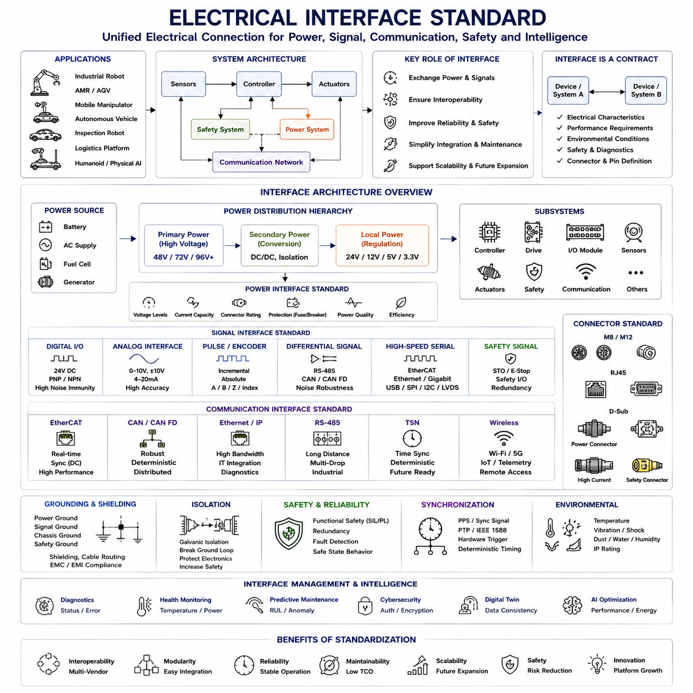
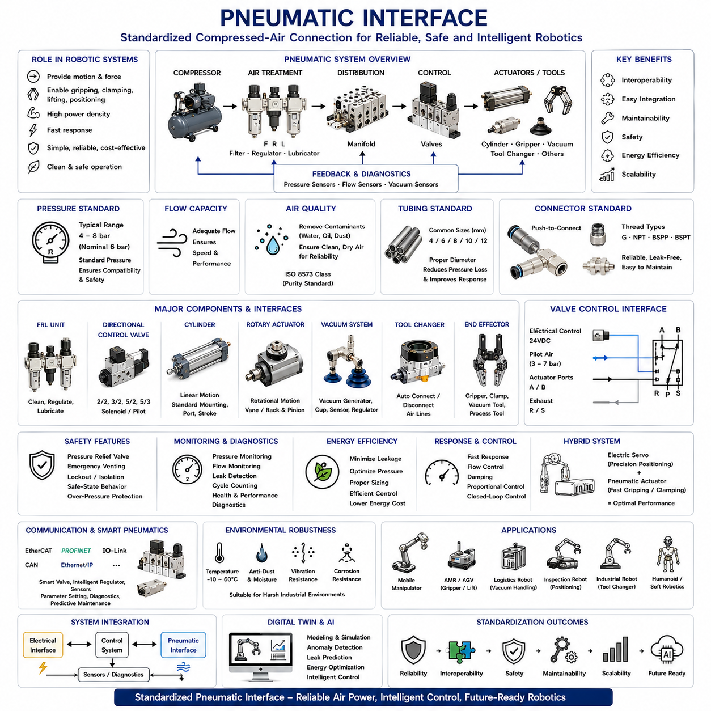
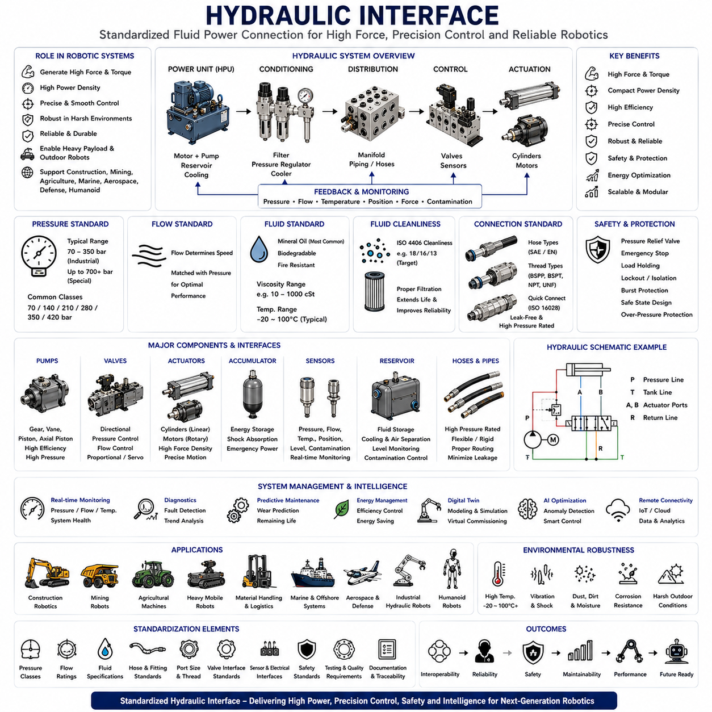
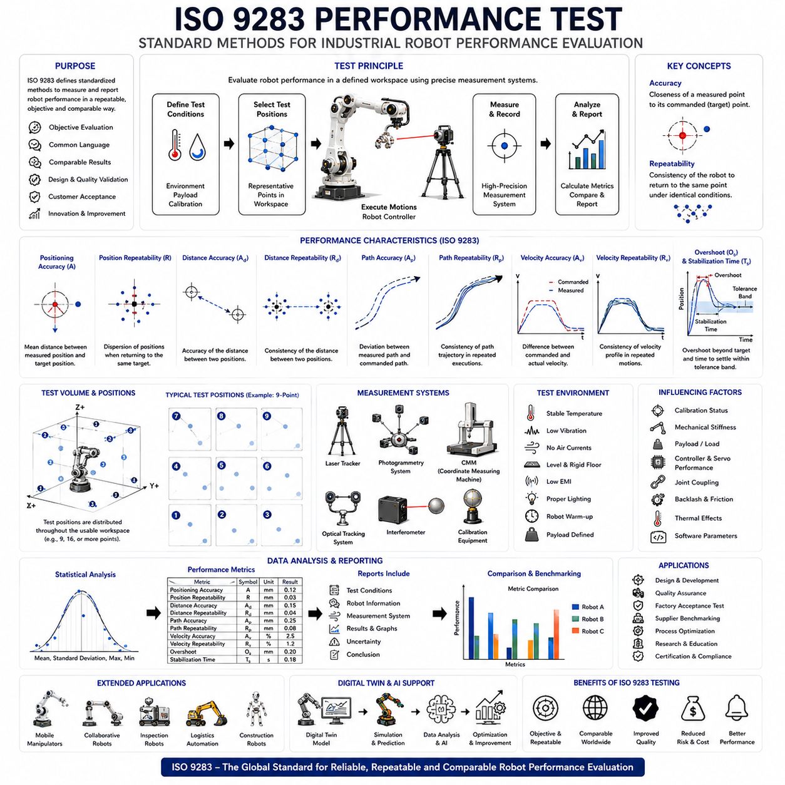
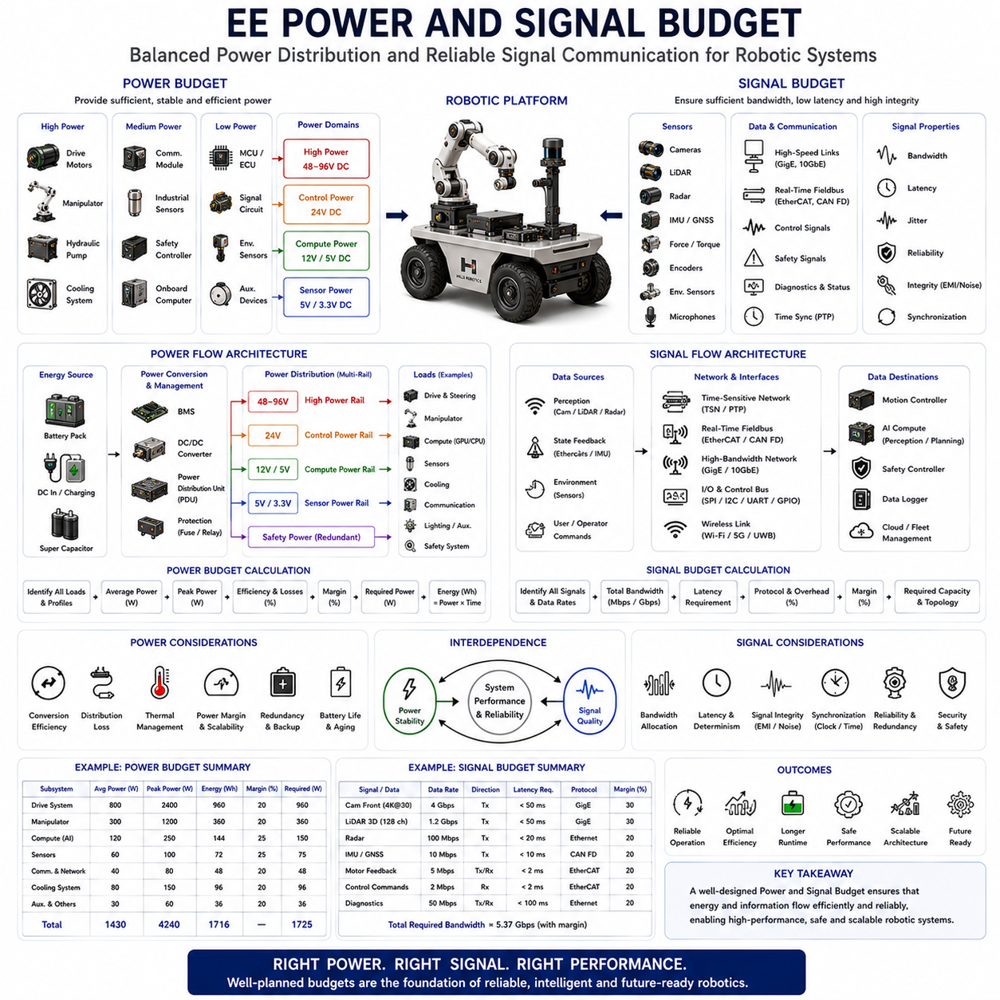

**Volume 14 Mobile Manipulator Architecture**


# Chapter 3. End Effector Interface

##  

## 3.1 Electrical Interface Standard

{width="7.268055555555556in" height="7.268055555555556in"}

Electrical Interface Standard is one of the most important foundational elements in modern robotic systems because it defines how electrical power, signals, communication channels, control commands, sensor feedback, safety circuits, and auxiliary functions are physically and logically interconnected throughout an entire machine architecture. Regardless of whether the system is an industrial manipulator, an autonomous mobile robot, a mobile manipulator, an outdoor autonomous platform, an inspection robot, a logistics automation platform, or a future Physical AI system, every subsystem must communicate and exchange energy through clearly defined electrical interfaces. Without a standardized interface architecture, system integration becomes increasingly difficult, maintenance costs increase, interoperability decreases, reliability suffers, and long-term scalability becomes nearly impossible.

Within the Hills Robotics Platform Architecture, Electrical Interface Standardization is treated as a core engineering discipline because it directly affects hardware modularity, software portability, supplier independence, manufacturing efficiency, serviceability, reliability, safety compliance, and future platform expansion. As robotic systems evolve from single-purpose machines into highly configurable intelligent platforms, the need for unified electrical interfaces becomes increasingly critical.

An electrical interface can be defined as the complete specification governing how two electrical subsystems connect and interact. This specification typically includes voltage levels, current limits, signal types, communication protocols, connector definitions, grounding methods, shielding requirements, isolation boundaries, synchronization mechanisms, safety characteristics, fault-handling procedures, and environmental requirements. The interface acts as a contract between two components, ensuring predictable operation regardless of manufacturer or subsystem implementation details.

Historically, many robotic systems were developed as isolated solutions where each subsystem utilized proprietary connectors, custom wiring schemes, unique voltage levels, and vendor-specific communication protocols. While such approaches could function within a single project, they often created integration challenges whenever components needed replacement, upgrades, or expansion. As robotics matured into a platform-oriented industry, standardization became a necessity rather than a convenience.

Electrical interface standardization begins with power-distribution architecture. Every subsystem requires electrical energy, but different devices often require different voltage levels and power characteristics. High-power actuators may operate from 48VDC, 72VDC, or higher voltages. Embedded controllers may require 24VDC. Sensors may operate from 12VDC, 5VDC, or 3.3VDC. Communication electronics may require tightly regulated low-voltage supplies. A well-designed electrical interface standard defines these voltage domains clearly and establishes consistent rules governing power distribution throughout the system.

Modern robotic platforms increasingly adopt hierarchical power architectures. A primary energy source such as a battery pack, industrial AC supply, or fuel-cell system provides high-level energy distribution. Secondary power-conversion stages generate intermediate voltage rails. Local regulators then provide precisely controlled voltages for individual subsystems. Standardized power interfaces simplify integration and reduce design complexity.

Current capacity is another critical element of interface design. Connectors, cables, terminals, and protection devices must be selected according to expected operating currents and fault conditions. Undersized interfaces may overheat, experience voltage drops, or fail catastrophically. Oversized interfaces increase cost, weight, and physical complexity. Electrical standards therefore define acceptable current ranges, conductor sizes, connector ratings, and protection requirements.

Grounding architecture forms a fundamental part of every electrical interface standard. Ground serves as both a reference potential and a fault-current return path. Poor grounding practices can create communication errors, sensor inaccuracies, electromagnetic interference, unexpected current paths, and safety hazards. Robotic systems typically employ carefully designed grounding strategies that separate power grounds, signal grounds, chassis grounds, and safety grounds while maintaining controlled interconnection points.

Shielding requirements become increasingly important as robotic systems incorporate high-power motors, switching power electronics, wireless communication systems, high-speed digital interfaces, and sensitive sensor technologies. Electromagnetic interference generated by one subsystem can easily affect another subsystem if proper shielding and cable-management practices are not followed. Electrical interface standards therefore define shielding methods, termination techniques, cable routing requirements, and electromagnetic compatibility expectations.

Signal classification represents another major area of standardization. Not all electrical signals possess the same characteristics or requirements. Digital signals typically represent binary information. Analog signals convey continuously varying measurements. Pulse signals represent discrete events. Differential signals improve noise immunity. High-speed serial links support large data transfers. Safety signals require additional redundancy and diagnostic capabilities. Interface standards classify signals according to their intended purpose and specify appropriate electrical characteristics for each category.

Digital input and output interfaces remain among the most widely used industrial control connections. Twenty-four-volt digital I/O systems have become particularly common because they provide excellent noise immunity, industrial robustness, and compatibility across a wide range of automation equipment. Standardized digital interfaces simplify integration among sensors, actuators, controllers, and safety systems.

Analog interfaces continue to play important roles despite increasing digitalization. Current-loop standards such as 4--20 mA remain widely used in industrial environments because they provide excellent noise resistance and support long cable lengths. Voltage-based interfaces such as 0--10 V or ±10 V remain common in motion control, instrumentation, and process automation. Electrical interface standards define signal ranges, accuracy requirements, isolation characteristics, and calibration procedures.

Communication interfaces have become central components of modern robotic architectures. Ethernet, EtherCAT, CAN, CAN FD, RS-485, RS-232, USB, SPI, I2C, LVDS, Gigabit Ethernet, TSN, and wireless interfaces all serve specific purposes within robotic systems. Electrical interface standards define not only protocol behavior but also physical-layer characteristics including connector types, cable specifications, termination methods, shielding requirements, and signal integrity expectations.

EtherCAT has emerged as one of the most important communication standards for robotic motion control. Its electrical interface requirements include cable specifications, connector configurations, network topology guidelines, grounding recommendations, synchronization mechanisms, and diagnostic capabilities. Standardized EtherCAT interfaces allow servo drives, motion controllers, safety devices, and distributed I/O modules from different manufacturers to operate together within a unified control architecture.

CAN and CAN FD remain important interfaces for distributed embedded systems. Their robustness, fault tolerance, and deterministic characteristics make them particularly suitable for mobile robotics, autonomous vehicles, battery management systems, and distributed control architectures. Electrical interface standards ensure consistent implementation across all connected devices.

Connector standardization significantly influences maintainability and scalability. Connectors serve as the physical implementation of electrical interfaces. Standardized connector families simplify manufacturing, inventory management, field service, and future upgrades. Industrial systems often utilize M8, M12, RJ45, D-Sub, circular industrial connectors, high-current power connectors, and specialized safety connectors depending on application requirements.

Environmental requirements strongly influence interface design. Industrial robots may operate in factories, warehouses, outdoor environments, agricultural fields, construction sites, mining operations, transportation systems, or harsh weather conditions. Electrical interfaces must therefore withstand vibration, shock, temperature variation, humidity, dust, water ingress, chemical exposure, and long-term mechanical stress. Environmental specifications often include ingress protection ratings, vibration resistance standards, corrosion requirements, and operating temperature limits.

Isolation architecture plays an increasingly important role in modern robotic systems. Galvanic isolation prevents unwanted current flow between subsystems while protecting sensitive electronics from high voltages, ground loops, and fault propagation. Isolated communication channels, isolated power supplies, isolated sensor interfaces, and isolated safety systems contribute significantly to system robustness and reliability.

Safety requirements introduce additional interface considerations. Functional safety standards require electrical interfaces capable of supporting fault detection, redundancy, diagnostics, and safe-state transitions. Emergency stop circuits, safety controllers, safety relays, safe torque off functions, safe speed monitoring systems, and protective sensor interfaces all depend upon carefully defined electrical standards. Safety interfaces must provide predictable behavior even under fault conditions.

Redundancy becomes increasingly important in mission-critical systems. Autonomous vehicles, medical robots, industrial automation systems, and future humanoid platforms may require redundant power paths, redundant communication channels, redundant safety interfaces, and redundant sensing systems. Electrical interface standards define how redundancy is implemented, monitored, and managed.

Synchronization requirements have grown substantially with the adoption of distributed robotic architectures. Multiple controllers, sensors, cameras, LiDAR systems, servo drives, and edge-computing platforms must often operate according to a common timing framework. Electrical interfaces increasingly support synchronization signals, precision time protocols, hardware trigger mechanisms, and distributed clock architectures.

Sensor interfaces represent a major category within robotic electrical standards. Cameras, LiDAR sensors, radar systems, IMUs, force sensors, torque sensors, proximity sensors, temperature sensors, pressure sensors, encoders, GPS receivers, and environmental sensors each possess unique electrical characteristics. Standardized interfaces simplify sensor integration while improving interoperability and long-term maintainability.

Actuator interfaces similarly require careful standardization. Servo drives, motor controllers, hydraulic valves, pneumatic systems, linear actuators, steering systems, grippers, and end effectors all require reliable electrical connections. Standardized actuator interfaces support modular robotic architectures and simplify future upgrades.

Battery-powered robotic platforms introduce additional interface requirements. Battery management systems, charging systems, power-distribution modules, energy-monitoring systems, and regenerative-energy pathways must all interact through well-defined electrical interfaces. Standardization improves safety, efficiency, maintainability, and interoperability across different robotic platforms.

Diagnostics and health monitoring increasingly form part of modern electrical interface standards. Intelligent devices often communicate operational status, fault conditions, temperature measurements, power consumption, communication quality metrics, and predictive-maintenance indicators through standardized interfaces. This information supports system reliability and lifecycle management.

Cybersecurity considerations are beginning to influence electrical interface design as well. Secure communication channels, device authentication mechanisms, encrypted data transmission, hardware security modules, and trusted-device architectures increasingly appear within modern robotic platforms. Future electrical interface standards will likely integrate cybersecurity requirements directly into their specifications.

Digital twin technologies further emphasize the importance of interface standardization. Virtual representations of robotic systems require consistent access to sensor data, actuator states, power information, communication status, and synchronization information. Standardized interfaces simplify digital twin integration and improve simulation fidelity.

Artificial intelligence and Physical AI systems introduce even greater demands on interface architectures. Advanced perception systems, distributed AI accelerators, high-bandwidth sensor networks, edge-computing platforms, and collaborative robotic subsystems require enormous amounts of data exchange while maintaining deterministic behavior. Standardized electrical interfaces provide the infrastructure necessary to support these capabilities.

Within the Hills Robotics platform strategy, Electrical Interface Standard serves as a common foundation spanning indoor AMRs, outdoor autonomous vehicles, mobile manipulators, inspection robots, logistics automation platforms, fleet management systems, and future humanoid robots. Standardized voltage domains, communication networks, connector architectures, safety interfaces, synchronization mechanisms, and diagnostics frameworks enable reusable engineering solutions across multiple product families.

As robotic systems continue evolving toward modularity, scalability, autonomy, and Physical AI integration, electrical interface standardization will become increasingly important. It transforms collections of individual components into coherent engineering platforms capable of supporting long-term growth and innovation. Ultimately, the Electrical Interface Standard is not merely a collection of wiring specifications; it is the foundational framework that enables reliable power distribution, deterministic communication, safe operation, efficient integration, and intelligent system evolution across the entire robotic ecosystem.

# 03_01 전기 인터페이스 표준(Electrical Interface Standard)

전기 인터페이스 표준(Electrical Interface Standard)은 현대 로봇 시스템에서 가장 중요한 기반 기술 중 하나이다. 이는 전력(Power), 신호(Signal), 통신 채널(Communication Channel), 제어 명령(Control Command), 센서 피드백(Sensor Feedback), 안전 회로(Safety Circuit), 보조 기능(Auxiliary Function)이 시스템 전체에서 어떻게 물리적·논리적으로 연결되고 상호작용하는지를 정의한다.

산업용 매니퓰레이터(Industrial Manipulator), 자율이동로봇(AMR, Autonomous Mobile Robot), 모바일 매니퓰레이터(Mobile Manipulator), 실외 자율주행 플랫폼(Outdoor Autonomous Platform), 검사 로봇(Inspection Robot), 물류 자동화 플랫폼(Logistics Automation Platform), 미래의 피지컬 AI(Physical AI) 시스템에 이르기까지 모든 하위 시스템은 명확하게 정의된 전기 인터페이스를 통해 에너지와 정보를 교환한다.

만약 인터페이스 표준화가 이루어지지 않는다면 시스템 통합(System Integration)은 매우 어려워지고 유지보수 비용(Maintenance Cost)은 증가하며 상호운용성(Interoperability)은 감소한다. 또한 신뢰성(Reliability), 확장성(Scalability), 재사용성(Reusability)도 크게 저하된다.

힐스로보틱스(Hills Robotics)의 플랫폼 아키텍처에서는 전기 인터페이스 표준화를 핵심 엔지니어링 분야(Core Engineering Discipline)로 정의한다. 이는 하드웨어 모듈화(Hardware Modularity), 소프트웨어 이식성(Software Portability), 공급업체 독립성(Supplier Independence), 생산 효율성(Manufacturing Efficiency), 유지보수성(Serviceability), 신뢰성, 안전성(Safety Compliance), 미래 확장성(Future Expansion)에 직접적인 영향을 주기 때문이다.

전기 인터페이스는 두 전기 시스템이 연결되고 상호작용하는 방법을 정의한 전체 규격(Specification)이라고 볼 수 있다. 여기에는 전압 레벨(Voltage Level), 전류 제한(Current Limit), 신호 유형(Signal Type), 통신 프로토콜(Communication Protocol), 커넥터 정의(Connector Definition), 접지 방식(Grounding Method), 차폐 요구사항(Shielding Requirement), 절연 경계(Isolation Boundary), 동기화 방식(Synchronization Mechanism), 안전 특성(Safety Characteristic), 고장 처리 절차(Fault Handling Procedure), 환경 요구사항(Environmental Requirement)이 포함된다.

쉽게 말해 인터페이스는 두 장치가 반드시 따라야 하는 기술 계약(Technical Contract)이다. 이 계약이 존재하기 때문에 제조사가 다르더라도 장치 간의 예측 가능한 동작이 가능해진다.

초기 로봇 시스템들은 대부분 독립적으로 개발되었기 때문에 제조사마다 고유한 커넥터, 배선 방식, 전압 규격, 통신 프로토콜을 사용하였다. 이러한 방식은 단일 프로젝트에서는 문제가 없을 수 있지만, 시스템 확장이나 장치 교체, 업그레이드 시 심각한 통합 문제를 발생시켰다.

로봇 산업이 플랫폼 중심(Platform-Oriented Industry)으로 발전하면서 표준화는 선택이 아닌 필수가 되었다.

전기 인터페이스 표준화의 출발점은 전력 분배 구조(Power Distribution Architecture)이다. 모든 장치는 전력을 필요로 하지만 요구 전압은 서로 다르다.

고출력 액추에이터(Actuator)는 48VDC, 72VDC 또는 그 이상의 전압을 사용할 수 있다. 임베디드 컨트롤러(Embedded Controller)는 일반적으로 24VDC를 사용한다. 센서는 12VDC, 5VDC 또는 3.3VDC를 사용할 수 있다. 통신 장치는 매우 안정적인 저전압 공급을 요구한다.

잘 설계된 전기 인터페이스 표준은 이러한 전압 도메인(Voltage Domain)을 명확하게 정의하고 시스템 전체의 전력 분배 규칙을 수립한다.

현대 로봇 플랫폼은 계층형 전력 구조(Hierarchical Power Architecture)를 채택하는 경우가 많다. 배터리(Battery), 산업용 교류 전원(Industrial AC Supply), 연료전지(Fuel Cell)가 상위 에너지 공급원이 되고, 이후 전력 변환기(Power Converter)가 중간 전압 레일(Voltage Rail)을 생성한다. 마지막으로 로컬 전압 레귤레이터(Local Regulator)가 개별 장치에 필요한 전압을 공급한다.

전류 용량(Current Capacity) 역시 중요한 요소이다. 커넥터(Connector), 케이블(Cable), 단자(Terminal), 보호 장치(Protection Device)는 예상 전류와 고장 조건(Fault Condition)을 고려하여 설계되어야 한다.

전류 용량이 부족하면 과열(Overheating), 전압 강하(Voltage Drop), 시스템 고장이 발생할 수 있다. 반대로 지나치게 크게 설계하면 비용과 무게가 증가한다.

접지 구조(Grounding Architecture)는 모든 전기 인터페이스의 핵심이다. 접지는 기준 전위(Reference Potential) 역할을 수행하며 동시에 고장 전류(Fault Current)의 반환 경로(Return Path)를 제공한다.

잘못된 접지는 통신 오류(Communication Error), 센서 오차(Sensor Error), 전자기 간섭(EMI, Electromagnetic Interference), 예기치 않은 전류 경로(Unwanted Current Path), 안전 문제(Safety Hazard)를 유발할 수 있다.

따라서 현대 로봇 시스템은 전력 접지(Power Ground), 신호 접지(Signal Ground), 섀시 접지(Chassis Ground), 안전 접지(Safety Ground)를 분리하고 제어된 방식으로 연결한다.

차폐(Shielding)는 점점 더 중요해지고 있다. 고출력 모터(Motor), 인버터(Inverter), 무선 통신(Wireless Communication), 고속 디지털 인터페이스(High-Speed Digital Interface)는 강한 전자기 잡음(Electromagnetic Noise)을 발생시킨다.

전기 인터페이스 표준은 차폐 방식, 차폐 종단(Shield Termination), 케이블 라우팅(Cable Routing), 전자기 적합성(EMC, Electromagnetic Compatibility)을 정의하여 이러한 문제를 방지한다.

신호 분류(Signal Classification)도 중요한 표준화 영역이다.

디지털 신호(Digital Signal)는 이진 정보(Binary Information)를 전달한다. 아날로그 신호(Analog Signal)는 연속적인 측정값을 전달한다. 펄스 신호(Pulse Signal)는 이벤트를 나타낸다. 차동 신호(Differential Signal)는 노이즈 내성을 향상시킨다. 고속 직렬 통신(High-Speed Serial Communication)은 대용량 데이터 전송을 담당한다. 안전 신호(Safety Signal)는 추가적인 진단 기능과 이중화를 요구한다.

디지털 입출력(Digital I/O)은 산업 자동화에서 가장 널리 사용되는 인터페이스이다. 특히 24V 디지털 I/O는 우수한 노이즈 내성과 산업 환경 적합성을 제공한다.

아날로그 인터페이스도 여전히 중요하다. 4\~20mA 전류 루프(Current Loop)는 긴 거리에서도 안정적인 신호 전송이 가능하여 산업 환경에서 널리 사용된다. 0\~10V 또는 ±10V 전압 인터페이스는 모션 제어 및 계측 분야에서 자주 사용된다.

통신 인터페이스는 현대 로봇의 핵심 구성 요소가 되었다. Ethernet, EtherCAT, CAN, CAN FD, RS-485, RS-232, USB, SPI, I2C, LVDS, Gigabit Ethernet, TSN(Time Sensitive Networking) 등은 각각 특정 목적을 위해 사용된다.

EtherCAT은 특히 모션 제어(Motion Control) 분야에서 가장 중요한 통신 표준 중 하나이다. EtherCAT 인터페이스 표준은 케이블 규격, 커넥터 구조, 네트워크 토폴로지(Network Topology), 접지 방식, 동기화(Synchronization), 진단 기능(Diagnostics)을 정의한다.

CAN과 CAN FD는 모바일 로봇(Mobile Robot), 자율주행 플랫폼(Autonomous Vehicle), 배터리 관리 시스템(BMS, Battery Management System)에서 널리 사용된다.

커넥터 표준화(Connector Standardization)는 유지보수성과 확장성에 큰 영향을 준다. M8, M12, RJ45, D-Sub, 원형 산업용 커넥터(Circular Connector), 고전류 전원 커넥터(High-Current Power Connector) 등이 대표적이다.

환경 요구사항(Environmental Requirement)도 매우 중요하다. 산업용 로봇은 공장, 창고, 농업 환경, 건설 현장, 광산, 물류 센터 등 다양한 환경에서 사용된다.

따라서 인터페이스는 진동(Vibration), 충격(Shock), 온도 변화(Temperature Variation), 습도(Humidity), 먼지(Dust), 수분(Water), 화학 물질(Chemical Exposure)에 견딜 수 있어야 한다.

절연 구조(Isolation Architecture)는 현대 로봇 시스템에서 더욱 중요해지고 있다. 갈바닉 절연(Galvanic Isolation)은 고전압으로부터 민감한 전자장치를 보호하고 접지 루프(Ground Loop)를 방지한다.

안전 요구사항(Safety Requirement)은 추가적인 인터페이스 규정을 요구한다. 비상 정지(Emergency Stop), 안전 릴레이(Safety Relay), 안전 토크 차단(STO, Safe Torque Off), 안전 속도 감시(SLS, Safe Limited Speed) 등은 기능 안전(Functional Safety) 규격을 만족해야 한다.

미션 크리티컬(Mission-Critical) 시스템에서는 이중화(Redundancy)도 중요하다. 자율주행 플랫폼, 의료 로봇(Medical Robot), 휴머노이드(Humanoid)는 전원, 통신, 센서, 안전 회로의 이중화를 요구할 수 있다.

동기화(Synchronization) 요구사항도 지속적으로 증가하고 있다. 카메라(Camera), LiDAR, IMU, 서보 드라이브, 엣지 컴퓨팅(Edge Computing) 장치는 공통 시간 기준(Common Time Reference)에 따라 동작해야 한다.

센서 인터페이스(Sensor Interface)는 또 다른 중요한 분야이다. 카메라, LiDAR, 레이더(Radar), IMU, 힘 센서(Force Sensor), 토크 센서(Torque Sensor), 온도 센서(Temperature Sensor), 엔코더(Encoder), GPS 수신기(GPS Receiver)는 각각 고유한 전기적 특성을 가진다.

액추에이터 인터페이스(Actuator Interface) 역시 표준화가 필요하다. 서보 드라이브, 모터 컨트롤러(Motor Controller), 유압 밸브(Hydraulic Valve), 공압 장치(Pneumatic System), 그리퍼(Gripper), 엔드 이펙터(End Effector)는 모두 안정적인 전기 인터페이스를 필요로 한다.

배터리 기반 플랫폼에서는 BMS, 충전 시스템(Charging System), 전력 분배 모듈(Power Distribution Module), 회생 에너지 시스템(Regenerative Energy System) 간의 인터페이스 표준화가 중요하다.

최근에는 진단(Diagnostics)과 상태 모니터링(Health Monitoring) 기능도 인터페이스 표준에 포함되고 있다. 장치는 온도, 소비 전력, 통신 품질, 오류 상태, 예지보전 정보를 표준화된 방식으로 제공한다.

사이버보안(Cybersecurity) 역시 전기 인터페이스 설계에 영향을 주고 있다. 장치 인증(Device Authentication), 암호화 통신(Encrypted Communication), 보안 하드웨어(Security Hardware)가 점차 표준에 포함되고 있다.

디지털 트윈(Digital Twin)은 인터페이스 표준화의 중요성을 더욱 높이고 있다. 디지털 트윈은 센서 데이터, 액추에이터 상태, 전력 정보, 동기화 정보를 일관된 방식으로 접근할 수 있어야 한다.

인공지능(AI)과 피지컬 AI 시스템은 더욱 많은 데이터 교환과 결정론적 동작을 요구한다. 따라서 표준화된 전기 인터페이스는 미래 지능형 로봇 플랫폼의 핵심 인프라가 된다.

힐스로보틱스의 실내 AMR, 실외 자율주행 플랫폼, 모바일 매니퓰레이터, 검사 로봇, 물류 자동화 플랫폼, 플릿 관리(Fleet Management), 미래 휴머노이드 플랫폼에서는 전기 인터페이스 표준이 공통 플랫폼의 기반 역할을 수행한다.

결론적으로 전기 인터페이스 표준은 단순한 배선 규격(Wiring Specification)이 아니다. 이는 안정적인 전력 공급(Power Distribution), 결정론적 통신(Deterministic Communication), 안전한 운용(Safe Operation), 효율적인 시스템 통합(System Integration), 그리고 지능형 로봇 플랫폼의 지속적인 발전(Evolution)을 가능하게 하는 핵심 프레임워크(Core Framework)이다. 미래의 모듈형 로봇(Modular Robot), 자율주행 플랫폼, 휴머노이드, 피지컬 AI 시스템으로 발전할수록 전기 인터페이스 표준의 중요성은 더욱 커질 것이다.

##  

## 3.2 Pneumatic Interface

{width="7.268055555555556in" height="7.268055555555556in"}

Pneumatic Interface technology represents one of the most important physical connection standards within modern automation, robotics, manufacturing systems, logistics equipment, industrial manipulators, autonomous mobile robots, collaborative robots, inspection systems, and future Physical AI platforms. While electrical interfaces provide power and information exchange, pneumatic interfaces provide controlled compressed-air energy that enables motion, gripping, clamping, lifting, positioning, sorting, actuation, and safety functions. In many industrial applications, pneumatic systems continue to offer advantages in simplicity, reliability, power density, cleanliness, response speed, and cost effectiveness. As robotic platforms become increasingly modular and intelligent, standardized pneumatic interfaces become essential for interoperability, maintainability, scalability, safety, and lifecycle management.

Within the Hills Robotics Platform Architecture, Pneumatic Interface Standardization serves as a key subsystem for integrating end effectors, grippers, vacuum systems, pneumatic cylinders, tool changers, safety actuators, inspection mechanisms, and future modular robotic components. A standardized pneumatic architecture allows multiple devices from different suppliers to operate together through a common compressed-air infrastructure while maintaining predictable performance and simplifying integration.

A pneumatic interface can be defined as the complete mechanical, fluidic, electrical, and communication specification governing how compressed-air systems connect and interact. The interface includes pressure ratings, flow requirements, connector standards, tubing specifications, valve control methods, safety mechanisms, air quality requirements, diagnostic capabilities, and environmental constraints. Just as electrical interfaces define voltage and communication compatibility, pneumatic interfaces define the conditions necessary for reliable compressed-air operation.

The foundation of every pneumatic system is compressed air. Pneumatic energy originates from compressors that convert electrical or mechanical energy into stored air pressure. This compressed air is distributed throughout a facility or robotic platform through a network of pipes, hoses, manifolds, regulators, filters, and valves. The pneumatic interface defines how this energy is delivered to individual devices and subsystems.

Pressure standardization is one of the most fundamental aspects of pneumatic interface design. Most industrial pneumatic systems operate within pressure ranges of approximately 4 bar to 8 bar, with 6 bar often serving as a common nominal operating pressure. Standardized pressure levels simplify component selection, improve interoperability, and reduce the risk of equipment damage. Components designed for a common pressure range can be integrated without extensive customization.

Flow capacity represents another critical parameter. Pressure alone does not determine actuator performance. Airflow determines how quickly pneumatic devices can respond and how much energy can be delivered during dynamic operations. Pneumatic interfaces therefore specify both pressure and flow requirements to ensure predictable system behavior.

Air quality plays a significant role in pneumatic-system reliability. Compressed air may contain water vapor, oil contamination, dust particles, corrosion products, and other impurities. These contaminants can degrade seals, damage valves, reduce actuator life, and impair performance. Pneumatic interface standards therefore define filtration levels, moisture-control requirements, oil-content limits, and air-quality classifications.

The Filter-Regulator-Lubricator assembly, commonly referred to as an FRL unit, forms the foundation of many pneumatic infrastructures. Filters remove contaminants. Regulators maintain stable operating pressure. Lubricators provide controlled lubrication when required. Although many modern pneumatic systems operate oil-free, the FRL concept remains a fundamental element of interface architecture.

Tubing and hose specifications are equally important. Pneumatic interfaces rely upon flexible or rigid air-delivery pathways. Tube diameter directly influences airflow capability, pressure losses, and response time. Standard tube sizes simplify system integration and maintenance. Common industrial standards include metric tubing such as 4 mm, 6 mm, 8 mm, 10 mm, and 12 mm diameters, as well as imperial equivalents in certain regions.

Connector standardization significantly influences maintainability and interoperability. Push-to-connect fittings have become the dominant interface technology due to their ease of installation and reliability. Standardized connector families allow rapid replacement of devices and simplify field service operations. Thread standards such as G-thread, NPT, BSPP, and BSPT remain widely used depending on regional and industrial requirements.

Manifold architecture provides an efficient method of distributing compressed air to multiple devices. Rather than routing individual supply lines to every actuator, centralized manifolds distribute air through organized connection points. Modern robotic systems frequently utilize modular manifold designs that support expansion, maintenance, and reconfiguration.

Directional control valves represent one of the most important elements within pneumatic interface systems. These valves determine how compressed air is routed to actuators. Solenoid-operated valves are particularly common because they allow electronic controllers to command pneumatic motion. The electrical interface and pneumatic interface therefore become closely interconnected through valve-control architecture.

Valve classification is typically based upon the number of ports and switching positions. Two-way, three-way, four-way, and five-way valves serve different application requirements. Interface standards define port arrangements, pressure ratings, response times, electrical connections, and mounting methods to ensure compatibility among devices.

Pneumatic cylinders remain among the most widely used pneumatic actuators. They convert compressed-air energy into linear motion. Standardized pneumatic interfaces define mounting dimensions, operating pressures, stroke lengths, port sizes, and performance characteristics. This standardization allows cylinders from multiple manufacturers to be integrated into common architectures.

Rotary actuators provide controlled rotational movement through pneumatic power. These devices are frequently used in material-handling systems, positioning mechanisms, robotic tooling, and automation equipment. Standardized interfaces simplify actuator replacement and integration.

Vacuum systems represent another major category of pneumatic applications. Vacuum grippers are extensively used in logistics automation, warehouse robotics, semiconductor manufacturing, packaging systems, and robotic manipulation. Pneumatic interfaces for vacuum systems include vacuum generators, vacuum sensors, suction cups, flow controls, and safety mechanisms.

End-of-arm tooling in robotic systems increasingly depends upon standardized pneumatic interfaces. Grippers, vacuum cups, tool changers, clamping systems, inspection devices, and process tools frequently require compressed-air connections. Standardized pneumatic ports allow tools to be exchanged rapidly while minimizing downtime and integration complexity.

Tool changers represent a particularly important application. Modern robotic systems increasingly employ automatic tool-changing mechanisms that allow a single robot to perform multiple tasks. Standardized pneumatic interfaces support automatic connection and disconnection of compressed-air lines during tool changes while maintaining reliable sealing and safety performance.

Safety plays a central role in pneumatic interface design. Pneumatic energy can store significant amounts of potential energy. Unexpected release of compressed air may create hazards for personnel and equipment. Interface standards therefore define pressure-relief mechanisms, emergency venting systems, lockout procedures, fault-detection methods, and safe-state behaviors.

Pressure monitoring systems contribute significantly to operational safety. Pressure sensors continuously measure supply pressure, actuator pressure, vacuum levels, and system health indicators. Diagnostic information supports predictive maintenance and fault detection while helping prevent unsafe operating conditions.

Leakage management represents one of the most important operational concerns in pneumatic systems. Even small leaks can significantly increase energy consumption over time. Large industrial facilities often lose substantial amounts of compressed-air energy through undetected leakage. Pneumatic interface standards increasingly incorporate leak-detection capabilities, monitoring requirements, and maintenance procedures.

Energy efficiency has become a major design objective in modern pneumatic systems. Compressed air is often considered one of the most expensive forms of industrial energy due to compression losses and distribution inefficiencies. Standardized interfaces help minimize leakage, reduce pressure losses, optimize actuator sizing, and improve overall system efficiency.

Response time characteristics are particularly important in robotic applications. Pneumatic actuators can provide extremely rapid movement due to the compressibility and low inertia of air. However, air compressibility also introduces control challenges. Interface standards therefore define response characteristics, flow-control methods, damping requirements, and performance expectations.

Precision control historically represented a limitation of pneumatic systems compared with servo-electric systems. However, modern proportional valves, servo-pneumatic controllers, pressure regulators, and advanced control algorithms have significantly improved positioning capability. Pneumatic interfaces increasingly support closed-loop control architectures incorporating pressure sensors, position sensors, and intelligent controllers.

Hybrid robotic systems frequently combine electric and pneumatic technologies. Electric servo motors provide precise positioning while pneumatic actuators deliver rapid gripping, clamping, or force generation. Standardized interfaces allow these technologies to coexist within a unified system architecture.

Environmental robustness remains one of the strongest advantages of pneumatic technology. Pneumatic systems generally tolerate dust, moisture, vibration, temperature variation, and harsh industrial conditions more effectively than many electronic alternatives. This robustness makes pneumatic interfaces particularly attractive for outdoor robotics, heavy industry, food processing, mining operations, and logistics environments.

Food and pharmaceutical industries impose additional interface requirements. Pneumatic systems operating in hygienic environments must comply with strict cleanliness standards. Stainless-steel components, cleanable surfaces, oil-free operation, and contamination-resistant interfaces become essential design requirements.

Industrial communication networks increasingly integrate pneumatic devices into broader automation architectures. Smart valves, intelligent regulators, pressure sensors, flow meters, and diagnostic modules communicate through EtherCAT, PROFINET, IO-Link, CAN, Ethernet/IP, and other industrial protocols. Pneumatic interfaces therefore extend beyond physical air connections to include digital information exchange.

IO-Link has emerged as a particularly important technology for intelligent pneumatic devices. It enables parameter configuration, diagnostics, condition monitoring, and device identification through standardized communication mechanisms. Smart pneumatic interfaces support predictive maintenance and Industry 4.0 initiatives.

Diagnostic capabilities continue expanding within modern pneumatic architectures. Intelligent devices can monitor pressure stability, flow characteristics, cycle counts, leakage rates, valve performance, actuator wear, and environmental conditions. This information helps improve reliability and reduce maintenance costs.

Digital twin technologies increasingly model pneumatic systems alongside mechanical, electrical, and software subsystems. Accurate virtual representations of pressure behavior, airflow characteristics, actuator performance, and fault scenarios improve design validation and system optimization before deployment.

Artificial intelligence is beginning to influence pneumatic-system management as well. Machine-learning algorithms can analyze pressure trends, detect anomalies, predict leakage events, optimize energy consumption, and recommend maintenance actions. Future robotic platforms may automatically adapt pneumatic behavior based on operational requirements and environmental conditions.

Within the Hills Robotics ecosystem, pneumatic interfaces support numerous applications. Mobile manipulators utilize pneumatic grippers and vacuum tools for object handling. Inspection robots employ pneumatic positioning devices and sensor-cleaning systems. Logistics robots use vacuum handling mechanisms for parcel manipulation. Industrial robotic platforms integrate pneumatic tool changers and process equipment. Future humanoid systems may employ pneumatic technologies for compliance mechanisms, soft robotics, and advanced human-machine interaction.

As robotics continues evolving toward modularity, interoperability, intelligence, and Physical AI integration, pneumatic interface standardization becomes increasingly important. A well-defined pneumatic interface transforms compressed-air infrastructure into a scalable platform that supports reliable operation, simplified integration, improved safety, enhanced diagnostics, and future technological expansion.

Ultimately, the Pneumatic Interface is far more than a collection of hoses and fittings. It is a comprehensive engineering framework governing the generation, distribution, control, monitoring, and utilization of pneumatic energy throughout a robotic system. By standardizing pressure domains, airflow characteristics, connector architectures, safety mechanisms, diagnostic capabilities, and communication pathways, Pneumatic Interface Standards provide the foundation for reliable, efficient, maintainable, and intelligent robotic platforms capable of supporting next-generation automation and Physical AI applications.

# 03_02 공압 인터페이스(Pneumatic Interface)

공압 인터페이스(Pneumatic Interface)는 현대 자동화 시스템(Automation System), 로보틱스(Robotics), 제조 설비(Manufacturing System), 물류 장비(Logistics Equipment), 산업용 매니퓰레이터(Industrial Manipulator), 자율이동로봇(AMR, Autonomous Mobile Robot), 협동로봇(Collaborative Robot), 검사 시스템(Inspection System), 미래의 피지컬 AI(Physical AI) 플랫폼에서 매우 중요한 물리적 연결 표준 중 하나이다.

전기 인터페이스(Electrical Interface)가 전력(Power)과 정보(Information)를 전달한다면, 공압 인터페이스는 압축공기(Compressed Air)를 이용하여 움직임(Motion), 파지(Gripping), 클램핑(Clamping), 리프팅(Lifting), 위치 결정(Positioning), 분류(Sorting), 액추에이션(Actuation), 안전 기능(Safety Function)을 수행한다.

많은 산업 현장에서 공압 시스템(Pneumatic System)은 구조의 단순성(Simplicity), 높은 신뢰성(Reliability), 우수한 출력 대비 무게 비율(Power Density), 청정성(Cleanliness), 빠른 응답성(Response Speed), 비용 효율성(Cost Effectiveness) 측면에서 여전히 큰 장점을 제공한다.

로봇 플랫폼이 점점 더 모듈화(Modularity)되고 지능화(Intelligence)됨에 따라 표준화된 공압 인터페이스는 상호운용성(Interoperability), 유지보수성(Maintainability), 확장성(Scalability), 안전성(Safety), 수명주기 관리(Lifecycle Management)를 위해 필수적인 요소가 되고 있다.

힐스로보틱스(Hills Robotics)의 플랫폼 아키텍처에서는 공압 인터페이스 표준화(Pneumatic Interface Standardization)를 그리퍼(Gripper), 진공 시스템(Vacuum System), 공압 실린더(Pneumatic Cylinder), 툴 체인저(Tool Changer), 안전 액추에이터(Safety Actuator), 검사 장치(Inspection Mechanism), 미래 모듈형 로봇 부품(Modular Robotic Component)을 통합하기 위한 핵심 기술로 정의하고 있다.

공압 인터페이스는 압축공기 시스템이 연결되고 동작하는 모든 기계적(Mechanical), 유체적(Fluidic), 전기적(Electrical), 통신적(Communication) 규격을 포함하는 표준이다.

여기에는 압력 등급(Pressure Rating), 유량 요구사항(Flow Requirement), 커넥터 표준(Connector Standard), 튜브 규격(Tubing Specification), 밸브 제어 방식(Valve Control Method), 안전 장치(Safety Mechanism), 공기 품질(Air Quality), 진단 기능(Diagnostic Capability), 환경 조건(Environmental Constraint)이 포함된다.

전기 인터페이스가 전압과 통신을 정의한다면 공압 인터페이스는 압축공기의 공급과 제어를 정의하는 기술 계약(Technical Contract)이라고 볼 수 있다.

모든 공압 시스템의 시작은 압축공기이다. 압축기(Compressor)는 전기 에너지 또는 기계 에너지를 압축공기로 변환한다. 생성된 압축공기는 배관(Pipe), 호스(Hose), 매니폴드(Manifold), 레귤레이터(Regulator), 필터(Filter), 밸브(Valve)를 통해 전체 시스템으로 분배된다.

압력 표준화(Pressure Standardization)는 공압 인터페이스 설계의 가장 기본적인 요소이다.

대부분의 산업용 공압 시스템은 4 bar에서 8 bar 범위에서 동작하며, 6 bar가 가장 일반적인 표준 압력으로 사용된다.

압력 표준화는 부품 선택을 단순화하고, 상호운용성을 향상시키며, 장비 손상 위험을 감소시킨다.

유량(Flow Capacity)은 또 다른 핵심 요소이다.

압력만으로는 액추에이터의 성능을 결정할 수 없다. 실제 응답 속도와 출력은 공급 가능한 공기 유량에 의해 결정된다.

따라서 공압 인터페이스는 압력뿐 아니라 유량까지 함께 규정해야 한다.

공기 품질(Air Quality)은 공압 시스템 신뢰성에 직접적인 영향을 미친다.

압축공기에는 수분(Water Vapor), 오일(Oil Contamination), 먼지(Dust Particle), 부식 생성물(Corrosion Product)이 포함될 수 있다.

이러한 오염물질은 씰(Seal)을 손상시키고 밸브 수명을 단축시키며 시스템 성능을 저하시킨다.

따라서 공압 인터페이스 표준은 필터링 수준(Filtration Level), 수분 제거(Moisture Control), 오일 함량(Oil Content), 공기 품질 등급(Air Quality Classification)을 정의한다.

필터-레귤레이터-루브리케이터(Filter-Regulator-Lubricator), 즉 FRL 유닛은 공압 인프라의 기본 구성 요소이다.

필터는 오염물질을 제거하고, 레귤레이터는 압력을 일정하게 유지하며, 루브리케이터는 필요한 경우 윤활유를 공급한다.

최근에는 무급유(Oil-Free) 시스템이 증가하고 있지만 FRL 개념은 여전히 중요한 표준 요소이다.

튜브(Tube)와 호스(Hose) 규격 역시 중요하다.

튜브 직경은 유량, 압력 손실(Pressure Loss), 응답 속도에 직접적인 영향을 준다.

산업 현장에서는 일반적으로 4 mm, 6 mm, 8 mm, 10 mm, 12 mm 튜브가 널리 사용된다.

커넥터 표준화(Connector Standardization)는 유지보수성과 상호운용성을 크게 향상시킨다.

현재 가장 널리 사용되는 방식은 원터치 피팅(Push-to-Connect Fitting)이다.

또한 G Thread, NPT, BSPP, BSPT와 같은 나사 규격(Thread Standard)이 산업 및 지역별로 사용되고 있다.

매니폴드 아키텍처(Manifold Architecture)는 압축공기를 여러 장치에 효율적으로 분배하기 위한 구조이다.

개별 장치마다 공기 공급선을 연결하는 대신 중앙 매니폴드에서 여러 포트로 분배함으로써 설치와 유지보수를 단순화할 수 있다.

방향 제어 밸브(Directional Control Valve)는 공압 인터페이스의 핵심 구성 요소이다.

이 밸브는 압축공기를 어느 방향으로 공급할 것인지 결정한다.

솔레노이드 밸브(Solenoid Valve)는 전기 신호를 이용해 공압 흐름을 제어하기 때문에 전기 인터페이스와 공압 인터페이스를 연결하는 중요한 요소이다.

밸브는 일반적으로 2포트(2-Way), 3포트(3-Way), 4포트(4-Way), 5포트(5-Way) 구조로 분류된다.

공압 실린더(Pneumatic Cylinder)는 가장 널리 사용되는 공압 액추에이터이다.

압축공기를 직선 운동(Linear Motion)으로 변환하며, 장착 방식(Mounting Method), 스트로크 길이(Stroke Length), 포트 크기(Port Size), 압력 등급(Pressure Rating)이 표준화되어 있다.

회전 액추에이터(Rotary Actuator)는 공압 에너지를 회전 운동(Rotational Motion)으로 변환한다.

자재 이송(Material Handling), 위치 결정(Positioning), 로봇 툴링(Robotic Tooling)에 자주 사용된다.

진공 시스템(Vacuum System)은 현대 물류 로봇과 산업 자동화에서 매우 중요한 분야이다.

진공 그리퍼(Vacuum Gripper)는 물류 자동화, 창고 로봇, 반도체 제조, 포장 시스템(Packaging System)에서 광범위하게 사용된다.

진공 발생기(Vacuum Generator), 진공 센서(Vacuum Sensor), 흡착 패드(Suction Cup), 유량 제어기(Flow Controller)는 모두 공압 인터페이스의 일부이다.

로봇 엔드 이펙터(End Effector)는 공압 인터페이스 표준화의 가장 대표적인 응용 분야 중 하나이다.

그리퍼, 진공 패드, 클램프, 검사 장치, 공정 툴(Process Tool)은 모두 압축공기를 필요로 한다.

자동 툴 체인저(Automatic Tool Changer)는 이러한 표준화의 대표적인 사례이다.

하나의 로봇이 여러 작업을 수행하기 위해서는 툴을 자동으로 교체해야 하며, 이 과정에서 공압 라인도 자동으로 연결되고 분리되어야 한다.

안전성(Safety)은 공압 인터페이스 설계에서 매우 중요하다.

압축공기는 상당한 잠재 에너지(Potential Energy)를 저장하고 있기 때문에 갑작스러운 방출은 인명과 장비에 위험을 초래할 수 있다.

따라서 압력 해제 장치(Pressure Relief Device), 비상 배기 시스템(Emergency Venting System), 잠금 장치(Lockout Mechanism), 안전 상태 전환(Safe-State Transition)이 필요하다.

압력 모니터링 시스템(Pressure Monitoring System)은 운영 안전성을 향상시킨다.

압력 센서(Pressure Sensor)는 공급 압력, 실린더 압력, 진공 상태를 지속적으로 측정하며 이상 상태를 감지한다.

누설 관리(Leakage Management)는 공압 시스템의 가장 중요한 운영 과제 중 하나이다.

작은 누설도 장기적으로는 상당한 에너지 손실을 유발한다.

대형 공장에서는 압축공기 누설로 인해 전체 에너지 비용의 상당 부분이 낭비되기도 한다.

최근 공압 인터페이스는 누설 감지(Leak Detection) 기능과 상태 모니터링(Condition Monitoring)을 포함하는 방향으로 발전하고 있다.

에너지 효율(Energy Efficiency)은 현대 공압 설계의 핵심 목표이다.

압축공기는 압축 과정에서 많은 에너지를 소비하기 때문에 산업 현장에서 가장 비싼 에너지 중 하나로 간주된다.

따라서 압력 손실 감소, 누설 최소화, 적정 액추에이터 선정이 매우 중요하다.

공압 액추에이터는 매우 빠른 응답성을 제공한다.

공기는 관성이 작고 빠르게 이동할 수 있기 때문에 높은 속도의 동작이 가능하다.

반면 공기의 압축성(Compressibility)은 정밀 제어를 어렵게 만드는 요인이기도 하다.

최근에는 비례 밸브(Proportional Valve), 서보 공압 제어기(Servo Pneumatic Controller), 정밀 압력 제어기(Pressure Regulator)의 발전으로 공압 시스템도 폐루프 제어가 가능해지고 있다.

현대 로봇은 전기식(Electric)과 공압식(Pneumatic)을 혼합한 하이브리드 구조(Hybrid Architecture)를 자주 사용한다.

전기 서보는 정밀 위치 제어를 담당하고, 공압 액추에이터는 빠른 파지와 클램핑을 담당한다.

환경 내성(Environmental Robustness)은 공압 기술의 가장 큰 장점 중 하나이다.

공압 시스템은 먼지, 습기, 진동, 온도 변화에 강하며 중공업, 광산, 식품 산업, 물류 산업 등에서 안정적으로 사용할 수 있다.

식품 및 제약 산업(Food and Pharmaceutical Industry)은 추가적인 위생 요구사항(Hygienic Requirement)을 가진다.

스테인리스 스틸(Stainless Steel), 무급유 설계, 세척 가능한 표면(Cleanable Surface)이 필수적이다.

최근 공압 장치도 EtherCAT, PROFINET, IO-Link, CAN, Ethernet/IP 등의 산업용 네트워크(Industrial Network)에 연결되고 있다.

특히 IO-Link는 스마트 공압 장치(Smart Pneumatic Device)를 위한 핵심 기술로 자리잡고 있다.

스마트 밸브(Smart Valve), 지능형 레귤레이터(Intelligent Regulator), 압력 센서, 유량 센서(Flow Meter)는 진단과 예지보전을 지원한다.

디지털 트윈(Digital Twin)은 공압 시스템도 함께 모델링한다.

압력 변화, 유량 특성, 액추에이터 동작, 고장 시나리오를 가상 환경에서 검증할 수 있다.

인공지능(AI)은 공압 시스템 관리에도 적용되고 있다.

머신러닝(Machine Learning)은 압력 패턴을 분석하여 이상 상태(Anomaly)를 탐지하고 누설을 예측하며 에너지 소비를 최적화할 수 있다.

힐스로보틱스 플랫폼에서는 모바일 매니퓰레이터의 공압 그리퍼, 검사 로봇의 위치 조정 장치, 물류 로봇의 진공 흡착 장치, 산업용 로봇의 자동 툴 체인저 등에 공압 인터페이스가 활용된다.

미래의 휴머노이드(Humanoid)와 소프트 로보틱스(Soft Robotics)에서도 공압 기술은 순응 제어(Compliance Control)와 인간 친화적 상호작용(Human-Friendly Interaction)을 위해 중요한 역할을 수행할 것으로 예상된다.

결론적으로 공압 인터페이스는 단순한 호스와 피팅(Hose and Fitting)의 집합이 아니다. 이는 압축공기의 생성(Generation), 분배(Distribution), 제어(Control), 모니터링(Monitoring), 활용(Utilization)을 정의하는 종합적인 공학 프레임워크(Engineering Framework)이다.

압력 표준, 유량 특성, 커넥터 구조, 안전 장치, 진단 기능, 통신 인터페이스를 표준화함으로써 공압 인터페이스는 차세대 자동화 시스템, 지능형 로봇, 피지컬 AI 플랫폼을 위한 신뢰성(Reliability), 효율성(Efficiency), 유지보수성(Maintainability), 확장성(Scalability)의 기반을 제공하게 된다.

##  

## 3.3 Hydraulic Interface

{width="7.268055555555556in" height="7.268055555555556in"}

Hydraulic Interface technology represents one of the most powerful and robust energy-transfer architectures used in modern industrial automation, heavy robotics, construction machinery, agricultural equipment, mining systems, aerospace mechanisms, defense platforms, marine equipment, and emerging large-scale autonomous robotic systems. While electrical interfaces transfer electrical energy and pneumatic interfaces transfer compressed-air energy, hydraulic interfaces transfer fluid power through pressurized liquids, enabling the generation of extremely high force, torque, and power density within compact mechanical structures. As robotics evolves beyond lightweight industrial manipulators toward heavy-duty autonomous platforms, outdoor robots, construction automation systems, humanoid strength augmentation systems, and future Physical AI machines capable of interacting with the physical world at large scales, hydraulic interfaces continue to play an essential role in enabling high-load actuation and reliable power transmission.

Within the Hills Robotics Platform Architecture, Hydraulic Interface Standardization becomes increasingly important for future outdoor autonomous vehicles, heavy-payload robotic platforms, construction robotics, mining robots, agricultural automation systems, cargo handling equipment, advanced manipulation systems, and future large-scale humanoid robots. A standardized hydraulic architecture enables interoperability between pumps, valves, cylinders, actuators, sensors, power units, and intelligent control systems while simplifying maintenance, diagnostics, scalability, and long-term platform evolution.

A hydraulic interface can be defined as the complete specification governing the transmission, control, monitoring, and management of hydraulic energy between interconnected subsystems. The interface includes pressure ratings, flow specifications, connector standards, hose requirements, fluid specifications, valve architectures, filtration requirements, sensing mechanisms, safety functions, communication protocols, environmental requirements, and maintenance procedures. Similar to electrical interface standards that define voltage domains and communication standards, hydraulic interfaces define pressure domains, fluid behavior expectations, and energy-transfer characteristics.

The fundamental principle behind hydraulic systems is Pascal\'s Law, which states that pressure applied to a confined fluid is transmitted equally throughout the fluid. This principle allows hydraulic systems to amplify force efficiently and distribute energy over significant distances without requiring large mechanical linkages. Because hydraulic fluids are nearly incompressible compared to air, hydraulic systems can generate highly controllable force while maintaining excellent stiffness characteristics.

Hydraulic energy originates from a hydraulic power unit, commonly referred to as an HPU. The HPU serves as the central energy-generation system and typically consists of an electric motor, hydraulic pump, fluid reservoir, filtration system, cooling system, pressure regulation mechanisms, and monitoring equipment. The hydraulic interface standard defines how the HPU interacts with downstream hydraulic components and establishes operating conditions for the entire system.

Pressure standardization is one of the most important aspects of hydraulic interface design. Hydraulic systems commonly operate at significantly higher pressures than pneumatic systems. Industrial hydraulic systems may operate between 70 bar and 350 bar, while specialized applications may exceed 700 bar. Mobile equipment frequently utilizes operating pressures between 180 bar and 420 bar depending on performance requirements. Standardized pressure classifications simplify component compatibility and improve safety.

Pressure classes define the allowable operating limits for hoses, fittings, valves, actuators, accumulators, and sensors. Every component within a hydraulic system must be rated appropriately for the expected operating pressure and transient pressure spikes. Interface standards ensure that connected components maintain compatible pressure ratings and safety margins.

Flow rate is equally important. Pressure determines available force, while flow determines actuator speed. A hydraulic cylinder supplied with high pressure but insufficient flow may generate large force while moving slowly. Conversely, high flow with inadequate pressure may provide rapid motion but insufficient force. Hydraulic interface specifications therefore define both pressure and flow requirements to ensure predictable performance.

Fluid selection represents a unique aspect of hydraulic interface engineering. Unlike electrical systems that rely upon electron flow or pneumatic systems that rely upon compressed air, hydraulic systems depend on carefully engineered fluids. Hydraulic fluid serves simultaneously as an energy-transfer medium, lubricant, coolant, contamination transport mechanism, and corrosion inhibitor. Interface standards define acceptable fluid types, viscosity ranges, temperature limits, cleanliness requirements, and compatibility characteristics.

Mineral-oil-based hydraulic fluids remain the most common choice for industrial applications. However, environmentally sensitive applications increasingly utilize biodegradable hydraulic fluids. Fire-resistant hydraulic fluids are employed in aerospace, mining, steel manufacturing, and hazardous industrial environments. Interface standards ensure compatibility among seals, hoses, pumps, valves, and actuators regardless of fluid selection.

Fluid cleanliness is one of the most critical factors influencing hydraulic-system reliability. Contamination particles can damage pumps, wear valve surfaces, degrade seals, block passages, and reduce system efficiency. Consequently, hydraulic interface standards define filtration requirements and contamination-control procedures. ISO cleanliness codes are commonly used to quantify fluid cleanliness levels and establish maintenance criteria.

Hydraulic reservoirs play a central role in fluid management. Reservoirs store hydraulic fluid, support thermal stabilization, allow contaminant settling, and provide air separation. Interface standards define reservoir sizing methodologies, fluid-level monitoring requirements, ventilation systems, contamination protection measures, and maintenance access provisions.

Hydraulic pumps serve as the primary energy-conversion devices within hydraulic systems. Pumps convert mechanical energy into fluid power. Several pump technologies are commonly employed, including gear pumps, vane pumps, piston pumps, axial piston pumps, and radial piston pumps. Hydraulic interface standards define operating conditions, pressure ratings, flow capacities, efficiency requirements, and monitoring capabilities for pump integration.

Hydraulic actuators convert fluid power back into mechanical motion. Cylinders generate linear motion, while hydraulic motors generate rotary motion. Hydraulic cylinders are particularly common in heavy-duty applications because they provide exceptional force density. Interface standards define mounting dimensions, pressure ratings, port configurations, stroke specifications, sealing requirements, and performance characteristics to support interoperability.

Hydraulic motors are widely used in construction equipment, mining systems, agricultural machinery, and heavy robotic platforms. They provide high torque output while maintaining compact physical dimensions. Standardized interfaces simplify replacement, integration, and maintenance operations.

Valve architecture forms the control layer of hydraulic systems. Directional control valves determine fluid routing. Pressure-control valves regulate system pressure. Flow-control valves regulate actuator speed. Proportional valves and servo valves provide advanced motion-control capabilities. Interface standards define valve response characteristics, pressure ratings, communication interfaces, mounting configurations, and diagnostic functions.

Servo-hydraulic systems represent the highest-performance category of hydraulic motion control. These systems utilize precision servo valves, high-resolution feedback sensors, advanced controllers, and sophisticated algorithms to achieve precise position, velocity, and force control. Servo-hydraulic technology combines the power density of hydraulics with control precision approaching that of electric servo systems.

Electro-hydraulic integration has become increasingly important within modern robotic architectures. Electronic controllers continuously monitor hydraulic pressure, flow, temperature, actuator position, and system health. Intelligent control algorithms coordinate hydraulic subsystems with electrical drives, pneumatic systems, sensor networks, and AI-based decision-making platforms. Hydraulic interfaces therefore increasingly include both fluid-power connections and digital communication interfaces.

Feedback sensing is fundamental to advanced hydraulic control. Pressure sensors, flow sensors, temperature sensors, fluid-level sensors, contamination sensors, position sensors, force sensors, and vibration-monitoring devices provide real-time information regarding system behavior. Standardized sensor interfaces improve interoperability and support predictive maintenance strategies.

Hydraulic accumulators serve as energy-storage devices within fluid-power systems. By storing pressurized fluid, accumulators absorb shock loads, smooth pressure fluctuations, provide emergency power, and improve energy efficiency. Interface standards define accumulator sizing, pressure limits, safety requirements, monitoring functions, and integration methods.

Thermal management is particularly important in hydraulic systems. Energy losses within pumps, valves, hoses, and actuators generate heat. Excessive fluid temperature reduces lubrication quality, accelerates component wear, degrades seals, and reduces overall system efficiency. Hydraulic interfaces therefore incorporate cooling systems, temperature monitoring, heat exchangers, and thermal-management strategies.

Leakage control represents a major engineering challenge. External leakage creates environmental concerns, maintenance issues, safety hazards, and efficiency losses. Internal leakage reduces performance and energy efficiency. Hydraulic interface standards define sealing technologies, leakage limits, inspection procedures, and maintenance requirements to minimize these risks.

Safety considerations are especially critical because hydraulic systems store substantial energy under pressure. Hose failures, fitting failures, seal failures, pressure spikes, and uncontrolled actuator movements may create significant hazards. Interface standards therefore define pressure-relief mechanisms, emergency shutdown procedures, lockout systems, fault-detection methods, and safe-state transitions.

Pressure-relief valves serve as essential safety components. These devices prevent dangerous overpressure conditions by diverting fluid when system pressure exceeds predefined limits. Hydraulic interface standards specify pressure-relief requirements, testing procedures, and maintenance intervals.

Environmental robustness remains one of the greatest strengths of hydraulic technology. Hydraulic systems operate effectively in extreme temperatures, dusty environments, wet conditions, high-vibration applications, and heavy industrial settings. This robustness makes hydraulic interfaces particularly attractive for outdoor autonomous platforms and field robotics.

Construction robotics represents an increasingly important application area. Autonomous excavators, robotic loaders, automated earthmoving equipment, and heavy material-handling systems rely extensively on hydraulic actuation. Standardized hydraulic interfaces enable modularity and simplify integration across equipment families.

Agricultural robotics similarly benefits from hydraulic power. Tractors, harvesters, autonomous agricultural vehicles, and robotic implements frequently utilize hydraulic systems for steering, lifting, positioning, and force generation. Interface standardization supports equipment interoperability and fleet management.

Mining automation systems often operate under extremely demanding conditions involving high loads, abrasive materials, shock loading, and environmental contamination. Hydraulic interfaces provide the reliability and force density necessary for these applications while supporting advanced automation technologies.

Aerospace and defense systems continue to rely heavily on hydraulic interfaces for flight-control surfaces, landing gear mechanisms, weapon systems, stabilization platforms, and heavy-duty robotic systems. In these applications, reliability and fault tolerance are critical design priorities.

Industrial communication networks increasingly connect hydraulic devices to broader automation infrastructures. Intelligent valves, smart pumps, distributed sensors, and electro-hydraulic controllers communicate through EtherCAT, CAN, CAN FD, PROFINET, Ethernet/IP, and other industrial protocols. Hydraulic interfaces therefore extend beyond fluid transmission and become part of integrated cyber-physical systems.

Industry 4.0 concepts further expand hydraulic-interface capabilities. Intelligent hydraulic systems continuously monitor operational parameters, analyze performance trends, predict component wear, optimize energy consumption, and support remote diagnostics. These capabilities improve reliability while reducing lifecycle costs.

Digital twin technologies increasingly incorporate hydraulic-system modeling. Virtual representations of pressure dynamics, fluid flow, actuator behavior, thermal characteristics, and fault scenarios allow engineers to optimize designs before deployment. Accurate hydraulic-interface models improve simulation fidelity and system validation.

Artificial intelligence is beginning to transform hydraulic-system management. Machine-learning algorithms analyze pressure signatures, flow behavior, temperature trends, and vibration patterns to detect anomalies, predict failures, optimize energy consumption, and improve operational efficiency. Future hydraulic systems may automatically adapt operating parameters based on environmental conditions and mission requirements.

Within the Hills Robotics ecosystem, hydraulic interfaces will play a particularly important role in future heavy-duty platforms. Outdoor autonomous vehicles, cargo-handling systems, mining robots, agricultural robots, large-scale mobile manipulators, heavy inspection systems, and future humanoid robots designed for industrial environments may all benefit from hydraulic power transmission. Hybrid architectures combining electric, pneumatic, and hydraulic technologies will likely provide the optimal balance among precision, efficiency, force capability, and robustness.

As robotics advances toward larger-scale physical interaction with the environment, hydraulic technology will remain an essential enabler of force-intensive applications. Standardized hydraulic interfaces provide the foundation for safe integration, reliable operation, predictive maintenance, modular system design, and future platform scalability.

Ultimately, the Hydraulic Interface is far more than a collection of hoses, pumps, and valves. It is a comprehensive engineering framework governing the generation, distribution, storage, control, monitoring, and utilization of fluid power throughout a robotic system. By standardizing pressure domains, flow characteristics, fluid specifications, connector architectures, safety mechanisms, diagnostic capabilities, and communication pathways, Hydraulic Interface Standards enable the development of powerful, reliable, maintainable, and intelligent robotic platforms capable of supporting next-generation automation, heavy robotics, and future Physical AI systems.

# 03_03 유압 인터페이스(Hydraulic Interface)

유압 인터페이스(Hydraulic Interface)는 현대 산업 자동화(Industrial Automation), 중장비 로보틱스(Heavy Robotics), 건설 장비(Construction Machinery), 농업 기계(Agricultural Equipment), 광산 시스템(Mining System), 항공우주(Aerospace), 국방 플랫폼(Defense Platform), 해양 장비(Marine Equipment), 그리고 미래의 대형 자율 로봇 시스템(Large-Scale Autonomous Robotic System)에서 사용되는 가장 강력하고 견고한 에너지 전달 기술 중 하나이다.

전기 인터페이스(Electrical Interface)가 전기 에너지를 전달하고, 공압 인터페이스(Pneumatic Interface)가 압축공기 에너지를 전달한다면, 유압 인터페이스는 압력이 가해진 유체(Pressurized Fluid)를 이용하여 에너지를 전달한다. 이를 통해 매우 작은 공간에서도 높은 힘(Force), 토크(Torque), 출력 밀도(Power Density)를 생성할 수 있다.

로봇 기술이 경량 산업용 매니퓰레이터를 넘어 대형 자율주행 플랫폼, 건설 로봇, 광산 로봇, 농업 자동화 장비, 대형 화물 운반 시스템, 미래의 휴머노이드(Humanoid) 및 피지컬 AI(Physical AI) 시스템으로 발전함에 따라 유압 인터페이스는 여전히 중요한 핵심 기술로 자리 잡고 있다.

힐스로보틱스(Hills Robotics)의 플랫폼 아키텍처에서는 미래의 실외 자율주행 플랫폼(Outdoor Autonomous Platform), 고하중 로봇(Heavy Payload Robot), 건설 로봇(Construction Robot), 광산 로봇(Mining Robot), 농업 로봇(Agricultural Robot), 대형 매니퓰레이터(Large Manipulator), 미래 산업용 휴머노이드 플랫폼에서 유압 인터페이스 표준화(Hydraulic Interface Standardization)가 중요한 역할을 수행한다.

유압 인터페이스는 펌프(Pump), 밸브(Valve), 실린더(Cylinder), 액추에이터(Actuator), 센서(Sensor), 유압 동력 장치(HPU, Hydraulic Power Unit), 제어 시스템(Control System) 간의 상호운용성(Interoperability), 유지보수성(Maintainability), 확장성(Scalability), 진단(Diagnostics)을 보장하는 기반 기술이다.

유압 인터페이스는 유압 에너지(Hydraulic Energy)의 전달, 제어, 모니터링, 관리 방법을 정의하는 전체 규격(Specification)이다.

여기에는 압력 등급(Pressure Rating), 유량 규격(Flow Specification), 커넥터 표준(Connector Standard), 호스 규격(Hose Requirement), 유체 규격(Fluid Specification), 밸브 구조(Valve Architecture), 필터링 규격(Filtration Requirement), 센서 인터페이스(Sensing Mechanism), 안전 기능(Safety Function), 통신 프로토콜(Communication Protocol), 환경 조건(Environmental Requirement), 유지보수 절차(Maintenance Procedure)가 포함된다.

전기 인터페이스가 전압 도메인(Voltage Domain)을 정의한다면, 유압 인터페이스는 압력 도메인(Pressure Domain)과 유체 에너지 전달 특성을 정의한다고 볼 수 있다.

유압 시스템의 기본 원리는 파스칼의 법칙(Pascal\'s Law)이다.

밀폐된 유체에 가해진 압력은 모든 방향으로 동일하게 전달된다는 원리이다.

이 법칙 덕분에 유압 시스템은 비교적 작은 입력으로도 매우 큰 힘을 생성할 수 있다. 또한 공압과 달리 유체는 거의 압축되지 않기 때문에 높은 강성(Stiffness)과 정밀한 힘 제어가 가능하다.

유압 에너지는 일반적으로 유압 동력 장치(HPU, Hydraulic Power Unit)에서 생성된다.

HPU는 전기 모터(Electric Motor), 유압 펌프(Hydraulic Pump), 오일 탱크(Reservoir), 필터(Filter), 냉각 장치(Cooling System), 압력 제어 장치(Pressure Regulation System), 모니터링 장치(Monitoring Equipment) 등으로 구성된다.

유압 인터페이스 표준은 HPU와 하위 장치 간의 연결 방식과 운영 조건을 정의한다.

압력 표준화(Pressure Standardization)는 유압 설계에서 가장 중요한 요소 중 하나이다.

유압 시스템은 공압보다 훨씬 높은 압력에서 동작한다.

일반 산업용 유압 시스템은 70\~350 bar 범위에서 동작하며, 특수 장비는 700 bar 이상을 사용하기도 한다.

건설 장비나 이동식 장비(Mobile Equipment)는 보통 180\~420 bar 범위의 압력을 사용한다.

압력 등급(Pressure Class)은 호스(Hose), 피팅(Fitting), 밸브, 액추에이터, 축압기(Accumulator), 센서가 견딜 수 있는 허용 범위를 정의한다.

모든 부품은 정상 운전 압력뿐 아니라 순간 압력 상승(Pressure Spike)까지 고려하여 설계되어야 한다.

유량(Flow Rate)은 압력만큼 중요한 요소이다.

압력이 힘을 결정한다면 유량은 속도(Speed)를 결정한다.

높은 압력을 공급하더라도 유량이 부족하면 액추에이터는 매우 천천히 움직인다.

반대로 유량은 충분하지만 압력이 부족하면 빠르게 움직이지만 힘을 생성할 수 없다.

따라서 유압 인터페이스는 압력과 유량을 동시에 규정한다.

유체 선택(Fluid Selection)은 유압 인터페이스만의 중요한 특징이다.

유압유(Hydraulic Fluid)는 단순한 에너지 전달 매체가 아니다.

윤활(Lubrication), 냉각(Cooling), 부식 방지(Corrosion Protection), 오염물 제거(Contamination Transport) 기능도 동시에 수행한다.

따라서 인터페이스 표준은 유체 종류, 점도(Viscosity), 온도 범위(Temperature Range), 청정도(Cleanliness), 재질 호환성(Material Compatibility)을 정의한다.

광유 기반 유압유(Mineral Oil Hydraulic Fluid)가 가장 널리 사용되지만, 최근에는 생분해성 유압유(Biodegradable Hydraulic Fluid), 난연성 유압유(Fire Resistant Hydraulic Fluid)도 사용되고 있다.

유체 청정도(Fluid Cleanliness)는 유압 시스템 신뢰성에 가장 큰 영향을 미치는 요소 중 하나이다.

오염 입자(Contamination Particle)는 펌프를 손상시키고 밸브 마모를 유발하며 씰을 파괴하고 유로를 막는다.

따라서 ISO 청정도 코드(ISO Cleanliness Code)를 사용하여 오염 수준을 관리한다.

유압 탱크(Reservoir)는 유압 시스템의 중심 역할을 수행한다.

유체 저장(Storage), 온도 안정화(Thermal Stabilization), 오염물 침전(Settling), 공기 분리(Air Separation) 기능을 제공한다.

유압 펌프(Hydraulic Pump)는 기계 에너지를 유체 에너지로 변환한다.

기어 펌프(Gear Pump), 베인 펌프(Vane Pump), 피스톤 펌프(Piston Pump), 축방향 피스톤 펌프(Axial Piston Pump), 방사형 피스톤 펌프(Radial Piston Pump)가 대표적이다.

유압 액추에이터(Hydraulic Actuator)는 유체 에너지를 다시 기계적 움직임으로 변환한다.

유압 실린더(Hydraulic Cylinder)는 직선 운동을 생성하고, 유압 모터(Hydraulic Motor)는 회전 운동을 생성한다.

유압 실린더는 매우 높은 출력 밀도를 제공하기 때문에 건설 장비, 광산 장비, 중장비 로봇에서 널리 사용된다.

유압 모터는 건설 기계, 광산 장비, 농업 장비, 대형 로봇 플랫폼에서 고토크 회전을 제공한다.

밸브 구조(Valve Architecture)는 유압 시스템의 제어 계층(Control Layer)을 형성한다.

방향 제어 밸브(Directional Control Valve)는 유체 흐름 방향을 결정한다.

압력 제어 밸브(Pressure Control Valve)는 시스템 압력을 조절한다.

유량 제어 밸브(Flow Control Valve)는 액추에이터 속도를 제어한다.

비례 밸브(Proportional Valve)와 서보 밸브(Servo Valve)는 정밀한 모션 제어를 가능하게 한다.

서보 유압 시스템(Servo-Hydraulic System)은 유압 기술 중 가장 높은 수준의 제어 성능을 제공한다.

고정밀 서보 밸브, 고해상도 센서, 고성능 제어기를 결합하여 위치(Position), 속도(Velocity), 힘(Force)을 정밀하게 제어할 수 있다.

전자-유압 통합(Electro-Hydraulic Integration)은 현대 로봇 시스템의 중요한 발전 방향이다.

전자 제어기(Electronic Controller)는 압력, 유량, 온도, 위치, 시스템 상태를 실시간으로 감시한다.

유압 시스템은 전기 구동(Electric Drive), 공압 시스템(Pneumatic System), 센서 네트워크(Sensor Network), AI 기반 제어 플랫폼과 통합된다.

피드백 센싱(Feedback Sensing)은 고성능 유압 제어에 필수적이다.

압력 센서, 유량 센서, 온도 센서, 오염도 센서, 위치 센서, 힘 센서, 진동 센서가 시스템 상태를 지속적으로 모니터링한다.

축압기(Accumulator)는 유압 시스템의 에너지 저장 장치(Energy Storage Device)이다.

축압기는 압력 변동을 흡수하고 충격을 완화하며 비상 전원 역할을 수행한다.

열 관리(Thermal Management)는 유압 시스템에서 매우 중요하다.

펌프, 밸브, 호스, 액추에이터의 손실은 열로 변환된다.

과도한 온도는 윤활 성능 저하, 씰 손상, 효율 저하를 유발한다.

따라서 열교환기(Heat Exchanger), 냉각기(Cooler), 온도 센서가 필수적으로 사용된다.

누설 제어(Leakage Control)는 유압 시스템의 대표적인 과제이다.

외부 누설(External Leakage)은 환경 오염과 안전 문제를 유발한다.

내부 누설(Internal Leakage)은 성능 저하와 에너지 손실을 발생시킨다.

유압 인터페이스 표준은 누설 허용치, 씰링 기술(Sealing Technology), 점검 절차를 정의한다.

안전성(Safety)은 유압 시스템에서 매우 중요하다.

유압 시스템은 높은 압력의 에너지를 저장하고 있기 때문에 호스 파손, 피팅 파손, 압력 폭주, 제어 불능 동작이 심각한 사고를 초래할 수 있다.

압력 릴리프 밸브(Pressure Relief Valve)는 과압 상태를 방지하는 핵심 안전 장치이다.

유압 시스템은 극한 환경에서도 우수한 성능을 제공한다.

고온, 저온, 먼지, 습기, 진동, 충격 환경에서도 안정적으로 동작하기 때문에 실외 자율주행 플랫폼에 적합하다.

건설 로봇(Construction Robot), 자율 굴삭기(Autonomous Excavator), 자동 적재기(Autonomous Loader), 대형 자재 운반 시스템(Material Handling System)은 모두 유압 기술에 크게 의존한다.

농업 로봇(Agricultural Robot) 역시 조향(Steering), 리프팅(Lifting), 작업기 제어(Implement Control)를 위해 유압 시스템을 사용한다.

광산 자동화(Mining Automation)는 극한 하중과 충격 환경에서 동작하기 때문에 유압 기술의 대표적인 활용 분야이다.

항공우주(Aerospace)와 방위산업(Defense Industry) 역시 비행 제어면(Flight Control Surface), 착륙 장치(Landing Gear), 무기 시스템(Weapon System), 안정화 플랫폼(Stabilization Platform)에 유압 인터페이스를 사용한다.

최근 유압 장치들도 EtherCAT, CAN, CAN FD, PROFINET, Ethernet/IP와 같은 산업용 네트워크(Industrial Network)에 연결되고 있다.

이를 통해 지능형 밸브(Intelligent Valve), 스마트 펌프(Smart Pump), 분산형 센서(Distributed Sensor), 전자 유압 제어기(Electro-Hydraulic Controller)가 통합 시스템으로 동작한다.

산업 4.0(Industry 4.0) 환경에서는 유압 시스템도 예지보전(Predictive Maintenance), 에너지 최적화(Energy Optimization), 원격 진단(Remote Diagnostics)을 수행한다.

디지털 트윈(Digital Twin)은 압력 동역학(Pressure Dynamics), 유량 특성(Flow Characteristics), 액추에이터 동작, 열 특성(Thermal Characteristics), 고장 시나리오(Fault Scenario)를 가상 환경에서 시뮬레이션할 수 있게 한다.

인공지능(AI)은 압력 패턴, 유량 패턴, 온도 변화, 진동 데이터를 분석하여 이상 상태(Anomaly)를 감지하고 고장을 예측하며 에너지 효율을 향상시킨다.

힐스로보틱스의 미래 플랫폼에서는 유압 인터페이스가 중요한 역할을 수행할 가능성이 높다.

실외 자율주행 플랫폼, 화물 운반 시스템(Cargo Handling System), 광산 로봇, 농업 로봇, 대형 모바일 매니퓰레이터, 고하중 검사 시스템, 산업용 휴머노이드 등은 유압 구동의 높은 출력 밀도를 활용할 수 있다.

또한 전기(Electric), 공압(Pneumatic), 유압(Hydraulic)을 결합한 하이브리드 아키텍처(Hybrid Architecture)가 정밀도, 효율성, 출력, 내구성의 균형을 제공할 것으로 예상된다.

결론적으로 유압 인터페이스는 단순한 호스(Hose), 펌프(Pump), 밸브(Valve)의 집합이 아니다. 이는 유압 에너지의 생성(Generation), 분배(Distribution), 저장(Storage), 제어(Control), 모니터링(Monitoring), 활용(Utilization)을 정의하는 종합적인 공학 프레임워크(Engineering Framework)이다.

압력 도메인, 유량 특성, 유체 규격, 커넥터 구조, 안전 장치, 진단 기능, 통신 인터페이스를 표준화함으로써 유압 인터페이스는 차세대 자동화 시스템(Next-Generation Automation System), 대형 로봇 플랫폼(Heavy Robotic Platform), 산업용 휴머노이드(Humanoid), 미래 피지컬 AI 시스템을 위한 강력하고 신뢰성 높은 기반 기술을 제공하게 된다.

##  

## 3.4 ISO 9283 Performance Test

{width="7.268055555555556in" height="7.268055555555556in"}

ISO 9283 is one of the most important international standards used for evaluating the performance characteristics of industrial robots and robotic manipulation systems. As robotics technology continues to evolve toward higher precision, greater autonomy, collaborative operation, intelligent perception, and Physical AI capabilities, the need for objective and repeatable performance evaluation becomes increasingly critical. Manufacturers often publish specifications describing positioning accuracy, repeatability, speed, payload capacity, and operational performance. However, without a common testing methodology, performance claims from different suppliers may be difficult to compare. ISO 9283 addresses this challenge by providing a standardized framework for measuring, evaluating, and reporting robot performance under controlled conditions.

Within the Hills Robotics Platform Architecture, ISO 9283 principles are applied not only to traditional industrial manipulators but also to mobile manipulators, inspection robots, autonomous robotic platforms, collaborative robotic systems, logistics automation equipment, and future humanoid robots. Standardized performance testing provides a common engineering language that allows designers, manufacturers, customers, researchers, and regulatory organizations to evaluate robotic systems objectively.

The primary purpose of ISO 9283 is to define methods for evaluating robot motion performance within a specified working volume. The standard establishes consistent procedures for measuring positioning accuracy, repeatability, path-following capability, velocity characteristics, stabilization behavior, overshoot response, and dynamic performance. These measurements provide quantitative data that can be compared across different robotic systems regardless of manufacturer or mechanical architecture.

One of the most important concepts within ISO 9283 is the distinction between accuracy and repeatability. These terms are frequently confused even though they describe different performance characteristics. Accuracy refers to how closely a robot reaches a commanded position relative to its intended target. Repeatability refers to how consistently the robot returns to the same position when executing the same motion repeatedly. A robot may exhibit excellent repeatability while possessing relatively poor absolute accuracy if systematic errors exist within its kinematic model. Conversely, a robot may achieve good accuracy after calibration while demonstrating inconsistent repeatability due to mechanical instability or control-system limitations.

In many industrial applications, repeatability is often more important than absolute accuracy. Manufacturing operations frequently rely upon robots returning consistently to known locations rather than achieving perfect global positioning. Welding, assembly, machine tending, material handling, and packaging operations often depend heavily upon repeatability because fixtures and workpieces are positioned relative to the robot. ISO 9283 therefore places significant emphasis on repeatability evaluation.

The standard defines a controlled test environment to ensure measurement consistency. Environmental conditions can significantly influence robotic performance. Temperature variations, vibration, air currents, floor stability, electromagnetic interference, and payload changes may affect measurement results. Consequently, ISO 9283 recommends stable environmental conditions during testing to minimize external influences and improve repeatability of results.

Robot performance is evaluated within a defined test volume located inside the robot workspace. Rather than measuring performance across the entire reachable area, representative test positions are selected according to standardized procedures. These positions are distributed throughout the usable workspace to provide meaningful performance characterization while maintaining practical testing requirements.

Positioning accuracy testing begins by commanding the robot to move repeatedly to predefined target locations. High-precision measurement equipment records the actual position achieved at each target. The difference between the commanded location and the measured location represents positioning error. Statistical analysis of these measurements provides quantitative accuracy metrics that characterize robot performance.

Position repeatability testing follows a similar procedure but focuses on consistency rather than absolute correctness. The robot repeatedly approaches the same target position from identical conditions. The dispersion of measured positions around the average position represents repeatability performance. Smaller dispersion indicates better repeatability. This metric is often expressed in millimeters or fractions of a millimeter depending on system capability.

Modern industrial robots frequently achieve repeatability values significantly better than their absolute accuracy specifications. High-quality industrial manipulators may achieve repeatability in the range of tens of micrometers while maintaining absolute positioning accuracy within fractions of a millimeter or several millimeters depending on calibration status.

Distance accuracy represents another important performance characteristic. Rather than evaluating a single target location, distance accuracy measures how accurately the robot executes commanded movements between two positions. This metric becomes particularly important in applications involving assembly operations, dimensional inspection, machining, and coordinated manipulation tasks.

Distance repeatability evaluates the consistency of these commanded movements. Even if absolute positions exhibit small errors, highly consistent movement distances can enable effective operation in many manufacturing environments. ISO 9283 therefore includes procedures for evaluating both absolute and relative positioning characteristics.

Path accuracy testing evaluates the robot\'s ability to follow a commanded trajectory. Many industrial applications require continuous motion rather than point-to-point positioning. Welding, dispensing, painting, cutting, polishing, inspection, and scanning operations depend upon accurate trajectory execution. During path testing, the robot follows predefined geometric paths while precision measurement systems record actual motion. Deviations between the commanded path and actual trajectory provide quantitative measures of path accuracy.

Path repeatability extends this concept by measuring how consistently the robot reproduces the same trajectory during repeated executions. Repeatable path behavior is often essential in automated manufacturing processes where consistent product quality depends upon identical motion patterns.

Velocity characteristics represent another critical category of performance evaluation. Industrial robots frequently operate at high speeds while maintaining strict accuracy requirements. ISO 9283 defines procedures for measuring actual velocity performance and evaluating how closely robot motion matches commanded velocity profiles.

Velocity accuracy measures the difference between commanded speed and actual speed. Velocity repeatability evaluates the consistency of speed execution during repeated motions. These metrics become particularly important in applications involving process control, continuous material deposition, surface finishing, and synchronized multi-robot operations.

Overshoot behavior is another important dynamic characteristic addressed by ISO 9283. When a robot approaches a target position, momentum and control-system dynamics may cause temporary motion beyond the intended target before stabilization occurs. Excessive overshoot can reduce precision, increase cycle times, and create safety concerns. Standardized overshoot measurement procedures provide objective evaluation of controller performance and dynamic behavior.

Stabilization time represents the time required for the robot to settle within a specified tolerance band after reaching a target position. Fast stabilization improves productivity because productive work cannot begin until the robot achieves acceptable positional stability. Applications such as precision assembly, inspection, machining, and manipulation often require minimal stabilization times to maximize throughput.

Multi-axis coordination plays a central role in modern robotic systems. Industrial manipulators consist of multiple joints that must move synchronously to generate desired end-effector motion. ISO 9283 performance testing indirectly evaluates the effectiveness of this coordination by measuring resulting end-effector behavior. Dynamic coupling among joints, controller performance, servo synchronization, and mechanical stiffness all influence measured results.

Payload effects represent an important consideration in performance evaluation. Robot behavior changes significantly as payload increases. Structural deflection, motor loading, control effort, vibration characteristics, and dynamic response may vary substantially across different payload conditions. ISO 9283 testing often includes evaluation under representative payload configurations to characterize real-world operating performance.

Measurement technology plays a crucial role in ISO 9283 testing. High-precision coordinate measurement systems are typically required to achieve meaningful results. Laser trackers, photogrammetry systems, coordinate measuring machines, optical tracking systems, interferometers, and precision calibration equipment are commonly employed depending on required accuracy levels and workspace dimensions.

Laser trackers have become particularly popular for robotic performance testing because they provide high accuracy over large working volumes. These systems continuously measure the three-dimensional position of a target attached to the robot end effector. The resulting data enables comprehensive analysis of positioning accuracy, path accuracy, repeatability, and dynamic behavior.

Photogrammetry systems offer another powerful measurement approach. Multiple cameras observe targets attached to the robot and reconstruct three-dimensional positions through image processing algorithms. Photogrammetry can provide detailed spatial analysis while supporting measurement across large workspaces.

Coordinate measurement technologies continue evolving alongside robotics. Modern systems increasingly incorporate automated data collection, real-time analysis, digital twin integration, and AI-assisted diagnostics to improve testing efficiency and result interpretation.

Calibration significantly influences ISO 9283 performance outcomes. Robot calibration involves identifying and compensating for geometric errors, assembly tolerances, encoder offsets, and structural deviations. Proper calibration can dramatically improve positioning accuracy without necessarily affecting repeatability. Consequently, performance reports often specify calibration status and testing conditions to ensure meaningful interpretation.

Mechanical stiffness strongly affects performance characteristics measured under ISO 9283 procedures. Structural flexibility within links, joints, gearboxes, bearings, and mounting systems contributes to positioning errors, vibration, and dynamic instability. Higher stiffness generally improves accuracy and repeatability but may increase weight and cost. Engineering design therefore requires careful optimization.

Servo-control architecture represents another major factor influencing measured performance. Modern robots utilize sophisticated servo drives, feedback systems, trajectory planners, motion controllers, and dynamic compensation algorithms. Improvements in control-system design can significantly enhance positioning performance even when mechanical hardware remains unchanged.

The emergence of collaborative robots introduces additional considerations. Collaborative systems often prioritize safety, compliance, and force limitation over maximum stiffness and speed. As a result, performance characteristics may differ substantially from those of traditional industrial robots. ISO 9283 testing provides a standardized framework for quantifying these differences objectively.

Mobile manipulators extend ISO 9283 concepts beyond fixed-base robots. In these systems, manipulator performance depends not only on arm characteristics but also on mobile platform stability, localization accuracy, vibration behavior, and environmental interactions. Future performance standards may increasingly incorporate integrated evaluations of mobile robotic systems.

Autonomous robotic platforms similarly benefit from standardized performance assessment. Inspection robots, logistics systems, warehouse automation platforms, construction robots, agricultural robots, and service robots all require objective evaluation methodologies. Many principles established within ISO 9283 can be adapted to these emerging application domains.

Digital twin technology is increasingly integrated into performance testing workflows. Virtual models allow engineers to simulate test procedures, analyze expected performance, identify potential issues, and compare measured results against predictive models. Digital twins also support continuous monitoring throughout the robot lifecycle rather than limiting evaluation to factory acceptance testing.

Artificial intelligence is beginning to influence robotic performance evaluation as well. Machine-learning algorithms can analyze large volumes of test data, identify subtle performance trends, detect emerging degradation, predict maintenance requirements, and optimize control parameters. AI-assisted diagnostics may become increasingly important as robotic systems grow more complex.

Within the Hills Robotics ecosystem, ISO 9283 principles support the development of indoor AMRs, outdoor autonomous platforms, mobile manipulators, industrial inspection systems, logistics automation solutions, and future humanoid robots. Standardized performance evaluation ensures that engineering decisions are based upon objective measurements rather than subjective impressions. Consistent testing methodologies also simplify benchmarking, supplier evaluation, customer acceptance testing, and regulatory compliance.

Future Physical AI systems will require even more sophisticated performance metrics. Beyond traditional positioning accuracy and repeatability, future robots may need standardized evaluation of perception accuracy, manipulation intelligence, autonomous decision-making, force interaction quality, human-robot collaboration capability, and adaptive behavior. Nevertheless, the foundational concepts established by ISO 9283 will remain highly relevant because all advanced robotic functions ultimately depend upon reliable and measurable physical motion performance.

Ultimately, ISO 9283 Performance Testing provides far more than a collection of measurement procedures. It establishes a universal framework for quantifying robotic capability, comparing systems objectively, validating engineering designs, verifying manufacturing quality, and supporting continuous technological improvement. By standardizing the evaluation of positioning accuracy, repeatability, path performance, velocity behavior, dynamic response, and operational consistency, ISO 9283 continues to serve as one of the most important foundations for professional robotics engineering and next-generation intelligent robotic platforms.

# 03_04 ISO 9283 성능 시험(ISO 9283 Performance Test)

ISO 9283은 산업용 로봇(Industrial Robot)과 로봇 매니퓰레이션 시스템(Robotic Manipulation System)의 성능 특성을 평가하기 위해 사용되는 가장 중요한 국제 표준(International Standard) 중 하나이다. 로봇 기술이 점점 더 높은 정밀도(Precision), 자율성(Autonomy), 협업 기능(Collaboration), 지능형 인지(Intelligent Perception), 피지컬 AI(Physical AI) 방향으로 발전함에 따라 객관적이고 반복 가능한 성능 평가(Objective and Repeatable Performance Evaluation)의 중요성은 더욱 커지고 있다.

대부분의 로봇 제조사는 위치 정확도(Positioning Accuracy), 반복 정밀도(Repeatability), 속도(Speed), 페이로드(Payload), 동작 성능(Motion Performance)에 대한 사양을 제공한다. 그러나 공통된 시험 방법(Common Testing Method)이 없다면 서로 다른 제조사의 성능 수치를 직접 비교하기 어렵다.

ISO 9283은 이러한 문제를 해결하기 위해 로봇 성능을 측정하고 평가하며 보고하는 표준화된 프레임워크(Standardized Framework)를 제공한다.

힐스로보틱스(Hills Robotics)의 플랫폼 아키텍처에서는 ISO 9283 개념을 전통적인 산업용 매니퓰레이터뿐만 아니라 모바일 매니퓰레이터(Mobile Manipulator), 검사 로봇(Inspection Robot), 자율주행 플랫폼(Autonomous Platform), 협동로봇(Cobot), 물류 자동화 시스템(Logistics Automation System), 미래의 휴머노이드(Humanoid)까지 확장하여 적용할 수 있다.

표준화된 성능 시험은 설계자(Designer), 제조사(Manufacturer), 고객(Customer), 연구기관(Research Organization), 인증기관(Certification Body)이 동일한 기준으로 로봇 성능을 평가할 수 있도록 해준다.

ISO 9283의 가장 중요한 목적은 로봇 작업 공간(Workspace) 내에서의 모션 성능(Motion Performance)을 평가하는 것이다.

이 표준은 위치 정확도(Positioning Accuracy), 반복 정밀도(Repeatability), 경로 추종 능력(Path Following Capability), 속도 특성(Velocity Characteristic), 안정화 특성(Stabilization Behavior), 오버슈트(Overshoot), 동적 성능(Dynamic Performance) 등을 측정하는 방법을 정의한다.

이를 통해 제조사와 관계없이 로봇 성능을 정량적으로 비교할 수 있다.

ISO 9283에서 가장 중요한 개념 중 하나는 정확도(Accuracy)와 반복 정밀도(Repeatability)의 차이를 명확하게 구분하는 것이다.

정확도는 로봇이 목표 위치(Target Position)에 얼마나 가깝게 도달하는지를 의미한다.

반복 정밀도는 동일한 동작을 반복했을 때 동일한 위치에 얼마나 일관성 있게 도달하는지를 의미한다.

로봇이 매우 높은 반복 정밀도를 가지면서도 절대 정확도는 낮을 수 있다. 이는 기구학 모델(Kinematic Model)에 체계적인 오차(Systematic Error)가 존재하는 경우 발생할 수 있다.

반대로 정밀한 캘리브레이션(Calibration)을 수행하면 정확도는 높아질 수 있지만 기계적 불안정성(Mechanical Instability) 때문에 반복 정밀도가 낮을 수도 있다.

많은 산업 현장에서는 절대 정확도보다 반복 정밀도가 더 중요하다.

용접(Welding), 조립(Assembly), 머신 텐딩(Machine Tending), 자재 이송(Material Handling), 포장(Packaging)과 같은 작업은 로봇이 동일한 위치를 반복적으로 재현하는 능력에 크게 의존한다.

따라서 ISO 9283은 반복 정밀도 평가에 상당한 비중을 두고 있다.

ISO 9283은 시험 환경(Test Environment)도 규정한다.

온도 변화(Temperature Variation), 진동(Vibration), 공기 흐름(Air Flow), 바닥 안정성(Floor Stability), 전자기 간섭(EMI, Electromagnetic Interference), 페이로드 변화(Payload Variation)는 모두 측정 결과에 영향을 줄 수 있다.

따라서 시험은 가능한 한 안정적인 환경에서 수행되어야 한다.

성능 평가는 작업 공간 전체를 대상으로 수행하는 것이 아니라 대표적인 시험 영역(Test Volume)을 선정하여 진행된다.

작업 공간 내 여러 위치를 선정하고 해당 위치에서 측정을 수행함으로써 로봇 전체 성능을 대표할 수 있도록 한다.

위치 정확도 시험(Positioning Accuracy Test)은 로봇을 여러 목표 위치로 반복 이동시키는 방식으로 수행된다.

고정밀 측정 장비(Precision Measurement Equipment)는 실제 도달 위치를 기록한다.

목표 위치와 실제 위치의 차이가 위치 오차(Position Error)이다.

여러 측정값을 통계적으로 분석하여 위치 정확도를 산출한다.

반복 정밀도 시험(Position Repeatability Test)은 동일한 위치를 반복적으로 접근하는 방식으로 수행된다.

측정된 위치들이 얼마나 좁은 범위에 모여 있는지가 반복 정밀도를 나타낸다.

분산(Dispersion)이 작을수록 반복 정밀도가 높다.

고급 산업용 로봇은 일반적으로 수십 마이크로미터(Micrometer) 수준의 반복 정밀도를 달성할 수 있다.

거리 정확도(Distance Accuracy)는 두 위치 사이의 이동 거리를 얼마나 정확하게 수행하는지를 측정한다.

조립 공정, 검사 시스템, 가공(Machining), 협조 제어(Coordinated Manipulation)에서는 매우 중요한 성능 지표이다.

거리 반복 정밀도(Distance Repeatability)는 동일한 이동 거리를 얼마나 일관되게 반복하는지를 평가한다.

절대 위치에 약간의 오차가 존재하더라도 거리 반복성이 우수하면 실제 생산 현장에서는 충분히 높은 품질을 확보할 수 있다.

경로 정확도(Path Accuracy)는 로봇이 지정된 궤적(Trajectory)을 얼마나 정확하게 따라가는지를 평가한다.

용접, 디스펜싱(Dispensing), 도장(Painting), 절단(Cutting), 연마(Polishing), 검사(Inspection), 스캐닝(Scanning)과 같은 작업은 단순한 점대점(Point-to-Point) 이동이 아니라 연속적인 경로 제어가 필요하다.

ISO 9283은 실제 이동 경로와 목표 경로의 차이를 측정하여 경로 정확도를 계산한다.

경로 반복 정밀도(Path Repeatability)는 동일한 경로를 반복 수행할 때의 일관성을 평가한다.

생산 품질(Product Quality)이 동일한 모션 패턴(Motion Pattern)에 의존하는 공정에서는 매우 중요한 지표이다.

속도 특성(Velocity Characteristic)도 중요한 시험 항목이다.

현대 산업용 로봇은 높은 속도에서도 정확성을 유지해야 한다.

속도 정확도(Velocity Accuracy)는 목표 속도(Commanded Velocity)와 실제 속도(Actual Velocity)의 차이를 의미한다.

속도 반복 정밀도(Velocity Repeatability)는 동일한 동작에서 속도가 얼마나 일정하게 유지되는지를 평가한다.

이러한 특성은 연속 공정(Continuous Process), 표면 처리(Surface Finishing), 다중 로봇 동기화(Multi-Robot Synchronization)에 매우 중요하다.

오버슈트(Overshoot)는 목표 위치에 접근할 때 목표를 초과하여 이동한 후 다시 되돌아오는 현상이다.

과도한 오버슈트는 정밀도 저하, 사이클 타임(Cycle Time) 증가, 안전 문제를 유발할 수 있다.

ISO 9283은 이를 정량적으로 평가하는 절차를 제공한다.

안정화 시간(Stabilization Time)은 목표 위치에 도달한 후 허용 오차(Tolerance Band) 내에 안정적으로 머무를 때까지 걸리는 시간을 의미한다.

정밀 조립, 검사, 가공과 같은 작업에서는 안정화 시간이 짧을수록 생산성이 향상된다.

다축 협조 제어(Multi-Axis Coordination)는 현대 로봇의 핵심 기술이다.

산업용 로봇은 여러 관절(Joint)이 동시에 움직이며 엔드 이펙터(End Effector)의 원하는 움직임을 생성한다.

ISO 9283 시험은 결과적으로 이러한 협조 제어 성능까지 평가하게 된다.

관절 간 동적 결합(Dynamic Coupling), 제어기 성능(Controller Performance), 서보 동기화(Servo Synchronization), 기계 강성(Mechanical Stiffness)은 모두 측정 결과에 영향을 준다.

페이로드 영향(Payload Effect) 역시 중요한 요소이다.

하중이 증가하면 구조 변형(Structural Deflection), 모터 부하(Motor Loading), 진동 특성(Vibration Characteristic), 동적 응답(Dynamic Response)이 달라진다.

따라서 ISO 9283 시험은 실제 사용 조건과 유사한 하중 상태에서 수행되는 경우가 많다.

측정 기술(Measurement Technology)은 ISO 9283 시험의 핵심 요소이다.

대표적으로 레이저 트래커(Laser Tracker), 사진측량 시스템(Photogrammetry System), 좌표측정기(CMM, Coordinate Measuring Machine), 광학 추적 시스템(Optical Tracking System), 간섭계(Interferometer)가 사용된다.

레이저 트래커는 넓은 작업 공간에서도 매우 높은 정밀도를 제공하기 때문에 로봇 성능 평가에 가장 널리 사용되는 장비 중 하나이다.

사진측량 시스템은 여러 대의 카메라를 사용하여 3차원 위치를 계산한다.

대형 작업 공간에서도 효율적으로 측정할 수 있다는 장점이 있다.

캘리브레이션(Calibration)은 ISO 9283 결과에 큰 영향을 준다.

캘리브레이션은 기구학 오차(Kinematic Error), 조립 오차(Assembly Tolerance), 엔코더 오프셋(Encoder Offset), 구조 오차(Structural Deviation)를 보정하는 과정이다.

캘리브레이션을 통해 정확도는 크게 향상될 수 있지만 반복 정밀도에는 큰 변화가 없을 수도 있다.

기계 강성(Mechanical Stiffness) 역시 중요한 요소이다.

링크(Link), 관절(Joint), 감속기(Gearbox), 베어링(Bearing), 장착 구조(Mounting Structure)의 강성이 부족하면 위치 오차와 진동이 증가한다.

높은 강성은 일반적으로 정확도와 반복 정밀도를 향상시키지만 무게와 비용 증가를 동반한다.

서보 제어 구조(Servo Control Architecture)도 성능에 직접적인 영향을 준다.

현대 로봇은 고성능 서보 드라이브(Servo Drive), 엔코더(Encoder), 궤적 생성기(Trajectory Generator), 동역학 보상 알고리즘(Dynamic Compensation Algorithm)을 활용하여 성능을 향상시킨다.

협동로봇(Collaborative Robot)은 기존 산업용 로봇과 다른 특성을 가진다.

협동로봇은 안전성(Safety), 순응성(Compliance), 힘 제한(Force Limitation)을 우선시하기 때문에 강성(Stiffness)과 속도(Speed)는 상대적으로 낮을 수 있다.

ISO 9283은 이러한 차이를 객관적으로 비교할 수 있도록 해준다.

모바일 매니퓰레이터(Mobile Manipulator)는 ISO 9283 개념을 더욱 확장한다.

이 경우 매니퓰레이터 성능뿐 아니라 모바일 플랫폼(Mobile Platform)의 안정성(Stability), 위치 추정(Localization), 진동(Vibration) 특성도 전체 성능에 영향을 준다.

디지털 트윈(Digital Twin)은 최근 성능 시험에 적극적으로 활용되고 있다.

가상 모델(Virtual Model)을 통해 시험을 시뮬레이션하고 실제 측정 결과와 비교함으로써 설계를 최적화할 수 있다.

인공지능(AI)은 대량의 시험 데이터를 분석하여 성능 추세를 파악하고 고장 징후를 발견하며 유지보수 시점을 예측하는 데 활용되고 있다.

힐스로보틱스의 실내 AMR, 실외 자율주행 플랫폼, 모바일 매니퓰레이터, 검사 로봇, 물류 자동화 시스템, 미래의 휴머노이드 플랫폼은 모두 ISO 9283 개념을 기반으로 성능을 평가할 수 있다.

표준화된 시험은 주관적인 평가가 아닌 객관적인 데이터(Objective Data)에 기반한 의사결정을 가능하게 한다.

또한 벤치마킹(Benchmarking), 공급업체 평가(Supplier Evaluation), 고객 인수 시험(Customer Acceptance Test), 인증(Certification)을 단순화할 수 있다.

미래의 피지컬 AI 시스템은 위치 정확도와 반복 정밀도뿐 아니라 인지 정확도(Perception Accuracy), 조작 지능(Manipulation Intelligence), 자율 의사결정(Autonomous Decision Making), 힘 상호작용(Force Interaction), 인간-로봇 협업(Human-Robot Collaboration)까지 평가해야 할 가능성이 높다.

그러나 이러한 미래 기술 역시 결국 신뢰할 수 있는 물리적 움직임(Reliable Physical Motion)을 기반으로 하기 때문에 ISO 9283이 제공하는 기본 개념은 앞으로도 매우 중요한 의미를 유지할 것이다.

결론적으로 ISO 9283 성능 시험은 단순한 측정 절차의 집합이 아니다. 이는 로봇의 능력을 정량화하고, 시스템을 객관적으로 비교하며, 설계를 검증하고, 품질을 보장하며, 지속적인 기술 발전을 가능하게 하는 국제적 평가 프레임워크이다. 위치 정확도, 반복 정밀도, 경로 성능, 속도 특성, 동적 응답, 운용 일관성을 표준화된 방법으로 평가함으로써 ISO 9283은 현대 로보틱스와 차세대 지능형 로봇 플랫폼의 핵심 기반 표준으로 자리 잡고 있다.

##  

## 3.5 EE Power and Signal Budget

{width="7.268055555555556in" height="7.268055555555556in"}

EE Power and Signal Budget are one of the most fundamental engineering disciplines in modern robotics, automation systems, autonomous vehicles, industrial machinery, mobile manipulators, inspection platforms, humanoid robots, and future Physical AI systems. The term "EE" refers to Electrical and Electronic engineering domains, and the concept of budgeting represents the systematic allocation and management of electrical power resources and signal resources throughout a complete robotic platform. Just as financial budgeting ensures that organizational resources are allocated efficiently, power and signal budgeting ensures that electrical energy, communication bandwidth, control signals, sensor data channels, and safety resources are distributed appropriately among all subsystems.

Within the Hills Robotics Platform Architecture, EE Power and Signal Budgeting serves as a foundational systems-engineering activity because every subsystem ultimately depends upon electrical power and reliable signal transmission. Motors require energy to generate motion. Sensors require power to perform measurements. Controllers require stable voltage to execute algorithms. Communication networks require sufficient bandwidth to exchange information. Safety systems require guaranteed power availability during emergency conditions. Without a carefully planned power and signal budget, even the most advanced robotic system may experience instability, degraded performance, communication failures, thermal problems, unexpected shutdowns, or safety risks.

Power budgeting begins with a comprehensive understanding of all energy consumers within the robotic platform. Every component contributes to overall power demand. High-power devices such as traction motors, steering actuators, robotic manipulators, hydraulic pumps, cooling systems, and compute platforms often dominate system consumption. Medium-power devices include communication modules, industrial sensors, lighting systems, safety controllers, and embedded computers. Low-power devices include microcontrollers, signal-conditioning circuits, environmental sensors, and auxiliary monitoring systems. A complete power budget identifies every consumer and quantifies both average and peak power requirements.

The distinction between average power and peak power is particularly important. Average power determines long-term energy consumption and battery endurance, while peak power determines instantaneous load capability and power-supply sizing. Many robotic systems operate under highly dynamic conditions. A mobile robot may cruise at low power consumption for extended periods but require substantial power during acceleration, climbing, obstacle avoidance, or manipulation tasks. Similarly, robotic arms may consume relatively little power while holding position but require large power bursts during rapid motion. Power budgets must therefore consider both steady-state and transient operating conditions.

Electrical power is fundamentally defined as the product of voltage and current. Consequently, power budgeting requires accurate estimation of both voltage-domain requirements and current consumption characteristics. Modern robotic systems frequently contain multiple voltage domains operating simultaneously. High-power traction systems may utilize 48 VDC, 72 VDC, 96 VDC, or even higher voltage levels. Industrial control systems commonly operate at 24 VDC. Embedded computing devices often require 12 VDC, 5 VDC, or 3.3 VDC. Sensor electronics may utilize specialized low-voltage rails. The power budget must therefore define all voltage domains and quantify energy flow between them.

Battery-powered robotic platforms require particularly detailed power-budget analysis. Battery capacity directly influences operating endurance, mission duration, charging intervals, system weight, and overall platform economics. An underestimated power budget may result in insufficient runtime and operational failures. An excessively conservative budget may increase battery size, weight, cost, and packaging complexity unnecessarily. Effective engineering requires accurate estimation of actual power requirements under representative operating conditions.

Energy budgeting extends beyond instantaneous power calculations. Watt-hours, ampere-hours, energy density, charging efficiency, discharge characteristics, and battery aging must all be considered. Mission-based energy analysis often provides a more realistic perspective than simple average power estimates. Different operational scenarios may produce substantially different energy-consumption profiles. Indoor logistics operations, outdoor navigation, autonomous inspection, manipulation tasks, and AI-intensive perception workloads each create unique energy demands.

The emergence of AI-enabled robotic systems has dramatically increased power-budget complexity. Traditional industrial robots primarily consumed energy through motors and control electronics. Modern robotic platforms increasingly incorporate high-performance computing resources such as GPUs, AI accelerators, edge servers, machine-learning processors, and sensor-fusion engines. These devices may consume hundreds of watts or even several kilowatts depending on computational workload. Consequently, compute power has become a major consideration in modern power budgets.

Within Hills Robotics architectures, compute systems are often divided into multiple performance tiers. Entry-level systems may utilize embedded AI modules such as Orin NX platforms. Mid-level systems may employ more powerful edge-computing architectures. High-performance autonomous platforms may incorporate industrial edge computers with workstation-class GPUs. Each tier presents different power-consumption characteristics and thermal-management requirements. Power budgeting therefore becomes closely coupled with compute-platform selection.

Thermal considerations are inseparable from power budgeting because nearly all consumed electrical power ultimately becomes heat. Higher power consumption increases cooling requirements and influences system packaging, reliability, component lifetime, and environmental operating limits. Thermal budgets and power budgets therefore evolve together as complementary engineering activities. A subsystem that appears acceptable from an electrical perspective may become impractical if associated thermal loads exceed cooling-system capability.

Power-distribution architecture plays a central role in budget implementation. Electrical energy must be delivered efficiently and reliably from primary energy sources to individual loads. Distribution losses, conductor resistance, voltage drops, conversion inefficiencies, and protection mechanisms all influence overall system performance. Effective power budgeting includes analysis of distribution losses and ensures adequate power margins throughout the electrical infrastructure.

Power-conversion efficiency significantly influences overall energy utilization. Modern robotic systems often employ multiple conversion stages, including battery management systems, DC-DC converters, AC-DC converters, motor drives, voltage regulators, and isolated power supplies. Each conversion stage introduces losses. Even highly efficient converters typically exhibit efficiencies between 90% and 98%, meaning some energy is inevitably dissipated as heat. Comprehensive power budgets account for these losses rather than considering only end-device consumption.

Power margins are essential for robust system operation. Real-world operating conditions rarely match theoretical estimates perfectly. Manufacturing tolerances, environmental conditions, battery aging, unexpected workloads, and future system upgrades may increase power demand beyond initial predictions. Engineering best practices therefore include reserve capacity within power budgets to accommodate uncertainty and support long-term scalability.

Redundancy considerations further influence power budgeting. Mission-critical systems may require backup power sources, redundant converters, emergency batteries, or independent safety-power domains. Autonomous vehicles, industrial safety systems, medical robots, and future humanoid platforms increasingly rely on redundant power architectures to ensure continued operation during fault conditions. These requirements must be incorporated into overall budget calculations.

Signal budgeting represents a parallel discipline that addresses information flow rather than energy flow. Every robotic subsystem generates, transmits, receives, or processes signals. Sensors produce measurement data. Controllers exchange commands. Safety systems transmit status information. Communication networks transport large volumes of data among distributed devices. Signal budgeting ensures that sufficient bandwidth, signal integrity, timing accuracy, and communication resources are available throughout the system.

Signal classification forms the foundation of signal-budget analysis. Different signal types possess different requirements. Low-speed digital signals may require only minimal bandwidth. High-speed communication networks may require gigabit-level capacity. Analog measurement signals demand low noise and high fidelity. Safety signals require deterministic behavior and redundancy. Video streams generated by cameras may consume enormous communication resources compared with simple sensor measurements.

Bandwidth allocation has become increasingly important as robotic systems adopt perception-driven architectures. Modern robots frequently employ multiple cameras, LiDAR systems, radar sensors, inertial measurement units, GNSS receivers, force sensors, encoders, and environmental sensors simultaneously. Each device generates data at different rates and resolutions. Signal budgeting quantifies total data flow and ensures communication infrastructure can support expected workloads.

Camera systems often dominate signal budgets within AI-enabled robotic platforms. High-resolution cameras operating at high frame rates generate significant data volumes. A single 4K camera may produce several gigabits per second of raw data depending on frame rate and encoding methods. Multi-camera perception systems may therefore require substantial communication bandwidth and processing resources.

LiDAR systems represent another major contributor to signal budgets. Modern three-dimensional LiDAR sensors generate millions of measurement points per second. These data streams must be transmitted, processed, stored, and fused with information from other sensors. Signal budgets account for data rates, communication latency, synchronization requirements, and storage implications associated with such devices.

Sensor-fusion architectures further complicate signal-budget planning. Autonomous robotic systems increasingly combine information from multiple sensing modalities. Camera data, LiDAR measurements, radar returns, IMU outputs, encoder feedback, and environmental sensors must be integrated into coherent world models. Signal budgets therefore consider not only individual sensor data rates but also aggregated system requirements and processing bottlenecks.

Communication latency represents another critical aspect of signal budgeting. Bandwidth alone does not guarantee acceptable performance. Many robotic functions require deterministic and low-latency communication. Motion-control systems often operate at cycle times measured in microseconds or milliseconds. Safety systems require rapid fault-response capability. Distributed synchronization mechanisms depend upon precise timing relationships. Signal budgets therefore evaluate latency characteristics in addition to throughput capacity.

Synchronization requirements have become increasingly important in advanced robotic architectures. Multi-sensor perception systems often require precise time alignment among cameras, LiDAR units, radar systems, IMUs, and control networks. Signal budgets incorporate timing-distribution resources, synchronization protocols, hardware-trigger mechanisms, and clock-distribution architectures necessary to maintain coherent system behavior.

Signal integrity remains a major engineering concern. Electrical noise, electromagnetic interference, cable losses, impedance mismatches, ground loops, and environmental disturbances can degrade signal quality. Signal budgets therefore include analysis of transmission media, shielding requirements, connector architectures, differential signaling techniques, error-detection mechanisms, and communication reliability margins.

Industrial communication protocols provide structured frameworks for signal transport. EtherCAT, CAN, CAN FD, PROFINET, Ethernet/IP, TSN, RS-485, USB, SPI, I2C, and wireless communication systems each possess unique bandwidth, latency, reliability, and topology characteristics. Signal budgeting helps determine which protocols are appropriate for specific applications and how resources should be allocated among competing communication demands.

Safety systems introduce additional signal-budget considerations. Emergency-stop circuits, safety controllers, protective sensors, safe-motion functions, and functional-safety communication channels require dedicated resources and deterministic behavior. Signal budgets must ensure that safety-related information remains available under all operating conditions, including fault scenarios and communication-network disturbances.

Diagnostic and monitoring systems increasingly contribute to signal budgets as well. Modern robotic platforms continuously collect health information regarding power systems, motors, sensors, thermal conditions, communication quality, vibration levels, battery status, and operational performance. While these data streams improve reliability and support predictive maintenance, they also consume communication and processing resources that must be included in signal-budget calculations.

The emergence of digital-twin technology further expands signal-budget requirements. Virtual representations of robotic systems depend upon continuous access to operational data. Real-time synchronization between physical and digital systems requires reliable information flow across multiple subsystems. Signal budgets therefore increasingly include resources allocated to simulation, analytics, and remote monitoring functions.

Artificial intelligence introduces new signal-flow patterns as well. Machine-learning inference engines consume large sensor datasets while generating control decisions, semantic maps, object classifications, navigation plans, and predictive insights. The movement of data between sensors, memory systems, processors, storage devices, and communication networks becomes a significant architectural consideration. Signal budgeting ensures these pathways possess sufficient capacity to support AI workloads without creating bottlenecks.

Within the Hills Robotics ecosystem, EE Power and Signal Budgeting serves as a common engineering methodology across indoor AMRs, outdoor autonomous vehicles, inspection platforms, mobile manipulators, logistics automation systems, fleet-management architectures, and future humanoid robots. Standardized budgeting methodologies improve predictability, simplify system integration, support platform scalability, and reduce development risk. By quantifying energy requirements, communication demands, thermal loads, synchronization needs, safety resources, and future growth margins, engineers can create robust architectures capable of supporting increasingly sophisticated robotic capabilities.

As robotics advances toward AI-native systems, distributed autonomy, cloud-edge integration, and Physical AI platforms, the importance of EE Power and Signal Budgeting will continue to grow. Future robots will contain larger sensor suites, more powerful computing platforms, more complex communication infrastructures, and increasingly demanding operational requirements. Effective budgeting will therefore remain a foundational systems-engineering discipline that enables reliability, scalability, safety, efficiency, and long-term platform evolution.

Ultimately, EE Power and Signal Budget is far more than a collection of electrical calculations and communication estimates. It is a comprehensive engineering framework that governs how energy and information flow throughout a robotic platform. By systematically allocating resources, managing constraints, planning margins, and balancing competing demands, power and signal budgeting provides the foundation upon which reliable, intelligent, scalable, and future-ready robotic systems are built.

# 03_05 전기·전자 전력 및 신호 예산(EE Power and Signal Budget)

전기·전자 전력 및 신호 예산(EE Power and Signal Budget)은 현대 로보틱스(Robotics), 자동화 시스템(Automation System), 자율주행 플랫폼(Autonomous Platform), 산업용 장비(Industrial Machinery), 모바일 매니퓰레이터(Mobile Manipulator), 검사 로봇(Inspection Robot), 휴머노이드(Humanoid), 미래의 피지컬 AI(Physical AI) 시스템에서 가장 중요한 시스템 엔지니어링(System Engineering) 분야 중 하나이다.

EE는 전기·전자(Electrical and Electronics)를 의미하며, 예산(Budget)이라는 개념은 전체 로봇 플랫폼 내에서 전력(Power)과 신호(Signal)를 체계적으로 배분하고 관리하는 것을 의미한다.

기업이 재정 예산(Financial Budget)을 통해 자원을 효율적으로 배분하듯이, 전력 및 신호 예산은 전기에너지(Electrical Energy), 통신 대역폭(Communication Bandwidth), 제어 신호(Control Signal), 센서 데이터(Sensor Data), 안전 자원(Safety Resource)을 시스템 전체에 적절하게 배분하는 역할을 수행한다.

힐스로보틱스(Hills Robotics)의 플랫폼 아키텍처에서는 EE 전력 및 신호 예산이 핵심 시스템 설계 활동으로 간주된다. 모든 하위 시스템은 결국 전력 공급과 신뢰성 있는 신호 전달에 의존하기 때문이다.

모터(Motor)는 움직임을 생성하기 위해 전력이 필요하다. 센서(Sensor)는 측정을 수행하기 위해 전력이 필요하다. 제어기(Controller)는 알고리즘을 실행하기 위해 안정적인 전압이 필요하다. 통신 네트워크(Communication Network)는 데이터를 교환하기 위해 충분한 대역폭이 필요하다. 안전 시스템(Safety System)은 비상 상황에서도 전력을 유지해야 한다.

적절한 전력 및 신호 예산이 없다면 시스템은 불안정성(Instability), 성능 저하(Performance Degradation), 통신 오류(Communication Failure), 발열 문제(Thermal Problem), 예기치 않은 셧다운(Unexpected Shutdown), 안전 문제(Safety Risk)를 경험할 수 있다.

전력 예산(Power Budget)은 플랫폼 내의 모든 전력 소비 장치를 분석하는 것에서 시작된다.

모든 장치는 전체 전력 소비에 기여한다.

고전력 장치(High-Power Device)는 주행 모터(Traction Motor), 조향 액추에이터(Steering Actuator), 로봇 매니퓰레이터(Robot Manipulator), 유압 펌프(Hydraulic Pump), 냉각 시스템(Cooling System), AI 컴퓨팅 플랫폼(Compute Platform) 등이 있다.

중전력 장치(Medium-Power Device)는 통신 모듈(Communication Module), 산업용 센서(Industrial Sensor), 조명 시스템(Lighting System), 안전 제어기(Safety Controller), 임베디드 컴퓨터(Embedded Computer) 등이 있다.

저전력 장치(Low-Power Device)는 마이크로컨트롤러(Microcontroller), 신호 처리 회로(Signal Conditioning Circuit), 환경 센서(Environmental Sensor), 보조 모니터링 장치(Auxiliary Monitoring Device) 등이 있다.

완전한 전력 예산은 이러한 모든 장치를 식별하고 평균 전력(Average Power)과 최대 전력(Peak Power)을 산정해야 한다.

평균 전력과 최대 전력의 구분은 매우 중요하다.

평균 전력은 장기적인 에너지 소비와 배터리 지속 시간(Battery Endurance)을 결정한다.

반면 최대 전력은 전원 공급 장치(Power Supply)와 배터리의 순간 부하 능력(Instantaneous Load Capability)을 결정한다.

예를 들어 모바일 로봇은 대부분의 시간 동안 낮은 전력을 사용하지만 가속(Acceleration), 언덕 주행(Climbing), 장애물 회피(Obstacle Avoidance), 매니퓰레이션(Manipulation) 작업 시 순간적으로 높은 전력을 요구할 수 있다.

따라서 전력 예산은 정상 상태(Steady-State)뿐만 아니라 과도 상태(Transient Condition)도 반드시 고려해야 한다.

전력(Power)은 전압(Voltage)과 전류(Current)의 곱으로 정의된다.

따라서 전력 예산은 전압 도메인(Voltage Domain)과 전류 소비 특성(Current Consumption Characteristic)을 동시에 분석해야 한다.

현대 로봇 플랫폼은 여러 전압 도메인을 동시에 사용한다.

고출력 구동 시스템은 48VDC, 72VDC, 96VDC 또는 그 이상의 전압을 사용할 수 있다.

산업용 제어 시스템은 일반적으로 24VDC를 사용한다.

임베디드 컴퓨팅 시스템은 12VDC, 5VDC, 3.3VDC를 사용한다.

센서 회로는 더 낮은 전압을 사용할 수도 있다.

따라서 전력 예산은 각 전압 도메인과 에너지 흐름(Energy Flow)을 명확하게 정의해야 한다.

배터리 기반 로봇에서는 더욱 정밀한 전력 예산 분석이 필요하다.

배터리 용량(Battery Capacity)은 운용 시간(Runtime), 임무 수행 시간(Mission Duration), 충전 주기(Charging Interval), 시스템 무게(System Weight), 경제성(Economics)에 직접적인 영향을 준다.

전력 예산이 과소평가되면 운용 시간이 부족해질 수 있으며, 과대평가되면 불필요하게 큰 배터리와 비용 증가가 발생한다.

에너지 예산(Energy Budget)은 단순한 전력 계산을 넘어 와트시(Watt-Hour), 암페어시(Ampere-Hour), 에너지 밀도(Energy Density), 충전 효율(Charging Efficiency), 배터리 노화(Battery Aging)까지 고려한다.

실내 물류(Indoor Logistics), 실외 자율주행(Outdoor Navigation), 검사 작업(Inspection Task), 매니퓰레이션 작업, AI 인지 작업(Perception Workload)은 각각 서로 다른 에너지 소비 패턴을 가진다.

최근 AI 기반 로봇 시스템은 전력 예산의 복잡성을 크게 증가시키고 있다.

과거 산업용 로봇은 대부분 모터와 제어기의 전력이 주요 소비 요소였다.

그러나 현대 로봇은 GPU(Graphics Processing Unit), AI 가속기(AI Accelerator), 엣지 서버(Edge Server), 머신러닝 프로세서(Machine Learning Processor), 센서 융합 엔진(Sensor Fusion Engine)을 탑재하고 있다.

이들 장치는 수백 와트에서 수 킬로와트의 전력을 소비할 수 있다.

따라서 컴퓨팅 전력(Compute Power)은 현대 전력 예산의 핵심 요소가 되었다.

힐스로보틱스의 플랫폼 구조에서는 일반적으로 여러 등급의 컴퓨팅 시스템을 고려한다.

저사양 플랫폼은 Orin NX와 같은 임베디드 AI 모듈을 사용한다.

중간 등급 플랫폼은 보다 강력한 엣지 컴퓨터(Edge Computer)를 사용한다.

고성능 플랫폼은 산업용 엣지 PC와 RTX 계열 GPU를 탑재한다.

각 플랫폼은 서로 다른 전력 소비 특성과 열 관리 요구사항을 가진다.

열 관리(Thermal Management)는 전력 예산과 분리할 수 없는 요소이다.

소비된 전력의 대부분은 결국 열(Heat)로 변환된다.

전력 소비가 증가할수록 냉각 요구사항(Cooling Requirement)도 증가한다.

따라서 열 예산(Thermal Budget)과 전력 예산은 동시에 설계되어야 한다.

전력 분배 구조(Power Distribution Architecture)는 예산을 실제로 구현하는 구조이다.

전력은 에너지 저장 장치에서 각 장치로 효율적으로 전달되어야 한다.

배선 저항(Cable Resistance), 전압 강하(Voltage Drop), 전력 변환 손실(Conversion Loss), 보호 장치(Protection Device)는 모두 고려되어야 한다.

전력 변환 효율(Power Conversion Efficiency)은 전체 시스템 효율에 직접적인 영향을 준다.

DC-DC 컨버터(DC-DC Converter), AC-DC 컨버터(AC-DC Converter), 모터 드라이브(Motor Drive), 전압 레귤레이터(Voltage Regulator)는 일반적으로 90\~98% 정도의 효율을 가진다.

즉 일부 에너지는 항상 열로 손실된다.

전력 예산은 이러한 손실까지 포함하여 계산해야 한다.

전력 마진(Power Margin)은 안정적인 운용을 위해 필수적이다.

실제 환경은 항상 설계 조건과 동일하지 않다.

온도 변화, 배터리 노화, 제조 편차, 미래 기능 추가 등으로 인해 전력 요구량이 증가할 수 있다.

따라서 충분한 여유 용량을 확보해야 한다.

미션 크리티컬(Mission-Critical) 시스템에서는 전원 이중화(Redundant Power)도 고려된다.

자율주행 플랫폼, 의료 로봇(Medical Robot), 산업 안전 시스템, 미래 휴머노이드는 백업 전원(Backup Power), 비상 배터리(Emergency Battery), 독립적인 안전 전원(Safety Power Domain)을 요구할 수 있다.

신호 예산(Signal Budget)은 에너지 흐름이 아니라 정보 흐름(Information Flow)을 다룬다.

모든 로봇 시스템은 데이터를 생성하고 전달하며 처리한다.

센서는 데이터를 생성하고, 제어기는 명령을 전달하며, 통신 네트워크는 데이터를 이동시킨다.

신호 예산은 충분한 대역폭(Bandwidth), 신호 무결성(Signal Integrity), 시간 정확도(Timing Accuracy), 통신 자원(Communication Resource)을 확보하는 것을 목표로 한다.

신호 분류(Signal Classification)는 신호 예산의 기본이다.

저속 디지털 신호(Low-Speed Digital Signal)는 적은 대역폭만 필요하다.

고속 통신 네트워크(High-Speed Communication Network)는 기가비트(Gigabit) 수준의 대역폭을 요구한다.

아날로그 신호(Analog Signal)는 낮은 노이즈와 높은 정확도가 필요하다.

안전 신호(Safety Signal)는 결정론적 동작(Deterministic Behavior)과 이중화(Redundancy)를 요구한다.

현대 로봇은 카메라(Camera), LiDAR, 레이더(Radar), IMU(Inertial Measurement Unit), GNSS, 힘 센서(Force Sensor), 엔코더(Encoder), 환경 센서를 동시에 사용한다.

각 센서는 서로 다른 데이터 속도(Data Rate)를 가진다.

신호 예산은 전체 데이터 흐름(Total Data Flow)을 계산하여 통신 인프라가 이를 처리할 수 있는지 검증한다.

특히 카메라는 AI 로봇에서 가장 큰 신호 자원 소비자 중 하나이다.

4K 카메라 한 대만으로도 초당 수 기가비트(Gbps)의 데이터를 생성할 수 있다.

여러 대의 카메라를 사용하는 경우 데이터 양은 급격히 증가한다.

LiDAR 역시 신호 예산의 중요한 구성 요소이다.

현대 3D LiDAR는 초당 수백만 개의 포인트(Point)를 생성한다.

이 데이터는 전송되고 저장되며 처리되어야 한다.

센서 융합(Sensor Fusion)은 신호 예산을 더욱 복잡하게 만든다.

카메라, LiDAR, 레이더, IMU, 엔코더의 데이터를 통합하여 환경 모델(World Model)을 생성하기 때문이다.

따라서 개별 센서뿐 아니라 전체 시스템 차원의 데이터 흐름을 고려해야 한다.

통신 지연시간(Latency)은 대역폭만큼 중요하다.

모션 제어(Motion Control)는 밀리초(ms) 이하의 응답 시간을 요구한다.

안전 시스템은 매우 빠른 고장 대응(Fault Response)이 필요하다.

따라서 신호 예산은 처리량(Throughput)뿐 아니라 지연시간도 함께 고려한다.

동기화(Synchronization)는 현대 로봇의 핵심 요소이다.

다수의 카메라, LiDAR, IMU, 서보 드라이브는 동일한 시간 기준(Time Reference)을 공유해야 한다.

이를 위해 PTP(Precision Time Protocol), 하드웨어 트리거(Hardware Trigger), 클록 분배(Clock Distribution) 구조가 사용된다.

신호 무결성(Signal Integrity)도 매우 중요하다.

전자기 간섭(EMI), 케이블 손실(Cable Loss), 임피던스 불일치(Impedance Mismatch), 접지 루프(Ground Loop)는 데이터 품질을 저하시킬 수 있다.

따라서 차폐(Shielding), 차동 신호(Differential Signaling), 오류 검출(Error Detection)이 필요하다.

EtherCAT, CAN, CAN FD, PROFINET, Ethernet/IP, TSN(Time Sensitive Networking), RS-485, USB, SPI, I2C는 모두 특정 대역폭과 지연 특성을 가진 산업용 통신 프로토콜이다.

신호 예산은 어떤 프로토콜을 사용할지 결정하는 기준이 된다.

안전 시스템은 별도의 신호 자원을 필요로 한다.

비상정지(E-Stop), 안전 제어기(Safety Controller), 안전 센서(Safety Sensor), 기능 안전 통신(Functional Safety Communication)은 독립적이고 신뢰성 높은 통신 자원을 확보해야 한다.

진단 시스템(Diagnostic System)과 상태 모니터링(Health Monitoring) 역시 신호 자원을 소비한다.

배터리 상태(Battery Status), 모터 상태(Motor Status), 센서 상태(Sensor Status), 통신 품질(Communication Quality), 진동(Vibration), 온도(Temperature) 정보는 지속적으로 수집된다.

디지털 트윈(Digital Twin)은 이러한 데이터 흐름을 더욱 증가시킨다.

실제 시스템과 가상 시스템 사이의 실시간 동기화(Real-Time Synchronization)가 필요하기 때문이다.

AI 시스템은 대량의 데이터를 소비하고 생성한다.

센서 데이터는 AI 추론(Inference)을 위해 이동하며, AI는 객체 인식(Object Recognition), 의미 지도(Semantic Map), 경로 계획(Path Planning), 예측 정보(Predictive Insight)를 생성한다.

따라서 데이터 이동 자체가 중요한 설계 요소가 된다.

힐스로보틱스의 실내 AMR, 실외 자율주행 플랫폼, 검사 로봇, 모바일 매니퓰레이터, 플릿 관리(Fleet Management), 미래 휴머노이드 플랫폼에서는 EE 전력 및 신호 예산이 공통 엔지니어링 방법론으로 사용될 수 있다.

이를 통해 에너지 요구사항, 통신 요구사항, 열 부하(Thermal Load), 동기화 요구사항, 안전 요구사항, 미래 확장성을 정량적으로 분석할 수 있다.

결론적으로 EE 전력 및 신호 예산은 단순한 전기 계산이나 통신 계산이 아니다. 이는 로봇 플랫폼 전체에서 에너지(Energy)와 정보(Information)가 어떻게 흐르는지를 정의하는 종합적인 시스템 엔지니어링 프레임워크(System Engineering Framework)이다.

전력 자원, 통신 자원, 안전 자원, 연산 자원(Compute Resource)을 체계적으로 배분하고 관리함으로써 EE 전력 및 신호 예산은 신뢰성(Reliability), 안전성(Safety), 확장성(Scalability), 효율성(Efficiency), 미래 대응성(Future Readiness)을 갖춘 차세대 지능형 로봇 플랫폼의 핵심 기반 기술이 된다.
