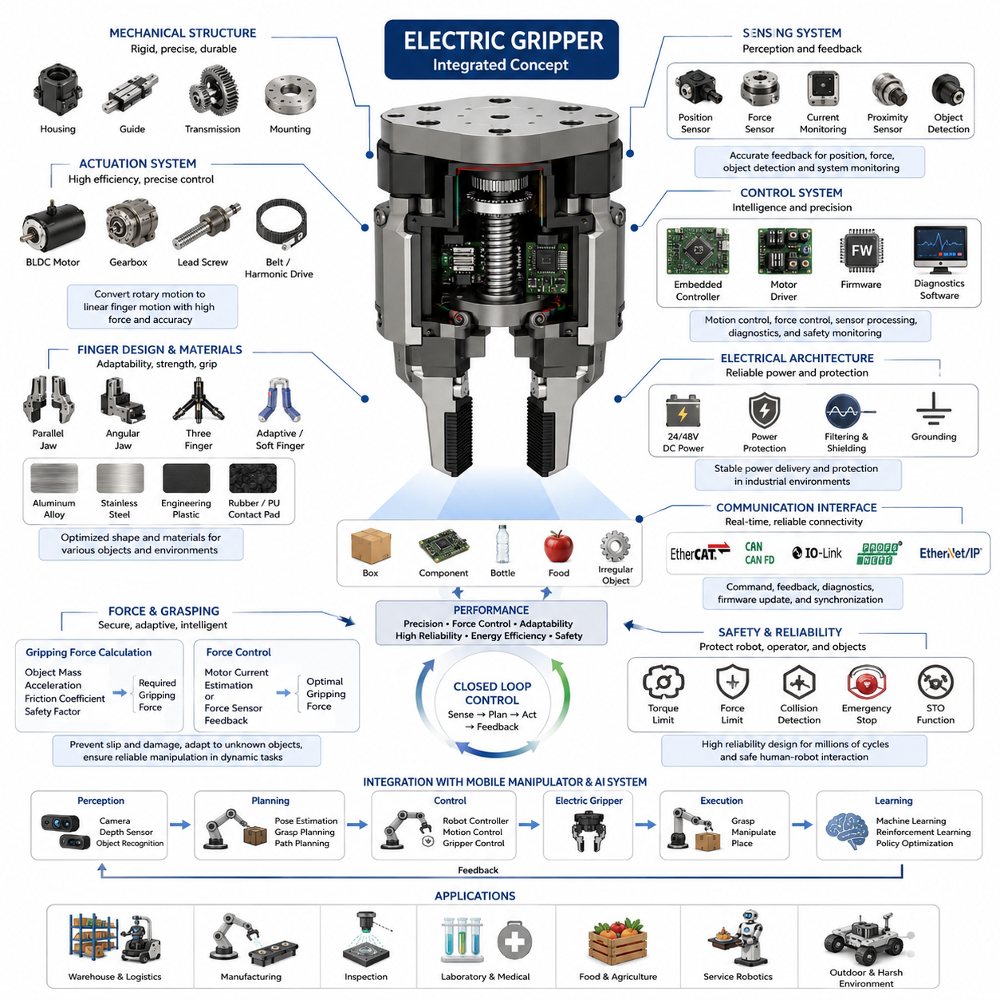
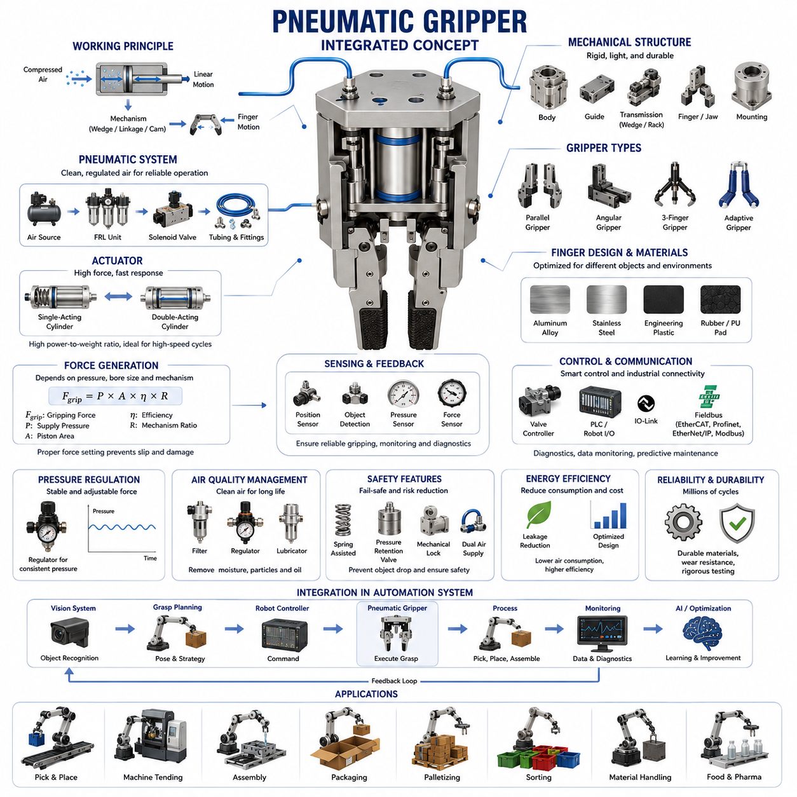
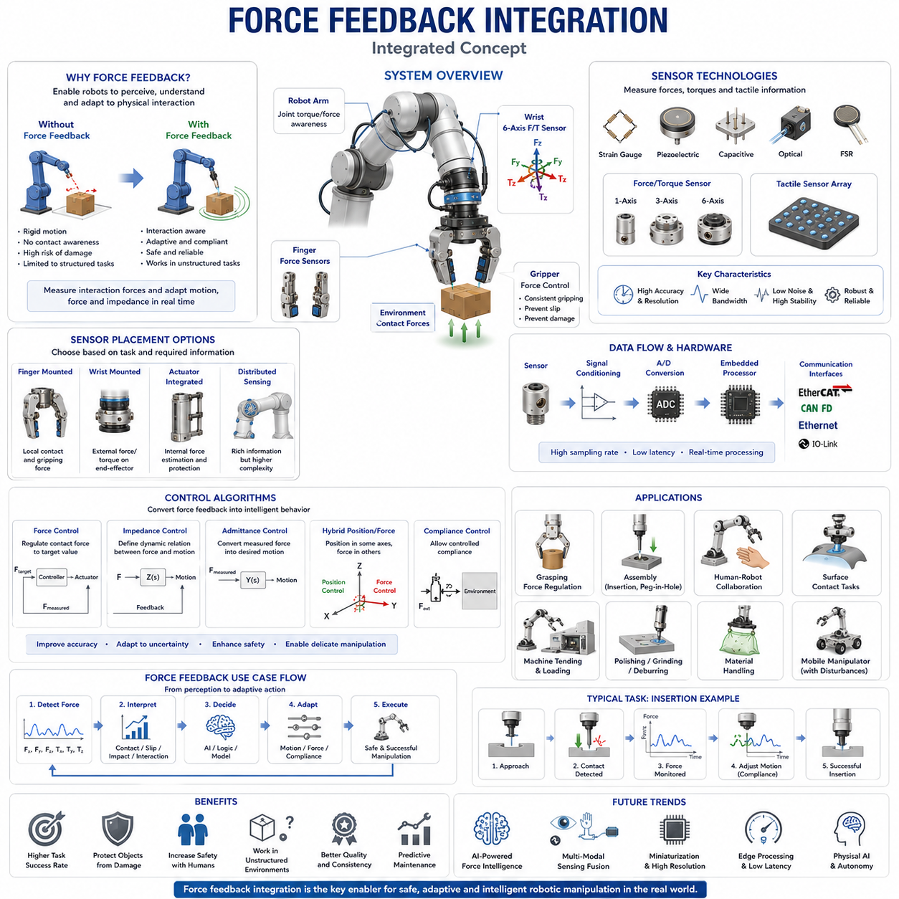
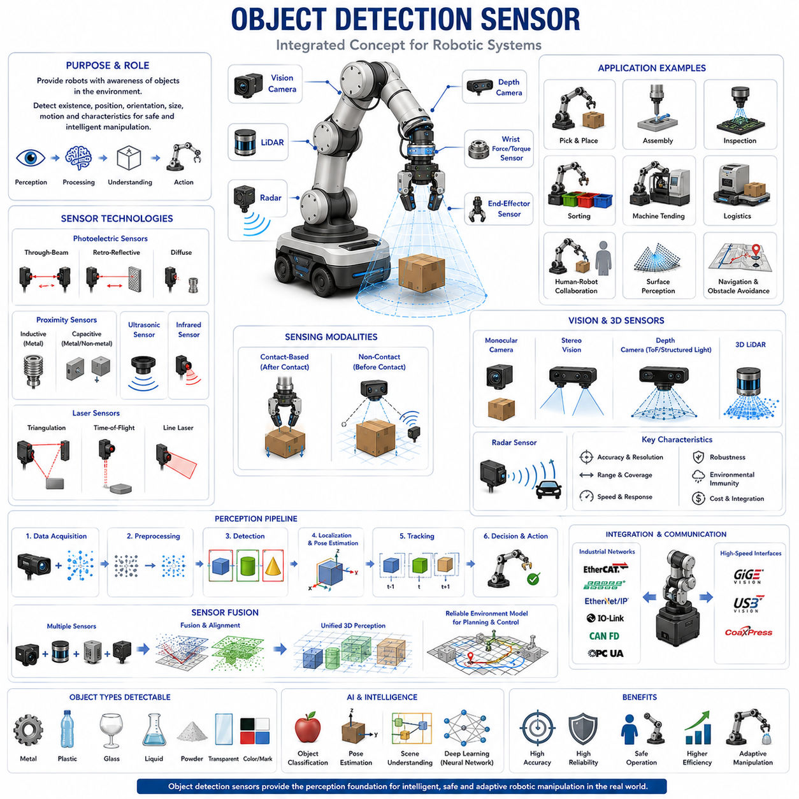
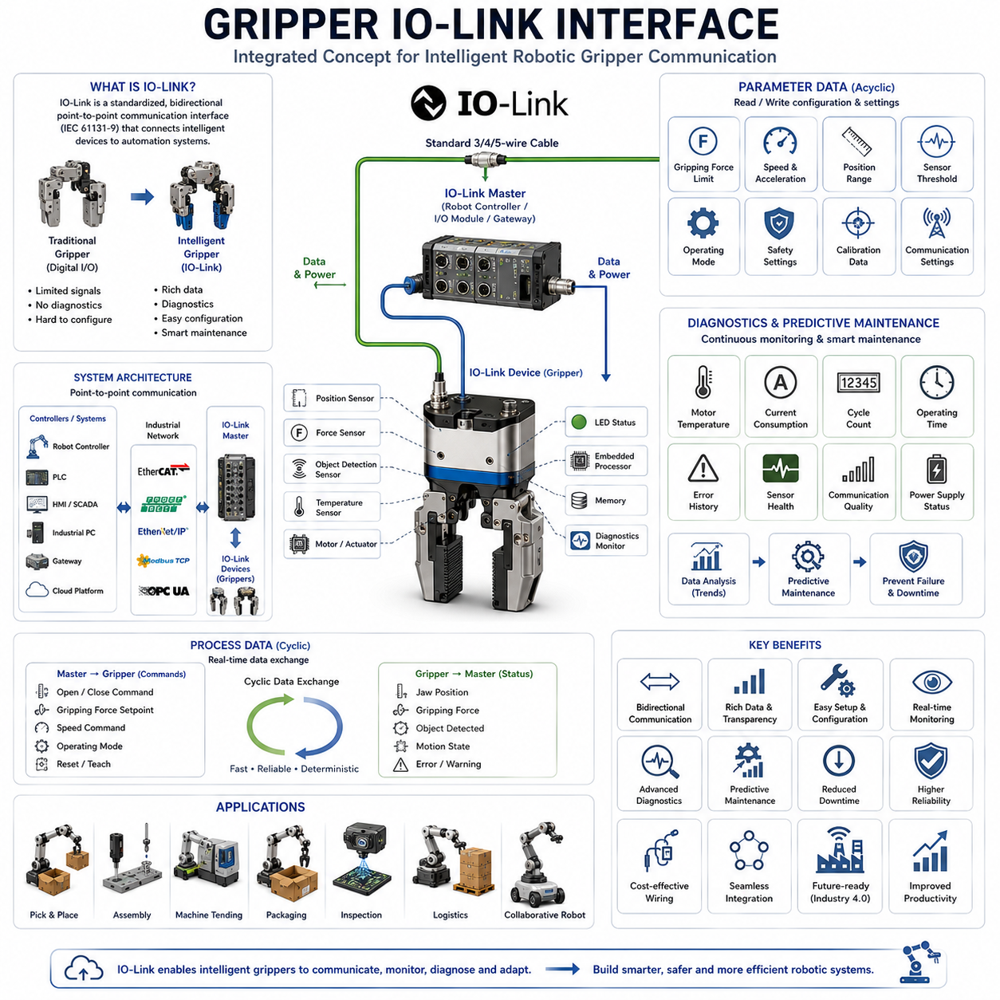

**Volume 14 Mobile Manipulator Architecture**

# Chapter 4. Gripper Architecture

## 4.1 Electric Gripper Design

{width="7.268055555555556in" height="7.268055555555556in"}

# 04_01 전동 그리퍼 설계(Electric Gripper Design)

전동 그리퍼(Electric Gripper)는 현대의 모바일 매니퓰레이터(Mobile Manipulator), 산업용 로봇(Industrial Robot), 협동로봇(Collaborative Robot), 자율 로봇 시스템(Autonomous Robotic System)에서 가장 중요한 엔드이펙터(End Effector) 중 하나이다. 로봇 자동화가 정형화된 제조 환경을 넘어 물류(Logistics), 창고 자동화(Warehouse Automation), 검사 자동화(Inspection Automation), 서비스 로봇(Service Robot), 그리고 피지컬 AI(Physical AI) 영역으로 확장됨에 따라, 전동 그리퍼는 높은 정밀도, 우수한 제어성, 에너지 효율성, 그리고 디지털 제어 시스템과의 뛰어난 통합성으로 인해 가장 선호되는 솔루션이 되었다.

모바일 매니퓰레이터 아키텍처(Mobile Manipulator Architecture)에서 전동 그리퍼는 로봇과 외부 환경 사이의 실제 물리적 접점 역할을 수행한다. 따라서 그리퍼의 성능은 작업 성공률, 조작 안정성, 생산성, 그리고 안전성에 직접적인 영향을 미친다. 이러한 이유로 전동 그리퍼 설계는 단순한 물체 집기 장치의 설계를 넘어 기계공학(Mechanical Engineering), 전기전자공학(Electrical Engineering), 제어공학(Control Engineering), 센서공학(Sensor Engineering), 통신공학(Communication Engineering), 안전공학(Safety Engineering), 그리고 인공지능(AI) 기술이 결합된 복합 시스템 설계 문제로 발전하고 있다.

전동 그리퍼의 기본 목적은 다양한 형상, 재질, 크기 및 무게를 가진 물체를 안정적으로 파지(Grasping)하고 이동하며 조작한 후 원하는 위치에 배치하는 것이다. 공압 그리퍼(Pneumatic Gripper)가 압축공기 시스템에 의존하는 것과 달리 전동 그리퍼는 서보모터(Servo Motor), 브러시리스 DC 모터(Brushless DC Motor), 스테퍼 모터(Stepper Motor), 또는 스마트 액추에이터(Smart Actuator)를 사용하여 구동된다. 이러한 구조는 압축공기 공급 장치를 제거할 수 있어 유지보수가 간단하며, 특히 이동형 로봇(Mobile Robot)에 적합한 구조를 제공한다.

전형적인 전동 그리퍼는 기계 구조(Mechanical Structure), 구동 시스템(Actuation System), 센서 시스템(Sensing System), 그리고 제어 시스템(Control System)으로 구성된다. 기계 구조에는 핑거(Finger), 조(Jaw), 가이드(Guide), 전달 메커니즘(Transmission Mechanism), 장착 인터페이스(Mounting Interface), 보호 하우징(Housing)이 포함된다. 구동 시스템은 모터(Motor), 감속기(Gearbox), 리드스크류(Lead Screw), 벨트 드라이브(Belt Drive), 하모닉 드라이브(Harmonic Drive) 등으로 구성된다. 센서 시스템은 위치 센서(Position Sensor), 힘 센서(Force Sensor), 전류 모니터(Current Monitoring), 근접 센서(Proximity Sensor), 물체 감지 센서(Object Detection Sensor)를 포함한다. 제어 시스템은 임베디드 컨트롤러(Embedded Controller), 모터 드라이버(Motor Driver), 통신 인터페이스(Communication Interface), 펌웨어(Firmware), 진단 소프트웨어(Diagnostic Software)로 구성된다.

구동 방식 선택은 전동 그리퍼 설계에서 가장 중요한 결정 중 하나이다. 브러시리스 DC 모터는 높은 효율성과 긴 수명, 낮은 유지보수 비용 때문에 가장 널리 사용된다. 서보모터는 폐루프 제어(Closed Loop Control)를 통해 정밀한 위치 제어가 가능하며 고정밀 산업용 그리퍼에 적합하다. 스테퍼 모터는 상대적으로 저렴한 비용으로 구현이 가능하여 중저가 시스템에서 사용된다. 최근에는 엔코더(Encoder)와 지능형 제어기가 통합된 스마트 서보 액추에이터가 많이 적용되고 있다.

전달 메커니즘은 모터의 회전 운동을 핑거의 직선 운동으로 변환한다. 리드스크류는 높은 정밀도와 자기잠금(Self-Locking) 특성 때문에 많이 사용된다. 볼스크류(Ball Screw)는 효율이 높고 속도가 빠르지만 별도의 브레이크 장치가 필요할 수 있다. 랙앤피니언(Rack and Pinion)은 단순하면서도 견고한 구조를 제공한다. 벨트 구동(Belt Drive)은 경량화에 유리하며, 하모닉 드라이브는 초고정밀 소형 설계에 적합하다.

핑거 설계는 실제 파지 성능을 결정하는 핵심 요소이다. 핑거 형상은 접촉 안정성, 힘 분포, 다양한 형상의 물체에 대한 적응성에 영향을 준다. 평행 조 그리퍼(Parallel Jaw Gripper)는 가장 널리 사용되는 구조로 대칭적인 파지력을 제공한다. 각도형 그리퍼(Angular Gripper)는 좁은 공간에서 유리하다. 3지형 그리퍼(Three-Finger Gripper)와 적응형 그리퍼(Adaptive Gripper)는 불규칙한 형상의 물체를 다루는 데 적합하다. 최근에는 연성 로봇(Soft Robotics) 기술을 적용한 소프트 그리퍼(Soft Gripper)가 증가하고 있다.

재료(Material) 선택 또한 매우 중요하다. 알루미늄 합금(Aluminum Alloy)은 강도와 무게의 균형이 우수하다. 스테인리스강(Stainless Steel)은 부식 환경에 적합하다. 엔지니어링 플라스틱(Engineering Plastic)은 경량화에 유리하다. 접촉면에는 고무(Rubber), 폴리우레탄(Polyurethane), 고마찰 소재를 적용하여 파지력을 향상시킨다.

파지력(Gripping Force) 계산은 설계 과정의 핵심이다. 필요한 파지력은 물체 질량(Mass), 가속도(Acceleration), 무게중심(Center of Gravity), 마찰계수(Friction Coefficient), 안전계수(Safety Factor)에 따라 결정된다. 특히 모바일 매니퓰레이터는 이동 중 가속과 감속이 발생하므로 정적인 계산보다 더 큰 여유를 고려해야 한다. 과도한 파지력은 물체 손상과 에너지 낭비를 유발하며, 부족한 파지력은 물체 낙하를 초래할 수 있다.

최신 전동 그리퍼는 힘 제어(Force Control)를 제공한다. 모터 전류를 이용한 간접 힘 추정(Force Estimation) 또는 전용 힘 센서를 이용한 직접 측정을 통해 파지력을 정밀하게 제어할 수 있다. 이러한 기능은 전자부품(Electronic Components), 의료기기(Medical Devices), 실험 샘플(Laboratory Samples), 식품(Food Products)과 같은 민감한 물체를 다룰 때 필수적이다.

위치 센싱(Position Sensing)은 정확한 그리퍼 제어를 가능하게 한다. 절대 엔코더(Absolute Encoder)는 전원 재인가 후에도 위치를 유지할 수 있으며, 증분 엔코더(Incremental Encoder)는 비용 효율적인 솔루션을 제공한다. 고해상도 위치 피드백은 반복 정밀도(Repeatability)를 향상시키고 정밀 조립 작업을 가능하게 한다.

물체 감지(Object Detection) 기능은 그리퍼의 신뢰성을 향상시킨다. 광학 센서(Optical Sensor), 적외선 센서(Infrared Sensor), 정전용량 센서(Capacitive Sensor), 유도형 센서(Inductive Sensor), 힘 센서 등을 이용하여 물체 존재 여부를 확인하고 파지 실패를 감지할 수 있다.

힘 피드백(Force Feedback)의 통합은 전동 그리퍼의 활용 범위를 크게 확장한다. 이를 통해 순응 제어(Compliance Control), 적응형 파지(Adaptive Grasping), 접촉 감지(Contact Detection), 삽입 작업(Insertion Task)이 가능해진다. 특히 미지의 물체를 다룰 때 힘 피드백은 자동으로 최적의 파지력을 조정하는 데 활용된다.

전기 아키텍처(Electrical Architecture)는 시스템 안정성에 큰 영향을 미친다. 대부분의 산업용 전동 그리퍼는 24V DC 전원을 사용하지만 모바일 로봇에서는 48V 시스템이 점차 확대되고 있다. 전원 보호 회로(Power Protection Circuit), 필터(Filter), 접지(Grounding), 차폐(Shielding)는 안정적인 동작을 위해 필수적이다.

통신 인터페이스(Communication Interface)는 로봇 제어기와의 연동을 담당한다. EtherCAT은 결정론적 통신(Deterministic Communication)과 낮은 지연시간(Low Latency) 덕분에 가장 널리 사용된다. CAN, CAN FD는 이동형 로봇에서 많이 사용되며, IO-Link는 센서 통합과 진단 기능을 제공한다. PROFINET과 EtherNet/IP는 산업 자동화 환경에서 일반적으로 활용된다.

임베디드 제어기(Embedded Controller)는 모션 제어(Motion Control), 힘 제어(Force Control), 센서 처리(Sensor Processing), 고장 진단(Fault Detection), 통신 관리(Communication Management)를 수행한다. 최근에는 실시간 운영체제(Real-Time Operating System, RTOS)를 기반으로 동작하며 모델 기반 제어(Model-Based Control)와 예측 제어(Predictive Control)를 적용하는 사례가 증가하고 있다.

안전성(Safety)은 전동 그리퍼 설계에서 절대적으로 중요한 요소이다. 협동로봇 환경에서는 핀치 포인트(Pinch Point), 과도한 파지력, 예기치 않은 동작 등을 방지해야 한다. 이를 위해 토크 제한(Torque Limiting), 힘 제한(Force Limiting), 충돌 감지(Collision Detection), 비상정지(Emergency Stop), 안전 토크 차단(Safe Torque Off, STO) 기능이 적용된다.

열 관리(Thermal Management)는 고성능 그리퍼에서 중요한 설계 요소이다. 모터와 전력전자(Power Electronics)에서 발생하는 열은 성능 저하와 수명 감소를 유발할 수 있다. 따라서 열전달 경로(Thermal Path), 방열 구조(Heat Dissipation Structure), 냉각 설계(Cooling Design)를 충분히 고려해야 한다.

신뢰성 공학(Reliability Engineering)은 수백만 회 이상의 파지 사이클에서도 안정적으로 동작할 수 있도록 하는 것을 목표로 한다. 베어링(Bearing), 감속기(Gearbox), 모터(Motor), 케이블(Cable), 센서(Sensor)의 수명을 분석하고 가속 수명 시험(Accelerated Life Test), 환경 시험(Environmental Test), 내구 시험(Endurance Test)을 수행한다.

환경 보호(Environmental Protection) 측면에서는 방진(Dust Protection), 방수(Water Protection), 내화학성(Chemical Resistance), 내진동성(Vibration Resistance)이 고려된다. 실외 로봇이나 산업 현장에서는 높은 IP 등급(IP Rating)이 요구될 수 있다.

모바일 매니퓰레이터 통합(Mobile Manipulator Integration)은 추가적인 설계 과제를 제공한다. 이동 중 발생하는 진동(Vibration), 가속도(Acceleration), 동적 하중(Dynamic Load)이 그리퍼 성능에 영향을 미치므로 전체 시스템 수준의 제어가 필요하다.

비전 유도 로봇(Vision Guided Robotics) 기술이 발전함에 따라 전동 그리퍼는 카메라(Camera), 깊이 센서(Depth Sensor), AI 기반 객체 인식(Object Recognition) 시스템과 긴밀하게 연동되고 있다. 비전 시스템은 물체 위치와 자세(Pose)를 추정하고, 그리퍼는 이를 기반으로 최적의 파지 동작을 수행한다.

인공지능(AI)은 전동 그리퍼의 미래를 변화시키고 있다. 머신러닝(Machine Learning)은 최적 파지 전략을 학습하고, 강화학습(Reinforcement Learning)은 반복적인 경험을 통해 조작 능력을 향상시킨다. 피지컬 AI(Physical AI) 시스템에서는 인식(Perception), 계획(Planning), 제어(Control), 조작(Manipulation)이 통합되어 인간 수준에 가까운 물체 조작 능력을 구현하게 된다.

미래의 전동 그리퍼는 더욱 높은 적응성(Adaptability), 지능성(Intelligence), 센서 융합(Sensor Fusion), 자율성(Autonomy)을 갖추게 될 것이다. 촉각 센서(Tactile Sensor), 힘 센서(Force Sensor), 비전 센서(Vision Sensor)가 통합된 차세대 그리퍼는 다양한 물체를 자동으로 인식하고 최적의 파지 전략을 선택할 수 있을 것이다. 모바일 매니퓰레이터와 피지컬 AI 플랫폼이 발전할수록 전동 그리퍼는 로봇이 실제 세계와 상호작용하는 가장 핵심적인 인터페이스로서 그 중요성이 더욱 커질 것이다.

## 4.2 Pneumatic Gripper Design

{width="7.268055555555556in" height="7.268055555555556in"}

# 04_02 공압 그리퍼 설계(Pneumatic Gripper Design)

공압 그리퍼(Pneumatic Gripper)는 산업 자동화(Industrial Automation), 로봇 조작(Robotic Manipulation), 조립 시스템(Assembly System), 포장 라인(Packaging Line), 물류 시설(Logistics Facility), 제조 공정(Manufacturing Environment)에서 가장 널리 사용되는 엔드이펙터(End Effector) 중 하나이다. 전동 그리퍼(Electric Gripper)와 지능형 로봇 핸드(Intelligent Robotic Hand)가 빠르게 발전하고 있음에도 불구하고, 공압 그리퍼는 단순한 구조, 높은 출력 밀도(Power Density), 우수한 신뢰성(Reliability), 낮은 초기 비용(Low Acquisition Cost), 그리고 매우 빠른 동작 속도(Cycle Speed) 덕분에 여전히 산업 현장의 주류 기술로 사용되고 있다.

모바일 매니퓰레이터(Mobile Manipulator), 산업용 로봇(Industrial Robot), 협동로봇(Collaborative Robot) 시스템에서 공압 그리퍼는 로봇과 물체 사이의 실제 물리적 인터페이스 역할을 수행한다. 따라서 공압 그리퍼의 성능은 생산성(Productivity), 핸들링 정확도(Handling Accuracy), 작업 신뢰성(Operational Reliability), 그리고 전체 시스템 효율(System Efficiency)에 직접적인 영향을 미친다. 이러한 이유로 공압 그리퍼 설계는 기계공학(Mechanical Engineering), 유체동력공학(Fluid Power Engineering), 제어공학(Control Engineering), 센서공학(Sensor Engineering), 안전공학(Safety Engineering), 신뢰성공학(Reliability Engineering), 산업통신(Industrial Communication) 기술이 융합된 종합적인 엔지니어링 분야로 발전하고 있다.

공압 그리퍼의 기본 원리는 압축공기(Compressed Air)의 에너지를 기계적 운동(Mechanical Motion)으로 변환하는 것이다. 압축공기가 액추에이터(Actuator)의 실린더 챔버(Cylinder Chamber) 내부로 공급되면 피스톤(Piston) 또는 다이어프램(Diaphragm)에 힘을 발생시킨다. 생성된 직선 운동(Linear Motion)은 링크(Link), 캠(Cam), 기어(Gear), 또는 직접 구동 메커니즘(Direct Drive Mechanism)을 통해 그리퍼 핑거(Finger)로 전달된다. 이러한 단순한 구조 덕분에 공압 그리퍼는 크기 대비 매우 높은 파지력(Gripping Force)을 생성할 수 있다.

공압 시스템은 공장 내 중앙 압축공기 설비(Central Compressed Air System)를 활용할 수 있기 때문에 대규모 자동화 환경에서 경제성이 매우 높다. 특히 반복적인 고속 작업이 요구되는 환경에서 뛰어난 성능을 제공한다. 픽앤플레이스(Pick and Place), 머신 텐딩(Machine Tending), 팔레타이징(Palletizing), 포장(Packaging), 분류(Sorting), 조립(Assembly), 자재 이송(Material Transfer) 등의 작업은 공압 그리퍼가 가장 널리 활용되는 분야이다.

공압 그리퍼는 기계 시스템(Mechanical System), 공압 시스템(Pneumatic System), 센서 시스템(Sensing System), 제어 시스템(Control System)으로 구성된다. 기계 시스템에는 그리퍼 바디(Body), 핑거(Finger), 조(Jaw), 가이드(Guide), 베어링(Bearing), 전달 메커니즘(Transmission Mechanism), 장착 구조(Mounting Structure)가 포함된다. 공압 시스템은 실린더(Cylinder), 솔레노이드 밸브(Solenoid Valve), 피팅(Fitting), 튜브(Tube), 레귤레이터(Regulator), 필터(Filter), 윤활기(Lubricator), 압력 센서(Pressure Sensor)로 구성된다. 센서 시스템은 위치 센서(Position Sensor), 물체 감지 센서(Object Detection Sensor), 힘 센서(Force Sensor), 압력 센서 등을 포함한다. 제어 시스템은 PLC(Programmable Logic Controller), 로봇 컨트롤러(Robot Controller), 안전 시스템(Safety System), 산업 통신 네트워크(Industrial Communication Network)로 구성된다.

공압 기술의 가장 큰 장점 중 하나는 우수한 출력 대 중량비(Power-to-Weight Ratio)이다. 압축공기 실린더는 작은 크기에서도 매우 큰 힘을 발생시킬 수 있다. 이는 특히 엔드이펙터의 무게를 최소화해야 하는 로봇 응용 분야에서 매우 중요하다. 엔드이펙터의 질량이 감소하면 매니퓰레이터(Manipulator)의 관성(Inertia)이 줄어들고, 동적 성능(Dynamic Performance)이 향상되며, 에너지 소비(Energy Consumption)가 감소하고, 가반하중(Payload Capacity)이 증가한다.

공압 액추에이터 설계는 그리퍼 성능을 결정하는 핵심 요소이다. 단동 실린더(Single-Acting Cylinder)는 한 방향으로만 압축공기를 사용하고 복귀는 스프링(Spring)에 의해 이루어진다. 복동 실린더(Double-Acting Cylinder)는 개방(Open)과 폐쇄(Close) 양 방향 모두 압축공기를 사용하여 더 높은 힘과 정밀한 제어를 제공한다. 산업용 로봇에서는 일반적으로 복동 실린더가 선호된다.

전달 메커니즘은 액추에이터의 운동을 핑거 운동으로 변환한다. 평행 조 그리퍼(Parallel Gripper)는 웨지 메커니즘(Wedge Mechanism), 랙앤피니언(Rack and Pinion), 토글 링크(Toggle Linkage), 캠 드라이브(Cam Drive)를 사용하여 양쪽 조의 동기화된 움직임을 구현한다. 각도형 그리퍼(Angular Gripper)는 회전 운동을 이용한다. 3지형 그리퍼(Three-Finger Gripper)는 원형 물체를 중심 기준으로 잡을 수 있는 구조를 제공한다.

평행 조 공압 그리퍼는 가장 널리 사용되는 구조이다. 양쪽 조가 평행하게 이동하기 때문에 높은 반복 정밀도(Repeatability)와 우수한 파지 안정성을 제공한다. 전자 부품(Electronic Components), 기계 부품(Mechanical Components), 포장 제품(Packaged Products) 등의 취급에 적합하다.

각도형 공압 그리퍼는 협소한 공간에서 유리하다. 조가 회전하면서 열리고 닫히므로 제한된 작업 공간에서도 접근성이 우수하다. 머신 텐딩, 자동 조립 장비, 자동 공급 장치 등에 자주 사용된다.

3지형 공압 그리퍼는 원통형(Cylindrical Object) 또는 불규칙 형상(Irregular Shape)의 물체를 다룰 때 뛰어난 성능을 제공한다. 세 개의 접촉점(Contact Point)을 통해 힘을 분산시키므로 물체의 미끄러짐(Slippage)을 줄이고 안정성을 향상시킨다.

핑거 설계(Finger Design)는 실제 파지 성능을 크게 좌우한다. 긴 핑거(Long Finger)는 도달 거리(Reach)를 증가시키지만 강성(Stiffness)을 감소시킨다. 짧은 핑거(Short Finger)는 높은 강성과 큰 파지력을 제공하지만 접근성이 제한된다. 따라서 작업 조건에 따라 최적의 길이와 형상을 결정해야 한다.

재료(Material) 선택도 중요하다. 알루미늄 합금(Aluminum Alloy)은 가볍고 강도가 높아 가장 널리 사용된다. 스테인리스강(Stainless Steel)은 내식성(Corrosion Resistance)이 요구되는 환경에 적합하다. 엔지니어링 플라스틱(Engineering Plastic)은 경량화와 충격 흡수에 유리하다. 접촉면에는 고무(Rubber), 폴리우레탄(Polyurethane), 실리콘(Silicone) 등이 사용되어 마찰력(Friction Force)을 향상시킨다.

파지력 생성(Gripping Force Generation)은 공압 그리퍼 설계의 핵심이다. 이론적인 파지력은 실린더 직경(Cylinder Bore Diameter), 공급 압력(Supply Pressure), 기계적 전달비(Mechanical Transmission Ratio), 시스템 효율(System Efficiency)에 의해 결정된다. 공급 압력을 증가시키거나 실린더 크기를 키우면 파지력이 증가한다. 그러나 과도한 파지력은 제품 손상을 유발할 수 있으며, 부족한 파지력은 물체 낙하를 초래한다.

공압 시스템은 공기의 압축성(Compressibility) 때문에 전동 시스템보다 정밀 제어가 어렵다. 압력 변화, 누설(Leakage), 온도 변화(Temperature Variation) 등의 영향으로 비선형 특성(Nonlinear Characteristics)을 가진다. 따라서 대부분의 공압 그리퍼는 정밀 위치 제어(Position Control)보다 개폐(Open-Close) 동작에 최적화되어 있다.

압력 조절(Pressure Regulation)은 일정한 파지력을 유지하기 위해 필수적이다. 압력 조정기(Pressure Regulator)는 공급 압력 변동에도 일정한 출력 압력을 유지한다. 이를 통해 전자 제품, 식품, 의료 샘플과 같은 민감한 제품도 안전하게 취급할 수 있다.

공기 품질 관리(Air Quality Management)는 시스템 신뢰성에 직접적인 영향을 준다. 수분(Moisture), 먼지(Dust), 오일(Oil), 입자(Particle)는 실린더와 밸브의 마모를 증가시키고 성능 저하를 유발한다. 따라서 필터(Filter), 레귤레이터(Regulator), 윤활기(Lubricator)로 구성된 FRL 장치(FRL Unit)가 일반적으로 사용된다.

위치 센싱(Position Sensing)은 시스템의 지능화를 가능하게 한다. 자기식 리드 스위치(Magnetic Reed Switch), 홀 센서(Hall Sensor), 광학 센서(Optical Sensor), 유도형 센서(Inductive Sensor)를 통해 조의 위치를 모니터링할 수 있다. 이를 통해 개폐 상태 확인, 장애물 감지, 물체 존재 여부 확인이 가능하다.

물체 감지(Object Detection) 기능은 파지 성공 여부를 확인하는 데 사용된다. 압력 변화를 이용한 간접 감지 방식과 센서를 이용한 직접 감지 방식이 존재한다. 이러한 기능은 생산 공정의 오류를 감소시키고 신뢰성을 향상시킨다.

최근에는 힘 센서(Force Sensor), 스트레인 게이지(Strain Gauge), 압력 센서 등을 활용한 힘 피드백(Force Feedback) 기능이 확대되고 있다. 이를 통해 물체 특성에 따라 자동으로 파지력을 조절할 수 있으며, 섬세한 제품의 손상을 방지할 수 있다.

안전성(Safety)은 공압 그리퍼 설계의 핵심 요소이다. 압축공기 공급이 중단될 경우 물체 낙하가 발생할 수 있다. 이를 방지하기 위해 스프링 유지 장치(Spring Retention Mechanism), 압력 유지 밸브(Pressure Retention Valve), 기계식 잠금장치(Mechanical Locking System), 이중 공기 공급(Dual Air Supply) 등의 안전 메커니즘이 적용된다.

에너지 효율(Energy Efficiency) 또한 중요한 설계 요소이다. 압축공기 시스템은 압축기(Compressor) 손실, 누설 손실, 스로틀링 손실(Throttling Loss) 등으로 인해 효율이 낮을 수 있다. 따라서 공기 소비량(Air Consumption)을 줄이고 누설을 최소화하는 설계가 요구된다.

신뢰성 공학(Reliability Engineering)은 수백만 회 이상의 반복 동작에서도 안정적으로 동작하도록 하는 것을 목표로 한다. 씰(Seal), 베어링(Bearing), 실린더(Cylinder), 밸브(Valve)의 수명을 분석하고 가속 수명 시험(Accelerated Life Test), 내구 시험(Endurance Test), 환경 시험(Environmental Test)을 수행한다.

환경 요구사항(Environmental Requirements)에 따라 설계도 달라진다. 식품 산업(Food Industry)과 제약 산업(Pharmaceutical Industry)은 세척 가능 설계(Washdown Design)와 부식 방지 재료를 요구한다. 실외 환경(Outdoor Environment)은 높은 방진방수(IP Rating)를 요구한다.

현대의 공압 그리퍼는 EtherCAT, IO-Link, PROFINET, EtherNet/IP, Modbus TCP 등의 산업 통신 프로토콜(Industrial Communication Protocol)을 지원한다. 이를 통해 압력 데이터, 진단 정보(Diagnostic Information), 사이클 수(Cycle Count), 유지보수 정보(Maintenance Information)를 실시간으로 모니터링할 수 있다.

협동로봇 환경에서는 인간과의 안전한 상호작용(Human-Robot Interaction)이 중요하다. 따라서 부드러운 접촉 재료(Soft Contact Material), 힘 제한 기능(Force Limitation), 충돌 감지(Collision Detection) 기능이 점차 중요해지고 있다.

모바일 매니퓰레이터에서는 온보드 압축기(Onboard Compressor), 공기 저장 탱크(Air Reservoir), 하이브리드 공압-전동 시스템(Hybrid Pneumatic-Electric System)을 사용하여 공압 그리퍼를 구동할 수 있다. 이러한 구조는 높은 파지력과 빠른 동작 속도가 필요한 환경에서 매우 유용하다.

미래의 공압 그리퍼는 더욱 지능화(Intelligent), 디지털화(Digitalized), 네트워크화(Networked)될 것이다. 스마트 공압 그리퍼(Smart Pneumatic Gripper)는 내장 프로세서(Embedded Processor), 실시간 진단(Real-Time Diagnostics), 예지보전(Predictive Maintenance), 적응형 제어(Adaptive Control)를 제공하게 될 것이다. 또한 전동 제어(Electric Control)와 공압 구동(Pneumatic Actuation)을 결합한 하이브리드 구조(Hybrid Architecture)가 확대될 것으로 예상된다.

로봇 공학이 자율 로봇(Autonomous Robot)과 피지컬 AI(Physical AI) 시대로 발전함에 따라, 공압 그리퍼는 여전히 고속(High Speed), 고출력(High Force), 고신뢰성(High Reliability)이 요구되는 산업용 조작 시스템의 핵심 기술로 중요한 역할을 수행할 것이다.

## 4.3 Force Feedback Integration

{width="7.268055555555556in" height="7.268055555555556in"}

# 04_03 힘 피드백 통합(Force Feedback Integration)

힘 피드백 통합(Force Feedback Integration)은 현대 로봇 조작 시스템(Robotic Manipulation System)에서 가장 중요한 기술 발전 중 하나이다. 로봇이 단순 반복 자동화 장비를 넘어 동적이고 비정형적인 환경(Dynamic and Unstructured Environment)에서 작업할 수 있는 지능형 물리 시스템(Intelligent Physical System)으로 발전하면서, 외부 힘을 인식하고 측정하며 이에 반응하는 능력은 필수 요소가 되었다.

전통적인 로봇 시스템은 위치 제어(Position Control), 속도 제어(Velocity Control), 사전 정의된 궤적(Trajectory)에 기반하여 동작한다. 이러한 방식은 구조화된 산업 환경에서는 매우 효과적이지만, 미지의 물체를 다루거나 섬세한 조작 작업을 수행하거나 인간과 협업하거나 지속적으로 변화하는 환경과 상호작용해야 하는 경우에는 한계가 존재한다. 힘 피드백 통합은 이러한 한계를 극복하여 로봇이 접촉력(Contact Force)을 인식하고 상황에 따라 행동을 조정할 수 있도록 한다.

모바일 매니퓰레이터(Mobile Manipulator) 아키텍처에서 힘 피드백은 물리 세계와 제어 시스템(Control System)을 연결하는 핵심 정보 채널이다. 엔드이펙터(End Effector), 그리퍼(Gripper), 로봇 암(Robot Arm), 그리고 제어 소프트웨어(Control Software)는 폐루프 제어 시스템(Closed-Loop Control System)을 형성하며 실시간으로 접촉력을 감지하고 동작을 수정한다. 이러한 기능은 단순한 위치 기반 제어(Position-Based Control)를 상호작용 인식 제어(Interaction-Aware Control)로 발전시켜 로봇이 순응성(Compliance), 적응성(Adaptability), 안전성(Safety), 그리고 정교한 조작 능력(Dexterity)을 갖추도록 만든다.

힘 피드백의 기본 개념은 로봇과 외부 환경 사이에서 발생하는 기계적 상호작용 힘(Mechanical Interaction Force)을 측정하는 것이다. 여기에는 파지력(Gripping Force), 접촉력(Contact Force), 삽입력(Insertion Force), 마찰력(Friction Force), 충격력(Impact Force), 반력(Reaction Force), 외란(Disturbance Force)이 포함된다. 이러한 힘을 측정하고 분석함으로써 로봇은 자신이 환경과 어떻게 상호작용하고 있는지를 이해할 수 있다.

힘 피드백 시스템은 일반적으로 센서 하드웨어(Sensor Hardware), 신호 조절 회로(Signal Conditioning Electronics), 통신 네트워크(Communication Network), 임베디드 프로세서(Embedded Processor), 제어 알고리즘(Control Algorithm), 액추에이터 제어기(Actuator Controller)로 구성된다. 센서는 물리적 힘을 전기 신호로 변환하며, 센서의 정확도(Accuracy), 해상도(Resolution), 대역폭(Bandwidth), 반복성(Repeatability), 안정성(Stability)은 전체 시스템 성능을 결정하는 핵심 요소이다.

가장 널리 사용되는 힘 센서 중 하나는 스트레인 게이지 센서(Strain Gauge Sensor)이다. 스트레인 게이지는 구조물이 변형될 때 전기 저항(Electrical Resistance)이 변화하는 원리를 이용한다. 이 저항 변화를 측정함으로써 외부 힘을 정밀하게 계산할 수 있다. 스트레인 게이지 기반 센서는 그리퍼, 로봇 손목(Wrist), 엔드이펙터, 힘-토크 센서(Force-Torque Sensor)에 널리 적용된다.

압전 센서(Piezoelectric Sensor)는 기계적 응력이 가해질 때 전하(Electrical Charge)를 생성한다. 매우 빠른 응답 특성을 가지므로 충격(Impact), 진동(Vibration), 순간 접촉 이벤트(Transient Contact Event)를 측정하는 데 적합하다. 다만 정적 힘(Static Force)을 장시간 측정하는 경우에는 전하 누설(Charge Leakage) 문제가 존재한다.

정전용량 센서(Capacitive Sensor)는 기계적 변형에 의해 발생하는 정전용량(Capacitance)의 변화를 측정한다. 매우 높은 감도(Sensitivity)와 해상도(Resolution)를 제공하며, 특히 촉각 센서(Tactile Sensor) 시스템에서 작은 힘을 측정하는 데 적합하다.

광학 힘 센서(Optical Force Sensor)는 광 신호(Optical Signal)의 변화, 변위(Displacement), 또는 광 강도(Intensity) 변화를 이용하여 힘을 계산한다. 전자기 간섭(Electromagnetic Interference)에 강하며, 고전압 환경이나 산업 환경에서 유용하게 사용된다. 광섬유 센서(Fiber Optic Sensor)는 전기 절연(Electrical Isolation)이 필요한 분야에서 특히 유리하다.

힘 감지 저항기(Force Sensitive Resistor, FSR)는 비교적 저렴하고 소형화가 용이한 기술이다. 가해지는 힘에 따라 저항값이 변화하며, 정밀도는 상대적으로 낮지만 촉각 감지(Tactile Detection) 및 물체 접촉 확인(Object Contact Detection)에 널리 사용된다.

힘 센서는 단일 축(Single-Axis) 또는 다축(Multi-Axis) 구조를 가질 수 있다. 단일 축 센서는 주로 파지력 측정에 사용된다. 다축 센서는 여러 방향의 힘을 동시에 측정할 수 있으며, 6축 힘-토크 센서(Six-Axis Force-Torque Sensor)는 X, Y, Z 방향의 힘과 각 축에 대한 토크(Torque)를 동시에 측정한다. 이는 로봇과 환경 사이의 상호작용을 가장 완전하게 표현할 수 있는 센서이다.

센서의 설치 위치 또한 매우 중요하다. 센서는 그리퍼 핑거(Finger), 손목(Wrist), 액추에이터 내부(Actuator Internal), 또는 매니퓰레이터 구조물 내부에 배치될 수 있다. 핑거 장착형 센서는 파지력 측정에 최적이며, 손목 장착형 힘-토크 센서는 엔드이펙터 전체에 작용하는 외력을 측정하는 데 적합하다.

센서로부터 얻어진 원시 신호(Raw Signal)는 매우 작고 노이즈(Noise)에 민감하기 때문에 신호 조절(Signal Conditioning)이 필요하다. 증폭기(Amplifier), 필터(Filter), 온도 보상 회로(Temperature Compensation Circuit), 선형화 회로(Linearization Circuit)를 통해 신호 품질을 향상시킨다.

데이터 수집 시스템(Data Acquisition System)은 아날로그 신호(Analog Signal)를 디지털 신호(Digital Signal)로 변환한다. 샘플링 주파수(Sampling Frequency)는 동적 힘 이벤트(Dynamic Force Event)를 얼마나 정확하게 측정할 수 있는지를 결정한다. 조립(Assembly), 충돌 감지(Collision Detection), 순응 제어(Compliance Control)와 같은 작업은 높은 샘플링 속도와 낮은 지연시간(Low Latency)을 요구한다.

힘 피드백은 적절한 제어 알고리즘(Control Algorithm)과 결합되어야 의미를 가진다. 대표적인 힘 제어 방식에는 힘 제어(Force Control), 임피던스 제어(Impedance Control), 어드미턴스 제어(Admittance Control), 하이브리드 위치-힘 제어(Hybrid Position-Force Control), 순응 제어(Compliance Control)가 있다.

힘 제어는 목표 힘(Target Force)을 유지하도록 액추에이터 출력을 조정한다. 그리퍼 응용에서는 과도한 힘으로 인한 손상과 부족한 힘으로 인한 미끄러짐을 방지하는 데 사용된다.

임피던스 제어는 힘과 운동 사이의 관계를 가상의 질량(Mass), 감쇠(Damping), 강성(Stiffness)으로 표현한다. 로봇이 환경과 자연스럽게 상호작용할 수 있도록 하며 협동로봇과 조립 자동화 분야에서 널리 사용된다.

어드미턴스 제어는 외부 힘을 측정하고 이를 운동 명령(Motion Command)으로 변환한다. 사람이 로봇을 직접 밀거나 당겨서 움직일 수 있는 협업 환경에서 자주 사용된다.

하이브리드 위치-힘 제어는 일부 방향은 위치 제어로, 다른 방향은 힘 제어로 수행한다. 삽입 작업(Insertion Task), 조립 작업(Assembly Task), 연마(Polishing), 표면 추종(Surface Following) 작업에 매우 효과적이다.

순응 제어는 외부 힘이 가해질 때 로봇이 저항하지 않고 유연하게 반응하도록 한다. 이는 안전성을 향상시키고 접촉 충격(Contact Stress)을 감소시킨다.

파지 작업(Grasping Application)은 힘 피드백의 대표적인 활용 사례이다. 유리 제품(Glass Product), 전자 부품(Electronic Component), 의료기기(Medical Device), 식품(Food Product)과 같은 민감한 물체를 다룰 때 힘 피드백은 필요한 최소한의 파지력을 유지하면서도 안정적인 조작을 가능하게 한다.

조립 자동화(Assembly Automation)는 힘 피드백 기술의 또 다른 중요한 응용 분야이다. 삽입 작업 중 발생하는 정렬 오차(Alignment Error), 치수 편차(Dimensional Variation), 공차(Tolerance)로 인해 예상치 못한 힘이 발생할 수 있다. 힘 피드백은 이러한 상황을 감지하고 자동으로 동작을 수정하여 조립 성공률을 향상시킨다.

인간-로봇 협업(Human-Robot Collaboration)에서는 힘 인식 능력이 필수적이다. 협동로봇(Collaborative Robot)은 작업자와의 접촉을 감지하고 충돌을 방지해야 한다. 힘 피드백은 충돌 감지(Collision Detection), 접촉 모니터링(Contact Monitoring), 힘 제한(Force Limitation)을 가능하게 하여 안전한 작업 환경을 제공한다.

모바일 매니퓰레이터는 이동 플랫폼(Mobile Platform) 위에서 동작하기 때문에 추가적인 어려움이 존재한다. 차량 진동(Vibration), 가속도(Acceleration), 지형 변화(Terrain Disturbance)가 힘 측정값에 영향을 줄 수 있다. 따라서 필터링(Filter), 센서 융합(Sensor Fusion), 동적 보상(Dynamic Compensation) 기술이 필요하다.

촉각 센싱(Tactile Sensing)은 힘 피드백을 더욱 발전시킨 기술이다. 촉각 센서 배열(Tactile Sensor Array)은 접촉 위치(Contact Location), 압력 분포(Pressure Distribution), 전단력(Shear Force), 미끄러짐(Slip Condition)을 감지할 수 있다. 이는 인간의 촉각과 유사한 기능을 로봇에 제공한다.

인공지능(AI)은 힘 피드백 기술을 더욱 발전시키고 있다. 머신러닝(Machine Learning)은 성공적인 조작 과정에서 나타나는 힘 패턴(Force Pattern)을 학습할 수 있으며, 이상 감지(Anomaly Detection), 물체 특성 추정(Object Property Estimation), 제어 파라미터 최적화(Control Parameter Optimization)를 수행할 수 있다. 강화학습(Reinforcement Learning)은 반복적인 상호작용을 통해 최적의 조작 전략을 학습한다.

디지털 트윈(Digital Twin)과 시뮬레이션(Simulation)은 힘 모델링(Force Modeling)을 포함하여 제어 전략과 조작 알고리즘을 실제 시스템 적용 전에 검증할 수 있도록 지원한다.

힘 피드백은 예지보전(Predictive Maintenance)에도 활용된다. 힘 패턴의 변화는 베어링 마모(Bearing Wear), 정렬 불량(Misalignment), 센서 열화(Sensor Degradation), 구조 손상(Structural Damage)의 징후가 될 수 있다. 지속적인 모니터링을 통해 고장 발생 전에 유지보수를 수행할 수 있다.

미래의 힘 피드백 시스템은 더욱 지능화(Intelligent), 분산화(Distributed), 그리고 피지컬 AI(Physical AI)와 긴밀하게 통합될 것이다. 힘 센서, 비전(Vision), 촉각(Tactile Perception), 근접 센서(Proximity Sensor), 환경 인식(Environmental Awareness)을 결합한 다중 센서 융합(Multi-Modal Sensor Fusion)은 인간 수준에 가까운 조작 능력을 가진 로봇을 가능하게 할 것이다.

산업용 로봇(Industrial Robot), 모바일 매니퓰레이터(Mobile Manipulator), 휴머노이드(Humanoid Robot), 서비스 로봇(Service Robot)이 발전할수록 힘 피드백 통합은 안전하고 적응적이며 지능적인 물리적 상호작용을 가능하게 하는 핵심 기술로 남게 될 것이다. 미래의 로봇은 단순히 미리 정의된 움직임을 수행하는 기계를 넘어, 물리 세계를 이해하고 실시간으로 반응하는 진정한 피지컬 AI 시스템으로 진화하게 될 것이다.

## 4.4 Object Detection Sensor

{width="7.268055555555556in" height="7.268055555555556in"}

# 04_04 물체 감지 센서(Object Detection Sensor)

물체 감지 센서(Object Detection Sensor)는 현대 로봇 조작 시스템(Robotic Manipulation System), 모바일 매니퓰레이터(Mobile Manipulator), 산업 자동화 장비(Industrial Automation Equipment), 협동로봇(Collaborative Robot), 자율 물류 플랫폼(Autonomous Logistics Platform), 그리고 피지컬 AI 시스템(Physical AI System)에서 가장 중요한 구성 요소 중 하나이다. 액추에이터(Actuator)와 그리퍼(Gripper)가 실제 물리적 조작 능력을 제공한다면, 물체 감지 센서는 로봇이 주변 환경 속 물체의 존재 여부, 위치(Position), 자세(Pose), 크기(Size), 형상(Shape), 이동 상태(Motion), 그리고 특성(Characteristics)을 이해할 수 있도록 하는 인식 계층(Perception Layer)을 제공한다.

신뢰성 있는 물체 감지 기능이 없다면 로봇은 단순히 미리 정의된 위치와 구조화된 환경에만 의존하게 된다. 반면 고성능 센서를 활용하면 로봇은 상황 인식(Situational Awareness)을 수행할 수 있으며, 동적이고 예측 불가능한 환경에서도 지능적인 조작(Intelligent Manipulation)을 수행할 수 있다.

모바일 매니퓰레이터 아키텍처(Mobile Manipulator Architecture)에서 물체 감지 센서는 인식에서 행동으로 이어지는 파이프라인(Perception-to-Action Pipeline)의 출발점이다. 센서를 통해 수집된 정보는 인식 알고리즘(Perception Algorithm)에 의해 처리되고, 환경 모델(Environment Model)과 융합되며, 경로 계획(Motion Planning) 시스템에 전달된 후 최종적으로 로봇 동작(Robotic Action)으로 변환된다. 따라서 물체 감지 성능은 파지 성공률(Grasp Success Rate), 조작 정확도(Manipulation Accuracy), 충돌 회피 성능(Collision Avoidance Performance), 안전성(Safety), 그리고 전체 시스템 생산성(Productivity)에 직접적인 영향을 미친다.

물체 감지 센서의 주요 목적은 특정 공간 내에 물체가 존재하는지 확인하고, 로봇이 의사결정을 수행하는 데 필요한 정보를 제공하는 것이다. 응용 분야에 따라 단순히 물체 존재 여부만 제공할 수도 있고, 위치, 자세, 크기, 형상, 속도(Velocity), 표면 특성(Surface Characteristics), 재질(Material Properties), 객체 분류(Object Classification) 정보까지 제공할 수도 있다.

물체 감지 기술은 크게 접촉식 센싱(Contact-Based Sensing)과 비접촉식 센싱(Non-Contact Sensing)으로 구분할 수 있다. 접촉식 센서는 실제 접촉이 발생한 후 물체를 감지하며, 비접촉식 센서는 접촉 전에 물체를 인식한다. 대부분의 로봇 시스템은 충돌을 방지하고 안전한 동작을 수행하기 위해 비접촉식 센서를 주로 사용한다.

광전 센서(Photoelectric Sensor)는 산업 자동화 분야에서 가장 널리 사용되는 물체 감지 기술 중 하나이다. 광전 센서는 빛(Light)을 송신하고 수신하는 방식으로 동작한다. 물체가 광 경로를 차단하거나 반사시키면 센서는 이를 감지한다. 구조가 단순하고 응답 속도(Response Time)가 빠르며 비용이 낮기 때문에 컨베이어 시스템(Conveyor System), 포장 설비(Packaging Equipment), 조립 라인(Assembly Line), 로봇 셀(Robot Cell)에서 광범위하게 사용된다.

투과형 광전 센서(Through-Beam Photoelectric Sensor)는 송신기(Transmitter)와 수신기(Receiver)가 분리되어 있으며, 물체가 광선을 차단할 때 감지가 이루어진다. 긴 감지 거리와 높은 신뢰성을 제공한다.

반사형 광전 센서(Retro-Reflective Photoelectric Sensor)는 반사판(Reflector)을 사용하여 광 신호를 되돌려 받는다. 물체가 빛을 차단하면 감지되며, 설치가 비교적 간단하다.

확산 반사형 센서(Diffuse Photoelectric Sensor)는 물체 자체에서 반사되는 빛을 이용한다. 별도의 반사판이 필요 없지만 물체 색상(Color), 표면 상태(Surface Finish), 반사율(Reflectivity)에 따라 성능이 달라질 수 있다.

레이저 센서(Laser Sensor)는 일반 광전 센서보다 더 높은 정밀도와 긴 감지 거리를 제공한다. 좁고 집중된 레이저 빔(Laser Beam)을 사용하여 거리 측정(Distance Measurement)과 물체 위치 추정(Object Localization)을 수행한다. 특히 레이저 삼각측량 센서(Laser Triangulation Sensor)는 정밀 검사(Precision Inspection), 치수 측정(Dimensional Measurement), 로봇 가이드(Robot Guidance)에 널리 사용된다.

유도형 근접 센서(Inductive Proximity Sensor)는 금속 물체(Metal Object)를 감지하기 위해 전자기장(Electromagnetic Field)을 활용한다. 금속이 감지 영역에 들어오면 전자기 특성이 변화하여 이를 검출한다. 내구성이 높고 오염에 강해 산업 환경에서 많이 사용된다.

정전용량형 근접 센서(Capacitive Proximity Sensor)는 정전용량(Capacitance)의 변화를 측정하여 물체를 감지한다. 금속뿐만 아니라 플라스틱(Plastic), 액체(Liquid), 분말(Powder), 목재(Wood), 종이(Paper), 유리(Glass) 등 다양한 재질을 감지할 수 있다.

초음파 센서(Ultrasonic Sensor)는 음파(Acoustic Wave)를 송신한 후 반사되어 돌아오는 시간을 측정한다. 빛이 아닌 소리를 사용하기 때문에 물체 색상이나 투명도에 영향을 받지 않는다. 투명 물체(Transparent Object), 액체 표면(Liquid Surface), 부드러운 재질(Soft Material)을 감지하는 데 효과적이다.

적외선 센서(Infrared Sensor)는 적외선 방사(Infrared Radiation)를 활용한다. 능동형 적외선 센서(Active Infrared Sensor)는 적외선을 송신하고 반사를 측정하며, 수동형 적외선 센서(Passive Infrared Sensor)는 물체가 방출하는 열에너지를 감지한다.

비전 기반 물체 감지 시스템(Vision-Based Object Detection System)은 현대 로봇에서 가장 강력한 센서 기술 중 하나이다. 카메라(Camera)는 풍부한 시각 정보를 제공하며, 컴퓨터 비전(Computer Vision)과 인공지능(AI)을 통해 분석된다. 단순히 물체 존재 여부만 확인하는 것이 아니라 객체 인식(Object Recognition), 자세 추정(Pose Estimation), 장면 이해(Scene Understanding), 경로 계획 지원까지 수행할 수 있다.

단안 카메라(Monocular Camera)는 하나의 이미지 센서를 사용한다. 비용이 낮고 구조가 단순하며 객체 인식과 분류에 적합하다. 깊이 정보(Depth Information)는 직접 제공하지 않지만 AI를 통해 3차원 정보를 추정할 수 있다.

스테레오 비전(Stereo Vision)은 두 개의 카메라를 사용하여 시차(Disparity)를 계산하고 깊이 정보를 생성한다. 이를 통해 3차원 인식(Three-Dimensional Perception)이 가능하다.

깊이 카메라(Depth Camera)는 각 픽셀에 대한 거리 정보를 직접 측정한다. 구조광(Structured Light) 방식과 비행시간(Time-of-Flight, ToF) 방식이 대표적이다. 깊이 카메라는 파지 계획(Grasp Planning)과 물체 위치 추정에 매우 유용하다.

3차원 LiDAR(Three-Dimensional LiDAR)는 레이저 반사를 이용하여 고밀도 포인트 클라우드(Point Cloud)를 생성한다. 이를 통해 물체 형상(Geometry), 장애물(Obstacle), 주변 환경(Environment)을 정밀하게 인식할 수 있다. 조명 조건 변화에 강하다는 장점이 있다.

레이더(Radar)는 전파(Radio Frequency Signal)를 이용하여 물체를 감지한다. 먼지(Dust), 안개(Fog), 연기(Smoke), 비(Rain), 어둠(Darkness)과 같은 악조건에서도 안정적으로 동작한다. 해상도는 카메라나 LiDAR보다 낮지만 강인성(Robustness)이 뛰어나다.

센서 배치(Sensor Placement)는 물체 감지 성능에 큰 영향을 미친다. 모바일 매니퓰레이터는 일반적으로 로봇 베이스(Base), 매니퓰레이터 암(Manipulator Arm), 손목(Wrist), 엔드이펙터(End Effector)에 다양한 센서를 배치한다. 이러한 분산 센싱 아키텍처(Distributed Sensing Architecture)는 사각지대(Blind Spot)를 줄이고 인식 정확도를 향상시킨다.

센서 보정(Sensor Calibration)은 정확한 측정을 위해 필수적이다. 카메라 보정(Camera Calibration)은 렌즈 왜곡(Lens Distortion)을 제거하고 내부 파라미터(Intrinsic Parameters)를 계산한다. 외부 보정(Extrinsic Calibration)은 센서와 로봇 좌표계(Robot Coordinate System) 간의 관계를 정의한다. 다중 센서 보정(Multi-Sensor Calibration)은 여러 센서가 동일한 환경 정보를 일관성 있게 해석하도록 지원한다.

센서 융합(Sensor Fusion)은 다양한 센서의 장점을 결합하여 환경을 더욱 정확하게 이해하는 기술이다. 카메라는 풍부한 의미 정보(Semantic Information)를 제공하지만 조명에 민감하다. LiDAR는 정확한 형상을 제공하지만 텍스처(Texture) 정보가 부족하다. 레이더는 악천후 환경에서 강력하지만 해상도가 낮다. 이들을 융합하면 더 높은 신뢰성과 정확성을 얻을 수 있다.

인공지능(AI)은 물체 감지 기술을 혁신적으로 발전시키고 있다. 딥러닝(Deep Learning) 기반 객체 검출 모델(Object Detection Model)은 수천 개 이상의 객체를 인식할 수 있으며, 부분 가림(Partial Occlusion) 상황에서도 높은 정확도를 유지한다. CNN(Convolutional Neural Network), 트랜스포머(Transformer), 파운데이션 모델(Foundation Model)은 현대 로봇 인식 시스템의 핵심 기술이다.

객체 분류(Object Classification)는 단순한 감지를 넘어 물체가 무엇인지를 판단한다. 이를 통해 로봇은 작업 전략(Task Strategy)을 선택할 수 있다. 예를 들어 물류 로봇(Logistics Robot)은 박스(Box)를 식별하고, 서비스 로봇(Service Robot)은 가전제품(Appliance)이나 도구(Tool)를 인식할 수 있다.

자세 추정(Pose Estimation)은 물체의 위치와 방향을 계산하는 기술이다. 이는 파지 계획(Grasp Planning), 조립(Assembly), 검사(Inspection)에 필수적인 요소이다.

객체 추적(Object Tracking)은 이동하는 물체를 지속적으로 관찰하는 기술이다. 연속된 프레임(Frame)에서 물체를 연결하고 이동 경로(Trajectory)를 예측한다. 이는 이동 컨베이어(Moving Conveyor), 자율주행 차량(Autonomous Vehicle), 협업 환경(Collaborative Environment)에서 매우 중요하다.

그리퍼에 직접 장착된 센서(End-Effector Mounted Sensor)는 로봇의 실제 작업 시점에서 가장 정확한 정보를 제공한다. 손목 카메라(Wrist Camera), 핑거 센서(Fingertip Sensor), 소형 깊이 센서(Miniature Depth Sensor)는 파지 성공률을 크게 향상시킨다.

안전성(Safety) 측면에서도 물체 감지 센서는 매우 중요하다. 사람(Human), 장애물(Obstacle), 예기치 않은 환경 변화(Environmental Change)를 실시간으로 감지하여 충돌 회피(Collision Avoidance), 보호 정지(Protective Stop), 속도 감소(Speed Reduction)를 수행할 수 있다.

산업 통신 네트워크(Industrial Communication Network)는 물체 감지 센서와 상위 제어 시스템을 연결한다. EtherCAT, PROFINET, EtherNet/IP, IO-Link, CAN FD, OPC UA 등이 널리 사용된다. 고성능 비전 시스템은 GigE Vision, USB3 Vision, CoaXPress, 고속 이더넷(High-Speed Ethernet)을 사용하여 실시간 영상 처리를 수행한다.

물체 감지 센서는 예지보전(Predictive Maintenance)에도 활용된다. 장비의 외관 변화, 위치 변화, 진동 패턴(Vibration Pattern), 마모 상태(Wear Condition)를 모니터링하여 잠재적인 고장을 사전에 발견할 수 있다.

미래의 물체 감지 센서는 더욱 높은 해상도(Higher Resolution), 낮은 지연시간(Lower Latency), 그리고 높은 지능(Intelligence)을 갖게 될 것이다. 이벤트 카메라(Event Camera), 뉴로모픽 센서(Neuromorphic Sensor), 초분광 카메라(Hyperspectral Camera), 차세대 LiDAR(Next-Generation LiDAR), AI 가속기(AI Accelerator), 멀티모달 인식 플랫폼(Multi-Modal Perception Platform)이 이러한 발전을 이끌 것으로 예상된다.

미래의 로봇은 단순히 물체를 감지하는 수준을 넘어, 물체의 속성(Properties), 사용 목적(Purpose), 향후 행동(Behavior)을 이해하고 예측하며, 이를 바탕으로 지능적인 의사결정을 수행하게 될 것이다. 모바일 매니퓰레이터, 산업용 로봇, 휴머노이드(Humanoid Robot), 그리고 피지컬 AI 플랫폼이 발전할수록 물체 감지 센서는 모든 지능형 로봇 시스템의 기반이 되는 핵심 기술로서 그 중요성이 더욱 커질 것이다.

## 4.5 Gripper IO Link Interface

{width="7.268055555555556in" height="7.268055555555556in"}

# 04_05 그리퍼 IO-Link 인터페이스(Gripper IO-Link Interface)

IO-Link 인터페이스(IO-Link Interface)는 현대 산업 자동화(Industrial Automation), 로봇 조작 시스템(Robotic Manipulation System), 스마트 제조(Smart Manufacturing), 그리고 인더스트리 4.0(Industry 4.0) 아키텍처에서 가장 중요한 통신 기술 중 하나로 자리 잡고 있다. 모바일 매니퓰레이터(Mobile Manipulator)나 산업용 로봇(Industrial Robot)에서 그리퍼(Gripper)는 로봇과 실제 물리 세계를 연결하는 최종 접점이다. 최근의 그리퍼는 단순한 개폐 장치(Open-Close Device)를 넘어 센서(Sensor), 진단 기능(Diagnostics), 힘 제어(Force Control), 임베디드 프로세서(Embedded Processor)를 내장한 지능형 메카트로닉스 시스템(Intelligent Mechatronic System)으로 발전하고 있다. 이러한 변화와 함께 그리퍼와 상위 제어 시스템(Higher-Level Control System)을 연결하는 통신 구조의 중요성이 크게 증가하고 있다.

IO-Link는 지능형 그리퍼를 자동화 시스템에 통합하기 위한 표준화된 양방향 디지털 통신(Standardized Bidirectional Digital Communication) 기술을 제공한다. 이를 통해 그리퍼는 단순한 액추에이터(Actuator)가 아니라 네트워크에 연결된 지능형 장치(Intelligent Networked Device)로 동작할 수 있게 된다.

전통적인 로봇 그리퍼는 일반적으로 디지털 입출력(Digital Input/Output)을 이용하여 연결되었다. 개방(Open), 폐쇄(Close), 물체 감지(Object Detection), 오류 출력(Fault Output) 신호가 각각의 배선을 통해 전달되었다. 이러한 방식은 기본적인 자동화에는 충분했지만 장치 상태(Device Status), 진단 정보(Diagnostic Information), 설정 파라미터(Configuration Parameter), 운영 성능(Operational Performance)에 대한 정보를 제공하기에는 한계가 있었다.

현대의 지능형 그리퍼는 단순한 개폐 정보 이상의 방대한 데이터를 생성한다. IO-Link는 이러한 문제를 해결하기 위해 개발된 기술로, 그리퍼를 수동적인 액추에이터에서 능동적인 정보 제공 장치로 변화시킨다. 이를 통해 로봇 제어기(Robot Controller), PLC(Programmable Logic Controller), SCADA(Supervisory Control and Data Acquisition), 클라우드 분석 시스템(Cloud Analytics Platform)과 풍부한 데이터를 교환할 수 있다.

IO-Link는 국제 표준 IEC 61131-9에 의해 정의된 통신 프로토콜이다. 이 기술은 단순 필드 장치(Field Device)와 상위 산업 네트워크(Industrial Network) 사이의 간극을 메우기 위해 개발되었다. 복잡한 필드버스(Fieldbus)와 달리 IO-Link는 IO-Link 마스터(IO-Link Master)와 IO-Link 디바이스(IO-Link Device) 사이의 점대점(Point-to-Point) 통신 구조를 사용한다. 표준 산업용 케이블(Standard Industrial Cable)을 사용하기 때문에 설치가 간단하면서도 고급 통신 기능을 제공한다.

로봇 그리퍼 시스템에서는 일반적으로 IO-Link 마스터가 로봇 컨트롤러, 원격 I/O(Remote I/O), 산업용 게이트웨이(Industrial Gateway), 분산 제어기(Distributed Controller)에 위치한다. 그리퍼는 IO-Link 디바이스 역할을 수행하며 프로세스 데이터(Process Data), 파라미터 데이터(Parameter Data), 진단 메시지(Diagnostic Message), 이벤트 정보(Event Information)를 교환한다.

IO-Link의 가장 큰 장점 중 하나는 양방향 통신(Bidirectional Communication)이다. 기존 디지털 I/O는 단순한 명령 전달과 상태 확인만 가능했지만, IO-Link는 실시간 데이터 교환을 지원한다. 로봇 제어기는 파지력 설정(Grip Force Setting), 동작 속도(Motion Speed), 가속도(Acceleration), 보정 데이터(Calibration Data), 운영 모드(Operation Mode)를 전송할 수 있으며, 그리퍼는 위치(Position), 파지력(Grip Force), 사이클 수(Cycle Count), 온도(Temperature), 오류 정보(Error Information), 유지보수 상태(Maintenance Status)를 반환할 수 있다.

프로세스 데이터(Process Data)는 IO-Link 통신의 핵심이다. 이는 마스터와 디바이스 간에 주기적으로 교환되는 실시간 정보이다. 일반적인 프로세스 데이터에는 조 위치(Jaw Position), 파지력(Gripping Force), 물체 감지 상태(Object Detection Status), 동작 상태(Motion State), 오류 상태(Error Condition), 센서 데이터(Sensor Data), 제어 명령(Control Command)이 포함된다. 이러한 정보는 실시간으로 업데이트되므로 제어기는 항상 최신 상태를 파악할 수 있다.

파라미터 데이터(Parameter Data)는 그리퍼의 동작 특성을 설정하는 데 사용된다. 현대의 지능형 그리퍼는 수십 개에서 수백 개에 이르는 설정 값을 보유할 수 있다. 여기에는 파지력 제한(Grip Force Limit), 속도 설정(Speed Setting), 가속도 프로파일(Acceleration Profile), 센서 임계값(Sensor Threshold), 통신 설정(Communication Setting), 안전 설정(Safety Configuration), 보정 값(Calibration Value)이 포함된다. IO-Link를 이용하면 현장 접근 없이 원격으로 이러한 값을 변경할 수 있다.

장치 식별(Device Identification)은 IO-Link의 또 다른 중요한 기능이다. 각 장치는 제조사 정보(Manufacturer Information), 장치 유형(Device Type), 시리얼 번호(Serial Number), 펌웨어 버전(Firmware Version), 하드웨어 리비전(Hardware Revision) 정보를 제공한다. 이를 통해 자동 장치 인식(Automatic Device Recognition)이 가능해지며 유지보수와 교체 작업이 크게 단순화된다.

진단 기능(Diagnostics)은 IO-Link가 제공하는 가장 큰 가치 중 하나이다. 기존 시스템에서는 장치의 건강 상태(Device Health)를 파악하기 어려웠지만, IO-Link 기반 그리퍼는 내부 상태를 지속적으로 모니터링할 수 있다. 모터 온도(Motor Temperature), 전류 소비(Current Consumption), 센서 상태(Sensor Status), 통신 품질(Communication Quality), 전원 상태(Power Supply Status), 기계적 마모(Mechanical Wear), 동작 횟수(Cycle Count), 오류 이력(Fault History) 등의 정보를 실시간으로 제공한다.

예지보전(Predictive Maintenance)은 이러한 진단 정보의 대표적인 활용 분야이다. 모터 전류 증가, 위치 정확도 저하, 온도 상승, 진동 증가, 비정상적인 사이클 패턴은 고장의 초기 징후가 될 수 있다. 유지보수 담당자는 이러한 데이터를 분석하여 실제 고장이 발생하기 전에 부품을 교체하거나 정비할 수 있다.

파지력 제어(Grip Force Control) 역시 IO-Link의 중요한 응용 분야이다. 최신 전동 그리퍼는 힘 센서(Force Sensor)를 내장하고 있으며, 측정된 힘 데이터를 실시간으로 제어기에 전달할 수 있다. 이를 통해 물체의 특성에 따라 파지력을 자동으로 조정할 수 있다. 깨지기 쉬운 유리 제품이나 전자 부품은 낮은 힘으로, 무거운 부품은 높은 힘으로 파지할 수 있다.

위치 모니터링(Position Monitoring)은 조(Jaw)의 이동 상태를 추적하는 기능이다. 고해상도 위치 센서(Position Sensor)를 통해 파지 성공 여부를 확인하고, 장애물 감지(Obstacle Detection), 미완전 파지(Incomplete Grasp), 기계적 간섭(Mechanical Interference)을 검출할 수 있다.

물체 감지(Object Detection) 기능 역시 향상된다. 기존에는 단순히 물체가 있는지 없는지만 확인할 수 있었지만, IO-Link를 이용하면 접촉 위치(Contact Position), 힘 분포(Force Distribution), 물체 크기(Object Size), 신뢰도 수준(Confidence Level) 등의 세부 정보를 제공할 수 있다.

힘 피드백(Force Feedback)과의 통합은 더욱 정교한 제어를 가능하게 한다. 힘 센서가 측정한 데이터를 실시간으로 전송하여 폐루프 힘 제어(Closed-Loop Force Control)를 구현할 수 있다. 이는 정밀 조립(Precision Assembly), 전자 부품 취급(Electronics Handling), 실험실 자동화(Laboratory Automation), 협동로봇(Collaborative Robot) 분야에서 매우 중요하다.

안전 모니터링(Safety Monitoring)도 강화된다. 과도한 힘(Excessive Force), 통신 오류(Communication Failure), 과열(Overheating), 비정상 동작(Abnormal Motion), 센서 고장(Sensor Failure), 액추에이터 오류(Actuator Fault)를 즉시 감지하여 상위 시스템에 전달할 수 있다. IO-Link 자체는 기능 안전 프로토콜(Functional Safety Protocol)은 아니지만, 안전 시스템 구축에 매우 중요한 정보를 제공한다.

협동로봇 환경에서는 IO-Link의 중요성이 더욱 커진다. 사람과 함께 작업하는 로봇은 엔드이펙터 상태를 지속적으로 모니터링해야 한다. 실시간 힘 데이터, 위치 데이터, 상태 정보는 충돌 감지(Collision Detection), 힘 제한(Force Limitation), 작업자 보호(Operator Protection)에 활용될 수 있다.

산업 통신 상호운용성(Industrial Communication Interoperability) 역시 IO-Link의 강점이다. IO-Link 마스터는 EtherCAT, PROFINET, EtherNet/IP, Modbus TCP, OPC UA, CAN 기반 네트워크와 쉽게 연결될 수 있다. 따라서 IO-Link 기반 그리퍼는 복잡한 자동화 시스템 내에서도 손쉽게 통합될 수 있다.

모바일 매니퓰레이터에서는 네트워크 대역폭(Network Bandwidth)이 제한적이기 때문에 효율적인 통신이 중요하다. IO-Link는 낮은 통신 부하(Low Communication Overhead)와 단순한 배선(Simple Wiring)을 제공하므로 로봇 암 내부의 케이블 관리와 무게 감소에도 유리하다.

디지털 트윈(Digital Twin)과 가상 시운전(Virtual Commissioning) 환경에서는 IO-Link 데이터를 활용하여 실제 시스템과 동일한 가상 모델을 구축할 수 있다. 이를 통해 성능 분석(Performance Analysis), 공정 최적화(Process Optimization), 시스템 검증(System Validation)을 수행할 수 있다.

클라우드 연결성(Cloud Connectivity)과 인더스트리 4.0은 IO-Link 데이터를 더욱 가치 있게 만든다. 제조 실행 시스템(Manufacturing Execution System), ERP(Enterprise Resource Planning), 클라우드 분석 플랫폼과 연결하여 생산성을 향상시키고 유지보수 전략을 최적화할 수 있다.

인공지능(AI)은 IO-Link 데이터를 적극 활용할 수 있다. 머신러닝(Machine Learning)은 파지 패턴(Grip Pattern), 사이클 이력(Cycle History), 고장 이벤트(Failure Event), 운영 데이터를 분석하여 이상 감지(Anomaly Detection), 예지보전(Predictive Maintenance), 공정 최적화(Process Optimization)를 수행할 수 있다.

에너지 모니터링(Energy Monitoring) 또한 새로운 응용 분야이다. 전력 소비(Power Consumption), 부하 상태(Actuator Load), 사용률(Utilization), 에너지 효율(Energy Efficiency) 데이터를 수집하여 운영 비용을 절감할 수 있다.

미래의 그리퍼 통신 아키텍처는 더욱 높은 지능(Intelligence), 강력한 진단 기능(Advanced Diagnostics), AI 기반 자동화(AI-Driven Automation)와의 긴밀한 통합을 향해 발전할 것이다. IO-Link는 단순성(Simplicity), 비용 효율성(Cost Effectiveness), 상호운용성(Interoperability), 기능성(Functionality)의 균형을 제공하기 때문에 이러한 발전 과정에서 핵심적인 역할을 수행할 것으로 예상된다.

향후 모바일 매니퓰레이터, 자율 조작 시스템(Autonomous Manipulation System), 피지컬 AI(Physical AI), 지능형 제조(Intelligent Manufacturing)가 발전함에 따라 그리퍼는 단순한 엔드이펙터가 아니라 지능형 센싱 및 조작 노드(Intelligent Sensing and Manipulation Node)로 진화할 것이다. IO-Link 인터페이스는 이러한 변화를 가능하게 하는 핵심 통신 기반 기술로서 차세대 로봇 자동화 시스템의 중요한 구성 요소가 될 것이다.
