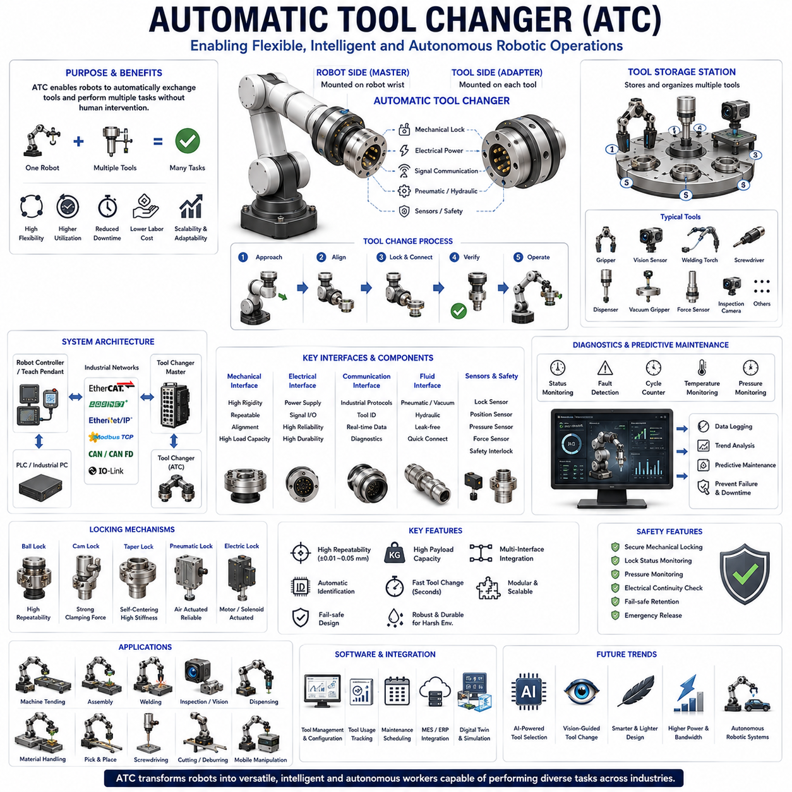
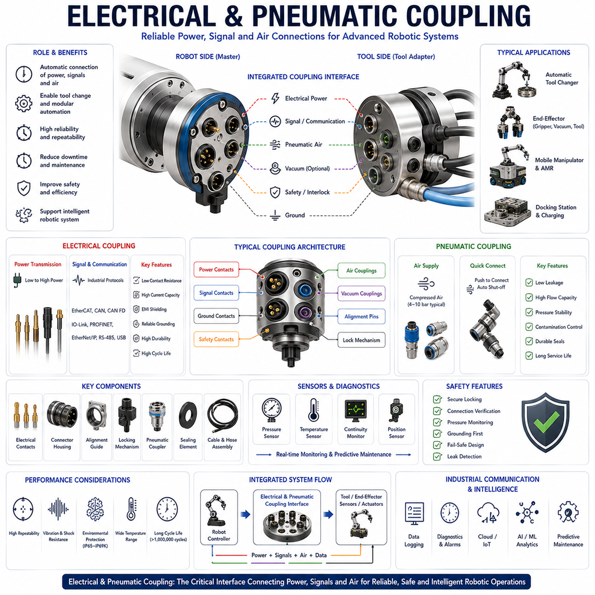
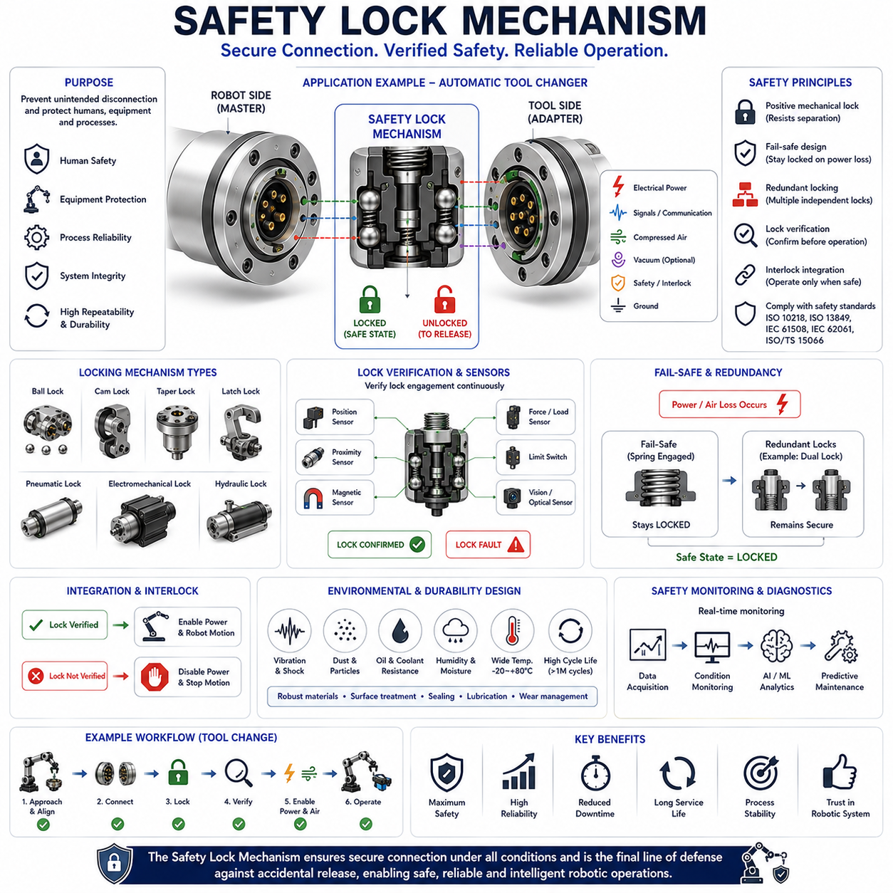
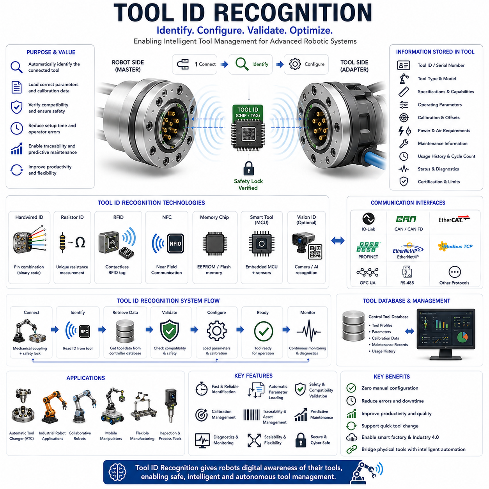
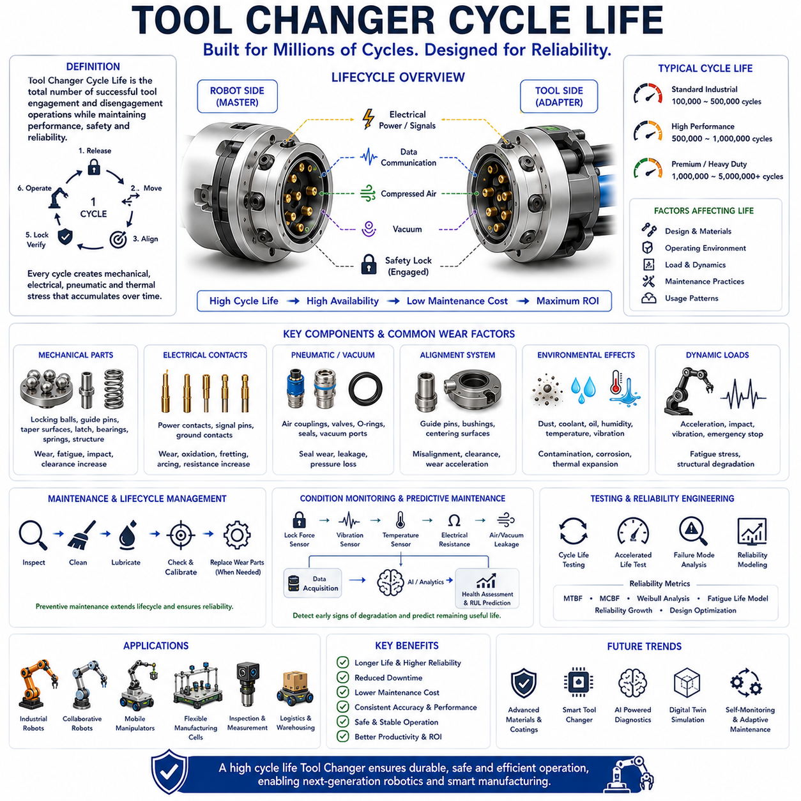

**Volume 14 Mobile Manipulator Architecture**


# Chapter 5. Tool Changer Design

##  

## 5.1 Automatic Tool Changer ATC

{width="7.268055555555556in" height="7.268055555555556in"}

An Automatic Tool Changer (ATC) is one of the most important enabling technologies in modern robotic automation, industrial robotics, mobile manipulators, collaborative robots, flexible manufacturing systems, and Physical AI platforms. As robotic systems continue to evolve from single-purpose machines into highly adaptive autonomous systems, the ability to automatically exchange end-effectors without human intervention has become increasingly valuable. The Automatic Tool Changer allows a robot to switch between multiple tools, grippers, sensors, inspection devices, welding heads, screwdrivers, dispensing systems, cutting devices, and specialized end-effectors during operation. This capability dramatically expands robotic flexibility, improves equipment utilization, reduces downtime, and enables a single robot platform to perform a wide variety of tasks within a unified automation architecture.

Traditionally, industrial robots were designed to perform a limited set of repetitive operations using a dedicated end-effector. Whenever a new operation was required, production had to be interrupted while operators manually replaced tooling. This approach reduced manufacturing flexibility, increased labor costs, and limited automation scalability. The introduction of Automatic Tool Changer systems fundamentally transformed robotic operation by allowing robots to autonomously select, connect, verify, utilize, and return tools according to production requirements. As a result, a single robotic platform can now perform multiple manufacturing processes, inspection procedures, material handling operations, and assembly tasks without human intervention.

Within a mobile manipulator architecture, the Automatic Tool Changer serves as a critical interface between the robot arm and the working tool. The ATC system provides a standardized mechanical, electrical, pneumatic, hydraulic, communication, and safety connection that enables rapid tool exchange while maintaining high reliability and repeatability. The tool changer becomes a foundational element that supports modular robotics, adaptive automation, and intelligent task execution.

The fundamental purpose of an Automatic Tool Changer is to create a repeatable and reliable connection mechanism between a robot and multiple interchangeable tools. The system must ensure accurate mechanical alignment, secure locking, uninterrupted power delivery, signal communication, fluid transfer when required, and safe operation throughout the entire tool-changing process. The quality of the ATC design directly influences robotic precision, productivity, reliability, maintainability, and operational safety.

A typical ATC architecture consists of a robot-side master unit, a tool-side adapter unit, a tool storage station, alignment mechanisms, locking mechanisms, electrical interfaces, communication interfaces, pneumatic or hydraulic couplings, sensor systems, and control software. The robot-side master remains permanently attached to the manipulator wrist, while tool-side adapters are mounted on individual tools. During tool exchange, the robot aligns the master unit with the selected adapter and establishes all required mechanical and electrical connections automatically.

Mechanical coupling represents the most fundamental function of the ATC system. The coupling mechanism must provide high structural stiffness, accurate positioning, repeatable alignment, and sufficient load-carrying capability. Mechanical interfaces are typically designed to withstand static loads, dynamic forces, vibration, impact loads, and operational torques generated during robotic tasks. Precision alignment surfaces ensure that each tool is mounted consistently, minimizing positional variation and maintaining process accuracy.

Several mechanical locking mechanisms are commonly employed in Automatic Tool Changer systems. Ball-lock mechanisms utilize hardened steel locking balls that engage precision grooves within the mating interface. This design provides excellent repeatability, compact packaging, and high load capacity. Cam-lock systems employ rotating cams that generate clamping forces during engagement. Taper-lock interfaces use precision tapered surfaces that create self-centering alignment and high stiffness. Pneumatic locking systems employ compressed air to actuate mechanical retention devices, while electrically actuated locks use motors or solenoids to engage locking elements.

Repeatability is one of the most critical performance characteristics of an Automatic Tool Changer. In many robotic applications, the positional accuracy of the exchanged tool directly affects process quality. Precision assembly, machine tending, welding, inspection, dispensing, and metrology applications may require repeatability measured in tens of micrometers. High-quality ATC systems are therefore engineered to maintain consistent positioning throughout thousands or millions of tool exchange cycles.

Load capacity considerations influence nearly every aspect of ATC design. The tool changer must safely support the weight of the tool, payload forces generated during operation, dynamic accelerations, and external disturbances. Industrial robotic systems may handle tools weighing only a few hundred grams or several hundred kilograms. Mobile manipulator systems often require lightweight tool changers to minimize wrist inertia while maintaining sufficient structural strength for demanding applications.

Electrical integration is an essential component of modern ATC architectures. Many robotic tools require electrical power for operation. Grippers, sensors, vision systems, force-torque sensors, servo-driven tools, inspection equipment, and smart end-effectors all depend on reliable electrical connectivity. The ATC interface must provide secure electrical contacts capable of transferring power while maintaining signal integrity and resistance to environmental contamination.

Power transmission requirements vary significantly depending on application demands. Simple sensor tools may require only low-voltage power supplies, while advanced robotic tools may require high-current power distribution for motors, heaters, lighting systems, or embedded computing platforms. Electrical connectors integrated into the tool changer must accommodate these requirements while maintaining durability under repeated connection cycles.

Signal communication capabilities have become increasingly important as robotic tools become more intelligent. Modern tools often incorporate embedded processors, diagnostics systems, smart sensors, and communication interfaces. Industrial communication protocols such as IO-Link, EtherCAT, CAN, CAN FD, PROFINET, EtherNet/IP, Modbus TCP, and RS-485 may be integrated through the ATC interface. Reliable communication enables real-time control, configuration management, diagnostics monitoring, and tool identification.

Tool identification is a particularly valuable feature within advanced ATC systems. Each tool may contain an electronic identifier, RFID tag, memory module, or embedded communication device. When a tool is connected, the robot automatically verifies tool identity and retrieves associated operating parameters. This capability prevents configuration errors, supports automated setup procedures, and enhances overall system safety.

Pneumatic integration is widely used in robotic automation because many industrial end-effectors rely on compressed air. Pneumatic grippers, vacuum systems, blow-off devices, actuators, and process tools require reliable air delivery through the tool changer interface. Pneumatic couplings integrated within the ATC system automatically establish compressed air connections during tool engagement. Leak prevention, contamination control, pressure stability, and connection durability are critical design considerations.

Hydraulic integration is less common but remains important in heavy-duty industrial applications. Hydraulic tools provide extremely high force density and are often used in forming operations, heavy manipulation tasks, cutting systems, and specialized manufacturing processes. Hydraulic couplings integrated into the ATC must provide leak-free operation, contamination resistance, and safe pressure management.

Vacuum transfer capabilities are frequently incorporated into ATC architectures. Vacuum grippers are widely used in material handling applications involving glass panels, sheet metal, semiconductor wafers, packaging materials, and consumer products. Automatic vacuum coupling enables rapid tool changes without requiring manual reconnection of vacuum lines.

Sensor integration significantly improves tool changer reliability and intelligence. Position sensors verify alignment during engagement. Lock status sensors confirm secure mechanical coupling. Electrical continuity monitoring validates power connections. Pressure sensors monitor pneumatic integrity. Force sensors may detect abnormal loading conditions during tool exchange. Together these sensing capabilities support robust operation and fault detection.

Safety is one of the most important design considerations for Automatic Tool Changer systems. Tool detachment during operation can create severe hazards for personnel, equipment, and products. Safety mechanisms must ensure secure retention under all operating conditions. Redundant locking systems, lock verification sensors, fail-safe retention mechanisms, emergency release procedures, and continuous monitoring functions are frequently implemented to mitigate risks.

Fail-safe operation is particularly important in collaborative robotics and mobile manipulation applications. In the event of power loss, communication failure, or pneumatic pressure loss, the ATC must maintain tool retention and prevent unintended release. Mechanical locking systems often remain engaged without external power, providing inherent safety during fault conditions.

Environmental considerations influence tool changer design across different industries. Manufacturing facilities may expose ATC systems to dust, oil mist, coolant, metal chips, vibration, temperature variations, humidity, and chemical contaminants. Food processing and pharmaceutical environments impose additional hygiene requirements. Outdoor robotic applications introduce weather exposure, corrosion risks, and temperature extremes. Appropriate material selection, sealing strategies, protective coatings, and environmental testing ensure reliable operation under these conditions.

Mobile manipulator systems present unique challenges for Automatic Tool Changer integration. Unlike stationary industrial robots, mobile manipulators operate in dynamic environments where positioning uncertainties, vehicle motion, vibration, and varying operating conditions influence tool exchange procedures. Advanced perception systems, vision-guided alignment algorithms, and adaptive control strategies may be required to achieve reliable tool changing performance in these environments.

Vision-guided tool changing has emerged as an important capability in advanced robotic systems. Cameras, depth sensors, and AI-based perception algorithms assist the robot in locating tool storage stations, estimating alignment errors, and guiding engagement motions. Vision systems increase robustness and reduce dependency on highly constrained mechanical fixtures. This capability becomes particularly valuable in flexible manufacturing environments and autonomous mobile robotics.

Artificial intelligence is increasingly influencing Automatic Tool Changer operation. AI algorithms can optimize tool selection strategies, predict maintenance requirements, detect abnormal behaviors, and improve operational efficiency. Machine learning techniques may analyze tool usage patterns, process performance, and maintenance histories to optimize tool management throughout the production lifecycle.

Tool management software serves as the intelligence layer above the physical ATC hardware. The software tracks tool availability, tool condition, maintenance schedules, usage histories, calibration records, and process assignments. Integration with Manufacturing Execution Systems (MES), Enterprise Resource Planning (ERP) systems, fleet management platforms, and digital twin environments enables comprehensive lifecycle management of robotic tooling assets.

Digital twins are becoming increasingly important in ATC development and deployment. Virtual models of tool changers, robotic tools, and manufacturing systems allow engineers to simulate tool exchange procedures, evaluate reliability, optimize workflows, and validate control algorithms before physical deployment. Simulation-driven engineering reduces commissioning time and improves overall system performance.

The emergence of Physical AI and autonomous robotics is significantly increasing the importance of Automatic Tool Changer technology. Future robotic systems will not be limited to predefined tasks but will dynamically select tools according to mission objectives, environmental conditions, and operational requirements. Autonomous warehouse robots may switch between grippers and scanners. Inspection robots may exchange cameras, LiDAR sensors, and measurement devices. Mobile service robots may select specialized tools according to customer requests. Humanoid robots may utilize tool changers to expand manipulation capabilities beyond the limitations of fixed robotic hands.

Future Automatic Tool Changer architectures will likely incorporate greater intelligence, enhanced sensing capabilities, higher power transmission capacity, improved communication bandwidth, and stronger integration with AI-driven automation systems. Miniaturized electronics, embedded diagnostics, advanced materials, predictive maintenance algorithms, and autonomous tool management capabilities will further expand the role of ATC systems within next-generation robotic platforms.

As robotics continues evolving toward flexible manufacturing, adaptive automation, autonomous mobile manipulation, and Physical AI, the Automatic Tool Changer will remain one of the foundational technologies enabling robotic versatility. By allowing a single robotic platform to seamlessly utilize multiple tools and capabilities, ATC systems transform robots from specialized machines into highly adaptable intelligent workers capable of performing diverse tasks across a wide range of industries and applications.

# 05_01 자동 공구 교환기(Automatic Tool Changer, ATC)

자동 공구 교환기(Automatic Tool Changer, ATC)는 현대 로봇 자동화(Robotic Automation), 산업용 로봇(Industrial Robotics), 모바일 매니퓰레이터(Mobile Manipulator), 협동로봇(Collaborative Robot), 유연 생산 시스템(Flexible Manufacturing System), 그리고 피지컬 AI(Physical AI) 플랫폼을 가능하게 하는 핵심 기술 중 하나이다. 로봇 시스템이 단일 목적의 기계(Single-Purpose Machine)에서 다목적 자율 시스템(Multi-Purpose Autonomous System)으로 발전함에 따라, 사람의 개입 없이 다양한 엔드이펙터(End Effector)를 자동으로 교체할 수 있는 능력이 매우 중요해지고 있다.

자동 공구 교환기는 로봇이 그리퍼(Gripper), 비전 센서(Vision Sensor), 검사 장비(Inspection Device), 용접 토치(Welding Torch), 전동 드라이버(Screwdriver), 디스펜서(Dispenser), 절단 장치(Cutting Device) 등 다양한 공구를 자동으로 교체할 수 있도록 지원한다. 이를 통해 하나의 로봇 플랫폼이 여러 작업을 수행할 수 있게 되며, 생산 유연성(Flexibility), 설비 활용도(Utilization), 생산성(Productivity), 그리고 자동화 수준(Automation Level)을 크게 향상시킨다.

과거 산업용 로봇은 특정 작업만 수행하도록 설계되었으며, 새로운 작업이 필요할 경우 작업자가 직접 공구를 교체해야 했다. 이는 생산 중단(Downtime)을 유발하고 인건비(Labor Cost)를 증가시키며 자동화 확장성을 제한하였다. 자동 공구 교환기의 도입은 이러한 문제를 해결하여 로봇이 스스로 공구를 선택(Select), 연결(Connect), 검증(Verify), 사용(Operate), 반환(Return)할 수 있도록 만들었다.

모바일 매니퓰레이터 아키텍처(Mobile Manipulator Architecture)에서 ATC는 로봇 암(Robot Arm)과 실제 작업 공구(Working Tool)를 연결하는 핵심 인터페이스 역할을 수행한다. ATC는 기계적 연결(Mechanical Connection), 전기적 연결(Electrical Connection), 공압 연결(Pneumatic Connection), 유압 연결(Hydraulic Connection), 통신 연결(Communication Connection), 그리고 안전 연결(Safety Connection)을 표준화하여 다양한 공구를 안정적으로 사용할 수 있도록 지원한다.

ATC의 기본 목적은 로봇과 여러 공구 사이에 반복 가능하고 신뢰성 있는 연결(Repeatable and Reliable Connection)을 제공하는 것이다. 시스템은 정확한 정렬(Alignment), 강력한 잠금(Locking), 안정적인 전력 공급(Power Delivery), 신호 전달(Signal Communication), 유체 전달(Fluid Transfer), 그리고 안전한 분리 및 결합(Safe Engagement and Disengagement)을 보장해야 한다.

일반적인 ATC 시스템은 로봇 측 마스터 유닛(Robot-Side Master Unit), 공구 측 어댑터(Tool-Side Adapter), 공구 보관 스테이션(Tool Storage Station), 정렬 메커니즘(Alignment Mechanism), 잠금 메커니즘(Locking Mechanism), 전기 인터페이스(Electrical Interface), 통신 인터페이스(Communication Interface), 공압 및 유압 커플링(Coupling), 센서 시스템(Sensor System), 그리고 제어 소프트웨어(Control Software)로 구성된다.

마스터 유닛은 로봇 손목(Wrist)에 고정되며, 각 공구에는 전용 어댑터가 장착된다. 공구 교환 시 로봇은 마스터 유닛과 공구 어댑터를 정렬한 후 자동으로 기계적, 전기적, 통신적 연결을 수행한다.

기계적 결합(Mechanical Coupling)은 ATC의 가장 기본적인 기능이다. 결합 구조는 높은 강성(Stiffness), 높은 정밀도(Precision), 반복 정렬성(Repeatability), 충분한 하중 지지 능력(Load Capacity)을 제공해야 한다. 산업용 로봇은 작업 중 진동(Vibration), 충격(Impact), 토크(Torque), 가속도(Acceleration)를 지속적으로 받기 때문에 ATC는 이러한 하중을 안전하게 견뎌야 한다.

대표적인 잠금 방식으로는 볼 락(Ball Lock), 캠 락(Cam Lock), 테이퍼 락(Taper Lock), 공압 잠금(Pneumatic Lock), 전동 잠금(Electric Lock)이 있다.

볼 락 방식은 정밀 가공된 홈(Groove)에 강구(Steel Ball)가 결합되는 구조로 높은 반복 정밀도와 우수한 강성을 제공한다.

캠 락 방식은 회전 캠(Rotating Cam)을 이용하여 강한 클램핑 힘(Clamping Force)을 생성한다.

테이퍼 락 방식은 원추형(Tapered Surface)을 이용하여 자동 중심 정렬(Self-Centering Alignment)을 제공하며 매우 높은 강성을 확보할 수 있다.

공압 잠금은 압축공기(Compressed Air)를 이용해 잠금 장치를 작동시키며, 전동 잠금은 모터(Motor) 또는 솔레노이드(Solenoid)를 이용한다.

반복 정밀도(Repeatability)는 ATC 성능을 평가하는 가장 중요한 지표 중 하나이다. 조립(Assembly), 용접(Welding), 검사(Inspection), 측정(Metrology)과 같은 작업에서는 수십 마이크로미터(Micrometer) 수준의 반복 정밀도가 요구된다. 따라서 고성능 ATC는 수백만 회 이상의 교환 사이클에서도 동일한 위치 정밀도를 유지할 수 있도록 설계된다.

하중 지지 능력(Load Capacity)은 ATC 설계의 거의 모든 요소에 영향을 미친다. 시스템은 공구 자체의 무게뿐만 아니라 작업 중 발생하는 외력(External Force), 동적 하중(Dynamic Load), 충격 하중(Impact Load)까지 지지해야 한다. 산업용 시스템에서는 수백 그램의 소형 공구부터 수백 킬로그램에 달하는 대형 공구까지 사용될 수 있다.

전기 인터페이스(Electrical Interface)는 현대 ATC 시스템에서 필수 요소이다. 대부분의 공구는 전기 에너지를 필요로 하며, 전동 그리퍼(Electric Gripper), 카메라(Camera), 힘-토크 센서(Force-Torque Sensor), 스마트 공구(Smart Tool)는 모두 안정적인 전력 공급이 필요하다.

전력 전달(Power Transmission)은 저전압 신호(Level Signal)부터 고전류 모터 전원(Motor Power Supply)까지 다양한 수준을 지원해야 한다. 전기 접점(Electrical Contact)은 반복 결합 과정에서도 낮은 접촉 저항(Contact Resistance)과 높은 신뢰성을 유지해야 한다.

통신 기능(Communication Capability)은 최근 ATC에서 더욱 중요해지고 있다. 현대 공구는 임베디드 프로세서(Embedded Processor), 진단 시스템(Diagnostic System), 스마트 센서(Smart Sensor)를 내장하고 있다. EtherCAT, CAN, CAN FD, IO-Link, PROFINET, EtherNet/IP, Modbus TCP 등의 산업용 프로토콜(Industrial Protocol)이 ATC 인터페이스를 통해 전달될 수 있다.

공구 식별(Tool Identification)은 ATC의 중요한 기능이다. 각 공구는 RFID 태그(RFID Tag), EEPROM 메모리(Memory Module), 또는 내장형 통신 장치(Embedded Communication Device)를 포함할 수 있다. 공구가 연결되면 로봇은 자동으로 공구 종류를 인식하고 필요한 설정(Parameter)을 로딩한다. 이를 통해 설정 오류(Configuration Error)를 방지하고 생산성을 향상시킬 수 있다.

공압 인터페이스(Pneumatic Interface)는 산업 자동화에서 매우 중요하다. 공압 그리퍼(Pneumatic Gripper), 진공 시스템(Vacuum System), 블로우 장치(Blow-Off Device)는 모두 압축공기를 필요로 한다. ATC는 자동으로 공압 라인을 연결하며 압력 안정성(Pressure Stability)과 누설 방지(Leak Prevention)를 보장해야 한다.

유압 인터페이스(Hydraulic Interface)는 대형 산업 장비에서 사용된다. 유압 공구(Hydraulic Tool)는 매우 높은 힘 밀도(Force Density)를 제공하므로 절단(Cutting), 프레스(Forming), 대형 조작(Heavy Manipulation) 작업에 사용된다.

진공 인터페이스(Vacuum Interface)는 유리(Glass), 금속판(Sheet Metal), 반도체 웨이퍼(Semiconductor Wafer), 포장재(Packaging Material)를 취급하는 데 널리 사용된다.

센서 통합(Sensor Integration)은 ATC의 지능화를 가능하게 한다. 위치 센서(Position Sensor)는 정렬 상태를 확인하고, 잠금 센서(Lock Sensor)는 결합 상태를 검증하며, 압력 센서(Pressure Sensor)는 공압 상태를 모니터링한다. 힘 센서(Force Sensor)는 비정상적인 하중을 감지할 수 있다.

안전성(Safety)은 ATC 설계에서 가장 중요한 요소 중 하나이다. 작업 중 공구가 분리되면 작업자와 장비에 심각한 위험을 초래할 수 있다. 이를 방지하기 위해 이중 잠금(Redundant Locking), 잠금 확인 센서(Lock Verification Sensor), 비상 분리 절차(Emergency Release Procedure), 지속적인 상태 모니터링(Continuous Monitoring)이 적용된다.

정전(Power Loss), 통신 장애(Communication Failure), 공압 상실(Pneumatic Failure)과 같은 상황에서도 공구가 떨어지지 않도록 페일 세이프(Fail-Safe) 구조가 요구된다. 대부분의 ATC는 전원이 없어도 기계적으로 잠금 상태를 유지하도록 설계된다.

환경 조건(Environmental Conditions) 또한 중요하다. 산업 현장에서는 먼지(Dust), 오일 미스트(Oil Mist), 절삭유(Coolant), 금속 칩(Metal Chip), 진동(Vibration), 습도(Humidity), 화학 물질(Chemical Substance)에 노출될 수 있다. 식품(Food) 및 제약(Pharmaceutical) 산업은 세척 가능성(Washdown Capability)과 위생 설계(Hygienic Design)를 요구한다.

모바일 매니퓰레이터는 정적 환경이 아닌 동적 환경(Dynamic Environment)에서 동작하므로 ATC 설계가 더욱 복잡하다. 이동 중 발생하는 진동과 위치 오차(Position Error)를 보상하기 위해 비전 기반 정렬(Vision-Guided Alignment)과 적응 제어(Adaptive Control)가 활용된다.

비전 기반 공구 교환(Vision-Guided Tool Changing)은 최근 매우 중요한 기술로 부상하고 있다. 카메라(Camera), 깊이 센서(Depth Sensor), AI 기반 인식 알고리즘(AI-Based Perception Algorithm)을 이용하여 공구 위치를 인식하고 자동 정렬을 수행한다.

인공지능(AI)은 ATC 운영 방식에도 영향을 미치고 있다. AI는 공구 사용 패턴(Tool Usage Pattern), 유지보수 기록(Maintenance History), 공정 성능(Process Performance)을 분석하여 최적의 공구 선택(Tool Selection)과 유지보수 계획(Maintenance Planning)을 수행할 수 있다.

공구 관리 소프트웨어(Tool Management Software)는 ATC 시스템의 두뇌 역할을 한다. 공구 상태(Tool Status), 사용 이력(Usage History), 유지보수 일정(Maintenance Schedule), 보정 기록(Calibration Record)을 관리하며 MES(Manufacturing Execution System), ERP(Enterprise Resource Planning), 디지털 트윈(Digital Twin)과 연동된다.

디지털 트윈은 ATC 시스템의 시뮬레이션과 최적화에 활용된다. 가상 환경에서 공구 교환 절차를 검증하고 제어 알고리즘을 평가할 수 있다.

피지컬 AI와 자율 로봇(Autonomous Robot)의 발전은 ATC의 중요성을 더욱 높이고 있다. 미래의 로봇은 단순히 하나의 작업만 수행하는 것이 아니라, 작업 목표와 환경 조건에 따라 스스로 적절한 공구를 선택하게 될 것이다. 물류 로봇(Logistics Robot)은 그리퍼와 바코드 스캐너를 교체하고, 검사 로봇(Inspection Robot)은 카메라와 LiDAR를 교체하며, 서비스 로봇(Service Robot)은 상황에 따라 다양한 작업 도구를 사용할 수 있게 될 것이다.

미래의 ATC는 더욱 높은 지능(Intelligence), 더 강력한 진단 기능(Advanced Diagnostics), 더 큰 전력 전달 능력(Higher Power Capacity), 더 높은 통신 대역폭(Communication Bandwidth), 그리고 AI 기반 공구 관리(AI-Driven Tool Management)를 지원하게 될 것이다.

로봇 기술이 유연 생산(Flexible Manufacturing), 적응형 자동화(Adaptive Automation), 자율 모바일 조작(Autonomous Mobile Manipulation), 그리고 피지컬 AI 시대로 발전함에 따라 자동 공구 교환기(Automatic Tool Changer)는 로봇을 단순한 작업 기계에서 다기능 지능형 작업자(Multi-Functional Intelligent Worker)로 변화시키는 핵심 기반 기술로서 더욱 중요한 역할을 수행하게 될 것이다.

##  

## 5.2 Electrical Pneumatic Coupling

{width="7.268055555555556in" height="7.268055555555556in"}

Electrical and pneumatic coupling technologies form one of the most critical subsystems within modern robotic automation architectures, mobile manipulators, industrial robots, collaborative robots, automatic tool changers, and intelligent manufacturing platforms. While mechanical coupling establishes the structural connection between robotic components, electrical and pneumatic coupling systems provide the essential pathways through which energy, control signals, sensor information, and compressed air are transferred. Without reliable coupling mechanisms, robotic systems cannot effectively power end-effectors, communicate with intelligent devices, operate pneumatic actuators, or maintain safe and continuous operation. As robotic platforms become increasingly modular, autonomous, and adaptive, the importance of robust electrical and pneumatic coupling architectures continues to grow.

In a modern robotic system, electrical coupling and pneumatic coupling are often integrated into a unified interface architecture. This integration enables a robot to automatically exchange tools, connect intelligent end-effectors, activate pneumatic grippers, communicate with embedded sensors, and deliver power to advanced mechatronic devices through a single standardized connection point. Such integration is especially important in Automatic Tool Changer systems where multiple interfaces must be connected and disconnected repeatedly throughout the operational life of the robot.

The primary objective of electrical and pneumatic coupling is to provide reliable, repeatable, low-resistance, low-leakage, and high-durability connections capable of operating under industrial conditions. These conditions frequently include vibration, shock loading, dust exposure, humidity, oil contamination, temperature variation, electromagnetic interference, and continuous mechanical cycling. Consequently, coupling systems must be designed with careful attention to reliability engineering, environmental protection, maintainability, and operational safety.

Electrical coupling refers to the transfer of electrical energy, communication signals, control commands, sensor data, and diagnostic information between two interconnected systems. In robotic applications, electrical coupling commonly exists between robot wrists and end-effectors, Automatic Tool Changers and tools, mobile manipulators and payload modules, docking stations and robotic platforms, as well as sensor modules and control systems. The quality of electrical coupling directly influences communication reliability, power delivery stability, signal integrity, and overall system performance.

A typical electrical coupling system consists of electrical contacts, connector housings, alignment mechanisms, insulation structures, grounding systems, shielding elements, locking mechanisms, cable assemblies, and interface electronics. Each component plays an important role in maintaining reliable electrical performance throughout the operational life of the system.

Electrical contacts serve as the actual conductive interface through which current flows. Contact design significantly influences electrical resistance, current-carrying capacity, wear characteristics, and connection reliability. Gold-plated contacts are frequently used for low-current signal transmission because they provide excellent corrosion resistance and stable electrical performance. Silver-plated contacts are commonly employed for higher-current applications due to their superior conductivity. Contact materials must be selected carefully to balance conductivity, durability, wear resistance, and cost.

The geometry of electrical contacts influences connection quality. Pin-and-socket designs are widely used because they provide reliable alignment and consistent contact pressure. Spring-loaded contacts, often referred to as pogo pins, accommodate minor alignment variations and are particularly useful in Automatic Tool Changer applications. Blade connectors provide high current capacity while maintaining compact packaging. Advanced contact designs often incorporate self-cleaning mechanisms that remove contaminants during connection cycles.

Contact resistance represents one of the most important electrical performance parameters. Excessive resistance can generate heat, reduce efficiency, introduce voltage drops, and degrade system performance. Contact resistance is influenced by material properties, surface finish, contact force, contamination levels, and wear. Engineers must carefully optimize these factors to achieve reliable long-term operation.

Power transmission requirements vary significantly across robotic applications. Some devices require only low-voltage logic power for sensors and communication electronics. Others require substantial electrical power for motors, lighting systems, embedded computers, vision systems, force sensors, heaters, and intelligent end-effectors. Electrical coupling architectures must support appropriate voltage levels, current ratings, power densities, and safety margins according to application requirements.

Signal transmission introduces additional challenges because communication signals are often more sensitive than power circuits. Industrial communication networks such as EtherCAT, CAN, CAN FD, IO-Link, PROFINET, EtherNet/IP, RS-485, and USB require careful signal integrity management. Factors such as impedance matching, shielding effectiveness, electromagnetic compatibility, grounding strategies, and cable routing significantly influence communication reliability.

Electromagnetic interference represents a major concern in industrial environments. Electric motors, variable-frequency drives, welding systems, switching power supplies, and radio-frequency equipment generate electromagnetic noise that can interfere with communication signals. Electrical coupling systems therefore frequently incorporate shielding, differential signaling, grounding networks, isolation circuits, and filtering mechanisms to maintain signal quality.

Grounding architecture plays an important role in electrical coupling design. Proper grounding protects equipment from electrical faults, reduces electromagnetic emissions, minimizes noise susceptibility, and improves operator safety. Ground connections must remain reliable throughout repeated connection cycles and environmental exposure. In many robotic applications, dedicated grounding contacts engage before signal and power contacts to ensure safe connection sequencing.

Connector alignment is another critical consideration. Misalignment during coupling can damage contacts, reduce reliability, and create safety hazards. Alignment pins, tapered guides, floating connector mounts, compliance mechanisms, and self-centering geometries are frequently employed to ensure proper engagement. Automatic Tool Changer systems often rely heavily on precision alignment mechanisms to support thousands of automated connection cycles.

Environmental protection significantly influences connector design. Industrial robotic systems frequently operate in environments containing dust, oil, moisture, chemicals, metal particles, and temperature extremes. Connector housings often incorporate sealing technologies such as O-rings, gaskets, compression seals, and protective covers to achieve desired ingress protection ratings. IP65, IP67, and IP69K protection levels are common requirements in demanding industrial applications.

Pneumatic coupling provides the pathway through which compressed air is transferred between system components. Pneumatic power remains one of the most widely used actuation technologies in industrial automation due to its simplicity, high force density, rapid response characteristics, and cost effectiveness. Pneumatic grippers, actuators, vacuum generators, blow-off systems, and process tools all depend upon reliable pneumatic coupling architectures.

A pneumatic coupling system typically consists of fluid passages, sealing elements, quick-connect mechanisms, locking structures, pressure containment components, alignment features, and monitoring devices. The primary objective is to transfer compressed air efficiently while minimizing leakage, pressure loss, contamination, and maintenance requirements.

Compressed air quality significantly affects pneumatic coupling performance. Moisture, oil, particulate contamination, and chemical impurities can degrade seals, increase wear, obstruct flow passages, and reduce reliability. Pneumatic systems therefore frequently incorporate filtration, drying, pressure regulation, and contamination control measures to maintain air quality throughout the coupling interface.

Quick-connect pneumatic couplings are widely used because they enable rapid connection and disconnection without specialized tools. Internal valve mechanisms automatically open when mating components engage and close when disconnected. This design minimizes air loss, prevents contamination ingress, and improves operational convenience.

Sealing technology represents one of the most important aspects of pneumatic coupling design. Leakage directly reduces system efficiency, increases energy consumption, and may compromise actuator performance. O-rings, lip seals, face seals, radial seals, and elastomeric gaskets are commonly employed to achieve leak-free operation. Seal material selection must consider operating pressure, temperature, chemical compatibility, wear resistance, and service life requirements.

Pressure management is critical in pneumatic coupling systems. Industrial pneumatic systems commonly operate between 4 and 10 bar, although specialized applications may require higher or lower pressures. Coupling components must safely withstand maximum operating pressures, transient pressure spikes, cyclic loading, and accidental misuse. Structural integrity analysis, burst pressure testing, fatigue evaluation, and safety factor calculations are essential parts of the design process.

Flow capacity directly influences pneumatic system performance. Restrictive coupling designs create pressure drops that reduce actuator force and response speed. Engineers therefore optimize flow paths, passage diameters, internal geometries, and valve designs to minimize flow resistance while maintaining compact package sizes.

Vacuum transfer systems represent a specialized category of pneumatic coupling. Vacuum grippers are extensively used in material handling applications involving sheet metal, glass, semiconductor wafers, packaging materials, and consumer products. Vacuum coupling interfaces must maintain sufficient sealing performance to preserve vacuum levels while enabling rapid tool exchange and modular system integration.

Integrated electrical-pneumatic coupling systems combine multiple utility interfaces into a unified connection architecture. Such systems are commonly employed in Automatic Tool Changers, robotic wrists, modular automation platforms, and mobile manipulation systems. A single coupling event may simultaneously establish electrical power connections, communication channels, pneumatic supply lines, vacuum lines, and safety circuits. This integration reduces complexity, simplifies operation, and improves system flexibility.

Sensor integration significantly enhances coupling system intelligence. Pressure sensors monitor pneumatic conditions. Temperature sensors detect overheating. Electrical continuity monitoring verifies contact integrity. Flow sensors identify restrictions and leaks. Position sensors confirm proper engagement. These sensing capabilities enable real-time diagnostics and improve operational reliability.

Diagnostics play an increasingly important role in modern coupling architectures. Intelligent coupling systems continuously monitor connection status, electrical resistance, pressure levels, temperature conditions, communication quality, and operational cycles. Diagnostic data can be transmitted through industrial communication networks to support predictive maintenance, fault detection, and system optimization.

Safety considerations are fundamental in electrical and pneumatic coupling design. Electrical hazards may include shock risks, short circuits, overcurrent conditions, insulation failures, and unintended energization. Pneumatic hazards may involve sudden pressure release, hose failures, component separation, or uncontrolled actuator movement. Safety mechanisms such as interlocks, lock verification sensors, pressure relief devices, grounding contacts, insulation barriers, and fail-safe designs help mitigate these risks.

Mobile manipulators introduce unique challenges because coupling systems must operate reliably despite vehicle vibration, acceleration, shock loading, and environmental variability. Compact packaging, lightweight construction, flexible cable management, and robust mechanical retention become particularly important in these applications.

Automatic Tool Changer systems represent one of the most demanding applications for electrical and pneumatic coupling technologies. The coupling interface must support thousands or millions of automated connection cycles while maintaining reliable electrical performance, leak-free pneumatic operation, precise alignment, and consistent repeatability. The success of automated tool exchange depends heavily upon coupling reliability.

Industrial communication integration further increases the value of intelligent coupling architectures. Modern systems frequently support EtherCAT, PROFINET, EtherNet/IP, CAN FD, IO-Link, OPC UA, and cloud connectivity. Coupling systems increasingly serve not only as physical connection interfaces but also as information gateways linking sensors, actuators, controllers, diagnostics platforms, and AI-driven analytics systems.

Artificial intelligence is beginning to influence coupling system management. Machine learning algorithms can analyze connection cycles, contact resistance trends, leakage patterns, pressure behavior, and failure histories to predict maintenance requirements before failures occur. AI-driven diagnostics improve system availability and reduce operational costs.

Digital twin technologies increasingly incorporate coupling system models into virtual representations of robotic systems. Engineers can simulate electrical performance, pneumatic behavior, thermal characteristics, mechanical wear, and failure scenarios before deployment. Such simulation-driven development improves reliability and accelerates system validation.

The future of electrical and pneumatic coupling technologies will be characterized by increased integration, greater intelligence, enhanced diagnostics, higher power density, improved environmental resistance, and stronger connectivity. Advanced materials, embedded sensing, smart connectors, wireless diagnostics, self-monitoring architectures, and AI-assisted maintenance systems will further expand the capabilities of coupling technologies.

As robotics continues evolving toward autonomous manufacturing, modular automation, intelligent mobile manipulation, and Physical AI systems, electrical and pneumatic coupling will remain foundational enabling technologies. These interfaces serve as the critical pathways through which energy, information, control commands, and pneumatic power flow throughout robotic architectures. Their reliability, performance, and intelligence directly influence the effectiveness of next-generation robotic systems operating across manufacturing, logistics, healthcare, inspection, service robotics, and autonomous industrial applications.

# 05_02 전기 및 공압 커플링(Electrical Pneumatic Coupling)

전기 및 공압 커플링(Electrical Pneumatic Coupling)은 현대 로봇 자동화(Robotic Automation), 모바일 매니퓰레이터(Mobile Manipulator), 산업용 로봇(Industrial Robot), 협동로봇(Collaborative Robot), 자동 공구 교환기(Automatic Tool Changer, ATC), 그리고 스마트 제조 시스템(Intelligent Manufacturing System)의 핵심 하위 시스템 중 하나이다. 기계적 커플링(Mechanical Coupling)이 구조적 연결을 담당한다면, 전기 및 공압 커플링은 전력(Power), 제어 신호(Control Signal), 센서 데이터(Sensor Data), 진단 정보(Diagnostic Information), 그리고 압축공기(Compressed Air)를 전달하는 통로 역할을 수행한다.

신뢰성 있는 커플링 구조가 없다면 로봇은 엔드이펙터(End Effector)에 전력을 공급할 수 없고, 지능형 장치(Intelligent Device)와 통신할 수 없으며, 공압 액추에이터(Pneumatic Actuator)를 구동할 수도 없다. 로봇 플랫폼이 점점 더 모듈화(Modularization), 자율화(Autonomy), 지능화(Intelligence)됨에 따라 전기 및 공압 커플링 기술의 중요성은 지속적으로 증가하고 있다.

현대 로봇 시스템에서는 전기 커플링(Electrical Coupling)과 공압 커플링(Pneumatic Coupling)이 하나의 통합 인터페이스(Unified Interface)로 설계되는 경우가 많다. 이를 통해 로봇은 자동 공구 교환(Automatic Tool Change), 스마트 엔드이펙터(Smart End Effector) 연결, 공압 그리퍼(Pneumatic Gripper) 구동, 센서 데이터 통신, 전력 공급을 하나의 연결 동작(Connection Operation)만으로 수행할 수 있다.

전기 및 공압 커플링의 기본 목적은 산업 환경에서 반복적으로 사용되더라도 낮은 접촉 저항(Low Contact Resistance), 낮은 누설(Leakage), 높은 신뢰성(Reliability), 높은 반복성(Repeatability), 높은 내구성(Durability)을 유지하는 것이다. 산업 환경은 진동(Vibration), 충격(Shock), 먼지(Dust), 습기(Humidity), 오일(Oil), 온도 변화(Temperature Variation), 전자파 간섭(Electromagnetic Interference), 반복적인 기계 운동(Mechanical Cycling) 등이 존재하므로 커플링 시스템은 이러한 조건을 견딜 수 있도록 설계되어야 한다.

전기 커플링은 전력(Electrical Power), 통신 신호(Communication Signal), 제어 명령(Control Command), 센서 데이터(Sensor Data), 진단 정보(Diagnostic Information)를 전달하는 기술이다. 일반적으로 로봇 손목(Robot Wrist)과 엔드이펙터, ATC와 공구, 모바일 매니퓰레이터와 모듈형 장비(Modular Equipment), 도킹 스테이션(Docking Station)과 로봇 플랫폼 사이에서 사용된다.

전기 커플링 시스템은 전기 접점(Electrical Contact), 커넥터 하우징(Connector Housing), 정렬 장치(Alignment Mechanism), 절연 구조(Insulation Structure), 접지 시스템(Grounding System), 차폐 구조(Shielding Structure), 잠금 장치(Locking Mechanism), 케이블 어셈블리(Cable Assembly), 인터페이스 전자회로(Interface Electronics) 등으로 구성된다.

전기 접점은 실제 전류가 흐르는 부분이다. 접점 설계(Contact Design)는 전기 저항(Electrical Resistance), 전류 용량(Current Capacity), 마모 특성(Wear Characteristics), 연결 신뢰성(Connection Reliability)에 직접적인 영향을 준다.

금도금 접점(Gold-Plated Contact)은 낮은 전류 신호 전송에 널리 사용된다. 금은 부식(Corrosion)에 강하고 안정적인 접촉 특성을 제공하기 때문이다. 은도금 접점(Silver-Plated Contact)은 높은 전류를 전달하는 전력 회로에서 많이 사용되며 우수한 전도성(Conductivity)을 제공한다.

접점 형상(Contact Geometry)도 매우 중요하다. 핀-소켓(Pin-and-Socket) 구조는 가장 일반적인 방식이며 안정적인 정렬과 접촉 압력을 제공한다. 포고핀(Pogo Pin)은 스프링 구조(Spring Structure)를 이용하여 자동 정렬 기능을 제공하며 ATC 시스템에서 널리 사용된다. 블레이드 커넥터(Blade Connector)는 높은 전류 전달 능력을 제공한다.

접촉 저항(Contact Resistance)은 전기 성능을 결정하는 핵심 요소이다. 접촉 저항이 증가하면 발열(Heat Generation), 전압 강하(Voltage Drop), 전력 손실(Power Loss)이 발생할 수 있다. 따라서 재질(Material), 표면 마감(Surface Finish), 접촉 압력(Contact Force), 오염 수준(Contamination Level)을 적절히 관리해야 한다.

전력 전달(Power Transmission)은 응용 분야에 따라 요구사항이 다르다. 단순 센서는 저전압 전원(Low Voltage Power)만 필요하지만, 모터(Motor), 조명 시스템(Lighting System), GPU 컴퓨팅 장치(Embedded Computing Platform), 비전 시스템(Vision System)은 높은 전력을 요구할 수 있다.

신호 전송(Signal Transmission)은 전력 전달보다 더욱 민감한 문제를 포함한다. EtherCAT, CAN, CAN FD, IO-Link, PROFINET, EtherNet/IP, RS-485, USB와 같은 산업용 통신 프로토콜은 높은 신호 품질(Signal Integrity)을 요구한다. 임피던스 정합(Impedance Matching), 차폐(Shielding), 접지(Grounding), 케이블 라우팅(Cable Routing)은 통신 품질을 결정하는 중요한 요소이다.

전자파 간섭(Electromagnetic Interference, EMI)은 산업 환경에서 매우 중요한 문제이다. 모터, 인버터(Inverter), 용접기(Welding System), 스위칭 전원(Switching Power Supply)은 강한 전자파를 발생시킨다. 이를 방지하기 위해 차폐 구조, 차동 신호(Differential Signaling), 필터(Filter), 절연 회로(Isolation Circuit)가 사용된다.

접지 구조(Grounding Architecture)는 안전성과 신호 품질 모두에 영향을 미친다. 적절한 접지는 전기적 고장(Electrical Fault)으로부터 장비를 보호하고 노이즈(Noise)를 감소시킨다. 많은 산업용 커넥터는 전원 및 신호 접점보다 접지 접점이 먼저 연결되도록 설계된다.

정렬(Alignment)은 커플링 설계의 또 다른 핵심 요소이다. 잘못된 정렬은 접점 손상(Contact Damage), 통신 오류, 안전 문제를 유발할 수 있다. 이를 해결하기 위해 정렬 핀(Alignment Pin), 테이퍼 가이드(Taper Guide), 플로팅 마운트(Floating Mount), 자동 중심 정렬(Self-Centering Geometry) 기술이 적용된다.

산업 환경에서는 먼지, 오일, 수분, 화학 물질, 금속 입자 등에 노출되기 때문에 환경 보호(Environmental Protection)가 매우 중요하다. O-링(O-Ring), 가스켓(Gasket), 압축 씰(Compression Seal), 보호 커버(Protective Cover)를 이용하여 IP65, IP67, IP69K 수준의 보호 등급(IP Rating)을 구현한다.

공압 커플링은 압축공기를 전달하는 인터페이스이다. 공압 기술은 단순성(Simple Structure), 높은 힘 밀도(High Force Density), 빠른 응답성(Fast Response), 경제성(Cost Effectiveness) 덕분에 산업 자동화에서 여전히 널리 사용되고 있다.

공압 커플링 시스템은 유체 통로(Fluid Passage), 씰링 구조(Sealing Element), 퀵 커넥트 메커니즘(Quick Connect Mechanism), 잠금 구조(Locking Structure), 압력 유지 구조(Pressure Containment Structure), 정렬 장치(Alignment Feature), 모니터링 장치(Monitoring Device)로 구성된다.

압축공기 품질(Compressed Air Quality)은 공압 시스템 성능에 직접적인 영향을 미친다. 수분(Moisture), 오일(Oil), 먼지(Dust), 입자(Particle)는 씰 마모(Seal Wear), 유로 막힘(Flow Obstruction), 성능 저하를 유발할 수 있다. 따라서 필터(Filter), 드라이어(Dryer), 압력 조절기(Pressure Regulator)를 사용하여 공기 품질을 유지한다.

퀵 커넥트 공압 커플링(Quick Connect Pneumatic Coupling)은 별도의 공구 없이 빠른 연결과 분리가 가능하다. 내부 밸브(Internal Valve)가 연결 시 자동으로 열리고 분리 시 자동으로 닫히므로 공기 손실(Air Loss)을 최소화할 수 있다.

씰링 기술(Sealing Technology)은 공압 커플링의 핵심 요소이다. 누설(Leakage)은 에너지 손실(Energy Loss), 성능 저하, 유지보수 비용 증가를 초래한다. O-링, 립 씰(Lip Seal), 페이스 씰(Face Seal), 방사형 씰(Radial Seal), 탄성 가스켓(Elastomer Gasket)이 일반적으로 사용된다.

압력 관리(Pressure Management)는 매우 중요하다. 대부분의 산업용 공압 시스템은 4\~10 bar 범위에서 동작한다. 따라서 커플링은 반복 압력(Cyclic Pressure), 압력 스파이크(Pressure Spike), 최대 사용 압력(Maximum Operating Pressure)을 안전하게 견뎌야 한다.

유량 용량(Flow Capacity)은 공압 성능을 결정한다. 유로가 좁으면 압력 강하(Pressure Drop)가 발생하여 액추에이터 힘과 응답 속도가 감소한다. 따라서 유로 직경(Passage Diameter), 밸브 설계(Valve Design), 내부 형상(Internal Geometry)을 최적화해야 한다.

진공 시스템(Vacuum System)은 공압 커플링의 특수한 형태이다. 진공 그리퍼(Vacuum Gripper)는 유리, 금속판, 반도체 웨이퍼, 포장재를 취급하는 데 널리 사용된다. 진공 커플링은 높은 밀봉 성능(Sealing Performance)을 유지하면서도 빠른 교환을 지원해야 한다.

통합 전기-공압 커플링(Integrated Electrical-Pneumatic Coupling)은 여러 인터페이스를 하나로 결합한 구조이다. ATC, 모바일 매니퓰레이터, 모듈형 자동화 시스템에서 널리 사용된다. 단 한 번의 결합 동작으로 전력, 통신, 압축공기, 진공, 안전 신호가 동시에 연결될 수 있다.

센서 통합(Sensor Integration)은 커플링 시스템의 지능화를 가능하게 한다. 압력 센서(Pressure Sensor)는 공압 상태를 모니터링하고, 온도 센서(Temperature Sensor)는 과열을 감지하며, 연속성 검사(Electrical Continuity Monitoring)는 전기 접촉 상태를 확인한다. 유량 센서(Flow Sensor)는 누설과 막힘을 감지할 수 있다.

진단 기능(Diagnostics)은 현대 커플링 기술의 중요한 특징이다. 시스템은 접촉 저항, 압력 수준, 온도, 통신 품질, 사용 횟수(Operation Cycle)를 지속적으로 모니터링할 수 있다. 이러한 정보는 예지보전(Predictive Maintenance)과 고장 진단(Fault Detection)에 활용된다.

안전성(Safety)은 설계 전 과정에서 고려되어야 한다. 전기적 위험에는 감전(Electric Shock), 단락(Short Circuit), 과전류(Overcurrent), 절연 파괴(Insulation Failure)가 포함된다. 공압 위험에는 압력 방출(Pressure Release), 호스 파손(Hose Failure), 제어되지 않은 액추에이터 움직임(Uncontrolled Motion)이 포함된다.

모바일 매니퓰레이터에서는 진동, 충격, 환경 변화가 많기 때문에 커플링 시스템의 소형화(Compact Design), 경량화(Lightweight Design), 강한 체결력(Strong Retention), 케이블 관리(Cable Management)가 특히 중요하다.

자동 공구 교환기(ATC)는 전기 및 공압 커플링 기술이 가장 집중적으로 적용되는 대표적인 분야이다. 수십만 회에서 수백만 회 이상의 자동 결합과 분리 과정에서도 안정적인 전기 접촉과 누설 없는 공압 연결을 유지해야 한다.

산업 통신(Industrial Communication)의 발전과 함께 커플링 시스템은 단순한 연결 장치를 넘어 정보 허브(Information Hub)로 발전하고 있다. EtherCAT, PROFINET, EtherNet/IP, CAN FD, IO-Link, OPC UA와 연결되어 센서, 액추에이터, 제어기, AI 분석 플랫폼을 통합하는 역할을 수행한다.

인공지능(AI)은 커플링 관리에도 적용되고 있다. 머신러닝(Machine Learning)은 접촉 저항 변화, 누설 패턴, 압력 변화, 고장 이력을 분석하여 유지보수 시점을 예측할 수 있다. 이를 통해 시스템 가동률(Availability)을 향상시키고 유지보수 비용을 절감할 수 있다.

디지털 트윈(Digital Twin)은 전기 및 공압 커플링의 성능을 가상 환경에서 분석할 수 있도록 지원한다. 전기적 특성(Electrical Characteristics), 공압 성능(Pneumatic Performance), 열 특성(Thermal Characteristics), 마모(Wear), 고장 시나리오(Failure Scenario)를 사전에 검증할 수 있다.

미래의 전기 및 공압 커플링 기술은 더욱 높은 통합성(Higher Integration), 높은 지능(Intelligence), 강력한 진단 기능(Advanced Diagnostics), 높은 전력 밀도(High Power Density), 향상된 환경 저항성(Environmental Resistance), 그리고 AI 기반 유지보수(AI-Assisted Maintenance)를 갖추게 될 것이다.

로봇 기술이 자율 제조(Autonomous Manufacturing), 모듈형 자동화(Modular Automation), 모바일 조작(Mobile Manipulation), 피지컬 AI(Physical AI) 시대로 발전함에 따라 전기 및 공압 커플링은 에너지(Energy), 정보(Information), 제어(Control), 공압 동력(Pneumatic Power)을 연결하는 핵심 기반 기술로서 더욱 중요한 역할을 수행하게 될 것이다. 이는 차세대 로봇 시스템의 성능, 신뢰성, 안전성을 결정하는 가장 중요한 인터페이스 기술 중 하나로 계속 발전할 것이다.

##  

## 5.3 Safety Lock Mechanism

{width="7.268055555555556in" height="7.268055555555556in"}

The Safety Lock Mechanism is one of the most critical subsystems in robotic manipulation systems, automatic tool changers, industrial robots, collaborative robots, mobile manipulators, autonomous manufacturing platforms, and Physical AI systems. While many robotic components contribute to operational performance and productivity, the safety lock mechanism directly influences human safety, equipment protection, process reliability, and overall system integrity. In modern automation environments where robots operate with increasing autonomy, higher payload capacities, greater speeds, and closer interaction with human operators, reliable safety locking technologies are essential for preventing unintended disconnection, uncontrolled motion, accidental release, and catastrophic failures.

The primary purpose of a safety lock mechanism is to ensure that connected components remain securely attached throughout all operational conditions while preventing unintended separation or movement. Whether connecting a robotic tool to an Automatic Tool Changer, securing a gripper to a robot wrist, maintaining a docking interface, locking a payload module, or holding a safety enclosure closed, the lock mechanism serves as the final physical barrier that prevents hazardous events. Consequently, safety lock systems must be designed with significantly higher reliability requirements than ordinary mechanical interfaces.

Within a robotic architecture, the safety lock mechanism typically functions as part of a larger safety system that includes mechanical retention devices, sensors, electrical interlocks, software monitoring systems, diagnostic functions, emergency stop systems, and functional safety controllers. The locking mechanism itself provides the physical constraint, while surrounding systems continuously verify that the constraint remains effective. This layered safety philosophy reflects the principles of modern industrial safety engineering, where multiple independent protective measures work together to reduce risk.

In robotic tool-changing applications, the safety lock mechanism is particularly important because tools are frequently connected and disconnected throughout operation. Each connection event introduces opportunities for misalignment, incomplete engagement, wear, contamination, mechanical damage, and operator error. The lock mechanism must therefore tolerate repeated cycling while maintaining consistent performance and reliable retention characteristics over long service lives.

Mechanical locking principles form the foundation of most safety lock systems. A mechanical lock physically prevents separation by creating a positive engagement between two components. Unlike friction-based retention systems, positive locking mechanisms do not depend solely on clamping force. Instead, they create geometric constraints that physically block motion until an intentional release action occurs. This characteristic significantly improves reliability because retention remains effective even if vibration, shock loading, temperature changes, or component wear reduce clamping forces.

Ball-lock systems are among the most common safety locking technologies used in robotic tool changers. Hardened steel balls engage precision-machined grooves or cavities within mating components. When actuated, the balls move into locked positions and physically prevent separation. Ball-lock systems provide high load capacity, excellent repeatability, compact packaging, and long operational life. Because multiple locking balls can share loads simultaneously, stress distribution remains balanced and mechanical durability is enhanced.

Cam-lock mechanisms utilize rotating cams to generate locking forces and establish positive engagement. During locking, the cam rotates into a position where mechanical interference prevents separation. Cam-lock designs often provide strong clamping forces and can accommodate slight manufacturing tolerances while maintaining secure retention. Their simplicity and robustness make them attractive for industrial automation applications.

Taper-lock systems employ precision tapered geometries that create self-centering alignment and highly rigid connections. As components engage, tapered surfaces generate radial and axial forces that eliminate play and improve structural stiffness. Safety retention is achieved through geometric interference combined with locking elements that prevent unintended disengagement. Taper-lock systems are particularly useful in applications requiring high positional accuracy and repeatable tool mounting.

Latch-based locking systems utilize mechanical latches, hooks, or engagement arms that capture mating features. Once engaged, the latch prevents separation until a deliberate release command is executed. Latch mechanisms may be manually operated, pneumatically actuated, electrically driven, or hydraulically controlled. Their relatively simple construction makes them suitable for many robotic applications.

Pneumatic locking mechanisms use compressed air to actuate locking elements. In many robotic tool changers, pneumatic pistons move locking components into engagement positions. Pneumatic systems provide rapid actuation, high force output, and relatively simple integration with existing automation infrastructure. However, because compressed air availability influences operation, additional safety measures are often implemented to ensure retention during pressure loss events.

Electromechanical locking systems employ electric motors, solenoids, or actuators to engage and release locking structures. Advances in compact motor technology, integrated sensors, and embedded control electronics have made electromechanical locking increasingly popular in intelligent robotic systems. These systems support precise control, remote operation, diagnostics monitoring, and integration with higher-level automation architectures.

Hydraulic locking systems are typically reserved for heavy-duty applications involving large loads, high forces, or extreme environmental conditions. Hydraulic actuators provide exceptionally high force density and can maintain locking forces under demanding operational conditions. Such systems are commonly found in heavy industrial automation, aerospace tooling, large-scale manufacturing equipment, and specialized robotic platforms.

Fail-safe design principles represent one of the most important aspects of safety lock engineering. A fail-safe lock remains engaged when faults occur. Rather than relying on external power to maintain retention, the lock is designed so that power is only required for release. In the event of electrical failure, pneumatic pressure loss, controller malfunction, communication interruption, or emergency shutdown, the lock automatically remains in the safe state. This philosophy significantly reduces the probability of unintended release events.

Spring-loaded retention systems are frequently used to achieve fail-safe operation. Mechanical springs continuously apply locking forces, while external energy is required only to overcome spring forces during unlocking. As a result, the default state of the system remains locked regardless of power availability. Such architectures are particularly important in collaborative robotics, mobile manipulation, and autonomous systems where human interaction may occur.

Redundancy plays a major role in safety lock design. Safety-critical applications frequently employ multiple independent locking elements to reduce the probability of catastrophic failure. If one locking component becomes damaged, worn, contaminated, or improperly engaged, additional locking mechanisms continue providing retention. Redundant architectures are widely used in aerospace systems, medical robotics, industrial automation, and autonomous vehicle platforms.

Lock verification is equally important as the lock itself. A lock that appears engaged but is actually incomplete can create significant hazards. Consequently, modern safety lock systems incorporate multiple sensors that verify engagement status. Position sensors, proximity sensors, magnetic sensors, mechanical switches, optical sensors, and force sensors may all contribute to lock verification functions. The controller continuously monitors these signals to confirm that locking conditions remain valid.

Position sensing provides direct confirmation of locking element locations. For example, sensors may verify that locking pins have fully extended or that latches have reached their intended positions. Position verification reduces the likelihood of false lock indications caused by partial engagement or mechanical obstruction.

Force monitoring provides additional confidence by measuring loads within the locking system. Changes in force distribution may indicate improper engagement, excessive wear, mechanical damage, or impending failure. Force-based diagnostics are increasingly used in intelligent robotic systems to improve safety and predictive maintenance capabilities.

Interlock systems integrate safety locks with higher-level control architectures. An interlock prevents operation unless predefined safety conditions are satisfied. For example, a robotic tool may be prevented from receiving power unless the safety lock is verified. Similarly, robot motion may be disabled if lock status becomes uncertain. Interlocks create logical relationships between physical safety devices and system operation, significantly reducing risk.

Functional safety standards heavily influence safety lock design. Standards such as ISO 10218, ISO 13849, IEC 61508, IEC 62061, and ISO/TS 15066 establish requirements for robotic safety functions. Safety lock mechanisms operating within safety-related control systems must satisfy specific reliability metrics, diagnostic coverage requirements, and fault tolerance criteria. Compliance with these standards is often mandatory in industrial environments.

Environmental factors present significant challenges for safety lock mechanisms. Industrial facilities expose equipment to dust, metal particles, coolant fluids, oil mist, vibration, shock loading, humidity, chemical contaminants, and temperature variations. Outdoor robotic systems must additionally withstand rain, snow, ultraviolet exposure, corrosion, and extreme temperatures. Lock mechanisms must maintain performance under all expected environmental conditions throughout their operational lifetime.

Material selection directly influences lock reliability. High-strength steels provide excellent load-carrying capacity and wear resistance. Stainless steels improve corrosion resistance in harsh environments. Aluminum alloys reduce weight while maintaining adequate strength for many applications. Engineering polymers may be used for low-friction components, seals, and protective elements. Material compatibility, fatigue resistance, hardness, thermal stability, and manufacturability must all be considered during design.

Wear management is another important consideration because safety locks frequently experience thousands or millions of engagement cycles. Contact surfaces, locking pins, latches, bearings, guides, and springs gradually degrade during operation. Proper lubrication, surface treatments, hardened materials, and optimized contact geometries help extend service life and maintain reliability.

Mobile manipulators introduce additional safety lock challenges because vibration, vehicle acceleration, terrain irregularities, and dynamic loading conditions continuously affect the locking system. Retention mechanisms must resist unintended release despite external disturbances while maintaining low weight and compact packaging. Lock verification systems become particularly important because direct operator supervision may be limited during autonomous operation.

Automatic Tool Changer systems place especially demanding requirements on safety locks. Every tool exchange cycle involves mechanical engagement, alignment, locking verification, power transfer, communication establishment, and process validation. The safety lock serves as the central mechanism ensuring that all connected systems remain securely attached during operation. Any failure within the lock mechanism can potentially result in tool loss, equipment damage, process disruption, or safety incidents.

Artificial intelligence is increasingly contributing to safety lock monitoring and predictive maintenance. Machine learning algorithms analyze lock cycle histories, sensor signals, force measurements, vibration data, and diagnostic information to identify early indicators of degradation. Predictive maintenance strategies reduce unexpected failures by enabling maintenance actions before reliability becomes compromised.

Digital twin technologies further improve safety lock development and operation. Virtual models simulate mechanical behavior, wear progression, environmental effects, fault conditions, and operational scenarios. Engineers can evaluate design alternatives, validate safety functions, and optimize maintenance schedules using simulation-based methodologies before deploying physical systems.

Future safety lock mechanisms will likely incorporate advanced sensing, embedded intelligence, self-diagnostics, condition monitoring, and AI-assisted decision-making capabilities. Smart locking systems will continuously assess their own health, verify operational integrity, predict maintenance requirements, and communicate status information throughout connected automation networks. Wireless diagnostics, miniaturized sensors, advanced materials, and intelligent control architectures will further enhance reliability and safety.

As robotics advances toward increasingly autonomous, adaptive, and collaborative operation, safety lock mechanisms will remain fundamental enabling technologies. They provide the physical assurance that tools, modules, payloads, and critical components remain securely connected under all operating conditions. Their performance directly influences safety, reliability, productivity, and trust in robotic systems. Consequently, the Safety Lock Mechanism will continue serving as one of the most essential protective elements within future industrial robotics, mobile manipulation platforms, intelligent manufacturing systems, and Physical AI environments.

# 05_03 안전 잠금 메커니즘(Safety Lock Mechanism)

안전 잠금 메커니즘(Safety Lock Mechanism)은 로봇 조작 시스템(Robotic Manipulation System), 자동 공구 교환기(Automatic Tool Changer, ATC), 산업용 로봇(Industrial Robot), 협동로봇(Collaborative Robot), 모바일 매니퓰레이터(Mobile Manipulator), 자율 제조 시스템(Autonomous Manufacturing System), 그리고 피지컬 AI(Physical AI) 플랫폼에서 가장 중요한 하위 시스템 중 하나이다. 로봇 시스템의 생산성(Productivity)과 성능(Performance)에 기여하는 요소는 많지만, 안전 잠금 메커니즘은 작업자 안전(Human Safety), 장비 보호(Equipment Protection), 공정 신뢰성(Process Reliability), 그리고 시스템 무결성(System Integrity)에 직접적인 영향을 미친다.

현대 자동화 환경에서는 로봇이 더 높은 속도(Higher Speed), 더 큰 하중(Higher Payload), 더 높은 자율성(Autonomy)을 갖고 인간과 가까운 거리에서 작업하게 된다. 이러한 환경에서는 예기치 않은 분리(Unintended Disconnection), 제어되지 않은 움직임(Uncontrolled Motion), 공구 탈락(Accidental Release), 치명적인 시스템 고장(Catastrophic Failure)을 방지하기 위해 신뢰성 높은 안전 잠금 기술이 반드시 필요하다.

안전 잠금 메커니즘의 기본 목적은 연결된 부품들이 모든 운전 조건에서 안전하게 결합 상태를 유지하도록 하는 것이다. 로봇 공구(Robotic Tool)와 자동 공구 교환기, 그리퍼(Gripper)와 로봇 손목(Wrist), 도킹 인터페이스(Docking Interface), 페이로드 모듈(Payload Module), 또는 안전 도어(Safety Enclosure)를 연결하는 경우 모두 안전 잠금 장치는 위험 상황을 방지하는 최종 물리적 장벽(Final Physical Barrier)의 역할을 수행한다.

따라서 안전 잠금 시스템은 일반적인 기계 연결 구조보다 훨씬 높은 수준의 신뢰성을 요구한다. 로봇 시스템 내부에서는 기계적 잠금 장치(Mechanical Retention Device), 센서(Sensor), 전기 인터록(Electrical Interlock), 소프트웨어 모니터링(Software Monitoring), 진단 기능(Diagnostics), 비상 정지 시스템(Emergency Stop System), 기능 안전 제어기(Functional Safety Controller)와 함께 통합된 안전 구조를 형성한다.

잠금 장치는 실제 물리적 구속(Physical Constraint)을 제공하고, 주변 안전 시스템은 이 구속 상태가 정상적으로 유지되는지를 지속적으로 확인한다. 이러한 다중 방어 구조(Layered Safety Architecture)는 현대 산업 안전 공학(Industrial Safety Engineering)의 핵심 설계 철학이다.

자동 공구 교환기에서는 안전 잠금 장치의 중요성이 더욱 크다. 공구가 반복적으로 연결되고 분리되기 때문에 정렬 오차(Misalignment), 불완전 결합(Incomplete Engagement), 마모(Wear), 오염(Contamination), 기계적 손상(Mechanical Damage), 작업자 실수(Human Error) 등이 발생할 가능성이 존재한다. 따라서 잠금 메커니즘은 수십만\~수백만 회 이상의 반복 동작에서도 안정적인 성능을 유지해야 한다.

기계적 잠금 원리(Mechanical Locking Principle)는 대부분의 안전 잠금 시스템의 기반이 된다. 기계적 잠금은 두 부품 사이에 양의 결합(Positive Engagement)을 형성하여 물리적으로 분리를 방지한다. 마찰력(Friction Force)에 의존하는 방식과 달리, 양의 결합 방식은 진동(Vibration), 충격(Shock), 온도 변화(Temperature Variation), 마모(Wear)가 발생해도 결합 상태를 유지할 수 있다는 장점이 있다.

볼 락 시스템(Ball Lock System)은 ATC에서 가장 널리 사용되는 잠금 기술 중 하나이다. 경화 강구(Hardened Steel Ball)가 정밀 가공된 홈(Groove)에 결합되어 물리적으로 분리를 방지한다. 볼 락은 높은 하중 지지 능력(Load Capacity), 우수한 반복 정밀도(Repeatability), 긴 수명(Service Life)을 제공한다.

캠 락 메커니즘(Cam Lock Mechanism)은 회전 캠(Rotating Cam)을 이용하여 강한 클램핑 힘(Clamping Force)을 생성한다. 캠이 특정 위치까지 회전하면 기계적 간섭(Mechanical Interference)에 의해 분리가 불가능해진다. 구조가 단순하면서도 강성이 높아 산업 자동화 분야에서 널리 사용된다.

테이퍼 락 시스템(Taper Lock System)은 원추형 구조(Taper Geometry)를 사용하여 자동 중심 정렬(Self-Centering Alignment)과 높은 강성(Stiffness)을 제공한다. 테이퍼 면(Taper Surface)은 유격(Play)을 제거하고 정밀한 위치 재현성을 보장한다.

래치 방식(Latch-Based Locking System)은 후크(Hook), 걸쇠(Latch), 또는 잠금 암(Locking Arm)을 사용하여 결합을 유지한다. 수동(Manual), 공압(Pneumatic), 전동(Electromechanical), 유압(Hydraulic) 방식으로 구동될 수 있으며 구조가 비교적 단순하여 다양한 산업 분야에 적용된다.

공압 잠금 장치(Pneumatic Locking Mechanism)는 압축공기(Compressed Air)를 사용하여 잠금 요소를 작동시킨다. 빠른 응답 속도(Fast Response Time), 높은 출력(High Force Output), 기존 공압 시스템과의 쉬운 통합이 장점이다. 하지만 공기 압력 손실(Pressure Loss)이 발생할 수 있으므로 추가적인 안전 장치가 필요하다.

전기 기계식 잠금(Electromechanical Locking System)은 모터(Motor), 솔레노이드(Solenoid), 전동 액추에이터(Electric Actuator)를 이용하여 잠금과 해제를 수행한다. 최근에는 내장 센서(Embedded Sensor), 진단 기능(Diagnostic Function), 네트워크 통신(Network Communication)을 포함한 스마트 잠금 장치(Smart Locking System) 형태로 발전하고 있다.

유압 잠금 장치(Hydraulic Locking System)는 대형 하중(Large Load), 고출력(High Force)이 필요한 산업 환경에서 사용된다. 매우 높은 힘 밀도(Force Density)를 제공하며 항공우주(Aerospace), 중공업(Heavy Industry), 대형 제조 설비(Large Manufacturing Equipment) 등에 적용된다.

페일 세이프(Fail-Safe) 설계는 안전 잠금 메커니즘의 가장 중요한 개념 중 하나이다. 페일 세이프 잠금은 전원 상실(Power Loss), 통신 장애(Communication Failure), 공압 손실(Pneumatic Failure), 제어기 오류(Controller Failure)가 발생하더라도 잠금 상태를 유지한다.

많은 시스템은 스프링 유지 장치(Spring Retention Mechanism)를 사용한다. 스프링이 항상 잠금 방향으로 힘을 가하고 있으며, 잠금을 해제할 때만 외부 에너지가 필요하다. 따라서 전원이 사라져도 기본 상태(Default State)는 잠금 상태가 된다.

이중화(Redundancy)는 안전 잠금 설계의 핵심 요소이다. 하나의 잠금 장치가 손상되거나 마모되더라도 다른 잠금 장치가 계속해서 하중을 지지할 수 있도록 여러 개의 독립적인 잠금 요소를 사용한다. 이러한 구조는 항공우주, 의료 로봇(Medical Robot), 산업 자동화 분야에서 널리 적용된다.

잠금 검증(Lock Verification)은 잠금 자체만큼 중요하다. 잠금이 된 것처럼 보이지만 실제로는 완전히 결합되지 않은 경우 심각한 사고가 발생할 수 있다. 이를 방지하기 위해 현대 잠금 시스템은 위치 센서(Position Sensor), 근접 센서(Proximity Sensor), 자기 센서(Magnetic Sensor), 광학 센서(Optical Sensor), 힘 센서(Force Sensor)를 이용하여 잠금 상태를 지속적으로 확인한다.

위치 감지(Position Sensing)는 잠금 핀(Locking Pin) 또는 잠금 암이 정확한 위치에 도달했는지를 확인한다. 이를 통해 부분 결합(Partial Engagement)이나 기계적 간섭(Mechanical Obstruction)을 탐지할 수 있다.

힘 모니터링(Force Monitoring)은 잠금 구조 내부의 힘 분포(Force Distribution)를 측정한다. 힘이 비정상적으로 변화하면 마모, 손상, 또는 잠금 불량의 가능성을 조기에 발견할 수 있다.

인터록 시스템(Interlock System)은 잠금 상태와 로봇 동작을 연계한다. 예를 들어 잠금이 확인되지 않으면 공구에 전력을 공급하지 않거나, 로봇의 움직임을 차단하도록 설계할 수 있다. 이러한 인터록은 물리적 안전 장치와 제어 시스템을 논리적으로 연결하여 위험을 감소시킨다.

기능 안전 표준(Functional Safety Standard)은 안전 잠금 설계에 큰 영향을 미친다. ISO 10218, ISO 13849, IEC 61508, IEC 62061, ISO/TS 15066 등의 표준은 로봇 안전 시스템의 신뢰성(Reliability), 진단 커버리지(Diagnostic Coverage), 고장 허용도(Fault Tolerance)에 대한 요구사항을 정의하고 있다.

환경 조건(Environmental Condition) 또한 중요한 설계 요소이다. 산업 현장에서는 먼지, 금속 입자(Metal Particle), 절삭유(Coolant), 오일 미스트(Oil Mist), 진동, 습기, 화학 물질 등에 지속적으로 노출된다. 실외 로봇은 비(Rain), 눈(Snow), 자외선(UV Exposure), 부식(Corrosion), 극한 온도(Extreme Temperature)까지 고려해야 한다.

재료 선택(Material Selection)은 잠금 장치의 신뢰성을 결정한다. 고강도 강철(High-Strength Steel)은 높은 하중 지지 능력과 내마모성(Wear Resistance)을 제공한다. 스테인리스강(Stainless Steel)은 우수한 내식성(Corrosion Resistance)을 제공하며, 알루미늄 합금(Aluminum Alloy)은 경량화(Lightweight Design)에 유리하다.

마모 관리(Wear Management)도 매우 중요하다. 잠금 핀, 베어링(Bearing), 가이드(Guide), 스프링(Spring)은 수많은 반복 사이클을 경험하므로 적절한 윤활(Lubrication), 표면 처리(Surface Treatment), 열처리(Heat Treatment)가 필요하다.

모바일 매니퓰레이터는 차량 진동(Vehicle Vibration), 가속도(Acceleration), 지형 변화(Terrain Disturbance)에 의해 추가적인 하중을 받는다. 따라서 잠금 장치는 더욱 강력한 체결력(Retention Force)과 신뢰성 있는 상태 모니터링을 제공해야 한다.

자동 공구 교환기에서는 공구 교환 과정마다 정렬, 잠금, 전력 연결, 통신 연결, 상태 검증이 수행된다. 이때 안전 잠금 장치는 모든 연결 구조를 유지하는 중심 요소이며, 잠금 실패는 공구 낙하(Tool Drop), 장비 손상(Equipment Damage), 생산 중단(Process Disruption), 안전 사고(Safety Incident)를 초래할 수 있다.

최근에는 인공지능(AI)이 안전 잠금 시스템에도 적용되고 있다. 머신러닝(Machine Learning)은 잠금 횟수(Cycle History), 센서 데이터(Sensor Data), 진동 패턴(Vibration Pattern), 힘 측정값(Force Measurement)을 분석하여 고장을 예측하고 유지보수 시점을 판단할 수 있다.

디지털 트윈(Digital Twin)은 잠금 장치의 마모, 응력 분포(Stress Distribution), 환경 영향(Environmental Effect), 고장 모드(Failure Mode)를 시뮬레이션할 수 있도록 지원한다. 이를 통해 실제 장비 적용 전에 설계를 최적화하고 신뢰성을 향상시킬 수 있다.

미래의 안전 잠금 메커니즘은 더욱 높은 지능(Intelligence), 자가 진단(Self-Diagnostics), 상태 감시(Condition Monitoring), AI 기반 유지보수(AI-Assisted Maintenance)를 제공하게 될 것이다. 스마트 잠금 시스템(Smart Lock System)은 스스로 자신의 상태를 평가하고, 유지보수 필요성을 예측하며, 산업 네트워크를 통해 실시간으로 정보를 공유하게 될 것이다.

로봇 기술이 자율화(Autonomy), 적응화(Adaptability), 협업화(Collaboration) 방향으로 발전할수록 안전 잠금 메커니즘은 여전히 가장 중요한 핵심 안전 기술(Core Safety Technology) 중 하나로 남게 될 것이다. 공구(Tool), 모듈(Module), 페이로드(Payload), 핵심 부품(Critical Component)이 모든 운전 조건에서 안전하게 유지되도록 보장함으로써 산업용 로봇, 모바일 매니퓰레이터, 스마트 제조 시스템(Intelligent Manufacturing System), 그리고 미래의 피지컬 AI 플랫폼에서 필수적인 역할을 수행하게 될 것이다.

##  

## 5.4 Tool ID Recognition

{width="7.268055555555556in" height="7.268055555555556in"}

Tool ID Recognition is a foundational technology in modern robotic automation systems, Automatic Tool Changers (ATC), industrial robots, collaborative robots, mobile manipulators, flexible manufacturing systems, and Physical AI platforms. As robotic systems become increasingly modular and capable of utilizing a wide variety of interchangeable tools, the ability to automatically identify, verify, configure, monitor, and manage those tools becomes essential. Tool ID Recognition enables robots to understand exactly which tool is currently attached, retrieve the correct operating parameters, validate compatibility, ensure safety, and optimize task execution without requiring human intervention.

In traditional industrial automation environments, tool selection and configuration were often performed manually. Operators would physically install a tool and manually update control parameters within the robot controller. While this approach was acceptable in highly structured production systems with infrequent tool changes, it becomes impractical in modern flexible manufacturing environments where robots may exchange tools dozens or hundreds of times per day. Manual configuration introduces risks of operator error, incorrect parameter loading, incompatible tool usage, and reduced productivity. Tool ID Recognition eliminates these issues by enabling fully automated tool awareness.

The primary objective of Tool ID Recognition is to establish a reliable digital identity for every tool within the robotic ecosystem. Each tool becomes a uniquely identifiable asset that can communicate its characteristics, capabilities, requirements, maintenance status, and operational history to the robotic control system. The robot no longer treats tools as generic attachments but instead understands each tool as an intelligent subsystem with specific functions and constraints.

Within an Automatic Tool Changer architecture, Tool ID Recognition typically operates immediately after successful mechanical coupling and safety lock verification. Once the physical connection is established, the system initiates an identification process that determines which tool has been attached. The controller then retrieves configuration data associated with that tool and automatically adapts operational parameters accordingly. This process occurs within milliseconds or seconds, allowing seamless transitions between different manufacturing tasks.

Tool identification architectures generally consist of identification hardware, communication interfaces, embedded memory devices, control software, database management systems, safety validation mechanisms, and diagnostic monitoring functions. Together these elements create a comprehensive framework for managing tool identity throughout the operational lifecycle of the robotic system.

One of the simplest forms of Tool ID Recognition utilizes hardwired identification signals. In this approach, specific electrical pins are connected in predefined combinations to create unique binary identification patterns. When the tool is connected, the controller reads the pin configuration and determines the tool type. While this method is inexpensive and straightforward, the number of unique tool identities is limited by the number of available identification lines. Hardwired identification is therefore primarily used in simpler automation systems with relatively small tool libraries.

Resistor-based identification schemes provide a slightly more advanced solution. Each tool contains a resistor or resistor network with a unique resistance value. Upon connection, the controller measures the resistance and determines the corresponding tool identity. This approach increases the number of distinguishable tools while maintaining low implementation cost. However, measurement accuracy, environmental influences, and tolerance variations can limit scalability.

Radio Frequency Identification technology has become one of the most widely adopted methods for Tool ID Recognition. RFID systems consist of tags embedded within tools and readers integrated into robot wrists, tool changers, or docking interfaces. When a tool is connected, the reader interrogates the RFID tag and retrieves identification data. RFID technology offers numerous advantages including contactless operation, high reliability, unique identification capabilities, and resistance to contamination. Passive RFID tags require no internal power source, making them particularly attractive for industrial applications.

Advanced RFID implementations can store significantly more information than simple identification numbers. Tool specifications, calibration data, manufacturing records, maintenance histories, service intervals, serial numbers, firmware versions, operational limits, and configuration parameters may all be stored directly within the RFID memory. This capability transforms the RFID tag from a simple identifier into a portable digital information repository.

Near Field Communication technologies provide similar capabilities while supporting bidirectional communication and enhanced data exchange functions. NFC-based systems may be particularly useful in applications requiring configuration updates, diagnostics transfer, or operator interaction through handheld devices.

Memory chip-based identification systems represent another common approach. Non-volatile memory devices such as EEPROMs, flash memory modules, or embedded microcontrollers are integrated directly into the tool. Upon connection, the robot controller establishes communication with the memory device and retrieves stored information. Memory-based systems provide significantly greater storage capacity than simple identification schemes and support dynamic updates throughout the tool lifecycle.

Embedded microcontroller architectures further expand Tool ID Recognition capabilities. Rather than merely storing identification data, intelligent tools may incorporate processing units capable of actively communicating with the robot controller. Such tools can provide real-time diagnostics, sensor data, health information, calibration records, firmware updates, and operational recommendations. Intelligent tool architectures represent an important step toward fully connected Industry 4.0 manufacturing systems.

Industrial communication protocols play a crucial role in advanced Tool ID Recognition systems. Protocols such as IO-Link, CAN, CAN FD, EtherCAT, PROFINET, EtherNet/IP, Modbus TCP, OPC UA, and RS-485 enable structured communication between tools and controllers. These communication channels support not only identification but also comprehensive data exchange and operational management functions.

Tool parameter management is one of the most valuable capabilities enabled by Tool ID Recognition. Every robotic tool possesses unique operational characteristics. Grippers require force settings, speed limits, jaw dimensions, and object handling parameters. Welding tools require process configurations, current limits, and operating sequences. Inspection devices require calibration constants, measurement parameters, and image processing settings. By automatically loading the appropriate parameters when a tool is recognized, the robot eliminates manual setup procedures and reduces configuration errors.

Safety validation represents another critical function. Not all tools are compatible with every robotic task, operating mode, or robot platform. Tool ID Recognition enables automated compatibility checks that verify whether a selected tool can safely perform the intended operation. The system may evaluate payload limits, power requirements, communication compatibility, environmental suitability, certification status, and operational restrictions before permitting operation.

Automatic calibration management significantly improves system performance and maintainability. Many robotic tools require calibration data to achieve optimal accuracy. Tool offsets, center-of-gravity parameters, kinematic transformations, force calibration constants, and sensor correction factors can be automatically retrieved based on tool identity. This capability ensures that the robot always operates with correct calibration information regardless of how frequently tools are exchanged.

Asset management applications benefit greatly from Tool ID Recognition technologies. Each tool becomes a traceable asset within the manufacturing ecosystem. Operational histories, maintenance activities, usage statistics, calibration events, repair records, and lifecycle information can be linked directly to the tool identity. This traceability supports quality management, regulatory compliance, maintenance optimization, and operational analytics.

Predictive maintenance capabilities are enhanced when tool identity is continuously monitored. Because every tool possesses a unique digital identity, maintenance systems can track cumulative operating hours, cycle counts, wear indicators, environmental exposure, and diagnostic events for each individual tool. Maintenance schedules can then be optimized according to actual usage conditions rather than fixed time intervals.

Diagnostic monitoring provides additional operational value. Intelligent tools can continuously report health information through the Tool ID communication infrastructure. Motor temperatures, actuator currents, vibration levels, communication quality, sensor status, fault histories, and performance indicators can all be associated with specific tool identities. This information supports rapid troubleshooting and improves overall system reliability.

Mobile manipulators introduce unique challenges for Tool ID Recognition. Unlike fixed industrial robots operating in highly controlled environments, mobile robots may exchange tools in dynamic locations, outdoor environments, or autonomous operational scenarios. Tool recognition systems must therefore remain reliable despite vibration, environmental contamination, varying lighting conditions, and communication constraints. Robust identification technologies become essential for maintaining operational reliability.

Vision-based Tool ID Recognition has emerged as a complementary technology. Cameras and computer vision algorithms can identify tools using visual markers, QR codes, Data Matrix codes, geometric features, color patterns, or AI-based object recognition models. Vision systems provide redundancy and may support identification even when electronic communication interfaces are unavailable. Deep learning techniques further improve recognition robustness under challenging conditions.

Artificial intelligence increasingly contributes to Tool ID management. Machine learning algorithms can analyze usage patterns, operational histories, failure rates, maintenance records, and process performance to optimize tool selection strategies. AI-driven systems may recommend tool replacements, predict maintenance requirements, identify unusual behaviors, and improve production efficiency through data-driven decision-making.

Digital twin architectures leverage Tool ID Recognition to maintain accurate virtual representations of physical manufacturing assets. Every virtual tool instance corresponds to a specific physical tool identity. Changes in tool condition, calibration status, maintenance history, and operational behavior can be synchronized automatically between physical and digital environments. This capability enhances simulation accuracy and supports advanced manufacturing optimization strategies.

Cloud connectivity further expands the value of Tool ID Recognition. Tool information can be shared across manufacturing sites, maintenance facilities, fleet management platforms, and enterprise systems. Global tool tracking, centralized analytics, remote diagnostics, firmware management, and cross-facility optimization become possible when tool identities are consistently managed throughout connected industrial ecosystems.

Cybersecurity considerations are becoming increasingly important as tool communication capabilities expand. Authentication mechanisms, encrypted communication channels, secure firmware updates, access control policies, and device identity verification help protect robotic systems against unauthorized access and malicious modifications. Secure Tool ID Recognition architectures are essential for maintaining operational integrity within connected industrial environments.

Future Tool ID Recognition systems will likely evolve toward greater intelligence, richer data exchange, stronger cybersecurity, enhanced diagnostics, and deeper integration with Physical AI architectures. Smart tools will increasingly function as autonomous cyber-physical devices capable of communicating operational intent, self-monitoring their condition, adapting behavior to task requirements, and participating actively in distributed manufacturing ecosystems.

As robotic systems continue advancing toward flexible automation, autonomous manipulation, adaptive manufacturing, and Physical AI, Tool ID Recognition will remain a fundamental enabling technology. By allowing robots to automatically understand, configure, validate, and manage the tools they utilize, Tool ID Recognition transforms robotic platforms from fixed-purpose machines into intelligent adaptive systems capable of performing diverse tasks with minimal human intervention. It provides the digital awareness necessary for next-generation robotic operations and serves as a critical bridge between physical tools and intelligent automation architectures.

# 05_04 공구 식별 인식(Tool ID Recognition)

공구 식별 인식(Tool ID Recognition)은 현대 로봇 자동화 시스템(Robotic Automation System), 자동 공구 교환기(Automatic Tool Changer, ATC), 산업용 로봇(Industrial Robot), 협동로봇(Collaborative Robot), 모바일 매니퓰레이터(Mobile Manipulator), 유연 생산 시스템(Flexible Manufacturing System), 그리고 피지컬 AI(Physical AI) 플랫폼의 핵심 기술 중 하나이다. 로봇이 다양한 공구(Interchangeable Tool)를 자동으로 교체하며 여러 작업을 수행하는 방향으로 발전함에 따라, 현재 장착된 공구가 무엇인지 자동으로 인식하고 검증하며 설정할 수 있는 능력이 필수 요소가 되고 있다.

공구 식별 인식은 로봇이 현재 연결된 공구를 정확히 이해하고, 해당 공구에 적합한 운용 파라미터(Operation Parameter)를 불러오며, 호환성(Compatibility)을 검증하고, 안전성을 확보하며, 작업 성능을 최적화할 수 있도록 지원한다. 이를 통해 작업자의 개입 없이도 공구 교체와 작업 전환이 자동으로 이루어질 수 있다.

전통적인 산업 자동화 환경에서는 공구를 교체한 후 작업자가 직접 제어기(Controller)의 설정값을 변경해야 했다. 이러한 방식은 공구 교체 빈도가 낮은 생산라인에서는 문제가 되지 않았지만, 현대의 유연 생산 환경에서는 비효율적이다. 하루에도 수십 번 또는 수백 번의 공구 교환이 발생하는 경우, 수동 설정은 작업자 실수(Human Error), 잘못된 파라미터 적용(Configuration Error), 공구 호환성 문제(Tool Compatibility Issue), 생산성 저하(Productivity Loss)를 초래할 수 있다.

공구 식별 인식의 가장 중요한 목적은 각 공구에 고유한 디지털 정체성(Digital Identity)을 부여하는 것이다. 이를 통해 공구는 단순한 기계 부품이 아니라 자신의 기능(Function), 특성(Characteristics), 유지보수 정보(Maintenance Information), 사용 이력(Usage History), 운용 제한 조건(Operational Constraint)을 전달할 수 있는 지능형 자산(Intelligent Asset)이 된다.

자동 공구 교환기 환경에서는 일반적으로 기계적 결합(Mechanical Coupling)과 안전 잠금(Safety Lock Verification)이 완료된 직후 공구 식별 과정이 시작된다. 시스템은 연결된 공구의 정보를 읽고 해당 공구에 필요한 설정을 자동으로 로딩한다. 이 과정은 수 밀리초(Millisecond)에서 수 초(Second) 이내에 완료되며 작업 중단 없이 자연스럽게 다음 공정으로 전환될 수 있다.

공구 식별 시스템은 일반적으로 식별 하드웨어(Identification Hardware), 통신 인터페이스(Communication Interface), 메모리 장치(Memory Device), 제어 소프트웨어(Control Software), 데이터베이스(Database), 안전 검증 모듈(Safety Validation Module), 진단 기능(Diagnostics)으로 구성된다.

가장 단순한 공구 식별 방식은 하드와이어 식별(Hardwired Identification)이다. 특정 핀(Pin)을 조합하여 고유한 이진 코드(Binary Code)를 생성하고, 제어기가 이를 읽어 공구를 구분한다. 구현이 간단하고 비용이 낮지만 식별 가능한 공구 수가 제한적이라는 단점이 있다.

저항 기반 식별(Resistor-Based Identification)은 조금 더 발전된 방식이다. 각 공구 내부에 서로 다른 저항값(Resistance Value)을 가진 저항기(Resistor)를 내장하고, 제어기가 이를 측정하여 공구를 식별한다. 비교적 저렴하면서도 더 많은 공구를 구분할 수 있지만, 온도 변화와 측정 오차의 영향을 받을 수 있다.

RFID(Radio Frequency Identification)는 현재 가장 널리 사용되는 공구 식별 기술 중 하나이다. RFID 태그(Tag)는 공구에 내장되며, RFID 리더(Reader)는 로봇 손목, 자동 공구 교환기, 또는 도킹 인터페이스에 설치된다. 공구가 연결되면 리더가 태그를 읽어 공구 정보를 획득한다.

RFID의 가장 큰 장점은 비접촉식(Contactless Operation)이라는 점이다. 접점 마모(Contact Wear)가 없고 먼지(Dust), 오일(Oil), 진동(Vibration)에 강하며 신뢰성이 높다. 특히 수동 전원 공급이 필요 없는 수동형 RFID(Passive RFID)는 산업 환경에서 매우 널리 사용된다.

고급 RFID 시스템은 단순한 식별 번호(ID Number)뿐만 아니라 공구 사양(Tool Specification), 보정 데이터(Calibration Data), 제조 이력(Manufacturing Record), 유지보수 이력(Maintenance History), 펌웨어 버전(Firmware Version), 운용 한계(Operation Limit)까지 저장할 수 있다. 이러한 기능은 RFID를 단순 식별 장치가 아닌 디지털 정보 저장소(Digital Information Repository)로 활용할 수 있게 한다.

NFC(Near Field Communication)는 RFID와 유사하지만 양방향 통신(Bidirectional Communication)을 지원한다. 이를 통해 공구 설정 업데이트(Configuration Update), 진단 정보(Diagnostic Data), 유지보수 정보(Maintenance Information)를 실시간으로 교환할 수 있다.

메모리 칩 기반 식별(Memory Chip-Based Identification)은 EEPROM, 플래시 메모리(Flash Memory), 임베디드 마이크로컨트롤러(Embedded Microcontroller)를 공구에 내장하는 방식이다. 공구 연결 시 제어기가 메모리 정보를 읽어 공구를 식별하고 필요한 데이터를 획득한다.

최근에는 임베디드 마이크로컨트롤러 기반의 스마트 공구(Intelligent Tool)가 증가하고 있다. 이러한 공구는 단순히 정보를 저장하는 것을 넘어 실시간 진단(Real-Time Diagnostics), 센서 데이터(Sensor Data), 상태 정보(Health Information), 유지보수 정보(Maintenance Information)를 능동적으로 제공할 수 있다.

산업용 통신 프로토콜(Industrial Communication Protocol)은 고급 공구 식별 시스템의 핵심 요소이다. IO-Link, CAN, CAN FD, EtherCAT, PROFINET, EtherNet/IP, Modbus TCP, OPC UA, RS-485와 같은 프로토콜은 공구와 로봇 사이의 안정적인 데이터 교환을 지원한다.

공구 파라미터 관리(Tool Parameter Management)는 공구 식별 인식이 제공하는 가장 중요한 기능 중 하나이다. 모든 공구는 서로 다른 특성을 가지고 있다. 그리퍼는 파지력(Grip Force), 속도(Speed), 조(Jaw) 크기 정보를 필요로 하고, 용접 공구는 전류(Current), 전압(Voltage), 작업 시퀀스(Process Sequence)를 필요로 한다. 검사 장비는 보정값(Calibration Constant)과 측정 파라미터(Measurement Parameter)를 필요로 한다.

공구 식별 시스템은 공구가 연결되자마자 해당 파라미터를 자동으로 로드하여 설정 오류를 제거하고 작업 준비 시간을 최소화한다.

안전 검증(Safety Validation) 또한 중요한 기능이다. 모든 공구가 모든 작업에 적합한 것은 아니다. 시스템은 공구의 가반하중(Payload Limit), 전력 요구사항(Power Requirement), 통신 호환성(Communication Compatibility), 환경 적합성(Environmental Suitability), 인증 상태(Certification Status)를 검증하여 안전한 사용 여부를 판단한다.

자동 보정 관리(Automatic Calibration Management)는 로봇 정확도를 향상시킨다. 공구 중심점(Tool Center Point, TCP), 무게 중심(Center of Gravity), 힘 센서 보정값(Force Sensor Calibration Value), 위치 보정값(Position Offset)을 자동으로 불러와 항상 최적의 상태를 유지할 수 있다.

자산 관리(Asset Management) 측면에서도 공구 식별 기술은 매우 중요하다. 각 공구는 제조 이력, 사용 시간, 유지보수 기록, 수리 이력, 보정 이력을 가진 독립적인 자산으로 관리될 수 있다. 이를 통해 품질 관리(Quality Management), 규제 준수(Regulatory Compliance), 유지보수 최적화(Maintenance Optimization)를 수행할 수 있다.

예지보전(Predictive Maintenance)은 공구 식별 기술과 매우 잘 결합된다. 공구별 누적 사용 시간(Operating Hour), 사이클 수(Cycle Count), 마모 상태(Wear Condition), 환경 노출(Environmental Exposure)을 추적할 수 있기 때문이다. 이를 통해 실제 사용 상태에 기반한 유지보수 계획이 가능해진다.

진단 모니터링(Diagnostic Monitoring)은 스마트 공구 환경에서 더욱 중요하다. 공구는 모터 온도(Motor Temperature), 전류(Current), 진동(Vibration), 센서 상태(Sensor Status), 오류 이력(Fault History)을 지속적으로 보고할 수 있다. 이러한 정보는 신속한 문제 해결(Troubleshooting)과 시스템 신뢰성 향상에 기여한다.

모바일 매니퓰레이터 환경에서는 추가적인 도전 과제가 존재한다. 고정형 산업용 로봇과 달리 모바일 로봇은 야외 환경(Outdoor Environment), 이동 중 진동(Mobile Vibration), 통신 제약(Communication Constraint), 먼지와 오염(Contamination)에 노출된다. 따라서 공구 식별 기술은 더욱 강인한 신뢰성을 제공해야 한다.

비전 기반 공구 인식(Vision-Based Tool Recognition)은 최근 중요한 보조 기술로 발전하고 있다. 카메라(Camera)와 컴퓨터 비전(Computer Vision)을 이용하여 QR 코드(QR Code), 데이터 매트릭스(Data Matrix), 색상 패턴(Color Pattern), 형상 특징(Geometric Feature)을 인식할 수 있다.

인공지능(AI)은 공구 관리 시스템을 더욱 발전시키고 있다. 머신러닝(Machine Learning)은 공구 사용 패턴(Tool Usage Pattern), 고장 이력(Failure History), 유지보수 기록(Maintenance Record), 작업 성능(Process Performance)을 분석하여 최적의 공구 선택(Tool Selection)과 유지보수 시점(Maintenance Timing)을 예측할 수 있다.

디지털 트윈(Digital Twin)은 공구 식별 시스템과 긴밀하게 연결된다. 물리적 공구(Physical Tool)와 가상 공구(Virtual Tool)가 동일한 ID를 공유함으로써 보정 상태(Calibration Status), 유지보수 상태(Maintenance Status), 마모 상태(Wear Condition)를 실시간으로 동기화할 수 있다.

클라우드 연결성(Cloud Connectivity)은 공구 식별 기술의 활용 범위를 더욱 확대한다. 여러 공장(Factory), 유지보수 센터(Maintenance Center), 로봇 플릿(Fleet) 간에 공구 정보를 공유할 수 있으며, 원격 진단(Remote Diagnostics), 펌웨어 관리(Firmware Management), 글로벌 자산 관리(Global Asset Management)가 가능해진다.

사이버보안(Cybersecurity)은 점점 더 중요한 요소가 되고 있다. 공구가 네트워크에 연결됨에 따라 인증(Authentication), 암호화 통신(Encrypted Communication), 보안 펌웨어 업데이트(Secure Firmware Update), 접근 제어(Access Control)가 필요해지고 있다.

미래의 공구 식별 인식 시스템은 더욱 높은 지능(Intelligence), 더 풍부한 데이터 교환(Rich Data Exchange), 더 강력한 보안(Security), 더 정교한 진단(Diagnostics), 그리고 피지컬 AI와의 깊은 통합(Deep Integration)을 제공하게 될 것이다.

스마트 공구(Smart Tool)는 단순한 작업 도구가 아니라 스스로 상태를 모니터링하고, 작업 의도를 전달하며, 환경 변화에 적응하고, 분산 제조 시스템(Distributed Manufacturing System)의 일부로 동작하는 지능형 사이버-물리 시스템(Intelligent Cyber-Physical System)으로 발전하게 될 것이다.

로봇 기술이 유연 자동화(Flexible Automation), 자율 조작(Autonomous Manipulation), 적응형 제조(Adaptive Manufacturing), 그리고 피지컬 AI 시대로 발전함에 따라 공구 식별 인식은 로봇이 자신의 공구를 이해하고, 자동으로 설정하며, 검증하고, 관리할 수 있도록 만드는 핵심 기반 기술(Core Enabling Technology)로서 더욱 중요한 역할을 수행하게 될 것이다. 이는 물리적 공구(Physical Tool)와 지능형 자동화(Intelligent Automation)를 연결하는 디지털 인식 계층(Digital Awareness Layer)의 핵심이라 할 수 있다.

##  

## 5.5 Tool Changer Cycle Life

{width="7.268055555555556in" height="7.268055555555556in"}

Tool Changer Cycle Life is one of the most important performance metrics in Automatic Tool Changer (ATC) systems used in industrial robots, collaborative robots, mobile manipulators, intelligent manufacturing systems, and Physical AI platforms. While payload capacity, positioning accuracy, communication capability, and tool exchange speed often receive significant attention during system selection, the long-term operational durability of the tool changer ultimately determines lifecycle cost, maintenance requirements, operational availability, and return on investment. Tool Changer Cycle Life represents the total number of successful tool engagement and disengagement operations that an Automatic Tool Changer can perform while maintaining specified levels of mechanical integrity, positional repeatability, electrical continuity, pneumatic sealing performance, and safety compliance.

As robotic systems become increasingly autonomous and production environments move toward flexible manufacturing, robotic platforms are expected to perform more frequent tool exchanges than ever before. A robot operating in a traditional dedicated production line may only change tools occasionally, while a modern flexible manufacturing cell may perform hundreds or thousands of tools changes every day. In autonomous factories, logistics centers, inspection systems, and mobile manipulation platforms, tool changing becomes a routine operational activity. Consequently, cycle life becomes a primary engineering consideration rather than a secondary reliability parameter.

The concept of cycle life refers to the cumulative number of complete operational cycles performed by a tool changer. A single cycle generally consists of tool release, separation, movement to a new tool location, alignment, engagement, locking verification, communication establishment, operational use, and eventual release. Every cycle introduces mechanical loading, wear generation, electrical contact engagement, pneumatic seal compression, vibration exposure, and thermal variation. Over time, these cumulative effects influence system performance and reliability.

Cycle life is fundamentally a reliability engineering parameter. It provides manufacturers and users with an estimate of the operational lifespan of a tool changer under specified conditions. High-quality industrial tool changers may be rated for several hundred thousand cycles, while premium systems designed for intensive production environments often exceed one million or even several million operational cycles. The actual usable life depends on design quality, operating conditions, maintenance practices, environmental exposure, payload characteristics, and usage patterns.

Mechanical wear represents one of the primary factors limiting tool changer cycle life. Every engagement and disengagement operation creates friction between mating surfaces. Locking balls, guide pins, tapered alignment surfaces, latch mechanisms, bearings, springs, and structural interfaces experience repeated contact loading. Although individual wear events may be microscopic, the cumulative effect across hundreds of thousands or millions of cycles can significantly alter geometry, increase clearances, reduce alignment accuracy, and ultimately compromise performance.

Wear mechanisms vary depending on materials, surface treatments, lubrication conditions, loading characteristics, and environmental factors. Abrasive wear occurs when hard particles become trapped between contact surfaces. Adhesive wear develops when microscopic surface asperities bond and subsequently separate during motion. Fretting wear results from small oscillatory movements between loaded surfaces. Fatigue wear emerges through repeated cyclic stress that gradually degrades material properties. Understanding these mechanisms is essential for designing long-life tool changers.

Material selection plays a critical role in determining cycle life performance. Hardened alloy steels are commonly used for locking elements because they provide excellent wear resistance, fatigue strength, and dimensional stability. Stainless steels offer corrosion resistance in challenging environments. Advanced surface treatments such as nitriding, carburizing, hard chrome plating, diamond-like carbon coatings, and ceramic coatings further enhance durability by reducing friction and improving wear resistance.

Mechanical alignment systems significantly influence cycle life. Poor alignment increases impact forces, generates abnormal wear, and accelerates degradation of mating components. Precision guide pins, tapered centering surfaces, floating interfaces, compliance mechanisms, and self-centering geometries help minimize engagement forces and distribute loads evenly. Accurate alignment reduces stress concentrations and improves overall durability.

Locking mechanisms experience particularly demanding operational conditions because they directly retain operational loads during robotic activities. Ball-lock systems, cam-lock systems, taper-lock mechanisms, and latch-based retention systems all experience repeated loading cycles. The durability of these mechanisms depends upon contact stresses, material hardness, lubrication effectiveness, manufacturing tolerances, and structural design. Fatigue-resistant designs are essential for achieving extended cycle life.

Spring elements often represent critical wear components within tool changer assemblies. Springs are frequently used for lock retention, positioning assistance, preload generation, and fail-safe operation. Repeated compression and relaxation cycles gradually reduce spring performance through fatigue processes. Proper spring design, material selection, stress management, and environmental protection are therefore essential for long-term reliability.

Electrical interfaces introduce additional cycle life considerations. Every tool exchange cycle requires electrical contacts to connect and disconnect repeatedly. Electrical contacts must maintain low resistance, stable conductivity, and reliable signal transmission throughout their operational life. Contact degradation may occur due to mechanical wear, oxidation, contamination, arcing, fretting corrosion, and material transfer. Gold-plated contacts are often used for signal transmission because they resist corrosion and maintain stable electrical characteristics over extended cycling.

High-current power contacts experience additional stresses because current flow generates heat and may accelerate material degradation. Contact force, surface finish, current density, environmental exposure, and connection quality all influence electrical cycle life. Designers must balance electrical performance, durability, cost, and packaging constraints when selecting contact technologies.

Signal communication reliability becomes increasingly important as robotic tools become more intelligent. Modern tool changers often support communication protocols such as EtherCAT, IO-Link, CAN FD, PROFINET, EtherNet/IP, and OPC UA. Communication interfaces must maintain data integrity despite repeated connection cycles. Connector design, shielding effectiveness, contact durability, and environmental sealing all contribute to long-term communication reliability.

Pneumatic interfaces also experience wear and aging effects throughout their lifecycle. Pneumatic couplings rely on seals, valves, O-rings, and precision fluid passages to maintain pressure integrity. Repeated engagement cycles compress and release sealing elements, gradually affecting performance. Seal materials must withstand mechanical cycling, pressure fluctuations, temperature changes, contamination exposure, and chemical interactions without excessive degradation.

Vacuum interfaces face similar challenges. Vacuum grippers used in material handling applications depend on leak-free connections to maintain operational performance. Small increases in leakage rates may significantly reduce vacuum efficiency and gripping reliability. Consequently, vacuum coupling systems must be engineered for long-term sealing stability and wear resistance.

Environmental conditions strongly influence tool changer cycle life. Dust, metal particles, coolant fluids, oil mist, humidity, temperature variation, chemical exposure, and vibration all accelerate wear processes. Industrial environments often contain abrasive contaminants that become trapped between mating surfaces. Corrosive environments may attack exposed materials and compromise mechanical or electrical performance. Effective sealing, protective coatings, contamination management, and environmental testing are therefore critical elements of tool changer design.

Temperature effects are frequently underestimated but can significantly influence durability. Thermal expansion alters component alignment and contact forces. Elevated temperatures accelerate material aging, lubricant degradation, and seal wear. Repeated thermal cycling introduces additional fatigue stresses. Tool changers operating near welding processes, furnaces, outdoor environments, or high-power equipment require careful thermal management considerations.

Dynamic loading conditions create additional challenges. During robotic operation, the tool changer experiences forces generated by payload acceleration, process loads, impact events, emergency stops, vibration, and external disturbances. These dynamic loads may substantially exceed static loading conditions. Fatigue-resistant structural design is essential to ensure long cycle life under realistic operating conditions.

Mobile manipulators introduce particularly demanding requirements because tool changers experience additional vibration, shock loading, and environmental variability. Outdoor robotic systems may encounter rain, dust, temperature extremes, terrain-induced vibration, and unpredictable operating conditions. Tool changer designs intended for mobile platforms must therefore incorporate enhanced durability and environmental protection features.

Maintenance practices significantly influence actual cycle life performance. Even the most robust tool changer designs require periodic inspection, cleaning, lubrication, calibration verification, and component replacement. Preventive maintenance helps identify wear before performance degradation reaches unacceptable levels. Proper maintenance programs often extend operational life well beyond nominal design expectations.

Predictive maintenance technologies are becoming increasingly important for cycle life management. Intelligent tool changers may incorporate sensors that monitor lock engagement forces, vibration levels, temperature conditions, electrical resistance, pneumatic leakage, and alignment quality. By continuously tracking these parameters, predictive maintenance systems can identify early indicators of degradation and schedule maintenance activities before failures occur.

Condition monitoring systems further enhance lifecycle management. Embedded sensors can measure operational parameters during every tool exchange cycle. Machine learning algorithms analyze trends, detect anomalies, estimate remaining useful life, and provide maintenance recommendations. Such capabilities improve system availability while reducing maintenance costs and unplanned downtime.

Cycle life testing plays a critical role during product development and qualification. Manufacturers perform accelerated life testing to evaluate durability under simulated operational conditions. Automated test rigs repeatedly engage and disengage tool changer assemblies while monitoring mechanical wear, electrical performance, pneumatic integrity, and structural stability. Accelerated testing enables engineers to identify failure modes, optimize designs, and validate reliability targets before commercial deployment.

Reliability metrics such as Mean Time Between Failures (MTBF), Mean Cycles Between Failures (MCBF), Weibull distributions, fatigue life models, and reliability growth analysis are commonly used to characterize tool changer durability. These engineering methodologies provide quantitative frameworks for predicting operational lifespan and evaluating design improvements.

Digital twin technologies increasingly support cycle life analysis. Virtual models simulate wear progression, stress accumulation, thermal behavior, contact mechanics, and fatigue development throughout the lifecycle of the tool changer. Engineers can evaluate alternative materials, geometries, coatings, and maintenance strategies using simulation-based approaches. This capability reduces development costs while improving reliability.

Artificial intelligence is beginning to transform lifecycle management strategies. AI systems can analyze operational data collected across thousands of tool changers operating in diverse environments. By identifying patterns associated with degradation, failure, and maintenance effectiveness, machine learning models can improve life prediction accuracy and optimize maintenance scheduling. Future systems may dynamically adapt operating parameters to extend component lifespan while maintaining performance.

The transition toward Industry 4.0 and Physical AI further increases the importance of tool changer cycle life. Autonomous robotic systems operating continuously in smart factories require extremely high reliability and minimal maintenance intervention. Tool changers must function as dependable infrastructure components capable of supporting millions of operational cycles while maintaining precision, safety, and communication integrity.

Future tool changer technologies will likely incorporate advanced materials, intelligent coatings, self-monitoring capabilities, embedded diagnostics, predictive maintenance algorithms, and adaptive operating strategies. Smart tool changers may continuously evaluate their own condition, estimate remaining useful life, and communicate maintenance requirements to centralized asset management systems. These capabilities will significantly improve operational efficiency and reduce total cost of ownership.

As robotic automation continues expanding across manufacturing, logistics, healthcare, inspection, construction, agriculture, and autonomous mobile robotics, Tool Changer Cycle Life will remain one of the most important indicators of system quality and long-term value. A high-cycle-life tool changer not only reduces maintenance costs and downtime but also enables reliable operation in increasingly complex and autonomous robotic environments. It serves as a fundamental measure of durability, engineering excellence, and operational readiness for next-generation robotic systems.

# 05_05 공구 교환기 수명(Tool Changer Cycle Life)

공구 교환기 수명(Tool Changer Cycle Life)은 자동 공구 교환기(Automatic Tool Changer, ATC), 산업용 로봇(Industrial Robot), 협동로봇(Collaborative Robot), 모바일 매니퓰레이터(Mobile Manipulator), 스마트 제조 시스템(Intelligent Manufacturing System), 그리고 피지컬 AI(Physical AI) 플랫폼에서 가장 중요한 성능 지표 중 하나이다. 일반적으로 공구 교환기 선정 시 가반하중(Payload Capacity), 위치 정밀도(Positioning Accuracy), 통신 기능(Communication Capability), 공구 교환 속도(Tool Exchange Speed)가 주목받지만, 실제 장기 운영 관점에서는 공구 교환기의 내구성(Durability)과 수명(Lifecycle)이 총 소유 비용(Total Cost of Ownership), 유지보수 비용(Maintenance Cost), 설비 가동률(Availability), 투자 수익률(Return on Investment)을 결정한다.

공구 교환기 수명은 기계적 무결성(Mechanical Integrity), 위치 반복 정밀도(Positional Repeatability), 전기적 연결 성능(Electrical Continuity), 공압 밀봉 성능(Pneumatic Sealing Performance), 안전성(Safety Compliance)을 유지하면서 수행할 수 있는 총 결합 및 분리 횟수를 의미한다.

제조 환경이 유연 생산(Flexible Manufacturing) 중심으로 변화하면서 로봇은 과거보다 훨씬 더 많은 공구 교환을 수행하게 되었다. 전통적인 생산 라인에서는 공구 교환이 가끔 발생했지만, 현대 생산 시스템에서는 하루 수백 번에서 수천 번까지 공구를 교환할 수 있다. 물류 센터(Logistics Center), 검사 시스템(Inspection System), 모바일 조작 플랫폼(Mobile Manipulation Platform)에서는 공구 교환이 일상적인 작업이 되었다. 따라서 공구 교환기 수명은 단순한 신뢰성 수치가 아니라 핵심 설계 요소가 되었다.

사이클 수명(Cycle Life)은 공구 교환기의 전체 작동 주기(Operation Cycle)를 기준으로 정의된다. 하나의 사이클은 일반적으로 공구 해제(Tool Release), 분리(Separation), 이동(Movement), 정렬(Alignment), 결합(Engagement), 잠금 확인(Lock Verification), 통신 연결(Communication Establishment), 작업 수행(Operation), 그리고 다시 공구 해제 과정으로 구성된다.

각 사이클은 기계적 하중(Mechanical Load), 마찰(Friction), 전기 접촉(Electrical Contact), 공압 밀봉(Pneumatic Sealing), 진동(Vibration), 온도 변화(Thermal Variation)를 발생시키며, 이러한 영향이 누적되면서 시스템 성능에 영향을 준다.

공구 교환기 수명은 본질적으로 신뢰성 공학(Reliability Engineering)의 개념이다. 제조사는 특정 운용 조건에서 예상 가능한 수명을 정의한다. 일반 산업용 공구 교환기는 수십만 회에서 수백만 회의 사이클을 보장하며, 고급 산업용 시스템은 100만\~500만 회 이상의 수명을 제공하기도 한다.

실제 수명은 설계 품질(Design Quality), 운용 환경(Operating Environment), 유지보수 수준(Maintenance Practice), 하중 특성(Load Characteristics), 사용 패턴(Usage Pattern)에 따라 크게 달라진다.

기계적 마모(Mechanical Wear)는 공구 교환기 수명을 제한하는 가장 중요한 요소 중 하나이다. 공구가 결합되고 분리될 때마다 잠금 볼(Locking Ball), 가이드 핀(Guide Pin), 테이퍼 정렬면(Taper Alignment Surface), 래치(Latch), 베어링(Bearing), 스프링(Spring), 구조 인터페이스(Structural Interface)에 반복적인 접촉 하중(Contact Load)이 발생한다.

개별 마모량은 매우 작지만 수십만\~수백만 회가 반복되면 형상 변화(Geometric Change), 유격 증가(Clearance Increase), 정렬 정확도 감소(Alignment Accuracy Reduction), 성능 저하(Performance Degradation)가 발생할 수 있다.

마모는 여러 형태로 나타난다.

연마 마모(Abrasive Wear)는 이물질이 접촉면 사이에 끼어 발생한다.

응착 마모(Adhesive Wear)는 미세한 표면 돌기(Surface Asperity)가 서로 붙었다가 떨어지면서 발생한다.

프레팅 마모(Fretting Wear)는 미세 진동에 의해 발생한다.

피로 마모(Fatigue Wear)는 반복 응력(Cyclic Stress)에 의해 재료 특성이 점진적으로 저하되는 현상이다.

재료 선택(Material Selection)은 공구 교환기 수명에 직접적인 영향을 준다. 경화 합금강(Hardened Alloy Steel)은 높은 내마모성(Wear Resistance)과 피로 강도(Fatigue Strength)를 제공한다. 스테인리스강(Stainless Steel)은 내식성(Corrosion Resistance)을 제공하며, 질화(Nitriding), 침탄(Carburizing), 경질 크롬 도금(Hard Chrome Plating), DLC 코팅(Diamond-Like Carbon Coating), 세라믹 코팅(Ceramic Coating)과 같은 표면 처리(Surface Treatment)는 수명을 크게 향상시킨다.

정렬 시스템(Alignment System)은 수명에 매우 중요한 영향을 미친다. 정렬 불량(Misalignment)은 충격 하중(Impact Load)을 증가시키고 비정상적인 마모를 유발한다. 정밀 가이드 핀, 테이퍼 센터링(Taper Centering), 플로팅 인터페이스(Floating Interface), 컴플라이언스 메커니즘(Compliance Mechanism)은 하중을 균등하게 분산시켜 수명을 향상시킨다.

잠금 메커니즘(Locking Mechanism)은 가장 높은 응력을 받는 부품 중 하나이다. 볼 락(Ball Lock), 캠 락(Cam Lock), 테이퍼 락(Taper Lock), 래치 구조(Latch Mechanism)는 로봇 작업 중 발생하는 모든 힘을 지지해야 한다. 이들의 수명은 접촉 응력(Contact Stress), 재료 경도(Material Hardness), 윤활 상태(Lubrication Condition), 가공 정밀도(Manufacturing Tolerance)에 의해 결정된다.

스프링(Spring)은 공구 교환기 내부에서 자주 사용되는 핵심 부품이다. 잠금 유지(Lock Retention), 예압(Preload), 위치 보조(Positioning Assistance), 페일 세이프(Fail-Safe) 기능에 사용된다. 반복적인 압축과 이완 과정은 피로(Fatigue)를 발생시키므로 스프링 재질과 응력 관리가 중요하다.

전기 인터페이스(Electrical Interface) 역시 수명에 큰 영향을 미친다. 공구 교환 시마다 전기 접점(Electrical Contact)은 연결과 분리를 반복한다. 접점은 낮은 접촉 저항(Contact Resistance), 안정적인 전도성(Conductivity), 신뢰성 있는 신호 전달(Signal Transmission)을 유지해야 한다.

접점은 마모, 산화(Oxidation), 오염(Contamination), 아크(Arc), 프레팅 부식(Fretting Corrosion)에 의해 열화될 수 있다. 금도금 접점(Gold-Plated Contact)은 부식 저항성이 높고 장기간 안정적인 신호 전송을 제공하기 때문에 널리 사용된다.

고전류 전력 접점(High-Current Power Contact)은 추가적인 열(Heat)을 발생시키므로 더욱 높은 내구성이 요구된다.

산업 통신(Industrial Communication)도 수명과 밀접한 관계가 있다. EtherCAT, IO-Link, CAN FD, PROFINET, EtherNet/IP, OPC UA와 같은 프로토콜은 반복적인 결합 환경에서도 안정적인 데이터 전송을 유지해야 한다.

공압 인터페이스(Pneumatic Interface)는 씰(Seal), 밸브(Valve), O-링(O-Ring), 유로(Fluid Passage)를 통해 압축공기를 전달한다. 반복적인 결합과 분리는 씰을 지속적으로 압축 및 복원시키므로 시간이 지나면 누설(Leakage)이 증가할 수 있다.

진공 인터페이스(Vacuum Interface)도 동일한 문제를 가진다. 진공 그리퍼(Vacuum Gripper)는 미세한 누설 증가만으로도 성능 저하가 발생할 수 있으므로 장기적인 밀봉 성능(Long-Term Sealing Performance)이 중요하다.

환경 조건(Environmental Condition)은 공구 교환기 수명에 큰 영향을 미친다. 먼지, 금속 입자(Metal Particle), 절삭유(Coolant), 오일 미스트(Oil Mist), 습도(Humidity), 화학 물질(Chemical Substance), 진동은 마모를 가속화한다.

부식 환경(Corrosive Environment)은 금속 재료를 손상시키고 전기 접점 성능을 저하시킨다. 따라서 적절한 씰링(Sealing), 보호 코팅(Protective Coating), 오염 방지 설계(Contamination Control)가 필수적이다.

온도(Temperature) 역시 중요한 요소이다. 열팽창(Thermal Expansion)은 정렬 상태를 변화시키고 접촉력을 변경한다. 고온은 윤활제(Lubricant)와 씰 재료(Seal Material)의 노화를 가속한다. 반복적인 열 사이클(Thermal Cycle)은 피로 응력을 증가시킨다.

동적 하중(Dynamic Load)은 정적 하중보다 훨씬 큰 영향을 미칠 수 있다. 가속(Acceleration), 감속(Deceleration), 충격(Impact), 비상 정지(Emergency Stop), 외부 진동은 구조적 피로를 증가시킨다.

모바일 매니퓰레이터(Mobile Manipulator)는 특히 가혹한 조건에서 동작한다. 주행 중 진동(Vehicle Vibration), 충격(Shock Loading), 기온 변화(Temperature Variation), 실외 먼지(Outdoor Dust)에 노출되므로 공구 교환기의 내구성 요구사항이 더욱 높아진다.

유지보수(Maintenance)는 실제 수명에 결정적인 영향을 미친다. 아무리 우수한 설계라도 정기적인 청소(Cleaning), 윤활(Lubrication), 점검(Inspection), 보정 확인(Calibration Verification), 부품 교체(Component Replacement)가 필요하다.

예지보전(Predictive Maintenance)은 최근 매우 중요한 기술로 자리잡고 있다. 지능형 공구 교환기는 잠금력(Lock Force), 진동 수준(Vibration Level), 온도(Temperature), 전기 저항(Electrical Resistance), 공압 누설(Pneumatic Leakage), 정렬 상태(Alignment Quality)를 지속적으로 모니터링할 수 있다.

상태 모니터링(Condition Monitoring) 시스템은 매 사이클마다 데이터를 수집한다. 머신러닝(Machine Learning)은 이러한 데이터를 분석하여 이상 징후(Anomaly)를 발견하고 잔여 수명(Remaining Useful Life)을 예측할 수 있다.

수명 시험(Cycle Life Testing)은 제품 개발 과정에서 필수적으로 수행된다. 제조사는 자동 시험 장비(Test Rig)를 사용하여 수십만\~수백만 회의 반복 시험을 수행하고 마모, 전기 성능, 공압 성능, 구조 건전성을 평가한다.

신뢰성 평가지표(Reliability Metric)로는 평균 고장 간격 시간(MTBF, Mean Time Between Failures), 평균 고장 간격 사이클(MCBF, Mean Cycles Between Failures), 와이블 분포(Weibull Distribution), 피로 수명 모델(Fatigue Life Model)이 사용된다.

디지털 트윈(Digital Twin)은 공구 교환기 수명 분석에 점점 더 많이 활용되고 있다. 가상 모델을 이용하여 응력 축적(Stress Accumulation), 열 거동(Thermal Behavior), 마모 진행(Wear Progression), 피로(Fatigue Development)를 예측할 수 있다.

인공지능(AI)은 수명 관리 방식을 변화시키고 있다. 수천 개의 공구 교환기에서 수집된 데이터를 분석하여 고장 패턴(Failure Pattern)을 학습하고, 최적의 유지보수 시점(Maintenance Timing)을 예측할 수 있다.

인더스트리 4.0(Industry 4.0)과 피지컬 AI 시대에는 공구 교환기가 수백만 회 이상의 사이클을 수행하면서도 높은 정밀도(Precision), 안전성(Safety), 통신 무결성(Communication Integrity)을 유지해야 한다.

미래의 공구 교환기는 고급 소재(Advanced Material), 지능형 코팅(Intelligent Coating), 자가 진단(Self-Diagnostics), 상태 모니터링(Condition Monitoring), 예지보전 알고리즘(Predictive Maintenance Algorithm)을 내장하게 될 것이다.

스마트 공구 교환기(Smart Tool Changer)는 자신의 상태를 지속적으로 평가하고, 남은 수명을 계산하며, 중앙 자산 관리 시스템(Central Asset Management System)에 유지보수 요구사항을 자동 보고하게 될 것이다.

제조, 물류, 의료, 검사, 건설, 농업, 자율 이동 로봇(Autonomous Mobile Robot) 분야에서 로봇 활용이 확대될수록 공구 교환기 수명(Tool Changer Cycle Life)은 시스템 품질(System Quality), 장기 가치(Long-Term Value), 유지보수 비용(Maintenance Cost), 가동률(Availability)을 결정하는 핵심 지표가 될 것이다. 높은 사이클 수명을 가진 공구 교환기는 단순히 내구성이 우수한 장비를 의미하는 것이 아니라, 차세대 자율 로봇 시스템이 요구하는 신뢰성(Reliability), 안전성(Safety), 생산성(Productivity)을 보장하는 핵심 기반 기술이라고 할 수 있다.
