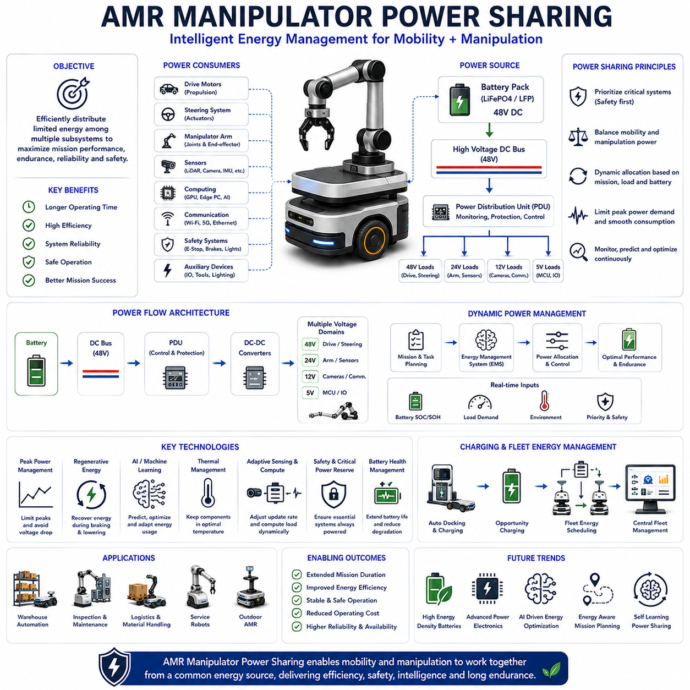
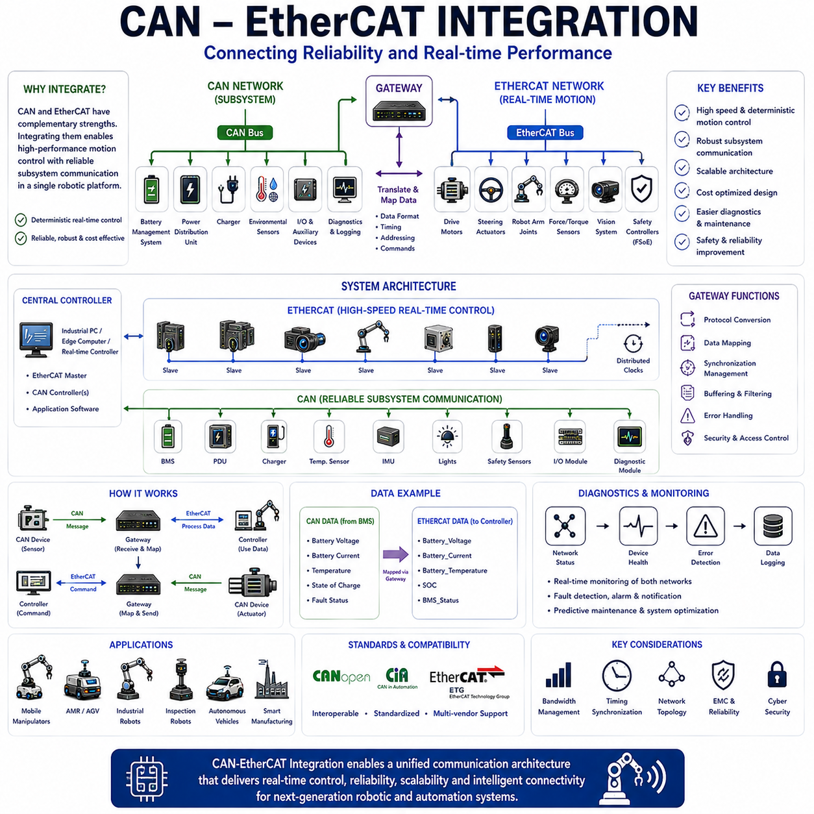
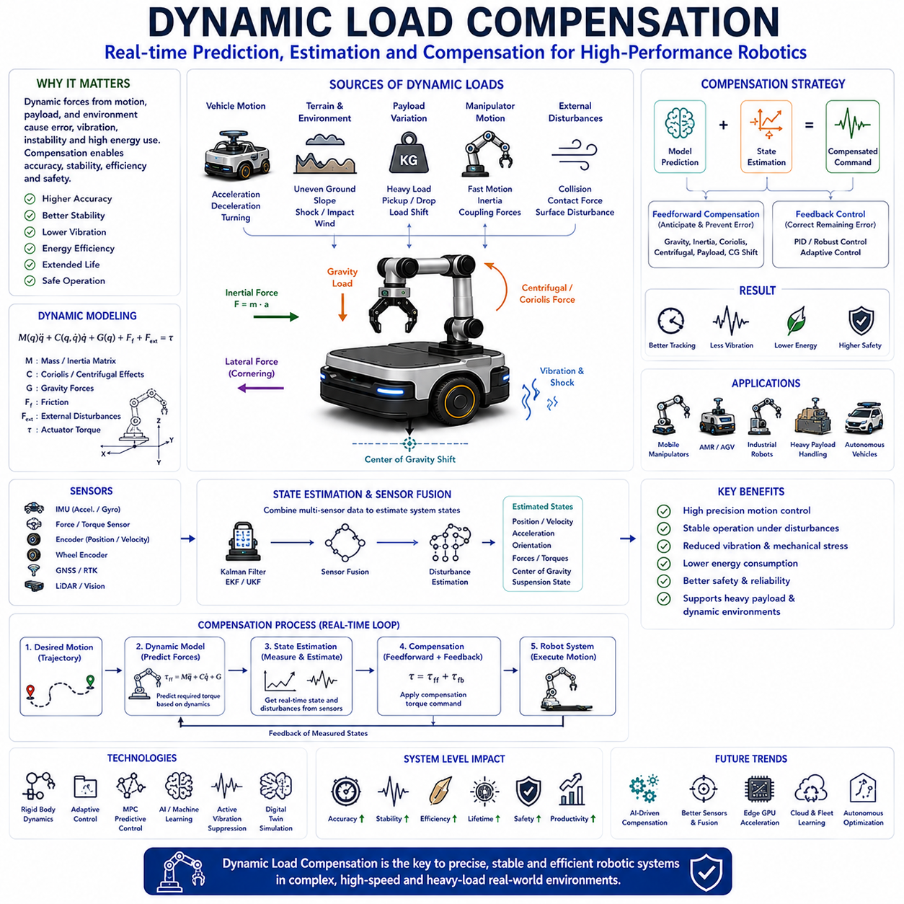
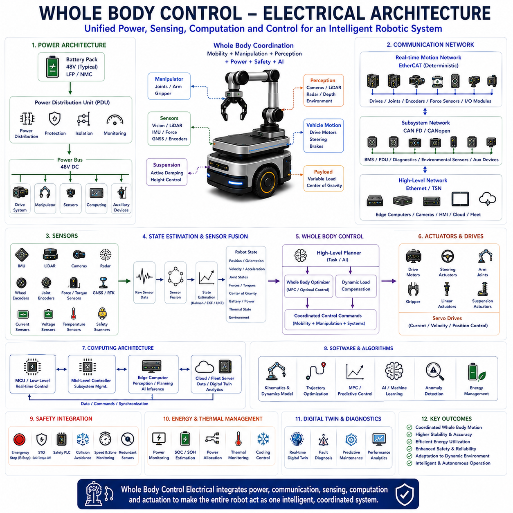
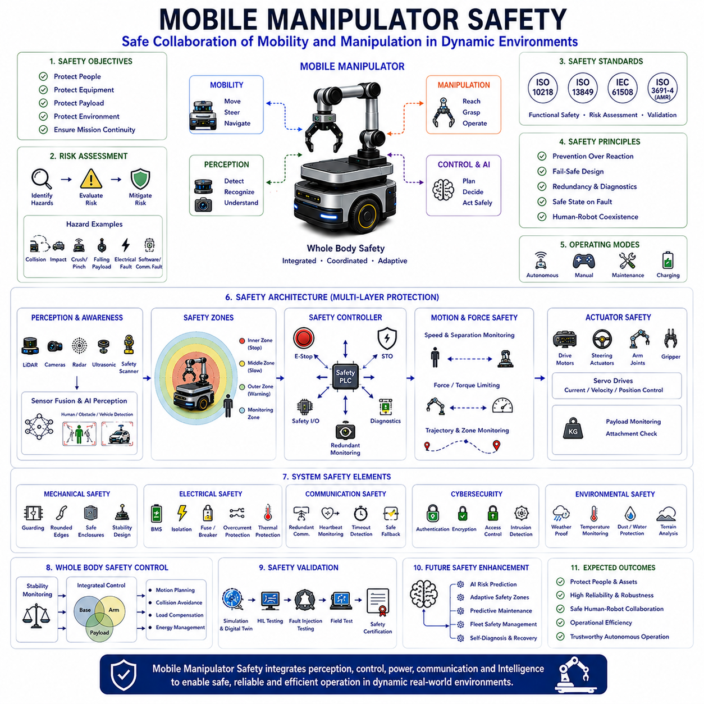

**Volume 14 Mobile Manipulator Architecture**

# Chapter 6. Mobile Base Integration

## 6.1 AMR Manipulator Power Sharing

{width="7.268055555555556in" height="7.268055555555556in"}

AMR Manipulator Power Sharing is a fundamental architectural concept in modern mobile robotics, autonomous mobile manipulators, warehouse automation systems, industrial inspection robots, service robots, logistics platforms, and Physical AI systems. As robotic platforms evolve beyond simple mobile transportation systems into highly capable autonomous workstations, the integration of robotic manipulators with Autonomous Mobile Robots (AMRs) introduces significant challenges in power generation, power distribution, power management, energy optimization, and system-level energy coordination. Effective power sharing architecture enables both mobility and manipulation subsystems to operate efficiently from a common energy source while maximizing operational endurance, reliability, safety, and mission performance.

Traditionally, AMRs and industrial robot manipulators were developed as separate systems. Mobile robots focused primarily on navigation and transportation, while robotic arms were fixed installations connected to stable industrial power infrastructure. As industries increasingly demand flexible automation, these two technologies are converging into a unified platform known as the mobile manipulator. In this architecture, a mobile base and a robotic arm operate together as a single intelligent machine capable of autonomous movement, object manipulation, inspection, assembly, maintenance, and interaction with the environment.

The integration of mobility and manipulation fundamentally changes energy consumption characteristics. Unlike stationary manipulators that receive unlimited external power, mobile manipulators must carry all required energy onboard. Every watt consumed by propulsion motors, steering systems, robotic joints, sensors, computers, communication systems, lighting devices, safety controllers, and peripheral equipment directly affects operating time and mission duration. Consequently, power sharing becomes a critical engineering discipline rather than a simple electrical design task.

The primary objective of AMR Manipulator Power Sharing is to distribute available electrical energy among multiple subsystems in a coordinated and intelligent manner. The architecture must ensure that essential systems remain operational while optimizing overall mission performance. Power sharing systems continuously balance energy demands between locomotion, manipulation, sensing, computing, communication, and safety functions according to operational priorities and battery conditions.

A typical AMR manipulator platform contains several major power consumers. The drive motors responsible for vehicle propulsion often represent one of the largest continuous power loads. Steering actuators, particularly in omnidirectional and four-wheel steering systems, introduce additional energy requirements. Robotic arm actuators consume substantial power during motion, payload handling, and precision positioning tasks. High-performance edge computers, GPUs, AI accelerators, LiDAR systems, cameras, radar sensors, wireless communication devices, and safety systems further contribute to total power demand.

The power architecture generally begins with a central battery system that serves as the primary energy source. Lithium Iron Phosphate batteries, commonly referred to as LFP batteries, have become widely adopted due to their safety, long cycle life, thermal stability, and cost effectiveness. Other chemistries such as Lithium Nickel Manganese Cobalt batteries may be used when higher energy density is required. Battery capacity selection directly influences operating duration, payload capacity, vehicle weight, charging strategy, and overall system economics.

The battery system typically supplies a high-voltage DC bus that distributes energy throughout the robot. Common architectures utilize 24V, 48V, 72V, or higher voltage buses depending on vehicle size and performance requirements. Larger outdoor AMRs and heavy-duty mobile manipulators often favor 48V architectures because they balance efficiency, safety, component availability, and power delivery capability.

Power distribution units serve as the central energy management hub within the robot. These units route electrical power to propulsion systems, manipulators, sensors, computers, communication equipment, safety devices, and auxiliary loads. Intelligent distribution systems monitor current, voltage, temperature, and energy consumption throughout the platform while providing protection against faults and overload conditions.

The propulsion subsystem often consumes the largest portion of total system energy during transportation tasks. Drive motor power requirements depend on vehicle mass, payload weight, acceleration profile, rolling resistance, terrain characteristics, slope gradients, and travel speed. Indoor warehouse robots may consume relatively modest propulsion power, while outdoor autonomous vehicles operating on rough terrain can require significantly greater energy.

Manipulator power consumption differs substantially from propulsion energy consumption. Robotic arms exhibit highly dynamic power profiles characterized by periods of intense activity followed by intervals of minimal energy usage. Joint motors consume power during acceleration, deceleration, payload lifting, force control, and trajectory execution. Static holding operations may also require continuous energy depending on actuator technology and mechanical design.

Power sharing becomes particularly important when propulsion and manipulation activities occur simultaneously. For example, a mobile manipulator performing dynamic inspection tasks while moving may require substantial power for both locomotion and arm operation. Without coordinated energy management, peak power demands could exceed battery capabilities, cause voltage instability, or reduce overall system reliability.

Dynamic power allocation strategies address these challenges by continuously adjusting power availability according to operational priorities. Mission planners, energy management systems, and supervisory controllers coordinate subsystem activities to ensure that available power resources are used efficiently. During high-demand manipulation tasks, vehicle speed may be reduced to limit propulsion energy consumption. Conversely, during long-distance travel, manipulator activity may be minimized to preserve battery capacity.

Peak power management represents a critical aspect of AMR Manipulator Power Sharing. Individual subsystems may occasionally require short-duration bursts of high power. Simultaneous peak demands from multiple systems can create electrical stress, increase battery degradation, and reduce system efficiency. Intelligent power management algorithms distribute loads over time, limit peak demand events, and smooth overall energy consumption profiles.

Power electronics play a central role in enabling efficient energy distribution. DC-DC converters transform battery voltage into levels required by individual subsystems. High-efficiency converters reduce energy losses and improve operating endurance. Multiple voltage domains are commonly required within a mobile manipulator. Propulsion motors may operate directly from the primary battery bus, while robotic arms, sensors, communication systems, and computing hardware often require lower voltages such as 24V, 12V, or 5V.

The robotic manipulator introduces unique power management requirements because actuator performance directly influences task capability. Servo motors, harmonic drive systems, cycloidal gearboxes, torque sensors, force control systems, and end-effectors all contribute to energy consumption. Efficient motion planning techniques can significantly reduce manipulator energy requirements by minimizing unnecessary acceleration, optimizing trajectories, and reducing static holding loads.

Regenerative energy recovery provides opportunities to improve overall system efficiency. During deceleration, descending motions, or controlled braking events, energy can be returned to the electrical system rather than dissipated as heat. Propulsion motors and robotic joints equipped with regenerative capabilities can contribute recovered energy back to the battery or DC bus. Although the total recovered energy may be modest, cumulative benefits become significant over extended operational periods.

Artificial intelligence increasingly contributes to power sharing optimization. AI-based energy management systems analyze mission requirements, operational history, battery state, environmental conditions, and predicted workload to optimize power allocation strategies. Machine learning models can forecast energy consumption, identify inefficient operating patterns, and recommend energy-saving behaviors. Such systems improve operational endurance while maintaining mission effectiveness.

Battery State of Charge monitoring is essential for effective power sharing. The energy management system continuously tracks available battery capacity and adjusts operational strategies accordingly. As battery charge decreases, non-essential functions may be restricted, travel speed may be reduced, computational workloads may be optimized, and mission priorities may be adjusted to preserve critical capabilities.

Battery State of Health monitoring further enhances long-term reliability. Battery aging affects capacity, internal resistance, charging behavior, and power delivery capability. Intelligent power sharing systems consider battery health information when determining allowable power levels and mission planning decisions. This approach extends battery lifespan and reduces maintenance costs.

Thermal management strongly influences power sharing performance. Electrical losses within batteries, motors, power electronics, computers, and communication equipment generate heat. Excessive temperatures reduce efficiency, accelerate component aging, and may trigger protective shutdown mechanisms. Coordinated thermal and power management strategies help maintain optimal operating conditions throughout the robot.

Safety considerations play a major role in power sharing architecture. Critical systems such as emergency stop circuits, safety controllers, obstacle detection sensors, communication systems, and braking mechanisms must remain operational under all conditions. Safety-related loads therefore receive the highest priority within the power allocation hierarchy. Even during low battery conditions, sufficient energy reserves must be maintained to support safe system operation.

Mobile manipulators operating in industrial environments often incorporate multiple computing platforms. High-performance GPUs may execute perception algorithms, AI inference workloads, digital twin simulations, and autonomous planning functions. Edge computers manage real-time control, sensor fusion, navigation, and communication. Because computing power consumption can be substantial, intelligent workload scheduling becomes an important component of energy optimization.

Sensor systems contribute significantly to overall power demand. LiDAR units, stereo cameras, depth sensors, radar modules, GNSS receivers, IMUs, force sensors, and environmental monitoring devices all require electrical energy. Adaptive sensing strategies can reduce power consumption by dynamically adjusting sensor update rates, operating modes, and processing intensity according to mission requirements.

Communication infrastructure also influences energy consumption. Wireless connectivity through Wi-Fi, private 5G, industrial Ethernet bridges, mesh networks, and cloud communication platforms requires continuous power. Intelligent communication management can reduce energy usage by optimizing transmission frequency, bandwidth utilization, and processing requirements.

Docking stations and automatic charging systems are closely connected to power sharing strategies. Modern mobile manipulators often return autonomously to charging stations when battery levels fall below predefined thresholds. Opportunity charging, where brief charging sessions occur during operational pauses, further extends mission duration and improves overall fleet productivity.

Fleet-level energy management introduces an additional layer of complexity. In multi-robot systems, centralized fleet management software coordinates charging schedules, mission assignments, and energy allocation across multiple platforms. Such coordination prevents charging bottlenecks, improves resource utilization, and maximizes operational efficiency.

Digital twin technology increasingly supports AMR Manipulator Power Sharing optimization. Virtual models simulate battery behavior, power consumption, thermal dynamics, mission execution, and energy distribution strategies before deployment. Engineers can evaluate design alternatives, optimize subsystem configurations, and validate operational concepts using simulation-driven methodologies.

Future developments in AMR Manipulator Power Sharing will likely focus on higher energy density batteries, intelligent power routing, adaptive energy management, AI-driven optimization, advanced power electronics, and integrated energy-aware mission planning. Solid-state batteries, high-efficiency converters, predictive energy models, and self-optimizing control systems will further improve performance and operational endurance.

As robotics continues advancing toward autonomous logistics, intelligent manufacturing, mobile manipulation, service automation, and Physical AI applications, AMR Manipulator Power Sharing will remain a foundational enabling technology. It serves as the invisible infrastructure that allows mobility, manipulation, perception, computation, and communication systems to operate harmoniously from a common energy source. Effective power sharing not only extends operational duration but also improves reliability, safety, efficiency, and mission success, making it one of the most important architectural considerations in next-generation mobile robotic systems.

## 6.2 CAN EtherCAT Integration

{width="7.268055555555556in" height="7.268055555555556in"}

CAN-EtherCAT Integration is one of the most important communication architecture concepts in modern robotics, industrial automation, autonomous mobile robots (AMRs), mobile manipulators, autonomous vehicles, intelligent manufacturing systems, and Physical AI platforms. As robotic systems become increasingly complex and distributed, multiple communication technologies must coexist within a single machine architecture. CAN (Controller Area Network) and EtherCAT (Ethernet for Control Automation Technology) are among the most widely adopted industrial communication protocols, each serving different operational requirements. Integrating these two networks effectively enables a robotic platform to achieve both deterministic real-time control and reliable subsystem communication while maintaining scalability, cost efficiency, and system reliability.

Historically, industrial control systems evolved around specialized fieldbus technologies designed to support distributed control architectures. CAN emerged as a robust and cost-effective communication protocol originally developed for automotive applications. Over time, its reliability, fault tolerance, and simplicity led to widespread adoption in industrial automation, robotics, medical equipment, agricultural machinery, and autonomous systems. EtherCAT emerged later as a high-performance industrial Ethernet technology designed to provide deterministic real-time communication with significantly higher bandwidth and synchronization accuracy than traditional fieldbus networks.

Modern robotic systems often contain subsystems with vastly different communication requirements. High-speed servo control systems require deterministic communication with update rates measured in microseconds or milliseconds. Motor controllers, torque sensors, force sensors, encoders, safety systems, and robotic joints often rely on tightly synchronized control loops. At the same time, battery management systems, environmental sensors, actuator controllers, diagnostic modules, power distribution units, and peripheral devices may only require moderate communication speeds and less stringent timing requirements. CAN-EtherCAT Integration allows engineers to allocate communication tasks according to the strengths of each protocol.

CAN is particularly well suited for distributed device communication where reliability, fault tolerance, and implementation simplicity are prioritized. The protocol uses a message-based architecture that allows multiple devices to share a common communication medium. CAN provides excellent electromagnetic interference resistance, robust error detection mechanisms, deterministic message arbitration, and relatively low implementation cost. These characteristics make it attractive for battery systems, power electronics, safety controllers, environmental monitoring systems, and auxiliary subsystems.

EtherCAT addresses different requirements. It provides extremely high communication performance with deterministic timing characteristics suitable for motion control applications. EtherCAT networks support distributed clocks, sub-microsecond synchronization, high-speed cyclic communication, and large-scale distributed control architectures. These capabilities make EtherCAT the preferred solution for servo drives, robotic manipulators, motion controllers, synchronized actuators, machine vision systems, and precision automation equipment.

The integration of CAN and EtherCAT creates a hierarchical communication architecture that combines the strengths of both technologies. In a typical mobile robot or mobile manipulator, EtherCAT serves as the real-time motion backbone, while CAN serves as a subsystem communication network. The EtherCAT network handles high-speed control loops for drive motors, steering actuators, robotic joints, force control systems, and safety-critical motion functions. The CAN network manages battery management systems, power distribution units, charging systems, environmental sensors, auxiliary devices, and diagnostic modules.

The communication architecture usually begins with a central control computer responsible for coordinating system operation. This controller may include an industrial PC, edge computing platform, real-time controller, or integrated robot control unit. The controller communicates with EtherCAT devices through an EtherCAT Master implementation while simultaneously interfacing with one or more CAN networks through dedicated CAN controllers or gateways.

The EtherCAT Master acts as the primary coordinator of real-time communication. It continuously exchanges cyclic process data with EtherCAT slave devices. Motion commands, position feedback, velocity information, torque measurements, sensor data, and synchronization signals flow through the EtherCAT network with highly deterministic timing. Distributed clock technology ensures precise synchronization across all connected devices.

CAN networks operate differently. Rather than relying on centralized polling mechanisms, CAN uses prioritized message arbitration. Devices transmit messages when necessary, and message priorities determine bus access. This architecture provides flexibility and robustness while minimizing communication overhead for less time-critical functions.

One of the most important components in CAN-EtherCAT Integration is the gateway. A CAN-EtherCAT Gateway serves as a communication bridge between the two protocols. The gateway translates data structures, timing requirements, communication formats, and addressing schemes between the networks. Through this mechanism, information originating from CAN devices becomes accessible to EtherCAT controllers and vice versa.

Gateways may be implemented as dedicated hardware modules, embedded communication processors, industrial controllers, or software-based communication services. The selection depends upon system complexity, performance requirements, reliability objectives, and cost constraints.

Data mapping is a critical aspect of CAN-EtherCAT Integration. Information generated by CAN devices must be converted into EtherCAT process data objects. Similarly, EtherCAT control commands may need to be translated into CAN messages. Proper mapping ensures that information remains consistent and available throughout the robotic system.

For example, a battery management system connected through CAN may continuously report battery voltage, current, temperature, state of charge, and fault status. These parameters are collected by the gateway and mapped into EtherCAT process variables accessible to the robot controller. The motion controller can then make energy-aware decisions based on real-time battery conditions.

Similarly, a power distribution unit connected through CAN may provide current measurements, fault indications, circuit breaker status, and thermal information. Integrating this data into the EtherCAT control environment allows centralized monitoring and diagnostics.

Mobile robots particularly benefit from CAN-EtherCAT Integration because they combine vehicle subsystems traditionally associated with automotive architectures and robotic subsystems requiring industrial motion control. Automotive components frequently utilize CAN communication because of its extensive industry adoption and mature ecosystem. Robotic manipulators, on the other hand, typically rely on EtherCAT due to its superior motion control capabilities.

A mobile manipulator therefore often contains both communication technologies. The vehicle platform may include battery systems, steering controllers, lighting modules, safety sensors, environmental monitoring devices, and charging interfaces operating on CAN. The robotic arm may include servo drives, encoders, force sensors, and motion controllers operating on EtherCAT. Integration creates a unified communication environment while preserving subsystem optimization.

Safety systems represent another important application area. Modern robotic platforms incorporate multiple layers of safety functionality including emergency stop circuits, safety laser scanners, collision detection systems, safe torque off functions, safety PLCs, and functional safety networks. Some safety devices communicate through CAN-based protocols such as CANopen Safety, while others utilize EtherCAT Safety over EtherCAT (FSoE). Integration enables coordinated safety management across heterogeneous network architectures.

Synchronization presents a significant technical challenge during integration. EtherCAT supports highly precise distributed clock synchronization, whereas traditional CAN networks do not inherently provide equivalent timing precision. Gateway architectures must therefore compensate for timing differences when transferring information between networks. Timestamping, buffering, synchronization algorithms, and scheduling mechanisms help maintain data consistency.

Bandwidth management is another important consideration. EtherCAT supports communication rates significantly higher than traditional CAN networks. When large quantities of data are transferred from EtherCAT to CAN, bandwidth limitations must be carefully managed. Intelligent filtering, data aggregation, event-driven communication, and prioritization strategies help prevent network congestion.

Diagnostic functionality is greatly enhanced through integrated communication architectures. Both CAN and EtherCAT provide diagnostic information regarding communication errors, device status, network health, synchronization quality, and operational conditions. By collecting diagnostics from both networks, engineers gain comprehensive visibility into system behavior. Centralized monitoring platforms can identify faults, predict failures, and improve maintenance effectiveness.

Industrial communication standards further simplify integration efforts. CANopen provides standardized device profiles and communication mechanisms for CAN networks. EtherCAT utilizes standardized object dictionaries, process data models, and configuration frameworks. Leveraging these standards reduces engineering effort and improves interoperability between devices from different manufacturers.

Cybersecurity considerations are becoming increasingly important as robotic systems become connected to enterprise networks, cloud platforms, and remote management services. Communication gateways represent potential security boundaries that must be protected against unauthorized access, malicious commands, and data manipulation. Secure communication architectures incorporate authentication, encryption, network segmentation, access control policies, and intrusion detection mechanisms.

Digital twin technologies benefit significantly from integrated communication infrastructures. Virtual representations of robotic systems require access to operational data originating from both CAN and EtherCAT devices. Integrated communication architectures provide a unified data source for simulation, monitoring, predictive maintenance, performance optimization, and lifecycle management applications.

Artificial intelligence increasingly utilizes information collected from both networks. Machine learning models may analyze motor performance data from EtherCAT devices alongside battery information, environmental conditions, and operational diagnostics originating from CAN networks. Such data fusion enables advanced predictive maintenance, anomaly detection, energy optimization, and autonomous decision-making capabilities.

In large-scale robotic systems, multiple CAN and EtherCAT networks may coexist. Distributed gateway architectures allow hierarchical communication structures supporting hundreds of devices across complex automation environments. Scalability becomes particularly important in intelligent factories, warehouse automation systems, autonomous logistics fleets, and industrial mobile robotics platforms.

Future developments in CAN-EtherCAT Integration will likely focus on tighter interoperability, higher performance gateways, enhanced cybersecurity, improved synchronization technologies, AI-assisted communication optimization, and seamless integration with cloud-native industrial architectures. Emerging standards and next-generation communication technologies may further simplify network convergence while preserving the strengths of existing protocols.

As robotics advances toward increasingly autonomous, intelligent, and interconnected systems, CAN-EtherCAT Integration will remain a fundamental architectural building block. It provides a practical and efficient mechanism for combining high-performance motion control with reliable distributed subsystem communication. By leveraging the complementary strengths of both technologies, robotic platforms can achieve superior scalability, reliability, maintainability, and operational performance. The successful integration of CAN and EtherCAT ultimately enables the creation of flexible, intelligent, and future-ready robotic systems capable of supporting the demanding requirements of modern automation and Physical AI applications.

## 6.3 Dynamic Load Compensation

{width="7.268055555555556in" height="7.268055555555556in"}

Dynamic Load Compensation is one of the most important technologies in modern robotics, autonomous mobile manipulators, industrial automation systems, collaborative robots, autonomous vehicles, intelligent manufacturing systems, and Physical AI platforms. As robotic systems become faster, more powerful, and increasingly autonomous, the effects of dynamic forces generated during motion become significant contributors to positioning error, vibration, instability, structural stress, energy consumption, and control performance degradation. Dynamic Load Compensation refers to the collection of modeling, sensing, estimation, and control techniques used to predict, counteract, and compensate for these dynamic effects in real time.

In an ideal robotic system, actuators generate precisely the forces and torques required to achieve desired motion trajectories. However, real-world systems operate under continuously changing dynamic conditions. Accelerating masses create inertial forces. Rotating components generate centrifugal and Coriolis effects. Payload variations alter system dynamics. Ground irregularities introduce disturbances. Structural flexibility causes vibration. External forces interact with robotic mechanisms. These factors collectively produce dynamic loads that must be compensated if high-performance operation is to be achieved.

Dynamic loads arise whenever mass experiences acceleration. According to Newtonian mechanics, force is proportional to mass multiplied by acceleration. As robots accelerate, decelerate, change direction, lift payloads, manipulate objects, or travel over uneven terrain, dynamic forces are generated throughout the mechanical structure. These forces propagate through joints, links, bearings, gearboxes, wheels, suspensions, and supporting structures. Without compensation, the resulting disturbances reduce control accuracy and increase mechanical wear.

In mobile robotic systems, dynamic loads originate from several sources. Vehicle acceleration generates longitudinal inertial forces. Steering maneuvers create lateral loads. Uneven terrain induces vertical impacts. Payload movement shifts the center of gravity. Manipulator motion introduces additional forces and moments. Environmental disturbances such as wind, collisions, or surface irregularities further complicate system behavior. Dynamic Load Compensation seeks to manage all of these effects simultaneously.

The significance of dynamic loading increases dramatically as robotic systems grow larger and faster. A small laboratory robot moving slowly may experience negligible dynamic effects. In contrast, a heavy outdoor Autonomous Mobile Robot carrying hundreds of kilograms while operating at high speed can generate substantial inertial forces. Similarly, robotic manipulators handling heavy payloads or executing rapid trajectories experience significant dynamic loading that directly influences precision and stability.

The foundation of Dynamic Load Compensation lies in dynamic system modeling. Engineers develop mathematical representations of robotic systems that describe relationships among mass, inertia, force, torque, velocity, acceleration, and external disturbances. These models provide the basis for predicting how the robot will respond to control inputs and environmental conditions.

Rigid body dynamics represents the most fundamental modeling approach. In this framework, robot components are treated as rigid objects connected through joints and constraints. Dynamic equations describe the motion of each component while accounting for inertia, gravitational effects, friction, and external forces. These equations enable controllers to anticipate dynamic behavior rather than merely reacting to observed errors.

Mass properties play a critical role in dynamic compensation. Every component possesses mass, center of gravity, and inertia characteristics. These properties determine how forces are distributed throughout the system during motion. Accurate mass modeling is particularly important in mobile manipulators where payloads change frequently. Even small inaccuracies in mass estimation can lead to significant compensation errors.

Center-of-gravity estimation is another essential element. As payloads are added, removed, lifted, or repositioned, the center of gravity of the robotic system changes continuously. These changes influence stability margins, wheel loading, suspension behavior, and actuator requirements. Dynamic compensation systems often incorporate real-time center-of-gravity estimation algorithms to maintain accurate system models.

Manipulator dynamics introduce additional complexity. Robotic arms consist of multiple moving links connected through actuated joints. Motion of one joint affects the dynamics of neighboring joints through coupling effects. Centrifugal forces, Coriolis forces, gravitational loading, and interaction torques all influence actuator requirements. Advanced compensation algorithms explicitly model these effects and incorporate them into control calculations.

Gravity compensation represents one of the simplest forms of dynamic compensation. Every robotic arm must continuously counteract gravitational forces acting on its links and payloads. By calculating gravitational torque requirements in advance, controllers can apply appropriate feedforward commands that reduce actuator effort and improve positioning accuracy.

Inertia compensation extends this concept by accounting for acceleration-induced forces. When a manipulator accelerates, additional torque is required to overcome inertia. Dynamic models estimate these requirements and generate compensating commands before errors occur. This feedforward approach improves trajectory tracking and reduces control lag.

Coriolis and centrifugal compensation become increasingly important at higher speeds. Rotating systems generate complex interaction forces that can significantly influence motion behavior. These forces are nonlinear and depend upon joint velocities and configurations. Modern robot controllers routinely calculate and compensate for these effects in real time.

Mobile manipulators present unique dynamic challenges because both the vehicle and the manipulator contribute to overall system behavior. Motion of the robotic arm influences vehicle stability. Vehicle acceleration affects manipulator positioning accuracy. Payload movement shifts weight distribution. Dynamic Load Compensation therefore requires coordinated modeling and control across multiple subsystems.

Suspension systems play an important role in outdoor mobile robots. Uneven terrain generates continuous disturbances that propagate through the vehicle structure. Suspension components absorb impacts and reduce vibration transmission, but residual motion still affects sensors, manipulators, and perception systems. Compensation algorithms often incorporate suspension state estimation to improve overall system performance.

Vibration suppression represents another major application of Dynamic Load Compensation. Structural flexibility causes oscillatory behavior whenever dynamic loads are applied. Vibrations reduce positioning accuracy, degrade sensor performance, accelerate fatigue damage, and decrease operational efficiency. Compensation techniques may include active damping, adaptive filtering, resonance avoidance, structural optimization, and feedback control.

Sensor technology forms the foundation of modern compensation systems. Inertial Measurement Units provide acceleration and angular velocity measurements. Force-torque sensors measure interaction forces. Encoders monitor joint positions and velocities. Wheel sensors track vehicle motion. GNSS systems provide global positioning data. LiDAR and vision systems contribute environmental awareness. These sensor inputs enable real-time estimation of dynamic conditions.

State estimation algorithms integrate sensor information to generate accurate representations of system behavior. Kalman filters, Extended Kalman Filters, Unscented Kalman Filters, particle filters, and sensor fusion frameworks combine multiple data sources to estimate positions, velocities, accelerations, forces, and disturbances. Accurate state estimation is essential for effective compensation.

Feedforward control is widely used in Dynamic Load Compensation. Rather than waiting for errors to occur, feedforward controllers predict required actuator commands based on dynamic models. This anticipatory approach significantly improves tracking performance, particularly during rapid motion or high-load conditions.

Feedback control remains equally important. No dynamic model is perfect, and unexpected disturbances inevitably occur. Feedback controllers continuously monitor system behavior and correct residual errors. Combining feedforward compensation with feedback stabilization provides robust performance across diverse operating conditions.

Model-based control techniques such as Computed Torque Control explicitly incorporate dynamic equations into the control process. These methods calculate actuator commands based on predicted system dynamics, enabling highly accurate trajectory tracking. Such approaches are common in industrial manipulators, humanoid robots, and high-performance automation systems.

Adaptive control further enhances compensation capabilities by continuously updating model parameters during operation. As payloads change, components wear, temperatures vary, or environmental conditions shift, adaptive controllers modify compensation strategies accordingly. This adaptability improves long-term performance and reduces sensitivity to modeling errors.

Artificial intelligence is increasingly transforming Dynamic Load Compensation. Machine learning models can identify dynamic patterns that are difficult to capture using traditional analytical methods. Neural networks, reinforcement learning systems, and data-driven models learn complex relationships among system states, actuator commands, and dynamic responses. AI-based compensation systems continuously improve through operational experience.

Predictive algorithms extend compensation beyond immediate control actions. By forecasting future motion requirements, system states, and environmental conditions, predictive controllers optimize actuator commands over extended time horizons. Model Predictive Control has become particularly attractive for mobile manipulators and autonomous vehicles operating in complex environments.

Energy efficiency benefits significantly from Dynamic Load Compensation. Uncompensated systems often require excessive actuator effort to overcome dynamic disturbances. Accurate compensation reduces unnecessary energy consumption, lowers thermal loading, and improves overall efficiency. For battery-powered mobile robots, these benefits directly translate into extended operational endurance.

Safety considerations are closely linked to dynamic compensation. Sudden dynamic loads may compromise stability, exceed actuator limits, damage payloads, or create hazardous operating conditions. Compensation systems continuously monitor dynamic conditions and enforce operational constraints that maintain safe system behavior.

Heavy payload handling represents one of the most demanding applications. Large payloads dramatically alter system dynamics, increase inertia, shift centers of gravity, and amplify structural loading. Dynamic compensation enables robots to maintain accuracy and stability despite these changing conditions. This capability is essential in manufacturing, logistics, construction, and industrial automation environments.

Outdoor Autonomous Mobile Robots face particularly challenging dynamic environments. Rough terrain, slopes, obstacles, weather conditions, and variable payloads generate complex disturbance profiles. Dynamic Load Compensation enables stable navigation, reliable perception, accurate manipulation, and safe operation under these demanding conditions.

Digital twin technologies increasingly support dynamic compensation development. High-fidelity simulation environments model system dynamics, structural behavior, sensor responses, and control algorithms. Engineers can evaluate compensation strategies, validate designs, and optimize performance before deploying physical systems. Digital twins also support online model updates throughout the operational lifecycle.

Cyber-physical integration further enhances compensation capabilities. Connected robotic systems can share operational data, update dynamic models remotely, receive software improvements, and benefit from fleet-wide learning. Such architectures enable continuous performance improvement across large populations of robotic systems.

Future Dynamic Load Compensation technologies will likely combine physics-based models, AI-driven prediction, adaptive control, digital twin synchronization, and distributed sensing into unified intelligent control frameworks. Advanced edge computing platforms, high-performance GPUs, real-time AI inference engines, and increasingly sophisticated sensor systems will enable compensation capabilities far beyond current implementations.

As robotics advances toward autonomous logistics, intelligent manufacturing, mobile manipulation, autonomous inspection, service robotics, and Physical AI systems, Dynamic Load Compensation will remain a foundational enabling technology. By continuously predicting, estimating, and compensating for the forces generated by motion and environmental interaction, it allows robotic systems to achieve higher accuracy, greater stability, improved efficiency, enhanced safety, and superior operational performance. Dynamic Load Compensation ultimately serves as the bridge between theoretical robotic motion and reliable real-world execution, making it indispensable for next-generation intelligent robotic platforms.

## 6.4 Whole Body Control Electrical

{width="7.268055555555556in" height="7.268055555555556in"}

Whole Body Control Electrical refers to the integrated electrical control architecture that coordinates every electromechanical subsystem within a robotic platform as a unified dynamic system. In modern robotics, especially autonomous mobile manipulators, industrial service robots, humanoid robots, outdoor autonomous vehicles, logistics robots, and Physical AI platforms, the robot can no longer be viewed as a collection of independent actuators and sensors. Instead, the entire machine must behave as a single coordinated entity capable of balancing mobility, manipulation, perception, communication, power management, safety, and artificial intelligence functions simultaneously. Whole Body Control Electrical provides the electrical, communication, computational, and control framework necessary to achieve this integration.

Historically, robotic systems were developed using subsystem-oriented architectures. Drive motors, steering systems, robotic arms, sensors, and controllers were often designed independently and connected through relatively simple interfaces. Such architectures were sufficient for fixed industrial robots operating in highly structured environments. However, as robots became mobile, autonomous, collaborative, and capable of performing complex tasks in dynamic environments, independent subsystem control became insufficient. Motion generated by one subsystem inevitably influences the behavior of others. A robotic arm lifting a payload changes vehicle stability. Vehicle acceleration affects arm positioning accuracy. Sensor placement influences perception quality. Energy consumption in one subsystem impacts the availability of power elsewhere. Whole Body Control emerged as a solution to these challenges.

The electrical aspect of Whole-Body Control focuses on coordinating all electrical devices, power flows, communication networks, sensing systems, actuators, embedded computers, and safety mechanisms as part of a unified control architecture. Rather than treating individual components separately, the system continuously evaluates the state of the entire robot and generates coordinated control actions that optimize overall performance.

At the highest-level, Whole-Body Control Electrical can be viewed as the nervous system of an intelligent robotic platform. Just as the biological nervous system coordinates muscles, sensory organs, and cognitive functions, the electrical architecture coordinates actuators, sensors, computing resources, communication systems, and energy resources throughout the robot. This coordination enables smooth, efficient, safe, and intelligent operation.

The foundation of Whole-Body Control Electrical begins with the electrical power architecture. Every robotic subsystem depends on electrical energy, and power distribution directly influences control performance. The electrical system typically originates from a centralized battery pack or power source. Lithium Iron Phosphate batteries, Lithium Nickel Manganese Cobalt batteries, fuel cells, hybrid power systems, or industrial power supplies may serve as the primary energy source depending on application requirements.

The main power bus distributes electrical energy throughout the robot. Common voltage levels include 24V, 48V, 72V, and higher-voltage architectures. Large outdoor robots and autonomous vehicles often favor 48V systems because they provide a balance between efficiency, safety, and power delivery capability. Humanoid robots and high-performance manipulators may employ multiple voltage domains to support diverse subsystem requirements.

Power Distribution Units serve as the central electrical backbone. These units manage current flow, voltage regulation, fault protection, power monitoring, and subsystem isolation. Whole Body Control relies heavily on accurate power information because actuator performance, battery condition, and thermal limitations directly influence control decisions.

The actuator network forms the muscular system of the robot. Drive motors, steering actuators, robotic joints, grippers, linear actuators, suspension systems, and auxiliary motion devices all belong to this network. Whole Body Control Electrical coordinates these devices through high-speed communication networks and synchronized control loops.

Servo drives play a particularly important role. Modern servo systems incorporate motor controllers, current loops, velocity loops, position loops, torque estimation algorithms, diagnostics, and communication interfaces. These intelligent devices continuously exchange information with centralized controllers. Whole Body Control utilizes this information to coordinate motion across the entire robot rather than controlling each actuator independently.

Communication infrastructure represents one of the most critical elements of Whole-Body Control Electrical. Modern robots may contain dozens or hundreds of distributed devices. Real-time communication protocols such as EtherCAT, CAN FD, CANopen, PROFINET, EtherNet/IP, TSN Ethernet, and IO-Link provide the connectivity required for synchronized operation.

EtherCAT is particularly well suited for Whole Body Control because it supports deterministic communication, distributed clocks, sub-microsecond synchronization, and high-speed cyclic data exchange. These capabilities enable coordinated control across multiple joints, wheels, steering actuators, and sensors.

CAN networks often support subsystem communication functions including battery management, environmental sensing, diagnostic reporting, power electronics monitoring, and auxiliary device control. The integration of EtherCAT and CAN networks creates a hierarchical communication architecture capable of supporting both high-speed motion control and reliable subsystem management.

Sensor systems provide the information required for coordinated control. Whole Body Control depends on accurate knowledge of robot state, environmental conditions, actuator behavior, and task execution status. Sensor architectures may include encoders, force-torque sensors, IMUs, GNSS receivers, LiDAR systems, stereo cameras, depth cameras, radar sensors, wheel encoders, temperature sensors, voltage monitors, current sensors, and safety scanners.

Sensor fusion is fundamental to Whole Body Control Electrical. No single sensor can fully describe the state of a complex robotic system. Multiple sensor streams must be combined to generate an accurate representation of the robot and its environment. Kalman filters, Extended Kalman Filters, Unscented Kalman Filters, particle filters, and AI-based estimation methods are frequently employed to achieve robust state estimation.

State estimation forms the informational foundation of the control system. The controller continuously estimates robot position, orientation, velocity, acceleration, joint states, payload characteristics, wheel slip conditions, battery status, thermal conditions, and environmental constraints. These estimates enable informed decision-making throughout the control hierarchy.

Computing architecture plays an increasingly important role in Whole Body Control Electrical. Modern robotic systems typically employ multiple computational layers. Low-level microcontrollers manage actuator control loops. Mid-level controllers coordinate subsystems. High-performance edge computers execute perception, planning, AI inference, and optimization algorithms. Cloud-based services may provide fleet management, data analytics, digital twin synchronization, and large-scale learning capabilities.

Distributed computing architectures improve scalability and fault tolerance. Rather than concentrating all computation within a single controller, processing responsibilities are distributed across specialized devices. This approach reduces communication latency, improves reliability, and enables modular system design.

Motion coordination represents one of the primary objectives of Whole Body Control. Traditional control architectures often separate vehicle motion from manipulator control. Whole Body Control treats the robot as a unified kinematic and dynamic system. Vehicle motion, arm motion, suspension behavior, payload dynamics, and environmental interactions are coordinated simultaneously.

For example, when a mobile manipulator lifts a heavy object, the controller may automatically adjust wheel torque, suspension settings, arm trajectory, and vehicle posture to maintain stability. Such coordinated behavior would be difficult or impossible using independent subsystem controllers.

Dynamic Load Compensation is closely integrated with Whole Body Control Electrical. Motion generated by one subsystem creates forces that affect others. Acceleration produces inertial loads. Manipulator motion shifts the center of gravity. Terrain disturbances generate vibration. Whole Body Control continuously predicts and compensates for these effects through coordinated actuator commands.

Energy management represents another critical component. Mobile robots operate under limited energy budgets. Whole Body Control continuously monitors battery state, subsystem power consumption, thermal conditions, and mission requirements. Power allocation decisions are optimized across mobility, manipulation, sensing, computation, and communication functions.

Thermal management is increasingly important as robotic systems become more computationally intensive. Motors, power electronics, batteries, GPUs, CPUs, and communication devices all generate heat. Whole Body Control Electrical incorporates thermal information into operational decisions. Motion speeds, AI workloads, charging behavior, and cooling systems may be adjusted dynamically to maintain safe operating temperatures.

Safety integration forms a central requirement of Whole Body Control. Modern robots must comply with functional safety standards while operating in proximity to humans and valuable equipment. Safety systems include emergency stop circuits, safe torque off functions, safety PLCs, collision avoidance systems, speed monitoring functions, and redundant sensing architectures.

Whole Body Control coordinates safety mechanisms with operational objectives. Rather than functioning as isolated systems, safety devices become integrated components of the overall control architecture. This integration enables more intelligent and adaptive safety behavior.

Artificial intelligence is increasingly incorporated into Whole Body Control Electrical. Machine learning models analyze sensor data, predict system behavior, optimize trajectories, estimate loads, detect anomalies, and improve energy efficiency. Reinforcement learning algorithms may learn control policies that maximize performance while respecting safety and operational constraints.

Predictive control techniques further enhance performance. Model Predictive Control evaluates future system behavior over a finite prediction horizon and optimizes control actions accordingly. This approach is particularly valuable for mobile manipulators operating in dynamic environments where multiple constraints must be satisfied simultaneously.

Digital twin technology is becoming an important tool for Whole Body Control development and operation. High-fidelity virtual models simulate robot dynamics, electrical behavior, communication performance, thermal conditions, and control strategies. Digital twins enable design optimization, predictive maintenance, fault diagnosis, and operational planning.

In large-scale autonomous fleets, Whole Body Control extends beyond individual robots. Fleet management systems coordinate multiple robots, charging stations, infrastructure devices, and cloud services. Shared information improves efficiency, safety, and resource utilization across the entire operational ecosystem.

Humanoid robots represent one of the most demanding applications of Whole Body Control Electrical. Walking, balancing, manipulation, perception, communication, and interaction must be coordinated simultaneously. Every joint influences overall stability and task performance. Whole Body Control enables these complex behaviors by treating the entire robot as a unified electromechanical organism.

Outdoor Autonomous Mobile Robots introduce additional challenges. Rough terrain, variable weather, changing payloads, uneven surfaces, and unpredictable environmental conditions require highly adaptive control strategies. Whole Body Control Electrical enables coordinated responses to these disturbances while maintaining mission performance.

Future developments in Whole Body Control Electrical will likely focus on tighter integration of AI, real-time digital twins, distributed intelligence, edge-cloud cooperation, advanced sensor fusion, adaptive control, energy-aware optimization, and autonomous self-diagnosis. Robots will increasingly monitor their own electrical, mechanical, thermal, and operational conditions while continuously adapting control strategies to changing circumstances.

As robotics advances toward Physical AI, autonomous logistics, intelligent manufacturing, autonomous inspection, service robotics, humanoid platforms, and large-scale robotic ecosystems, Whole Body Control Electrical will become one of the defining technologies of next-generation intelligent machines. It serves as the unified electrical and computational framework that transforms a collection of motors, sensors, batteries, computers, and communication devices into a coordinated robotic system capable of intelligent, efficient, safe, and adaptive behavior in complex real-world environments.

EtherCAT

CAN FD

CANopen

PROFINET

EtherNet/IP

TSN Ethernet

IO-Link

Encoder

Force-Torque Sensor

IMU

GNSS RTK

LiDAR

Stereo Camera

Depth Camera

Radar

Wheel Encoder

Current Sensor

Voltage Sensor

Temperature Sensor

SOC(State of Charge)

SOH(State of Health)

GPU

CPU

STO(Safe Torque Off)

## 6.5 Mobile Manipulator Safety

{width="7.268055555555556in" height="7.268055555555556in"}

Mobile Manipulator Safety is one of the most critical disciplines in modern robotics because it combines the safety challenges of both autonomous mobile robots and robotic manipulators into a single integrated system. A mobile manipulator is fundamentally different from a traditional industrial robot because it possesses the ability to move through an environment while simultaneously performing manipulation tasks. This combination introduces complex interactions among mobility, manipulation, perception, control, communication, power systems, environmental conditions, and human operators. Ensuring safe operation requires a comprehensive safety architecture that spans mechanical design, electrical systems, software control, communication networks, artificial intelligence, and operational procedures.

Traditional industrial robots typically operate inside fenced work cells where human access is restricted. Safety is achieved primarily through physical separation between humans and robots. Mobile manipulators, however, are designed to share environments with humans, vehicles, equipment, and other robots. Warehouses, factories, hospitals, airports, logistics centers, construction sites, agricultural fields, and public facilities increasingly deploy mobile manipulators to perform autonomous tasks. In these environments, physical separation is often impractical. Consequently, safety must be built directly into the robot itself.

The fundamental objective of Mobile Manipulator Safety is to prevent injury to people, damage to equipment, loss of payload, environmental harm, and operational failures while maintaining productive robot operation. This objective must be achieved despite dynamic environments, uncertain conditions, changing tasks, and continuous interaction between multiple system components.

Mobile manipulators introduce unique safety challenges because they possess two major sources of motion. The mobile base generates translational and rotational movement throughout the workspace, while the manipulator arm generates multi-axis motion relative to the mobile platform. These two motion systems interact continuously, creating a highly dynamic operating environment. A safety strategy that addresses only vehicle motion or only arm motion is insufficient. Instead, safety must consider the behavior of the entire robot as a unified system.

Risk assessment forms the foundation of Mobile Manipulator Safety. Every application must begin with a systematic analysis of hazards associated with robot operation. Engineers identify potential hazards, estimate the likelihood of occurrence, evaluate potential consequences, and determine appropriate mitigation strategies. Hazards may arise from collision, crushing, pinching, impact, falling payloads, electrical faults, software failures, communication disruptions, sensor malfunctions, environmental conditions, or unexpected human behavior.

Hazard identification must consider all operating modes. Autonomous operation, manual control, maintenance activities, emergency recovery procedures, charging operations, software updates, and transportation activities each introduce unique risks. A complete safety assessment evaluates both normal operation and abnormal conditions.

Functional safety plays a central role in mobile manipulator design. Functional safety focuses on ensuring that control systems respond correctly to faults and maintain safe operation under failure conditions. International standards provide frameworks for designing, validating, and certifying safety functions. Safety architectures often incorporate redundancy, fault detection, diagnostics, safe-state transitions, and fail-safe behavior.

Safety functions are implemented through multiple layers of protection. Emergency stop systems provide immediate motion cessation when hazardous conditions are detected. Safe torque off functions remove power from actuators while maintaining electrical integrity. Safety controllers monitor critical parameters and coordinate protective actions. Redundant sensing systems increase fault tolerance and improve reliability.

Collision avoidance represents one of the most visible safety functions. Mobile manipulators must continuously monitor their surroundings to detect people, vehicles, obstacles, equipment, and environmental hazards. Sensor technologies such as LiDAR, stereo cameras, depth cameras, radar systems, ultrasonic sensors, and safety laser scanners provide environmental awareness. Sensor fusion algorithms combine information from multiple sources to generate accurate representations of surrounding conditions.

The safety perception system must distinguish among different object types and determine appropriate responses. Human detection is particularly important because humans often behave unpredictably. Modern safety systems increasingly employ artificial intelligence to recognize human posture, movement intent, and proximity. Such capabilities enable more adaptive and context-aware safety behavior.

Protective zones are commonly used to manage interaction between robots and humans. Multiple safety zones may surround the mobile manipulator. Outer zones provide early warning and trigger speed reduction. Intermediate zones impose stricter operational limits. Inner zones activate emergency stopping mechanisms when immediate collision risk is detected. Dynamic safety zones may adapt based on robot speed, payload characteristics, manipulator configuration, and environmental conditions.

Speed and separation monitoring is a key concept in collaborative robotics. The robot continuously calculates safe operating speeds based on measured distances to nearby humans and obstacles. As separation distances decrease, motion speeds are reduced proportionally. This approach enables productive collaboration while maintaining acceptable risk levels.

Manipulator safety introduces additional complexities beyond vehicle safety. Robotic arms may create pinch points, crushing hazards, entanglement risks, and impact hazards. Multiple joints moving simultaneously generate complex motion paths that may be difficult for humans to predict. Safety systems therefore monitor manipulator position, velocity, acceleration, force, and torque continuously.

Force-limited operation provides one approach for reducing injury risk. Collaborative manipulators often incorporate torque sensing, force sensing, and compliance control mechanisms that limit interaction forces during unintended contact. When excessive forces are detected, motion is slowed or stopped automatically.

Payload safety is another critical consideration. Mobile manipulators frequently transport, lift, inspect, or manipulate objects of varying size, weight, and geometry. Payload loss can create significant hazards. Gripper systems, vacuum systems, tool changers, and attachment mechanisms must be designed to prevent unintended release. Payload monitoring systems verify secure attachment and detect abnormal conditions.

Center-of-gravity management is essential for maintaining stability. Manipulator motion and payload handling continuously alter weight distribution throughout the robot. Improper weight distribution may increase rollover risk, reduce traction, and compromise braking performance. Safety controllers monitor stability margins and restrict motion when unsafe conditions are detected.

Rollover prevention becomes particularly important for outdoor robots and heavy-duty mobile manipulators. Uneven terrain, slopes, sudden acceleration, rapid turning, and elevated payloads all contribute to rollover risk. Stability monitoring systems estimate center of gravity, support polygon geometry, inertial loading, and terrain conditions in real time. Control systems automatically limit motion to maintain safe stability margins.

Electrical safety represents a foundational element of Mobile Manipulator Safety. Modern robotic platforms contain high-energy battery systems, power electronics, motor drives, computing hardware, communication devices, and sensor networks. Electrical hazards include shock, arc faults, overheating, short circuits, insulation failures, battery thermal runaway, and electromagnetic interference.

Battery safety has become increasingly important as high-capacity lithium battery systems are widely adopted. Battery management systems continuously monitor voltage, current, temperature, state of charge, and state of health. Protective mechanisms prevent overcharging, over-discharging, overcurrent conditions, and thermal instability. Fault isolation mechanisms help prevent propagation of failures throughout the electrical system.

Communication safety is often overlooked but critically important. Mobile manipulators depend on communication among controllers, sensors, actuators, safety devices, and external infrastructure. Communication failures can compromise system awareness and control capability. Safety architectures therefore include redundant communication channels, heartbeat monitoring, timeout detection, and safe fallback strategies.

Cybersecurity is becoming an increasingly important component of safety. Unauthorized access, malicious software, communication spoofing, and cyber attacks may create physical safety hazards. Secure communication protocols, authentication mechanisms, encryption technologies, access control systems, and intrusion detection tools help protect robotic platforms against cyber threats.

Environmental safety considerations vary significantly across applications. Indoor robots may encounter pedestrians, forklifts, shelving systems, and confined spaces. Outdoor robots must contend with weather, terrain variability, lighting changes, dust, rain, snow, and temperature extremes. Safety systems must maintain effectiveness under all anticipated environmental conditions.

Human-machine interaction represents one of the most challenging aspects of Mobile Manipulator Safety. Humans often behave unpredictably and may not fully understand robot capabilities or limitations. Clear visual indicators, audible warnings, status displays, lighting systems, and intuitive interaction methods help improve situational awareness. Robots should communicate their intentions whenever possible.

Artificial intelligence is increasingly integrated into safety systems. Machine learning algorithms improve object recognition, anomaly detection, human behavior prediction, and environmental understanding. However, AI introduces new safety challenges because learned behaviors may be difficult to predict or verify. Safety-critical functions typically remain under deterministic supervisory control even when AI contributes to perception and planning.

Whole Body Control plays an important role in safety. Rather than treating the mobile base and manipulator separately, Whole Body Safety considers the robot as a unified dynamic system. Motion planning, collision avoidance, force control, stability management, energy management, and environmental awareness are coordinated simultaneously. This integrated approach improves both safety and operational efficiency.

Dynamic Load Compensation contributes directly to safety performance. Uncompensated dynamic forces may reduce stability, increase structural stress, and compromise trajectory accuracy. By predicting and compensating for inertial effects, vibration, payload dynamics, and external disturbances, Dynamic Load Compensation improves control reliability and reduces safety risks.

Safety validation is essential before deployment. Testing procedures evaluate normal operation, fault conditions, emergency responses, environmental robustness, communication failures, sensor degradation, power system faults, and human interaction scenarios. Validation may involve simulation, hardware-in-the-loop testing, digital twins, field trials, and formal safety assessments.

Digital twin technologies increasingly support safety engineering. High-fidelity simulation environments enable engineers to evaluate hazardous scenarios that would be difficult, expensive, or dangerous to reproduce physically. Digital twins facilitate risk analysis, controller validation, fault injection testing, and performance optimization.

Predictive safety systems represent an emerging trend. Rather than reacting only after hazards are detected, predictive systems anticipate future risks based on robot motion, environmental conditions, human behavior, and operational context. Predictive safety enables earlier intervention and smoother operation.

Fleet safety introduces additional complexity when multiple mobile manipulators operate within the same environment. Fleet management systems coordinate traffic flow, task allocation, charging operations, and shared workspace utilization. Inter-robot communication and centralized supervision help prevent collisions and resource conflicts.

Future Mobile Manipulator Safety architectures will likely combine advanced sensing, artificial intelligence, digital twins, predictive analytics, distributed safety intelligence, and adaptive control into highly integrated safety ecosystems. Real-time risk assessment, autonomous hazard mitigation, self-diagnosis, and self-recovery capabilities will further improve operational safety and reliability.

As robotics expands into logistics, manufacturing, healthcare, construction, agriculture, infrastructure inspection, service automation, and Physical AI applications, Mobile Manipulator Safety will remain one of the most important enabling technologies. Safe operation is not merely a regulatory requirement; it is a prerequisite for trust, adoption, scalability, and long-term success. By integrating mechanical safety, electrical safety, functional safety, cybersecurity, environmental awareness, and intelligent control into a unified framework, Mobile Manipulator Safety enables robots to operate effectively and responsibly within complex real-world environments while protecting people, assets, and mission objectives.

LiDAR

Stereo Camera

Depth Camera

Radar

Ultrasonic Sensor

Safety Laser Scanner

HMI(Human Machine Interface)

HIL(Hardware-in-the-Loop)
