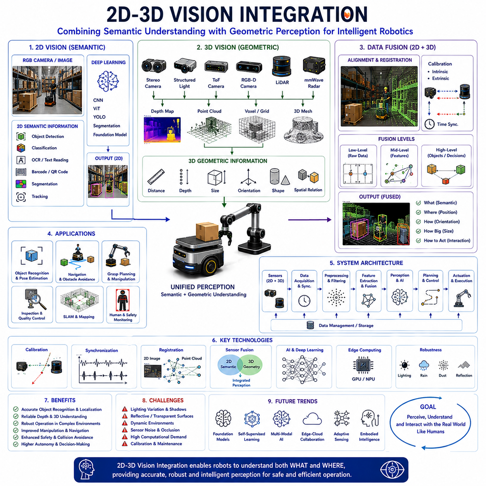
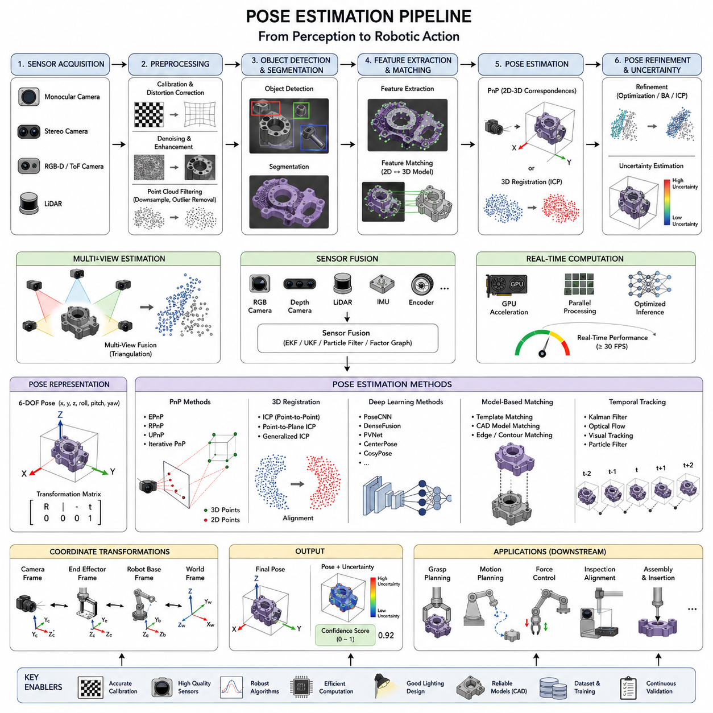
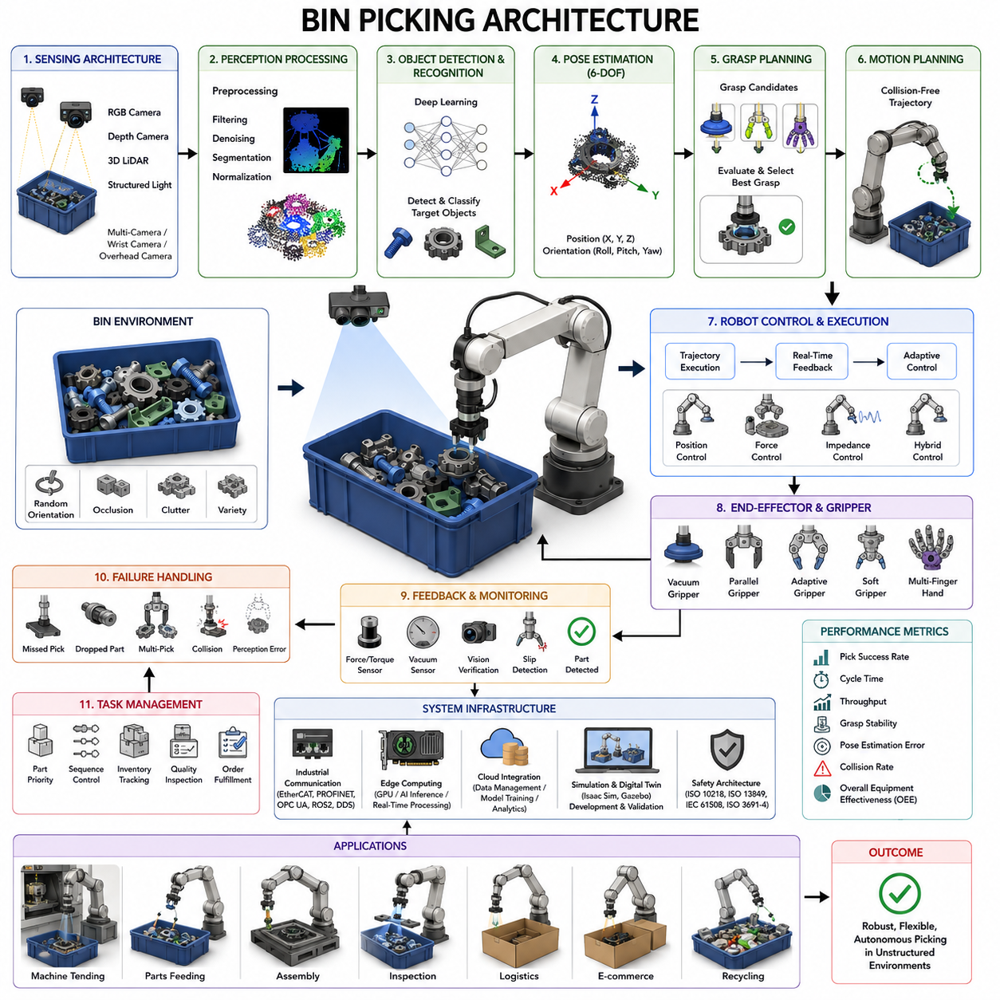
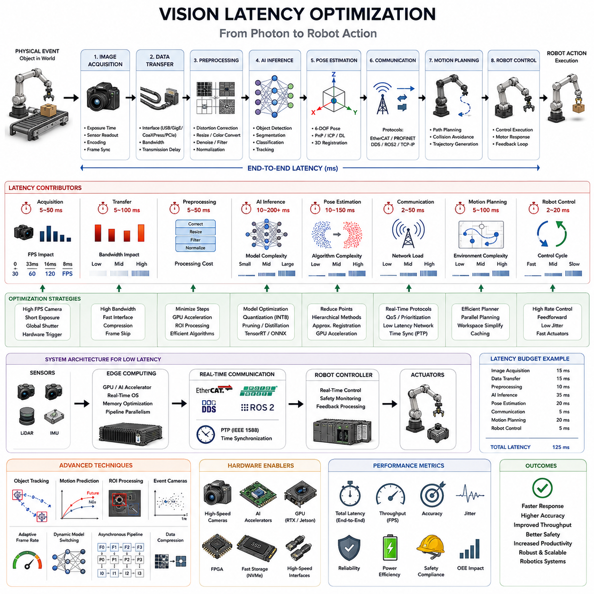
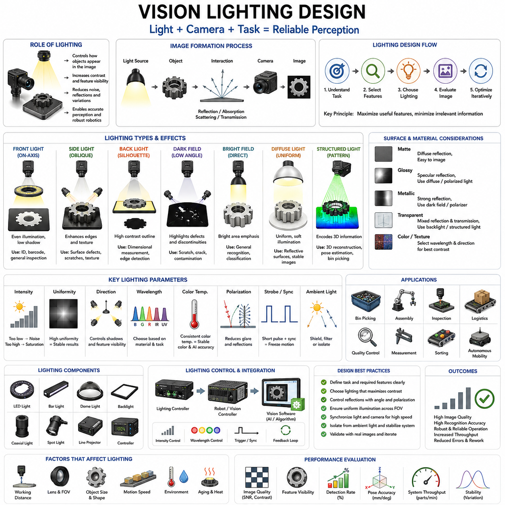

**Volume 14 Mobile Manipulator Architecture**

# Chapter 7. Vision Guided Robotics

## 7.1 2D 3D Vision Integration

{width="7.268055555555556in" height="7.268055555555556in"}

2D and 3D Vision Integration is one of the most fundamental perception technologies in modern robotics, autonomous mobile robots, mobile manipulators, industrial automation systems, autonomous vehicles, intelligent inspection platforms, warehouse robots, service robots, and Physical AI systems. The ability to understand both the appearance and the geometry of the environment allows robots to perceive the world in a manner that is significantly closer to human perception. While 2D vision provides rich semantic information about objects, scenes, textures, colors, symbols, and visual patterns, 3D vision provides geometric understanding such as depth, distance, volume, shape, orientation, and spatial relationships. When these two perception domains are integrated into a unified framework, robotic systems gain the ability to understand not only what an object is but also where it is, how it is oriented, how large it is, and how it can be safely manipulated or avoided.

Human perception naturally combines two-dimensional and three-dimensional information. Humans recognize objects through color, texture, shape, and visual context while simultaneously estimating distance and depth using binocular vision, motion parallax, focus changes, and environmental cues. Modern robotic systems attempt to replicate this capability by combining conventional image processing with depth sensing technologies. The integration of these complementary sensing modalities enables robots to achieve higher levels of environmental awareness, operational reliability, and autonomous decision-making.

Traditional 2D vision systems primarily rely on cameras that capture images consisting of pixels arranged within an image plane. These images contain detailed visual information about the environment. Advanced computer vision algorithms can identify objects, classify categories, recognize text, detect defects, read barcodes, interpret signs, track targets, and analyze complex scenes. Deep learning models such as Convolutional Neural Networks, Vision Transformers, YOLO-based detectors, semantic segmentation networks, and foundation vision models have dramatically improved the ability of robots to extract semantic meaning from 2D imagery.

Despite these strengths, 2D vision has fundamental limitations. A conventional camera cannot directly measure depth. An object may appear large because it is physically large or because it is close to the camera. Similarly, an object may appear small because it is physically small or because it is located far away. Without additional information, distinguishing between these possibilities becomes difficult. This ambiguity limits the ability of robots to estimate accurate object pose, navigate safely, perform manipulation tasks, and understand complex spatial relationships.

Three-dimensional vision addresses these limitations by measuring geometric properties of the environment. Modern robotic systems employ a variety of 3D sensing technologies including stereo cameras, structured light sensors, time-of-flight cameras, RGB-D cameras, laser scanners, LiDAR systems, millimeter-wave radar, and emerging solid-state depth sensors. These technologies generate depth maps, point clouds, voxel representations, occupancy grids, and geometric models that describe the spatial structure of the environment.

Stereo vision systems estimate depth by comparing images captured from multiple cameras separated by a known baseline. Objects appear at slightly different positions within each image, and this disparity information can be used to calculate depth. Stereo systems provide dense depth information and passive sensing capability but may struggle under low-texture conditions or poor lighting environments.

Structured light systems project known patterns onto a scene and analyze deformation of the projected pattern to estimate depth. These systems often achieve high measurement accuracy in controlled environments and are commonly used in industrial inspection and robotic manipulation applications.

Time-of-flight cameras determine distance by measuring the time required for emitted light to travel to an object and return to the sensor. These systems provide direct depth measurements and operate effectively under diverse lighting conditions. They are widely used in service robots, logistics robots, mobile platforms, and human-robot interaction systems.

LiDAR technology has become particularly important for autonomous navigation and outdoor robotics. LiDAR sensors emit laser pulses and measure return times to generate highly accurate three-dimensional representations of the surrounding environment. Modern LiDAR systems can produce millions of spatial measurements per second, enabling precise mapping, localization, obstacle detection, and environmental modeling.

Each sensing modality possesses unique strengths and limitations. No single sensor provides perfect perception under all operating conditions. Camera systems excel at semantic understanding but lack direct depth measurement. LiDAR provides accurate geometry but limited semantic information. Depth cameras generate dense depth data but may be sensitive to environmental conditions. Consequently, sensor integration becomes essential for achieving robust perception.

The primary objective of 2D-3D Vision Integration is to combine semantic understanding with geometric understanding. A 2D vision system may identify an object as a pallet, vehicle, tool, package, person, or machine component. A 3D perception system determines the precise location, orientation, dimensions, and spatial relationships associated with that object. Together, these capabilities enable intelligent interaction with the environment.

Calibration represents the foundation of successful integration. Multiple sensors must share a common coordinate framework. Intrinsic calibration determines the internal characteristics of each sensor, including focal length, lens distortion, principal point location, and imaging parameters. Extrinsic calibration establishes spatial relationships among sensors by determining relative position and orientation. Accurate calibration ensures that information collected from different sensors can be combined consistently.

Temporal synchronization is equally important. Sensors must capture information at approximately the same moment to ensure consistency. Unsynchronized measurements can produce inaccurate perception results, particularly when robots or objects are moving. Precision timing mechanisms, hardware triggers, distributed clocks, IEEE 1588 Precision Time Protocol systems, and synchronized acquisition architectures are commonly employed to achieve temporal alignment.

Data registration aligns information collected from multiple sensors. Point clouds generated by depth sensors must be projected into image space, while image information must be associated with corresponding geometric measurements. Registration algorithms establish relationships between pixels and three-dimensional coordinates, enabling meaningful fusion of semantic and spatial information.

RGB-D perception represents one of the most common examples of integrated vision. RGB images provide color and texture information while depth maps provide geometric measurements. Together, they enable object detection, segmentation, tracking, manipulation planning, and environmental understanding. RGB-D systems have become widely adopted in robotics because they provide a practical balance between complexity, performance, and cost.

Data fusion can occur at multiple levels. Low-level fusion combines raw sensor measurements before higher-level processing occurs. Mid-level fusion integrates extracted features such as edges, corners, descriptors, depth discontinuities, and semantic features. High-level fusion combines object hypotheses, scene interpretations, and decision-making outputs. Each fusion strategy offers distinct advantages depending on application requirements.

Feature-level fusion is particularly important in robotic perception. Visual features extracted from images can be associated with geometric features extracted from point clouds. This integration improves object recognition, localization accuracy, and environmental understanding. Combined feature representations often provide greater robustness than individual sensing modalities.

Object detection and recognition benefit significantly from integrated perception. Two-dimensional vision systems can identify object categories and visual characteristics, while three-dimensional measurements provide accurate position, orientation, and scale information. This combined understanding is essential for robotic manipulation, autonomous navigation, automated inspection, and industrial automation.

Pose estimation represents one of the most important applications of 2D-3D Vision Integration. Robots frequently need to determine the six-degree-of-freedom pose of objects before interacting with them. Integrated perception systems estimate position and orientation simultaneously, enabling precise grasp planning, assembly operations, pick-and-place tasks, and autonomous manipulation.

Mobile manipulators particularly benefit from integrated vision architectures. These robots must navigate through dynamic environments while simultaneously interacting with objects. Navigation requires understanding free space, obstacles, terrain, and environmental structure. Manipulation requires accurate object recognition, pose estimation, grasp planning, and motion execution. Combining 2D and 3D perception enables a unified understanding that supports both mobility and manipulation.

Autonomous Mobile Robots operating within warehouses rely heavily on integrated perception. Cameras identify shelves, labels, packages, signs, and operational markers. LiDAR and depth sensors provide obstacle detection, localization information, navigation support, and safety monitoring. Together, these sensing systems enable reliable operation in dynamic logistics environments.

Industrial inspection systems use integrated perception for quality control and dimensional verification. Two-dimensional vision identifies surface defects, scratches, discoloration, markings, and assembly issues. Three-dimensional measurements detect deformation, dimensional variation, warpage, alignment errors, and geometric defects. Combined inspection systems achieve higher accuracy and reliability than either technology alone.

Simultaneous Localization and Mapping also benefits from integrated vision architectures. Visual features extracted from camera images support place recognition and semantic mapping. Three-dimensional measurements provide geometric consistency and environmental structure. Together, these capabilities improve mapping accuracy, localization robustness, and long-term autonomy.

Artificial intelligence has become a major driver of 2D-3D Vision Integration. Deep learning models increasingly process image data and geometric data simultaneously. Multi-modal neural networks learn relationships between visual appearance and spatial structure. These models improve object recognition, scene understanding, navigation performance, and manipulation capability.

Foundation models are further transforming integrated perception. Large-scale vision-language models, multimodal transformers, and embodied AI architectures can reason about both visual and geometric information. Such systems move beyond simple object recognition toward contextual understanding, task reasoning, and autonomous decision-making.

Computational requirements represent a significant consideration. Processing high-resolution images, dense depth maps, and large point clouds demands substantial computing resources. Modern robotic systems increasingly employ GPUs, AI accelerators, edge computing platforms, and heterogeneous computing architectures to support real-time perception.

Data management becomes increasingly important as sensor resolution and update rates increase. Efficient compression, filtering, segmentation, region-of-interest processing, and adaptive sensing strategies help reduce computational burden while maintaining perception quality.

Environmental robustness remains a major design challenge. Lighting variation, reflections, dust, rain, fog, shadows, textureless surfaces, transparent objects, and dynamic environments can degrade perception performance. Multi-modal sensing improves robustness because different sensor types respond differently to environmental conditions. When one sensing modality becomes unreliable, others may continue providing useful information.

Safety systems increasingly depend upon integrated perception. Autonomous robots must reliably detect humans, vehicles, obstacles, equipment, and hazardous conditions. Combining semantic understanding with geometric awareness improves collision avoidance, risk assessment, path planning, and operational safety.

Digital twins and simulation environments are becoming important tools for developing integrated vision systems. High-fidelity simulation platforms generate synchronized image and depth data, allowing engineers to develop perception algorithms before deployment. Synthetic data generation further supports AI model training and validation.

Future developments in 2D-3D Vision Integration will likely focus on tighter AI integration, real-time scene understanding, foundation perception models, self-supervised learning, edge-cloud collaboration, adaptive sensing, and embodied intelligence. Sensors will become smaller, faster, more accurate, and more energy efficient. AI models will achieve deeper contextual understanding and improved generalization across diverse environments.

As robotics advances toward autonomous logistics, intelligent manufacturing, infrastructure inspection, warehouse automation, service robotics, autonomous vehicles, mobile manipulation, and Physical AI systems, 2D-3D Vision Integration will remain a foundational enabling technology. By combining semantic perception with geometric understanding, integrated vision systems allow robots to perceive, interpret, and interact with the real world in ways that approach human-level environmental awareness. This capability forms one of the essential building blocks for the next generation of intelligent autonomous robotic platforms.

OCR(Optical Character Recognition)

CNN(Convolutional Neural Network)

Vision Transformer (ViT)

YOLO(Object Detection Network)

Semantic Segmentation Network

Foundation Vision Model

Stereo Camera

Structured Light Sensor

Time-of-Flight Camera (ToF)

RGB-D Camera

LiDAR

Millimeter-Wave Radar

Solid-State Depth Sensor

Depth Map

Point Cloud

Voxel Representation

Occupancy Grid

3D Mesh

Hardware Trigger

IEEE 1588 Precision Time Protocol (PTP)

Distributed Clock

Timestamp Synchronization

Roll

Pitch

Yaw

Vision-Language Model

Multi-Modal Transformer

Embodied AI Model

GPU

NPU

Edge Computer

AI Accelerator

## 7.2 Pose Estimation Pipeline

{width="7.268055555555556in" height="7.268055555555556in"}

Pose Estimation Pipeline is one of the most critical technologies in modern vision-guided robotics because it provides the mathematical and computational framework that allows a robot to determine the exact position and orientation of an object within a three-dimensional workspace. In mobile manipulators, industrial robotic arms, autonomous inspection systems, warehouse picking robots, logistics automation platforms, and future Physical AI systems, accurate pose estimation serves as the bridge between perception and manipulation. Without reliable pose estimation, a robot may detect an object but remain incapable of grasping, assembling, inspecting, or interacting with it correctly. Therefore, pose estimation is not simply a computer vision function but a fundamental component of the complete robotic decision-making process. The topic is positioned within the Vision Guided Robotics section of the Mobile Manipulator Architecture framework, where it follows the integration of 2D and 3D vision systems and provides the foundational information required for grasp planning, path generation, force control, and autonomous manipulation.

A pose is typically defined as a six-degree-of-freedom representation describing both the location and orientation of an object. The position component consists of X, Y, and Z coordinates in a reference coordinate system, while the orientation component consists of roll, pitch, and yaw rotations. Together, these six parameters fully define how an object is located in space relative to the robot base, camera coordinate frame, world coordinate frame, or another reference system. The primary objective of a pose estimation pipeline is to compute these six values with sufficient accuracy, robustness, and speed to support real-time robotic operations.

The overall pose estimation pipeline begins with sensor acquisition. Vision sensors may include monocular cameras, stereo cameras, structured-light depth cameras, time-of-flight sensors, RGB-D cameras, or three-dimensional LiDAR systems. Each sensing modality offers different advantages and limitations. Monocular cameras provide high-resolution image information at relatively low cost but lack direct depth measurement. Stereo systems estimate depth through triangulation. Structured-light and time-of-flight cameras provide direct depth information but may be sensitive to lighting conditions. LiDAR sensors generate accurate geometric point clouds but often lack detailed texture information. In advanced robotic systems, multiple sensing technologies are frequently combined to improve estimation reliability.

Following sensor acquisition, the raw data enters a preprocessing stage. The objective of preprocessing is to improve data quality before feature extraction and pose computation. Image preprocessing may include distortion correction, camera calibration compensation, image normalization, denoising, contrast enhancement, color balancing, and illumination correction. Point cloud preprocessing may involve outlier removal, voxel down-sampling, statistical filtering, plane segmentation, and noise reduction. Effective preprocessing reduces computational complexity while simultaneously increasing pose estimation accuracy.

Camera calibration plays a crucial role within the pose estimation pipeline. Calibration determines intrinsic and extrinsic parameters of the imaging system. Intrinsic parameters describe focal length, principal point location, lens distortion coefficients, and pixel scaling characteristics. Extrinsic parameters define the spatial relationship between the camera and the robot coordinate system. Calibration errors directly propagate into pose estimation errors, making calibration one of the most important prerequisites for successful vision-guided manipulation. In industrial environments, periodic recalibration may be required due to vibration, thermal expansion, mechanical wear, or accidental sensor movement.

After preprocessing, the system proceeds to object detection and segmentation. The objective of this stage is to identify the target object within the captured scene. Traditional methods may use edge detection, thresholding, template matching, contour extraction, and geometric fitting. Modern systems increasingly rely on deep learning architectures such as CNNs, YOLO networks, Mask R-CNN, Faster R-CNN, Vision Transformers, and segmentation networks. These approaches can accurately identify objects under challenging conditions including cluttered environments, varying illumination, partial occlusions, and changing backgrounds.

Object segmentation provides additional information by isolating object boundaries from surrounding regions. Segmentation may occur at the pixel level through semantic segmentation or instance segmentation techniques. Semantic segmentation classifies each pixel into object categories, while instance segmentation distinguishes between individual object instances. Accurate segmentation significantly improves downstream pose estimation performance because irrelevant background information can be excluded from subsequent calculations.

Once the target object has been isolated, feature extraction begins. Feature extraction identifies visually meaningful structures that can be matched against object models or used directly for geometric calculations. Traditional computer vision methods employ feature detectors such as SIFT, SURF, ORB, FAST, BRISK, and Harris Corner Detection. These methods identify corners, edges, blobs, and texture patterns that remain relatively stable across different viewing conditions. Modern deep learning approaches replace handcrafted features with learned representations generated through neural networks. Learned features often provide greater robustness to viewpoint changes, lighting variations, and object deformations.

Feature matching is the next stage in the pipeline. Here, extracted image features are associated with corresponding features from a known object model, CAD representation, template image set, or reference database. Matching algorithms may use descriptor comparisons, nearest-neighbor searches, feature embeddings, or neural network similarity metrics. Accurate matching establishes correspondence relationships between observed sensor data and known object geometry. These correspondences form the basis for subsequent pose calculations.

A fundamental component of many pose estimation systems is Perspective-n-Point (PnP) computation. The PnP problem involves estimating the pose of a three-dimensional object from known correspondences between 3D object points and their 2D image projections. Algorithms such as EPnP, RPnP, UPnP, and iterative optimization approaches are widely used. By solving the geometric relationships between image features and object models, the system calculates the object\'s position and orientation relative to the camera.

When depth information is available, three-dimensional registration methods become possible. Point cloud registration aligns observed sensor data with a reference object model. One widely used technique is the Iterative Closest Point algorithm. ICP iteratively minimizes alignment error between measured point clouds and stored CAD models. Variants such as point-to-point ICP, point-to-plane ICP, generalized ICP, and colored ICP offer different trade-offs between accuracy, speed, and robustness. Registration-based methods are particularly effective in industrial environments where accurate CAD models are available.

Deep learning has introduced significant advancements in pose estimation. Modern neural networks can directly estimate object pose from images without explicit feature matching or geometric model fitting. Architectures such as PoseCNN, DenseFusion, PVNet, CenterPose, CosyPose, and transformer-based pose estimation models learn complex visual relationships directly from training data. These methods demonstrate strong performance under challenging conditions such as occlusions, reflective surfaces, textureless objects, and crowded scenes. However, they require extensive training datasets and significant computational resources.

Multi-view pose estimation further improves robustness and accuracy. Instead of relying on a single camera, multiple synchronized cameras observe the target object from different viewpoints. The system combines information from several perspectives to reduce ambiguity and compensate for occlusions. Multi-view triangulation enables more accurate depth reconstruction and often achieves significantly lower pose estimation error compared to single-view systems.

Sensor fusion is another important component of advanced pose estimation pipelines. RGB cameras may be combined with depth sensors, LiDAR systems, IMUs, force sensors, encoders, and GNSS receivers. Sensor fusion algorithms integrate complementary information to improve overall system performance. Extended Kalman Filters, Unscented Kalman Filters, Particle Filters, factor graph optimization, and Bayesian estimation techniques are commonly used for this purpose. Fusion improves robustness against sensor noise, environmental disturbances, and temporary sensor failures.

Real-time operation represents a critical requirement in robotic manipulation systems. Pose estimation must provide results quickly enough to support motion planning and control. Industrial picking applications may require update rates exceeding thirty frames per second. Collaborative robots interacting with humans often require even higher update frequencies. To meet these requirements, computational optimization techniques such as GPU acceleration, parallel processing, TensorRT deployment, CUDA optimization, edge computing architectures, and hardware-specific inference engines are frequently employed.

Pose refinement forms another stage within the pipeline. Initial pose estimates may contain errors caused by sensor noise, segmentation inaccuracies, calibration imperfections, or model mismatches. Refinement algorithms improve estimation quality through iterative optimization. Bundle adjustment, nonlinear least-squares optimization, graph-based optimization, and ICP refinement techniques minimize pose error and increase overall system precision. High-precision assembly operations often depend heavily on pose refinement to achieve sub-millimeter accuracy.

Uncertainty estimation is becoming increasingly important in modern robotic systems. Rather than providing only a single pose estimate, advanced systems quantify confidence levels associated with estimated positions and orientations. Confidence metrics enable higher-level planning systems to determine whether additional sensing is required before executing manipulation tasks. Probabilistic pose estimation frameworks improve system safety and reliability, particularly in autonomous environments.

Occlusion handling remains one of the most challenging aspects of pose estimation. Objects may be partially hidden by other objects, robotic grippers, containers, machinery, or environmental structures. Robust pose estimation pipelines employ strategies such as model-based reasoning, temporal tracking, multi-view sensing, learned occlusion representations, and hypothesis generation to maintain accurate pose estimates despite incomplete observations.

Temporal tracking extends pose estimation beyond individual frames. Once an object pose has been estimated, tracking algorithms maintain pose information across subsequent observations. Tracking reduces computational load because the system no longer needs to perform complete detection and estimation from scratch at every frame. Common approaches include Kalman filtering, optical flow tracking, visual odometry, particle filtering, and deep tracking networks. Tracking is especially important for moving objects, conveyor systems, autonomous vehicles, and dynamic warehouse environments.

Coordinate transformation management is another essential aspect of the pipeline. Robot systems operate using multiple coordinate frames including camera frames, end-effector frames, robot base frames, tool frames, world frames, and map frames. Transformation matrices represent the relationships between these frames. Homogeneous transformation matrices, rotation matrices, Euler angles, axis-angle representations, and quaternions are commonly used mathematical representations. Accurate transformation management ensures that pose information can be reliably converted into robot motion commands.

The output of the pose estimation pipeline serves multiple downstream systems. Grasp planners use pose information to determine grasp points and approach trajectories. Motion planners generate collision-free paths toward target objects. Force control systems adjust manipulation behavior based on object orientation. Inspection systems align sensors relative to target surfaces. Assembly robots use pose information to perform insertion, fastening, welding, and precision positioning operations. Consequently, pose estimation acts as the central perception-to-action interface within intelligent robotic systems.

In modern Mobile Manipulator architectures, pose estimation pipelines are increasingly integrated with Physical AI frameworks. Foundation models, vision-language models, embodied AI systems, and multimodal reasoning architectures are expanding the capabilities of traditional pose estimation. Future systems may not only estimate object pose but also understand object function, affordances, task context, and manipulation intent. Such capabilities will allow robots to operate in unstructured environments with minimal human programming while maintaining high levels of safety, reliability, and productivity.

As robotics continues evolving toward autonomous manipulation, warehouse automation, industrial inspection, logistics operations, collaborative robotics, humanoid systems, and Physical AI platforms, pose estimation pipelines will remain one of the most essential technological foundations. Their ability to transform raw sensor observations into precise spatial understanding enables robots to interact intelligently with the physical world, making accurate pose estimation a cornerstone of future robotic perception and autonomous operation.

## 7.3 Bin Picking Architecture

{width="7.268055555555556in" height="7.268055555555556in"}

Bin Picking Architecture is one of the most important enabling technologies in modern industrial robotics because it allows robots to autonomously identify, locate, grasp, and remove randomly arranged objects from containers, bins, pallets, totes, trays, and storage systems. Unlike traditional automation systems that require objects to be presented in fixed and predictable positions, bin picking systems operate in highly unstructured environments where parts may overlap, occlude each other, rotate arbitrarily, or appear in unpredictable orientations. This capability significantly increases manufacturing flexibility and reduces the need for expensive mechanical fixtures, dedicated feeders, and human intervention. As factories move toward Industry 4.0, smart manufacturing, autonomous logistics, and Physical AI systems, bin picking has become a foundational technology that bridges robotic perception, artificial intelligence, motion planning, and manipulation.

A typical bin picking system consists of multiple interconnected subsystems that work together to transform raw sensor data into successful grasp execution. These subsystems generally include sensing architecture, perception processing, object recognition, pose estimation, grasp planning, collision-free motion generation, robot control, end-effector management, feedback monitoring, and task optimization. Each subsystem contributes to the overall reliability, speed, and accuracy of the picking process. Failure in any component can result in missed picks, dropped objects, collisions, production delays, or system downtime.

The sensing layer forms the first stage of the architecture. Since objects inside a bin are typically stacked, overlapping, and partially hidden, traditional two-dimensional vision systems often struggle to provide sufficient information. Modern bin picking systems therefore rely heavily on three-dimensional perception technologies. Common sensor choices include stereo cameras, structured-light scanners, time-of-flight cameras, laser triangulation sensors, RGB-D cameras, and three-dimensional LiDAR systems. These sensors generate depth information that allows the robotic system to understand object geometry and spatial relationships within the bin.

RGB cameras continue to play an important role because color, texture, markings, labels, and surface features often provide valuable information for object identification. Many industrial systems combine RGB and depth sensing to create richer environmental representations. This fusion of geometric and visual information significantly improves perception performance in challenging industrial environments.

Sensor placement is a critical design consideration. Cameras may be mounted above the bin, attached to the robot wrist, integrated into the end effector, or deployed as multiple synchronized sensors. Overhead sensors provide broad workspace visibility and simplify calibration. Wrist-mounted sensors offer flexible viewing angles and allow dynamic scene inspection. Multi-camera architectures provide additional viewpoints that reduce occlusion problems and improve pose estimation accuracy. The choice depends on cycle time requirements, workspace constraints, object complexity, and cost considerations.

Following data acquisition, sensor information enters the perception processing stage. Raw images and point clouds often contain noise, reflections, missing depth values, motion blur, and environmental artifacts. Preprocessing algorithms improve data quality through filtering, denoising, distortion correction, point cloud smoothing, down-sampling, segmentation, and normalization. These operations reduce computational load while preserving essential object information.

Object detection is the next major component of bin picking architecture. The system must determine which objects are present in the scene and distinguish target objects from surrounding clutter. Traditional machine vision approaches use template matching, contour analysis, geometric fitting, and feature-based recognition methods. However, modern industrial systems increasingly employ deep learning techniques such as convolutional neural networks, transformer-based architectures, semantic segmentation networks, and instance segmentation models.

Deep learning-based object detection systems offer significant advantages when dealing with complex industrial environments. They can recognize objects despite variations in orientation, illumination, partial occlusions, surface wear, manufacturing tolerances, and packaging conditions. Models such as YOLO, Mask R-CNN, Faster R-CNN, DETR, and Vision Transformers have demonstrated strong performance in industrial picking applications.

Once objects have been detected, pose estimation becomes the central perception task. Pose estimation determines the precise six-degree-of-freedom position and orientation of each object relative to the robot coordinate system. Accurate pose estimation is essential because grasp planning depends directly on this information. Small pose errors can result in failed grasps, collisions, or part damage.

Pose estimation may be performed using model-based approaches, feature correspondence methods, point cloud registration techniques, or deep neural networks. Model-based approaches compare sensor observations with known CAD models. Registration algorithms such as Iterative Closest Point align observed point clouds with reference geometries. Deep learning approaches directly estimate object poses from sensor inputs without explicit geometric matching. Many industrial systems combine multiple techniques to improve robustness.

The architecture must also address the challenge of object occlusion. Objects inside bins frequently overlap and partially block one another. Some objects may only be partially visible from certain viewpoints. Advanced systems employ multi-view sensing, active vision strategies, probabilistic reasoning, and AI-based completion algorithms to infer object poses even when visibility is limited.

Grasp planning forms the next major subsystem. After object pose estimation is complete, the system must determine how the robot should physically grasp the object. The objective is not merely to reach the object but to achieve a stable, reliable, and collision-free grasp that supports downstream operations.

Grasp planning algorithms evaluate candidate grasp locations based on object geometry, center of mass, surface accessibility, friction characteristics, gripper capabilities, and task requirements. For suction grippers, planners identify flat and sealable surfaces. For parallel jaw grippers, algorithms seek opposing contact points capable of generating stable gripping forces. For multi-finger robotic hands, planners may compute complex contact configurations involving force closure and dexterous manipulation strategies.

Artificial intelligence has significantly improved grasp planning capabilities. Deep learning models trained on large grasp datasets can predict successful grasp locations directly from sensor observations. Systems such as Dex-Net, GraspNet, and modern foundation-based robotic models enable robots to generalize grasp strategies across previously unseen objects. This capability is particularly important in flexible manufacturing environments where product variations are common.

Once a grasp has been selected, motion planning generates a collision-free trajectory for the robot manipulator. Motion planning must account for the bin geometry, neighboring objects, robot kinematics, joint limits, singularities, and environmental obstacles. Algorithms such as Rapidly Exploring Random Trees, Probabilistic Roadmaps, optimization-based trajectory planners, and modern sampling-based motion planning techniques are widely used.

Motion planning in bin picking environments is especially challenging because the workspace is highly constrained. The robot may need to reach deep into containers while avoiding collisions with bin walls and surrounding parts. Clearance margins are often small, particularly when handling densely packed components. Consequently, motion planners must balance safety, efficiency, and cycle time requirements.

Robot control systems execute planned trajectories while continuously monitoring feedback from sensors. Position controllers, velocity controllers, force controllers, impedance controllers, and hybrid control architectures may all contribute to successful pick execution. Real-time feedback enables the robot to compensate for positioning errors, object movement, or unexpected disturbances.

End-effector design represents another critical architectural element. Different applications require different gripping technologies. Vacuum suction grippers are widely used in logistics, packaging, and consumer goods handling because they offer simplicity and speed. Parallel grippers are common in industrial manufacturing applications involving rigid components. Adaptive grippers, soft robotic grippers, magnetic grippers, and multi-finger dexterous hands provide additional flexibility for specialized tasks.

The selection of an end effector significantly influences overall system performance. A highly capable perception system cannot compensate for an inadequate gripping mechanism. Therefore, bin picking architecture must consider perception and manipulation as an integrated system rather than independent components.

Feedback monitoring provides continuous evaluation of grasp success. Sensors integrated into the gripper may measure force, pressure, vacuum level, contact location, slip detection, or object presence. Vision systems may verify successful object extraction after each pick attempt. Feedback enables error recovery and improves overall system reliability.

Failure handling mechanisms are essential because bin picking environments are inherently uncertain. Common failure scenarios include missed grasps, dropped parts, multiple-object pickups, unexpected collisions, and perception errors. The architecture should include strategies for retrying failed picks, selecting alternative grasp candidates, updating object models, and recovering from unexpected situations.

Task management and sequencing operate above individual picking operations. Production systems often require prioritization of specific parts, inventory tracking, quality inspection, order fulfillment coordination, and integration with warehouse management systems or manufacturing execution systems. The bin picking architecture must therefore communicate with higher-level enterprise software through standardized interfaces and industrial communication protocols.

Industrial communication infrastructure plays a major role in large-scale deployments. Ethernet-based communication technologies such as EtherCAT, PROFINET, EtherNet/IP, OPC UA, DDS, and ROS2 middleware frequently connect sensors, controllers, robots, and supervisory systems. Time synchronization mechanisms ensure consistent data fusion across distributed components.

Edge computing has become increasingly important in modern bin picking architectures. High-resolution depth processing, neural network inference, point cloud registration, and motion planning require substantial computational resources. Edge computing platforms equipped with GPUs enable low-latency processing while reducing dependence on cloud connectivity. Systems based on NVIDIA Jetson platforms, industrial edge computers, and dedicated AI accelerators are commonly deployed in industrial environments.

Cloud integration provides additional capabilities for fleet learning, centralized monitoring, dataset management, model retraining, predictive maintenance, and performance analytics. Hybrid edge-cloud architectures allow real-time operations to remain local while leveraging cloud resources for large-scale optimization and continuous improvement.

Simulation environments play an increasingly important role in bin picking system development. Digital twins enable engineers to evaluate perception algorithms, grasp strategies, robot trajectories, and system throughput before physical deployment. Simulation platforms such as Isaac Sim, Gazebo, MuJoCo, and industrial robotic simulation environments support synthetic data generation and AI model training.

Performance metrics are essential for evaluating bin picking architectures. Typical metrics include pick success rate, cycle time, throughput, grasp stability, object recognition accuracy, pose estimation error, collision rate, and overall equipment effectiveness. Industrial systems often target success rates exceeding ninety-five percent while maintaining cycle times compatible with production requirements.

Safety considerations must also be integrated throughout the architecture. Industrial robots operating near humans require collision detection, safe motion monitoring, emergency stop mechanisms, functional safety systems, and compliance with standards such as ISO 10218, ISO 13849, IEC 61508, and ISO 3691-4. Safety architectures must coexist with performance optimization without compromising operational reliability.

As robotic systems evolve toward Physical AI and autonomous manufacturing, bin picking architecture is becoming increasingly intelligent. Future systems will combine multimodal perception, foundation models, vision-language reasoning, reinforcement learning, and adaptive manipulation capabilities. Rather than simply identifying and grasping predefined objects, future robots will understand object function, contextual relationships, task intent, and environmental constraints. This evolution will transform bin picking from a narrowly defined automation task into a generalized robotic manipulation capability.

Within the broader Mobile Manipulator Architecture framework, Bin Picking Architecture serves as the practical integration point where perception systems, pose estimation pipelines, AI reasoning modules, robot control systems, motion planning engines, and end-effector technologies converge into a unified operational workflow. It represents one of the clearest examples of how modern robotics integrates sensing, intelligence, computation, and physical interaction to achieve autonomous operation in complex real-world environments. Through continued advances in artificial intelligence, sensor technology, computing platforms, and robotic manipulation, bin picking systems will remain a cornerstone technology for future factories, warehouses, logistics centers, inspection facilities, and Physical AI ecosystems.

## 7.4 Vision Latency Optimization

{width="7.268055555555556in" height="7.268055555555556in"}

Vision Latency Optimization is a critical discipline within modern vision-guided robotics because the effectiveness of a robotic system depends not only on perception accuracy but also on how quickly perception results can be transformed into robotic actions. In industrial automation, mobile manipulators, warehouse robots, autonomous inspection systems, collaborative robots, and future Physical AI platforms, even small delays in the vision pipeline can significantly impact productivity, accuracy, safety, and overall system performance. As robots become faster, more intelligent, and increasingly autonomous, latency optimization becomes one of the most important engineering challenges in robotic perception architecture.

Latency refers to the total elapsed time between an event occurring in the physical world and the corresponding reaction generated by the robotic system. In a vision-guided robot, latency begins when photons reach the camera sensor and ends when the robot controller receives actionable information and executes a corresponding command. This delay includes image acquisition, sensor processing, data transfer, image preprocessing, AI inference, object detection, pose estimation, communication, motion planning, and robot control execution. Every component contributes to overall latency, and optimization requires a system-level approach rather than isolated improvements.

Vision latency directly affects robotic accuracy. Consider a robotic arm tracking object moving on a conveyor belt. If the vision system requires 200 milliseconds to detect and localize an object, the object may have moved several centimeters before the robot receives the position estimate. The result is grasping error, failed picking attempts, reduced throughput, and lower production efficiency. Similar issues occur in mobile robots performing navigation, autonomous vehicles avoiding obstacles, and inspection robots tracking moving targets.

The complete vision pipeline can be divided into several latency-producing stages. The first stage is sensor acquisition latency. This includes camera exposure time, sensor readout time, image encoding time, and frame synchronization delays. Exposure time represents the duration during which the sensor collects light. Longer exposures improve image quality in low-light conditions but increase latency and motion blur. High-speed robotic applications typically use shorter exposure times to minimize delay and maintain image sharpness.

Sensor readout latency is determined by how quickly image data can be transferred from the imaging sensor to downstream processing hardware. Rolling shutter cameras often introduce additional temporal distortions because different rows of pixels are captured at slightly different times. Global shutter cameras eliminate this issue and are therefore preferred in high-speed robotic applications.

Frame rate significantly influences perception responsiveness. A camera operating at thirty frames per second generates a new image every 33 milliseconds. A camera operating at sixty frames per second reduces the interval to approximately 16 milliseconds. Cameras running at one hundred twenty frames per second further reduce acquisition latency and provide more timely information to downstream processing modules. However, higher frame rates increase bandwidth requirements, storage demands, and computational workload.

Data transmission forms the next source of latency. Modern robotic vision systems frequently transfer large amounts of image data between cameras, edge computers, GPUs, industrial controllers, and cloud infrastructure. Communication interfaces such as USB, GigE Vision, CoaXPress, Camera Link, PCIe, Ethernet, and wireless networks all introduce different transmission characteristics.

Bandwidth limitations can create bottlenecks when transferring high-resolution images. For example, multiple synchronized cameras capturing 4K images at high frame rates may generate several gigabytes of data per second. If network capacity is insufficient, queues develop and latency increases. Efficient interface selection and bandwidth management are therefore essential components of latency optimization.

Image preprocessing represents another major contributor to latency. Raw images typically require correction and enhancement before they can be used by perception algorithms. Common preprocessing tasks include distortion correction, color conversion, resizing, normalization, denoising, filtering, contrast enhancement, and image rectification. Although these operations improve perception accuracy, they consume processing resources and add delay.

Optimization strategies frequently involve minimizing unnecessary preprocessing operations. Engineers must carefully evaluate whether each processing step provides sufficient value to justify its latency cost. In some applications, simplified preprocessing pipelines produce better overall system performance despite slightly lower image quality.

Artificial intelligence inference has become one of the largest latency contributors in modern vision systems. Deep neural networks used for object detection, segmentation, classification, tracking, and pose estimation require substantial computational resources. Model complexity, network architecture, input resolution, and hardware platform all influence inference latency.

Large neural networks often provide higher accuracy but require longer execution times. Engineers must balance accuracy and latency according to application requirements. A highly accurate model producing results after half a second may be less useful than a slightly less accurate model producing results within a few milliseconds.

Model optimization techniques play a major role in reducing inference latency. Quantization converts floating-point operations into lower-precision arithmetic such as INT8 or FP16 computation. Pruning removes redundant neural network parameters. Knowledge distillation transfers capabilities from larger networks into smaller models. Operator fusion combines multiple computational stages into more efficient execution pipelines. These techniques often reduce latency significantly while maintaining acceptable accuracy.

Hardware acceleration is one of the most powerful approaches to latency reduction. Central Processing Units are highly flexible but often insufficient for demanding AI workloads. Graphics Processing Units provide massive parallel processing capability and are widely used for robotic vision systems. Platforms such as NVIDIA Jetson, RTX GPUs, industrial edge computers, AI accelerators, Tensor Processing Units, and FPGA-based solutions offer specialized hardware optimized for machine learning inference.

TensorRT optimization has become particularly important in NVIDIA-based robotic platforms. TensorRT performs graph optimization, layer fusion, precision reduction, kernel selection, and memory optimization to accelerate neural network execution. Proper TensorRT deployment can reduce inference latency by several factors compared with unoptimized execution.

Memory architecture significantly affects vision pipeline performance. Memory transfers between CPU memory, GPU memory, storage devices, and network interfaces often create hidden bottlenecks. Excessive copying of image data increases latency and reduces throughput. Zero-copy architectures, shared memory systems, direct memory access mechanisms, and efficient buffer management strategies help minimize these delays.

Pipeline parallelism provides another important optimization technique. Traditional sequential processing requires each stage to complete before the next stage begins. Parallel architectures allow image acquisition, preprocessing, inference, and motion planning to execute simultaneously on different frames. This approach increases overall throughput and reduces effective latency.

Multi-threaded software design is frequently used to implement pipeline parallelism. Separate execution threads may handle camera acquisition, AI inference, robot communication, visualization, logging, and diagnostics independently. Careful synchronization ensures efficient operation while avoiding race conditions and resource contention.

Edge computing has emerged as a key architectural strategy for latency reduction. Cloud computing provides substantial computational resources but introduces communication delays that may be unacceptable for real-time robotic applications. Edge computing places processing resources physically close to sensors and actuators, reducing transmission latency and enabling deterministic response times.

Many industrial robotic systems deploy perception workloads directly on edge computers mounted near production equipment. Mobile manipulators often integrate onboard GPUs and edge AI processors to ensure low-latency decision making without dependence on external infrastructure. Hybrid architectures may combine local real-time processing with cloud-based analytics and model management.

Object detection latency optimization requires careful model selection. Single-stage detectors such as YOLO typically provide faster inference than two-stage detectors such as Faster R-CNN. Although two-stage methods may offer higher accuracy in some scenarios, industrial robotic systems often prioritize responsiveness and therefore favor architectures optimized for real-time operation.

Pose estimation latency is another critical consideration. Precise six-degree-of-freedom pose estimation often involves computationally intensive geometric calculations, point cloud registration, or deep learning inference. Optimization may include reduced point cloud density, hierarchical processing strategies, approximate registration methods, and hardware acceleration.

Tracking algorithms can significantly reduce perception latency. Instead of performing complete object detection and pose estimation on every frame, tracking systems maintain object identities across time. Kalman Filters, Particle Filters, optical flow techniques, and deep tracking networks predict object motion between observations. This reduces computational load while maintaining accurate state estimates.

Communication latency between perception and robot control systems must also be minimized. Industrial communication protocols such as EtherCAT, PROFINET, DDS, ROS2 middleware, shared memory interfaces, and real-time Ethernet networks offer different latency characteristics. Deterministic communication becomes particularly important in high-speed manufacturing environments.

Time synchronization is essential for accurate multi-sensor perception. Cameras, LiDARs, IMUs, force sensors, encoders, and robot controllers must share a common temporal reference. Protocols such as Precision Time Protocol, IEEE 1588, hardware trigger systems, and synchronized clocks help ensure consistent sensor fusion and eliminate temporal alignment errors.

Motion prediction represents an advanced latency compensation strategy. Even with extensive optimization, some latency remains unavoidable. Predictive algorithms estimate future object positions based on observed motion. By compensating for expected delays, robots can effectively react to where objects will be rather than where they were observed. This capability is particularly important for conveyor tracking, mobile manipulation, autonomous vehicles, and dynamic industrial environments.

Vision-guided robotics often requires end-to-end latency analysis. Individual subsystem optimization does not necessarily guarantee overall improvement. Engineers must measure latency across the complete perception-to-action pipeline. Profiling tools identify bottlenecks and quantify the contribution of each component. Metrics such as sensor latency, inference latency, communication latency, control latency, and total system response time provide valuable performance insights.

Industrial applications impose varying latency requirements. Static inspection systems may tolerate delays of several hundred milliseconds because objects remain stationary. Warehouse picking systems typically require response times below one hundred milliseconds. Conveyor tracking applications often target tens of milliseconds. High-speed assembly systems may require single-digit millisecond latency. Autonomous vehicles and mobile robots operating in dynamic environments frequently require extremely low latency to maintain safety and navigation performance.

Power consumption introduces additional design tradeoffs. Aggressive latency optimization often increases computational workload and energy consumption. Mobile robots operating on battery power must balance performance against energy efficiency. Engineers frequently optimize for both latency and power simultaneously through dynamic resource allocation, adaptive processing strategies, and workload management techniques.

Safety considerations become increasingly important as latency decreases. Faster robotic responses enable improved obstacle avoidance and collision prevention. However, highly optimized systems must still guarantee deterministic behavior and functional safety. Real-time scheduling, watchdog mechanisms, redundancy management, fault detection, and safety-certified software architectures help ensure dependable operation.

Future developments in vision latency optimization will be driven by advances in AI accelerators, edge computing platforms, high-speed sensors, optical communication technologies, and Physical AI architectures. Emerging hardware will continue reducing inference times while supporting increasingly sophisticated perception algorithms. Event-based cameras, neuromorphic processors, dedicated AI silicon, and next-generation GPU architectures promise substantial improvements in both latency and efficiency.

Within the broader Vision Guided Robotics framework, Vision Latency Optimization serves as the connecting discipline that transforms perception capability into actionable robotic intelligence. A perception system that is accurate but slow cannot support high-performance automation. Likewise, a fast system with inadequate accuracy cannot reliably perform complex manipulation tasks. The ultimate objective of latency optimization is therefore to achieve an optimal balance between speed, accuracy, reliability, scalability, and energy efficiency. As robotics advances toward fully autonomous Physical AI systems capable of operating in dynamic real-world environments, Vision Latency Optimization will remain a foundational engineering discipline enabling responsive, intelligent, and safe robotic behavior.

## 7.5 Vision Lighting Design

{width="7.268055555555556in" height="7.268055555555556in"}

Vision Lighting Design is one of the most important disciplines in vision-guided robotics because lighting fundamentally determines the quality, consistency, and reliability of the visual information available to perception systems. While cameras, lenses, image sensors, artificial intelligence models, and processing algorithms receive significant attention in robotic vision projects, the effectiveness of these components is ultimately limited by the quality of illumination. In many industrial environments, lighting conditions contribute more to perception performance than camera specifications alone. As a result, successful vision-guided robotic systems are often designed around carefully engineered lighting architectures that ensure predictable image quality under varying operating conditions.

In robotic applications such as bin picking, assembly automation, inspection systems, logistics automation, autonomous mobile manipulation, quality control, packaging, sorting, and Physical AI platforms, vision systems must operate continuously and reliably regardless of ambient environmental conditions. Lighting design therefore becomes an engineering discipline that combines optics, photometry, sensor physics, industrial engineering, perception architecture, and system integration.

The primary objective of vision lighting is not simply to illuminate an object. Rather, the goal is to create controlled visual contrast that enhances relevant features while suppressing irrelevant information. A vision system performs best when target features are easily distinguishable from the background. Effective lighting design therefore focuses on maximizing signal-to-noise ratio, improving feature visibility, reducing ambiguities, minimizing reflections, and stabilizing image appearance over time.

Human vision and machine vision often have different lighting requirements. Humans can adapt to changing illumination conditions through complex biological mechanisms. Cameras, however, respond directly to incoming light intensity and spectral content. Conditions that appear acceptable to human operators may produce poor machine vision performance. Consequently, lighting systems must be designed specifically for robotic perception rather than human observation.

The image formation process begins when light interacts with an object surface. Incident light may be absorbed, reflected, scattered, transmitted, refracted, or diffracted depending on material properties. The characteristics of this interaction directly influence the image captured by the camera. Understanding these optical behaviors is fundamental to successful lighting design.

Surface properties play a major role in determining lighting requirements. Matte surfaces scatter light diffusely and generally produce stable visual characteristics. Glossy surfaces create specular reflections that may saturate image sensors and obscure important features. Metallic surfaces often generate strong reflections and require specialized illumination strategies. Transparent materials introduce additional challenges because transmitted and reflected light components coexist simultaneously.

Lighting design begins with understanding the inspection or manipulation task. Different applications require different visual information. Some tasks depend on edge detection. Others require color analysis, texture recognition, dimensional measurement, defect detection, barcode reading, object localization, or three-dimensional reconstruction. The lighting strategy should be selected according to the specific visual features that must be emphasized.

Brightness represents one of the most basic lighting parameters. Sufficient illumination is required to maintain high image quality while allowing short camera exposure times. Short exposures reduce motion blur and improve system responsiveness. High-speed robotic applications often require extremely bright lighting because objects may move rapidly relative to the camera.

However, excessive brightness is not always beneficial. Overexposure can saturate image sensors, eliminate useful contrast, and reduce measurement accuracy. Lighting intensity must therefore be carefully balanced to maximize useful information while avoiding sensor saturation.

Uniformity is another critical consideration. Uneven illumination creates spatial variations that complicate image processing and reduce perception reliability. Industrial lighting systems are typically designed to provide consistent illumination across the entire field of view. Uniform lighting improves object segmentation, feature extraction, dimensional measurement, and AI-based recognition performance.

Lighting direction significantly influences visual appearance. Front lighting places illumination near the camera axis and produces bright images with minimal shadows. This approach is commonly used for object identification, barcode reading, and general inspection tasks. However, front lighting may suppress surface texture and depth cues.

Side lighting introduces illumination from oblique angles. This configuration enhances edges, surface texture, scratches, dents, and other topographical features. Side lighting is frequently used in defect detection applications because shadows increase the visibility of small surface irregularities.

Backlighting positions the light source behind the object relative to the camera. This technique generates high-contrast silhouettes and is particularly effective for dimensional measurement, edge extraction, contour analysis, and presence detection. Many precision measurement systems rely heavily on backlighting because it simplifies image processing and improves repeatability.

Dark field illumination uses low-angle lighting to emphasize surface defects and small structural features. Light reflects away from the camera unless it encounters a discontinuity such as a scratch, crack, contamination particle, or surface imperfection. This method is widely used in electronics manufacturing, semiconductor inspection, and precision quality control applications.

Bright field illumination represents the opposite approach. Light is directed toward the camera, creating bright object regions and emphasizing overall appearance rather than surface defects. Bright field techniques are commonly employed for general object recognition and classification tasks.

Diffuse lighting systems distribute illumination uniformly across the target scene. Diffuse illumination reduces shadows, minimizes reflections, and improves consistency. Dome lights, integrating spheres, diffuse panels, and light tents are commonly used to create highly uniform illumination environments. These solutions are especially valuable when imaging reflective or complex surfaces.

Structured lighting introduces known light patterns into the scene. Projected stripes, grids, dots, and coded patterns allow vision systems to estimate depth and reconstruct three-dimensional geometry. Structured-light systems are widely used for robotic bin picking, dimensional inspection, reverse engineering, and pose estimation applications.

Color selection is another important component of lighting design. Different wavelengths interact differently with object materials. Red illumination may provide strong contrast for certain features while blue illumination may reveal others more effectively. Green illumination is frequently used because image sensors typically exhibit high sensitivity in the green spectral range.

Infrared lighting offers several advantages in industrial environments. Infrared illumination is invisible to human operators and often reduces sensitivity to ambient lighting variations. Infrared systems are widely used in autonomous vehicles, surveillance systems, mobile robots, and outdoor robotic applications.

Ultraviolet lighting enables specialized inspection tasks by exciting fluorescence in target materials. Certain defects, contaminants, adhesives, markings, and coatings become highly visible under ultraviolet illumination. Manufacturing and quality control systems frequently employ ultraviolet lighting for defect detection and material verification.

Color temperature influences image appearance and sensor response. Lighting systems must maintain consistent color temperature to ensure stable perception performance. Variations in color temperature can affect object classification, color measurement, and machine learning inference accuracy.

Ambient lighting presents significant challenges in industrial environments. Sunlight, overhead facility lighting, welding arcs, displays, vehicle headlights, and other external light sources can interfere with controlled illumination systems. Effective lighting design often includes shielding, enclosures, optical filters, and environmental isolation measures to reduce ambient interference.

Polarization techniques provide powerful solutions for reflection control. Polarized lighting combined with polarized camera filters can significantly reduce specular reflections from glossy surfaces. Cross-polarization configurations are frequently used in electronics inspection, packaging systems, and robotic manipulation of reflective materials.

Lighting geometry must be carefully coordinated with camera placement. Camera angle, working distance, field of view, depth of field, and lens characteristics all influence illumination requirements. Lighting cannot be designed independently of the optical system. Instead, cameras, lenses, filters, and lighting must be treated as an integrated imaging architecture.

Machine learning systems introduce additional lighting considerations. Deep neural networks often require consistent image appearance to maintain high recognition accuracy. Variations in illumination can create distribution shifts that reduce model performance. Therefore, robust lighting design helps stabilize AI inference and reduce dataset variability.

Training data collection should account for expected lighting conditions. If operational environments include significant illumination variation, training datasets should capture corresponding diversity. Synthetic data generation and simulation environments may also be used to model different lighting scenarios and improve model robustness.

Dynamic lighting control has become increasingly important in advanced robotic systems. Intelligent lighting systems can adjust intensity, wavelength, direction, and illumination patterns in real time according to task requirements. Adaptive lighting improves perception quality while optimizing energy consumption and system performance.

Stroboscopic lighting represents a particularly valuable technique for high-speed robotic applications. Instead of continuously illuminating the scene, powerful light pulses are synchronized with camera exposure. This approach freezes motion, eliminates blur, and enables extremely short effective exposure times while maintaining adequate image brightness.

Time synchronization between lighting and imaging systems is essential in high-performance machine vision architectures. Hardware triggers, synchronized clocks, and deterministic communication protocols ensure precise coordination between cameras and illumination devices. Such synchronization is particularly important in conveyor tracking, robotic assembly, and high-speed inspection systems.

Energy efficiency represents another important design objective. Industrial lighting systems often operate continuously for extended periods. Efficient LED technologies provide high brightness, long operational life, low maintenance requirements, and reduced power consumption. Modern vision systems overwhelmingly favor LED-based illumination solutions due to their flexibility and reliability.

Thermal management must also be considered. High-intensity lighting systems generate heat that can affect LED performance, camera stability, and system reliability. Proper heat dissipation, thermal monitoring, and environmental management contribute to long-term operational consistency.

Reliability is especially important in industrial environments. Lighting systems may operate twenty-four hours per day under vibration, dust, temperature variation, humidity, and electromagnetic interference. Industrial-grade lighting products are therefore designed for durability, predictable performance, and extended service life.

Vision lighting systems increasingly integrate with broader robotic architectures. Lighting controllers communicate with robot controllers, perception software, PLC systems, edge computers, and AI platforms. Such integration enables coordinated operation and task-specific illumination optimization.

Simulation tools are becoming valuable resources for lighting design. Optical simulation software allows engineers to evaluate illumination configurations before physical deployment. Digital twins can model reflections, shadows, camera responses, and perception performance under different lighting conditions. These tools reduce development time and improve system predictability.

Performance evaluation involves measuring image quality, feature visibility, recognition accuracy, defect detection rates, pose estimation reliability, and overall system throughput. Engineers often perform iterative optimization, adjusting lighting parameters until target performance metrics are achieved.

As robotic systems evolve toward autonomous perception, Physical AI, humanoid robotics, warehouse automation, and intelligent manufacturing, lighting design will become increasingly sophisticated. Future systems may combine adaptive illumination, multispectral imaging, computational photography, event-based sensing, and AI-driven lighting optimization to maximize perception performance under diverse operating conditions.

Within the broader Vision Guided Robotics architecture, Vision Lighting Design serves as a foundational enabling technology that directly influences every downstream perception process. Object detection, segmentation, pose estimation, tracking, grasp planning, inspection, navigation, and AI inference all depend on image quality established at the moment of image capture. A poorly illuminated scene cannot be fully corrected through software alone, regardless of algorithm sophistication. Conversely, a well-designed lighting architecture simplifies perception tasks, improves reliability, reduces computational burden, and increases overall robotic performance. For this reason, Vision Lighting Design remains one of the most critical yet often underestimated engineering disciplines in modern robotic vision systems.
