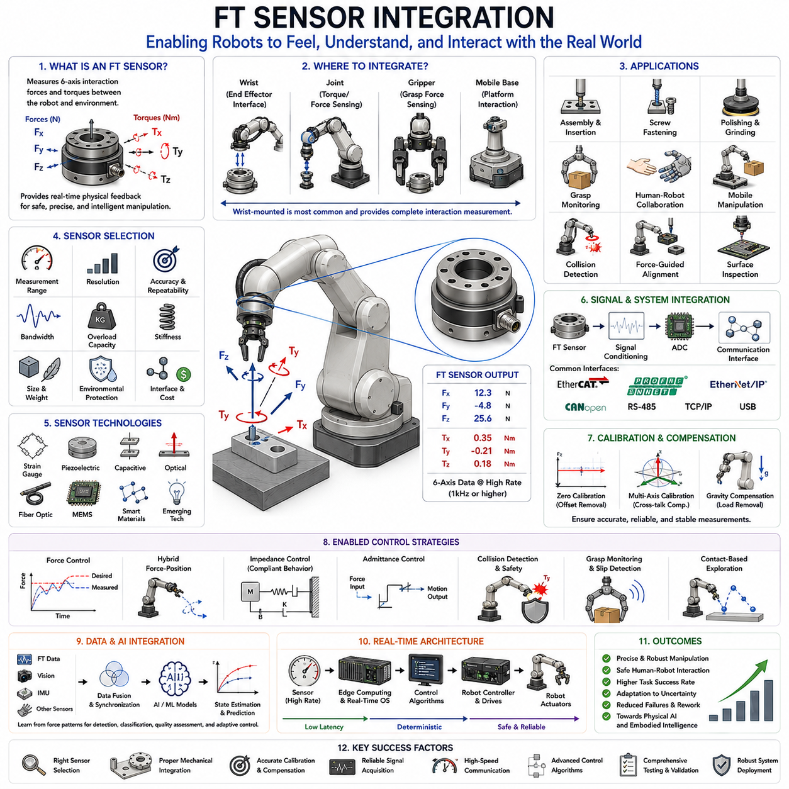
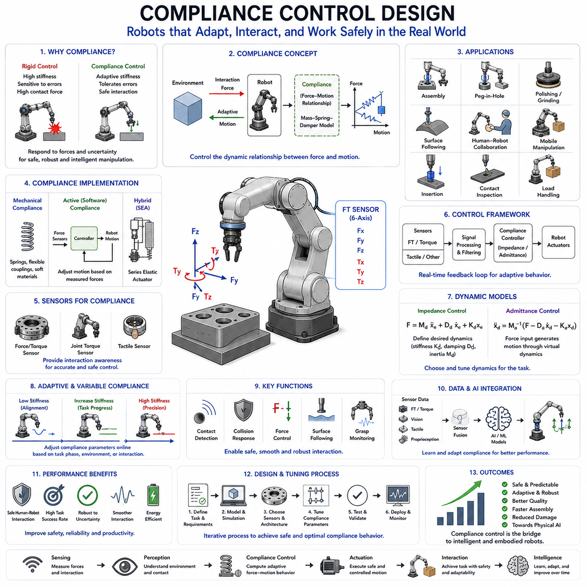
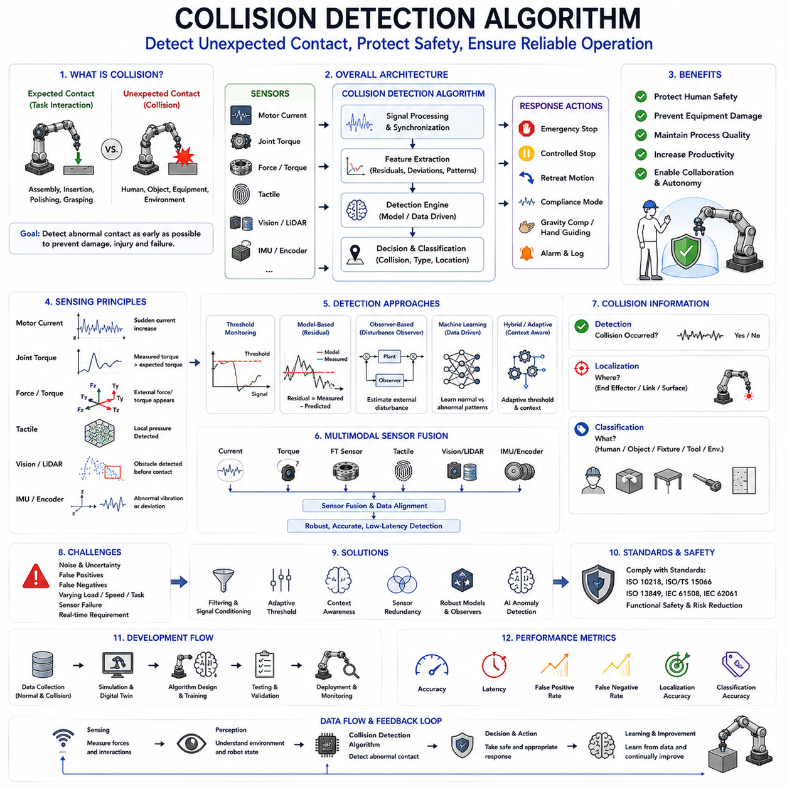
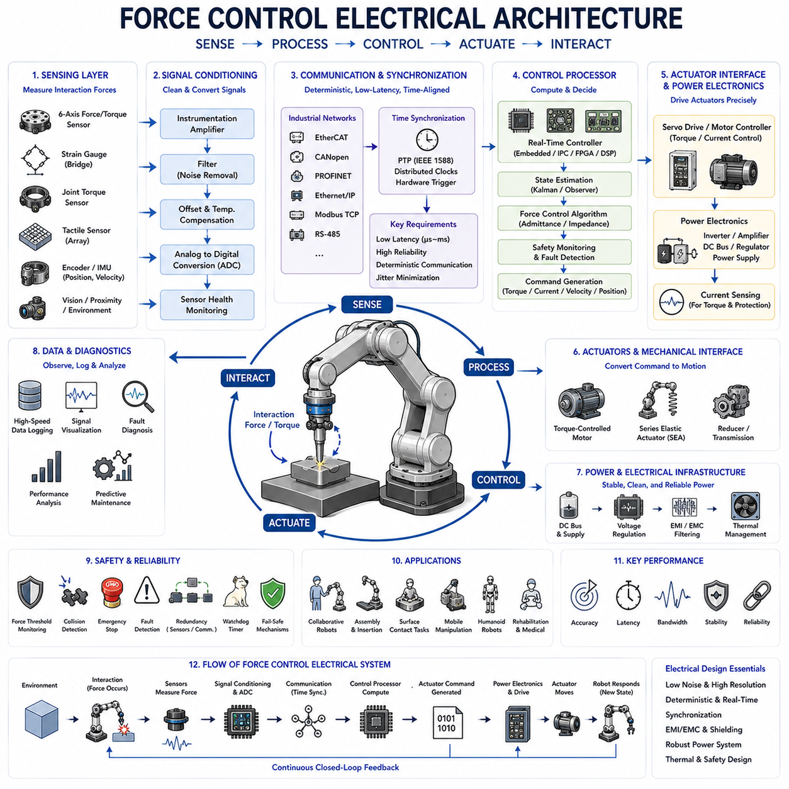
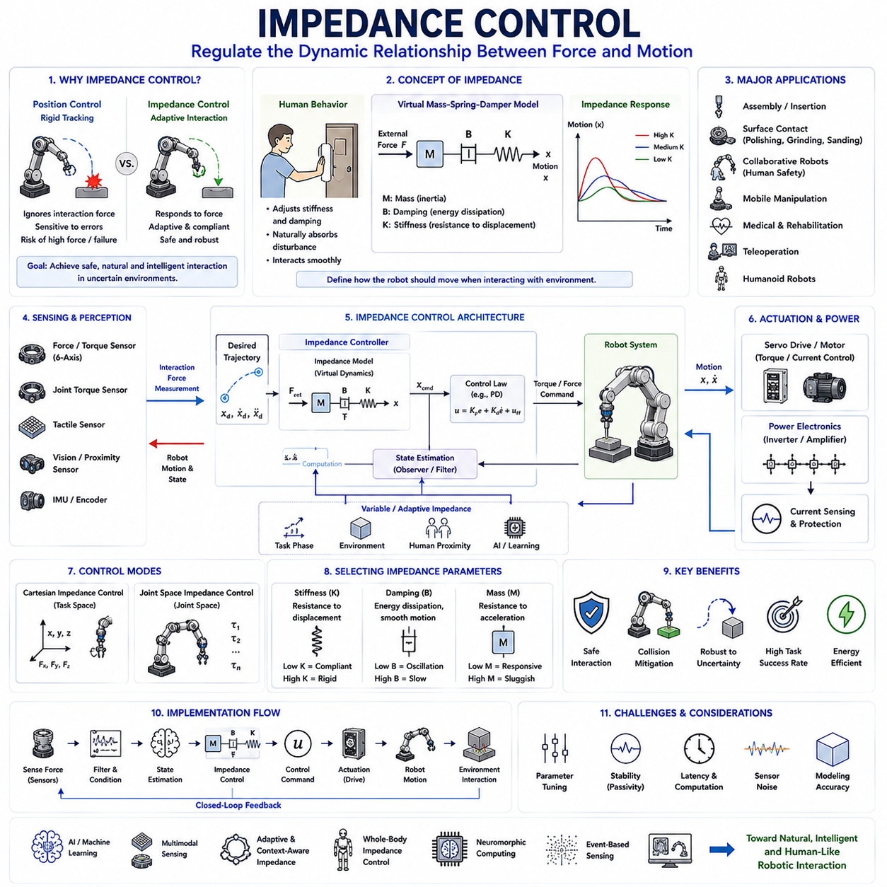

**Volume 14 Mobile Manipulator Architecture**

# Chapter 8. Force Torque Control

## 8.1 FT Sensor Integration

{width="7.268055555555556in" height="7.268055555555556in"}

Force/Torque Sensor Integration is one of the most important technologies in modern robotic manipulation systems because it provides robots with the ability to physically perceive interaction forces between the robot and its environment. While traditional industrial robots primarily operate through position control and predefined trajectories, advanced manipulation tasks increasingly require robots to understand and react to contact forces in real time. Force/Torque sensing enables robots to detect contact events, regulate interaction forces, perform compliant motion, execute precision assembly, manipulate fragile objects, collaborate safely with humans, and adapt to uncertain environments. As robotics evolves toward Physical AI, mobile manipulators, collaborative robots, humanoids, and intelligent autonomous systems, Force/Torque sensor integration becomes a foundational capability for achieving human-like physical interaction.

A Force/Torque sensor, commonly referred to as an FT sensor, measures forces and moments acting on a robotic structure. Unlike position sensors that measure location and motion, FT sensors measure mechanical interaction between the robot and external objects. Most industrial FT sensors provide six-axis measurements, including forces along the X, Y, and Z directions as well as torques around the X, Y, and Z axes. These six measurements collectively describe the complete interaction state between the robot and its environment.

The ability to perceive force is fundamental to many robotic tasks. Humans naturally rely on tactile and force feedback when opening doors, inserting connectors, assembling components, handling delicate materials, or interacting with other people. Without force sensing, robots must rely entirely on geometric assumptions and precise positioning. Even small uncertainties in object location, fixture placement, or environmental conditions can result in task failure. FT sensing allows robots to compensate for these uncertainties and achieve more robust performance.

In industrial automation, FT sensors are widely used in assembly operations involving insertion tasks, peg-in-hole operations, connector mating, screw fastening, bearing installation, and component alignment. During such operations, position errors are often unavoidable. Force sensing allows the robot to detect contact conditions and adapt its motion accordingly rather than applying excessive force that could damage components.

Collaborative robots depend heavily on force sensing to ensure safe human interaction. When humans and robots share workspaces, unexpected contact events may occur. FT sensors provide the ability to detect collisions rapidly and initiate protective actions. This capability contributes significantly to achieving compliance with industrial safety standards and improving workplace safety.

Mobile manipulators also benefit extensively from FT sensor integration. Unlike fixed industrial robots operating in highly structured environments, mobile manipulators frequently encounter uncertainty in object locations, environmental geometry, and interaction conditions. Force sensing provides valuable feedback that enables adaptation to these uncertainties during grasping, manipulation, and physical interaction tasks.

The physical placement of an FT sensor within a robotic system significantly influences its effectiveness. The most common location is between the robot wrist and the end effector. This configuration allows the sensor to measure interaction forces directly at the tool interface. Wrist-mounted FT sensors are widely used because they provide a comprehensive representation of forces experienced during manipulation tasks.

Alternative configurations include integration within robotic joints, grippers, tool changers, mobile platforms, and specialized manipulation devices. Joint-level force sensing provides distributed force information throughout the robot structure. Gripper-integrated sensors enable direct measurement of grasping forces. Platform-level sensors may be used to monitor payload distribution, vehicle interactions, and whole-body dynamics.

Sensor selection requires careful consideration of application requirements. Key specifications include measurement range, resolution, accuracy, repeatability, overload capacity, bandwidth, stiffness, size, weight, environmental protection, communication interface, and cost. The selected sensor must provide sufficient measurement capability while maintaining compatibility with the robot\'s mechanical and control architecture.

Measurement range determines the maximum force and torque that can be reliably measured. Sensors designed for delicate assembly tasks may prioritize high sensitivity and low measurement ranges. Heavy industrial manipulation applications require larger measurement ranges capable of handling substantial interaction forces. Selecting an inappropriate range may reduce measurement quality or expose the sensor to overload conditions.

Resolution defines the smallest detectable force change. High-resolution sensors enable detection of subtle contact events and support precision manipulation. Repeatability is equally important because consistent measurements are essential for reliable robotic operation. Industrial applications often prioritize repeatability over absolute accuracy because predictable behavior facilitates process optimization.

Bandwidth represents another critical parameter. Robotic interactions frequently involve dynamic force variations. Sensors with insufficient bandwidth may fail to capture rapid events such as impacts, vibrations, slip occurrences, or sudden contact transitions. High-bandwidth sensors provide more accurate representation of dynamic interactions and improve control performance.

Most modern FT sensors are based on strain gauge technology. Strain gauges measure microscopic deformations within an elastic mechanical structure. Applied forces cause small structural deflections that alter electrical resistance within the strain gauges. Signal conditioning electronics convert these resistance changes into measurable force and torque values.

Alternative sensing technologies include piezoelectric sensors, capacitive sensors, optical sensing methods, fiber-optic sensors, MEMS-based devices, and emerging smart material technologies. Each sensing approach offers different tradeoffs involving sensitivity, dynamic response, environmental robustness, and cost.

Mechanical integration is a critical aspect of FT sensor deployment. Improper mounting can introduce structural distortions, measurement errors, vibration sensitivity, and reliability issues. The mechanical interface must provide sufficient stiffness while preserving sensor accuracy. Mounting surfaces require careful machining and alignment to ensure uniform load distribution.

Electrical integration involves power delivery, signal acquisition, grounding, shielding, synchronization, and communication architecture. Industrial FT sensors commonly support interfaces such as EtherCAT, CANopen, Ethernet/IP, PROFINET, RS-485, USB, TCP/IP, and proprietary industrial communication protocols. Selection depends on system architecture, latency requirements, and industrial integration constraints.

Signal conditioning plays a crucial role in obtaining reliable force measurements. Raw sensor signals often contain noise, offsets, drift, vibration-induced disturbances, and environmental interference. Filtering techniques remove unwanted components while preserving meaningful force information. Low-pass filters, Kalman filters, adaptive filters, moving average filters, and model-based estimation methods are frequently employed.

Calibration is one of the most important steps in FT sensor integration. Calibration establishes the relationship between raw sensor outputs and actual force values. Manufacturing tolerances, mounting conditions, thermal effects, and environmental influences all affect measurement accuracy. Proper calibration ensures that sensor outputs accurately represent physical interaction forces.

Zero-point calibration removes measurement offsets when no external force is present. Multi-axis calibration accounts for cross-axis coupling effects. Advanced calibration procedures may also compensate for temperature variations, nonlinear behavior, and structural interactions. Periodic recalibration is often required to maintain long-term measurement reliability.

Coordinate transformation represents another essential integration task. FT sensor measurements are typically expressed within the sensor coordinate frame. Robotic control systems frequently require force information within tool frames, robot base frames, world frames, or task-specific coordinate systems. Transformation matrices convert force and torque measurements between these reference frames.

Gravity compensation is particularly important for wrist-mounted FT sensors. The weight of the end effector, gripper, tool changer, cables, and attached objects contributes to measured forces. Without compensation, sensor outputs include both interaction forces and gravitational loads. Dynamic gravity compensation algorithms subtract these predictable forces to isolate meaningful interaction information.

Force sensing enables a broad range of advanced robotic control strategies. Force control directly regulates interaction forces between the robot and the environment. Unlike position control, which focuses on spatial trajectories, force control focuses on maintaining desired contact forces. Applications include polishing, grinding, sanding, deburring, surface finishing, and material processing.

Hybrid force-position control combines force regulation in some directions with position regulation in others. This approach is particularly useful for assembly operations involving constrained motion. For example, a robot inserting a connector may control insertion force while simultaneously maintaining precise alignment.

Impedance control represents one of the most influential control paradigms enabled by FT sensing. Impedance control defines a dynamic relationship between applied force and resulting motion. Rather than rigidly enforcing positions, the robot behaves as a virtual mechanical system with configurable stiffness, damping, and inertia. This capability enables safe and natural interactions with uncertain environments.

Admittance control offers a complementary approach. In admittance control, measured forces influence desired motion commands through a virtual dynamic model. This strategy is commonly used when force sensors are available but actuator force control capabilities are limited.

Collision detection is another major application of FT sensor integration. Unexpected contacts generate characteristic force signatures that can be detected rapidly. The control system may respond by stopping motion, retracting the robot, reducing speed, or transitioning into a safe operating mode. This capability enhances safety and protects both equipment and operators.

Grasp monitoring represents an increasingly important use of force sensing. FT sensors can detect grasp success, object slippage, excessive gripping force, and unexpected object behavior. These measurements improve manipulation reliability and enable adaptive grasp adjustment during task execution.

Force sensing also supports advanced perception capabilities. Contact-based exploration allows robots to gather information about object geometry, material properties, stiffness, friction characteristics, and environmental structure. Such capabilities contribute to embodied intelligence and Physical AI by enabling robots to learn through physical interaction.

Machine learning is increasingly integrated with FT sensing systems. Deep learning models can interpret force patterns associated with successful manipulation, assembly quality, object identification, and failure conditions. Multimodal AI systems combine force information with vision, audio, tactile sensing, and proprioception to achieve richer environmental understanding.

Data synchronization is critical when combining FT sensing with other sensor modalities. Vision systems, IMUs, encoders, tactile sensors, and force sensors must share a common temporal reference. Accurate synchronization improves sensor fusion and enables precise interpretation of complex interaction events.

Real-time performance requirements place significant demands on FT sensor integration architectures. High-frequency force measurements often exceed one thousand samples per second. Low-latency communication and deterministic processing are necessary to support responsive force control and safe interaction.

Edge computing platforms increasingly process force information locally to minimize latency. Industrial edge computers, embedded controllers, real-time operating systems, and GPU-accelerated architectures provide computational resources for advanced force-based control algorithms.

Environmental robustness must be considered in industrial deployments. FT sensors may encounter dust, moisture, vibration, temperature variation, electromagnetic interference, chemical exposure, and mechanical shock. Industrial-grade designs incorporate protective enclosures, sealing technologies, thermal compensation mechanisms, and ruggedized electronics to maintain reliability under demanding conditions.

Testing and validation play a major role in successful FT sensor integration. Verification procedures typically evaluate accuracy, repeatability, linearity, hysteresis, bandwidth, thermal stability, overload protection, communication reliability, and long-term durability. Application-specific validation ensures that sensor performance meets operational requirements.

As robotics advances toward intelligent manipulation, autonomous assembly, humanoid systems, and Physical AI, FT sensor integration will become increasingly important. Future robots must interact safely and effectively with complex environments that cannot be completely modeled or predicted. Vision alone is insufficient for achieving robust physical interaction. Force sensing provides a complementary perception channel that enables robots to understand not only what they see but also what they physically feel.

Within the broader Force/Torque Control architecture, FT Sensor Integration serves as the foundational layer upon which compliance control, impedance control, collision detection, contact-rich manipulation, force-guided assembly, and human-robot collaboration are built. It transforms robots from purely geometric machines into physically aware systems capable of intelligent interaction with the real world. As robotic systems continue evolving toward greater autonomy and embodied intelligence, Force/Torque sensing will remain one of the most critical enabling technologies for advanced manipulation and Physical AI applications.

## 8.2 Compliance Control Design

{width="7.268055555555556in" height="7.268055555555556in"}

Compliance Control Design is one of the most important technologies in modern robotic manipulation because it enables robots to interact safely, intelligently, and effectively with uncertain physical environments. Traditional industrial robots were designed primarily for high precision and repeatability under structured conditions. Their control systems focused on accurately following predefined position trajectories while maintaining high mechanical stiffness. Although this approach works extremely well in controlled manufacturing environments, it becomes inadequate when robots must interact with humans, manipulate uncertain objects, perform assembly operations, or operate in dynamic real-world environments. Compliance control addresses these limitations by allowing robots to respond adaptively to external forces and environmental interactions.

Compliance refers to the ability of a mechanical system to yield or deform in response to applied forces. In robotics, compliance does not necessarily imply physical flexibility in the robot structure itself. Instead, compliance is often implemented through control algorithms that create the behavior of a flexible system even when the robot hardware remains mechanically rigid. Through compliance control, robots can absorb contact forces, accommodate positioning errors, adapt to environmental uncertainty, and perform contact-rich manipulation tasks without generating excessive interaction forces.

The importance of compliance becomes evident when comparing robotic behavior with human behavior. Humans naturally adjust arm stiffness, muscle activation, and movement patterns when interacting with objects. When inserting a connector, opening a door, shaking hands, assembling components, or carrying fragile items, humans continuously modulate compliance based on sensory feedback. Compliance control seeks to provide robots with similar adaptive capabilities. This transition from purely position-controlled systems to interaction-aware systems represents a major step toward Physical AI and embodied intelligence.

In industrial assembly operations, perfect geometric alignment rarely exists. Components may vary due to manufacturing tolerances, fixture inaccuracies, thermal expansion, vibration, or positioning errors. A purely position-controlled robot may attempt to force components into place, generating excessive stresses and potentially damaging parts. A compliant robot, however, can sense interaction forces and adapt its motion to accommodate these uncertainties. As a result, assembly becomes more robust, reliable, and efficient.

Collaborative robotics has significantly increased the importance of compliance control. Robots sharing workspaces with humans must operate safely under unpredictable conditions. Human workers may inadvertently contact robotic arms, tools, or payloads. Compliance control reduces collision forces and improves safety by allowing the robot to yield when unexpected contact occurs. This capability is essential for achieving compliance with collaborative robotics safety standards and enabling natural human-robot interaction.

Mobile manipulators face even greater uncertainty than fixed industrial robots. Object locations may vary, environmental geometry may change, and interaction conditions may be unknown. Compliance control enables mobile manipulators to perform grasping, manipulation, inspection, and service tasks despite these uncertainties. It provides robustness that cannot be achieved through perception and position control alone.

The fundamental objective of compliance control is to regulate the relationship between force and motion. Instead of treating external forces as disturbances that must be rejected, compliance control interprets forces as valuable information about the environment. The robot responds to these forces in a controlled manner, adjusting its motion according to predefined dynamic behaviors.

Compliance can be implemented at different levels of a robotic system. Mechanical compliance relies on physical flexibility within actuators, transmissions, joints, or structural components. Elastic elements, springs, flexible couplings, and soft materials provide inherent compliance. Mechanical compliance offers fast response and passive safety but may reduce positioning accuracy and increase design complexity.

Software-based compliance, often called active compliance, is implemented through control algorithms. Sensors measure interaction forces, and the control system modifies robot motion accordingly. Active compliance provides flexibility because compliance characteristics can be adjusted dynamically through software. Different tasks may require different compliance behaviors, and active compliance allows rapid adaptation without modifying hardware.

Hybrid approaches combine mechanical and active compliance. Series Elastic Actuators are a well-known example. These actuators place elastic elements between motors and loads, enabling direct force measurement and improved interaction safety. Series Elastic Actuators have become widely used in collaborative robots, humanoids, exoskeletons, rehabilitation systems, and advanced manipulation platforms.

Force sensing plays a central role in compliance control design. Force/Torque sensors provide measurements of interaction forces between the robot and the environment. These measurements allow the controller to estimate contact conditions and generate appropriate responses. Sensor quality directly influences compliance performance. High-resolution measurements enable detection of subtle interactions, while high-bandwidth sensors capture rapid force changes during dynamic tasks.

Joint torque sensors provide an alternative sensing approach. Rather than measuring forces at the end effector, joint torque sensors estimate interaction forces throughout the robot structure. This distributed sensing capability improves whole-body interaction awareness and supports advanced compliance control strategies.

Tactile sensing further enhances compliance control by providing localized contact information. Tactile sensors detect pressure distribution, contact location, surface properties, and slip conditions. Combined with force sensing, tactile feedback enables highly sophisticated manipulation behaviors.

The mathematical foundation of compliance control is often expressed through dynamic relationships between force and motion. Rather than directly commanding position trajectories, compliance controllers define how the robot should respond when forces are encountered. These dynamic relationships are commonly represented using mass-spring-damper models.

Stiffness represents resistance to displacement. High stiffness results in rigid behavior, while low stiffness allows greater flexibility. Damping regulates energy dissipation and influences motion smoothness. Inertia determines the resistance to acceleration. By adjusting these virtual parameters, engineers can create desired interaction characteristics without physically modifying the robot structure.

Impedance control is one of the most influential compliance control methodologies. Impedance control regulates the dynamic relationship between motion and force. The robot behaves as if it possesses virtual mechanical properties such as stiffness, damping, and inertia. External forces generate corresponding motion responses according to these virtual dynamics.

Impedance control is particularly valuable because it allows simultaneous consideration of position objectives and force interactions. The robot can follow desired trajectories while remaining responsive to environmental contact. This balance between precision and adaptability makes impedance control highly suitable for assembly, manipulation, and collaborative applications.

Admittance control provides a complementary approach. In admittance control, measured forces serve as inputs to a dynamic model that generates desired motion commands. The robot moves in response to external forces according to predefined compliance characteristics. Admittance control is commonly applied when force sensors are available but direct actuator force control is limited.

The choice between impedance and admittance control depends on robot architecture, actuator characteristics, sensing capabilities, and application requirements. Both approaches provide effective compliance behavior but differ in implementation complexity and performance characteristics.

Variable compliance control extends traditional methods by allowing compliance parameters to change dynamically during operation. Humans naturally adjust arm stiffness according to task demands. Robots can similarly modify compliance based on environmental conditions, task phases, object properties, or interaction context. Variable compliance improves efficiency, safety, and task performance.

For example, a robot performing insertion may use low stiffness during initial alignment to accommodate positional uncertainty. Once alignment is achieved, stiffness may increase to ensure precise insertion. During human interaction, compliance may increase to maximize safety. Such adaptive behavior significantly enhances robotic capability.

Contact detection is a critical component of compliance control systems. Before compliance behavior can be activated, the robot must recognize that interaction has occurred. Contact detection algorithms analyze force measurements, torque signals, tactile feedback, motor currents, and motion deviations. Rapid and reliable contact detection improves responsiveness and protects both the robot and its environment.

Collision response strategies build upon contact detection. Unexpected collisions require immediate corrective action. The robot may stop motion, retreat, reduce velocity, modify compliance parameters, or enter a safe operating mode. Compliance control provides the foundation for these responses by ensuring that interaction forces remain within acceptable limits.

Surface following is another important application. Robots performing polishing, sanding, painting, welding, inspection, or cleaning must maintain consistent contact with complex surfaces. Compliance control allows the robot to adapt to geometric variations while maintaining desired contact forces. This capability improves process quality and reduces dependency on highly accurate geometric models.

Peg-in-hole assembly is a classic benchmark for compliance control. Small positional errors can prevent successful insertion if the robot behaves rigidly. Compliance enables the robot to align naturally with mating features and complete insertion despite uncertainty. Many industrial assembly tasks rely heavily on this capability.

Human-robot collaboration benefits significantly from compliant behavior. Humans expect robots to respond predictably and safely during physical interaction. Compliance control reduces interaction forces, improves comfort, and supports intuitive collaboration. Future service robots, healthcare robots, assistive systems, and humanoids will depend heavily on advanced compliance capabilities.

Machine learning is increasingly integrated into compliance control architectures. Learning algorithms can optimize compliance parameters based on experience, identify successful interaction strategies, and adapt to changing environments. Reinforcement learning, imitation learning, and adaptive control methods enable robots to improve compliance performance over time.

Multimodal sensing further enhances compliance control. Vision systems provide information about object geometry and environmental structure. Force sensors provide interaction measurements. Tactile sensors provide local contact information. Proprioceptive sensors provide joint states and internal dynamics. Combining these information sources enables richer environmental understanding and more intelligent compliance behavior.

Real-time implementation presents significant challenges. Compliance control requires low-latency sensing, communication, computation, and actuation. Delays can degrade stability and responsiveness. High-performance real-time architectures are therefore essential. Industrial controllers, real-time operating systems, edge computing platforms, and deterministic communication protocols contribute to successful deployment.

Stability analysis is a fundamental aspect of compliance control design. Improper parameter selection may result in oscillations, instability, excessive compliance, or poor task performance. Engineers must carefully analyze dynamic behavior under expected operating conditions. Control theory, passivity analysis, Lyapunov methods, and simulation studies are commonly used to verify stability.

Simulation plays an important role in compliance control development. Digital twins allow engineers to evaluate interaction behavior before deployment. Contact models, force dynamics, environmental uncertainty, and human interaction scenarios can be explored safely within simulation environments. This approach reduces development risk and accelerates system optimization.

Safety considerations extend throughout compliance control architecture. Compliance alone does not guarantee safety. Sensor failures, communication delays, software errors, and unexpected environmental conditions must also be considered. Redundancy, fault detection, safety monitoring, and certified control architectures contribute to reliable operation.

Performance evaluation typically includes force regulation accuracy, contact stability, interaction smoothness, task success rate, energy efficiency, collision force reduction, assembly performance, and human interaction quality. These metrics provide quantitative measures of compliance effectiveness.

As robotics continues evolving toward autonomous manipulation, humanoid robotics, collaborative systems, service robotics, and Physical AI, compliance control will become increasingly essential. Robots must operate in environments that cannot be perfectly modeled and interact with objects that cannot be completely predicted. Compliance provides the adaptability required for these challenges.

Within the broader Force/Torque Control Architecture, Compliance Control Design serves as the fundamental mechanism that transforms force measurements into intelligent physical behavior. It enables robots to move beyond rigid automation and toward adaptive interaction with the real world. By combining force sensing, dynamic control, real-time computation, and environmental awareness, compliance control provides the foundation for safe, robust, and human-like robotic manipulation. As future robotic systems become more autonomous and physically capable, compliance control will remain one of the core technologies enabling embodied intelligence and advanced Physical AI systems.

## 8.3 Collision Detection Algorithm

{width="7.268055555555556in" height="7.268055555555556in"}

Collision Detection Algorithm is one of the most essential technologies in modern robotic systems because it enables robots to recognize unintended physical contact with objects, humans, equipment, or the environment and respond appropriately before damage, injury, or operational failure occurs. As robotics evolves from isolated industrial automation toward collaborative robotics, mobile manipulators, autonomous service robots, humanoid platforms, and Physical AI systems, collision detection becomes increasingly critical. Traditional industrial robots often operated inside safety cages where human interaction was prevented. Modern robotic systems, however, must function safely in shared environments where unexpected interactions can occur at any time. Collision detection algorithms provide the intelligence required to recognize these events and initiate appropriate protective actions.

A collision occurs whenever a robot experiences physical contact that differs from the expected interaction defined by its task. Some contacts are intentional and necessary, such as assembly insertion, surface polishing, force-guided manipulation, and grasping operations. Other contacts are unintended and potentially hazardous. The primary challenge of collision detection is therefore not simply detecting contact but distinguishing between expected and unexpected interactions while maintaining reliable operation under varying environmental conditions.

The fundamental objective of a collision detection algorithm is to identify abnormal physical interactions as early as possible. Early detection minimizes impact energy, reduces equipment damage, protects human operators, preserves process quality, and improves overall system safety. High-performance collision detection systems must balance sensitivity, robustness, reliability, response speed, and false alarm suppression.

Collision detection begins with understanding the dynamic behavior of the robotic system. Every robot possesses predictable relationships among commanded motion, measured motion, actuator torque, motor current, force sensing data, acceleration, velocity, and environmental interactions. Under normal operation, these relationships remain within expected ranges. When an unexpected collision occurs, measurable deviations appear within one or more sensing channels.

The simplest collision detection approach relies on threshold monitoring. Sensor measurements are continuously compared against predefined limits. If measured values exceed allowable thresholds, a collision event is declared. This approach is straightforward to implement and computationally efficient. Many industrial robots use threshold-based monitoring as a foundational safety mechanism because it provides rapid response and predictable behavior.

Motor current monitoring represents one of the most widely used collision detection techniques. Electric motors generate current proportional to output torque. During normal operation, motor current follows predictable patterns based on robot motion commands and payload characteristics. Unexpected collisions typically produce sudden increases in motor current as the robot attempts to continue moving against an obstacle. By monitoring deviations from expected current profiles, the control system can identify potential collision events.

Torque-based collision detection extends this concept further. Modern robotic joints often estimate or directly measure joint torques. Under normal operating conditions, measured torques correspond closely to model-predicted values. Unexpected external contact generates additional torques that cannot be explained by commanded motion alone. The difference between measured torque and predicted torque serves as a powerful collision indicator.

Force/Torque sensor integration significantly improves collision detection accuracy. Six-axis Force/Torque sensors directly measure interaction forces between the robot and its environment. These sensors provide detailed information about force magnitude, direction, and point of application. Because FT sensors measure interaction forces directly rather than inferring them indirectly, they often enable faster and more reliable collision detection compared with motor-current-only approaches.

Tactile sensing provides another valuable source of collision information. Tactile sensors distributed across robot surfaces detect localized pressure and contact events. Unlike joint-level sensing, tactile systems can identify the specific location where contact occurs. This capability is particularly important for humanoid robots, collaborative robots, and service robots that interact extensively with humans and complex environments.

External perception systems increasingly contribute to collision detection architectures. Cameras, LiDAR sensors, depth cameras, radar systems, ultrasonic sensors, and environmental monitoring systems can identify obstacles before physical contact occurs. Although these technologies primarily support collision avoidance rather than collision detection, they frequently operate alongside collision detection algorithms to create comprehensive safety architectures.

Model-based collision detection represents one of the most sophisticated approaches. A mathematical model predicts how the robot should behave under normal operating conditions. The control system continuously compares predicted states with measured states. Significant discrepancies may indicate external disturbances or collisions. This method enables detection even when force sensors are unavailable because unexpected interactions manifest as deviations from the predicted dynamic model.

Robot dynamic models typically incorporate mass properties, inertial characteristics, friction behavior, actuator dynamics, gravity effects, and kinematic relationships. Accurate modeling improves collision detection sensitivity while reducing false positives. However, model complexity increases computational requirements and may require careful parameter identification.

Residual generation plays a central role in model-based approaches. A residual represents the difference between expected system behavior and actual measurements. Under normal conditions, residuals remain small and primarily reflect sensor noise and modeling errors. During collisions, residual values increase significantly. Collision detection algorithms monitor these residuals and identify abnormal events when deviations exceed predefined criteria.

Observer-based techniques extend residual analysis through state estimation methods. Kalman Filters, Extended Kalman Filters, Unscented Kalman Filters, Sliding Mode Observers, Disturbance Observers, and Adaptive Observers estimate internal robot states while filtering noise and uncertainties. These methods improve collision detection robustness by separating meaningful disturbances from measurement noise.

Disturbance observers have become particularly popular in robotic applications. Disturbance observers estimate external forces acting on the system without requiring dedicated force sensors. When unexpected external forces exceed expected levels, collision events can be detected. This approach offers an attractive balance between performance and hardware cost.

Machine learning is increasingly influencing collision detection research and deployment. Traditional algorithms rely on predefined models and thresholds. Machine learning approaches learn normal and abnormal interaction patterns directly from data. By analyzing large volumes of operational data, machine learning systems can recognize subtle collision signatures that may be difficult to capture using conventional techniques.

Supervised learning methods train models using labeled examples of normal operation and collision events. Neural networks, Support Vector Machines, Random Forests, Gradient Boosting methods, and deep learning architectures can classify interaction patterns based on sensor inputs. Once trained, these systems may provide improved sensitivity and adaptability compared with fixed-rule approaches.

Unsupervised anomaly detection offers another promising direction. Instead of learning specific collision examples, the system learns normal operational behavior. Deviations from learned normal patterns are classified as anomalies. This approach is particularly valuable because collecting large datasets of collision events can be difficult and potentially dangerous.

Deep learning architectures such as Autoencoders, Variational Autoencoders, Recurrent Neural Networks, Long Short-Term Memory networks, Temporal Convolutional Networks, and Transformer-based models have demonstrated strong performance in anomaly detection and collision recognition tasks. These systems can capture complex temporal relationships among multiple sensor channels.

Multimodal collision detection combines information from multiple sensing modalities. Motor currents, joint torques, force sensors, tactile sensors, vision systems, IMUs, encoders, and environmental sensors each provide complementary information. Sensor fusion algorithms integrate these diverse information sources to improve detection reliability and reduce uncertainty.

Data synchronization becomes critically important in multimodal systems. Sensor measurements must be aligned temporally to ensure accurate interpretation of events. Precision Time Protocol, hardware triggers, synchronized clocks, and deterministic communication networks support accurate sensor synchronization.

Response time represents one of the most important performance metrics for collision detection algorithms. Detection delays directly influence impact severity. Faster detection reduces collision energy and improves safety. High-performance systems often target detection times measured in milliseconds. Achieving such responsiveness requires efficient sensing, communication, processing, and actuation architectures.

False positives represent a major challenge in collision detection design. Excessively sensitive algorithms may incorrectly classify normal interactions as collisions. Frequent false alarms disrupt production, reduce efficiency, and decrease operator confidence. Therefore, collision detection systems must carefully balance sensitivity against robustness.

False negatives are equally problematic. A false negative occurs when a real collision goes undetected. Such failures can lead to equipment damage, process failure, or safety hazards. Designing algorithms that minimize both false positives and false negatives remains a central challenge in robotic safety engineering.

Threshold adaptation provides one strategy for addressing varying operating conditions. Fixed thresholds may perform poorly across different payloads, speeds, environmental conditions, and task types. Adaptive thresholds adjust detection criteria dynamically according to current operating conditions. This approach improves robustness while maintaining sensitivity.

Context awareness further enhances collision detection performance. Different tasks produce different force profiles and dynamic behaviors. An assembly operation involving intentional contact differs significantly from free-space motion. Context-aware algorithms adjust detection parameters according to the current task phase, improving discrimination between expected and unexpected interactions.

Collaborative robots require particularly sophisticated collision detection capabilities. Human safety standards impose strict requirements regarding collision force limits, reaction times, and protective responses. Collaborative systems often integrate multiple detection layers including motor monitoring, torque sensing, force sensing, tactile sensing, and external environmental perception.

Protective actions initiated after collision detection vary according to application requirements. Emergency stop functions halt robot motion immediately. Controlled stop procedures reduce speed before stopping. Retreat motions move the robot away from the collision source. Compliance control modes increase flexibility and reduce interaction forces. Some systems may transition into gravity compensation or hand-guiding modes to facilitate safe human interaction.

Collision localization represents an advanced capability that identifies where contact occurred. Localization information supports more intelligent responses, diagnostics, and recovery procedures. Force sensor measurements, tactile arrays, dynamic observers, and machine learning models can contribute to collision localization.

Collision classification extends detection capabilities further. Rather than simply identifying contact, advanced systems categorize collision types. Contacts may involve humans, workpieces, fixtures, tools, environmental structures, or process-specific interactions. Different collision categories may require different response strategies.

Simulation plays an increasingly important role in collision detection development. Digital twins allow engineers to evaluate detection algorithms under diverse scenarios without risking physical equipment. Simulation environments support parameter tuning, performance validation, fault injection, and safety analysis. They also facilitate machine learning dataset generation for training advanced detection models.

Functional safety standards significantly influence collision detection design. Standards such as ISO 10218, ISO/TS 15066, ISO 13849, IEC 61508, IEC 62061, and related safety frameworks define requirements for robotic safety functions. Collision detection systems intended for safety-critical applications must satisfy rigorous validation, verification, and reliability requirements.

Redundancy improves system reliability by providing multiple independent detection mechanisms. If one sensing channel fails, other channels may continue providing protection. Safety-rated architectures frequently incorporate redundant sensors, processors, communication networks, and decision-making pathways.

Performance evaluation typically considers detection accuracy, detection latency, false positive rate, false negative rate, localization accuracy, classification accuracy, robustness, computational efficiency, and safety compliance. Comprehensive testing under realistic operating conditions is essential for validating system performance.

Future collision detection systems will increasingly integrate artificial intelligence, multimodal sensing, edge computing, digital twins, and Physical AI architectures. Robots will become capable of understanding interaction context, predicting potential collisions before they occur, adapting detection behavior dynamically, and learning from operational experience. Event-based sensing, advanced tactile skins, distributed sensing architectures, and neuromorphic computing may further improve responsiveness and environmental awareness.

Within the broader Force/Torque Control Architecture, Collision Detection Algorithms serve as the critical safety layer that transforms raw sensory information into actionable protection mechanisms. They bridge perception, force sensing, control systems, and safety architectures to ensure reliable operation in uncertain environments. As robots continue moving beyond isolated industrial cells into shared human environments, collision detection will remain one of the most important enabling technologies for safe, intelligent, and autonomous robotic systems.

## 8.4 Force Control Electrical

{width="7.268055555555556in" height="7.268055555555556in"}

Force Control Electrical refers to the electrical architecture, sensing infrastructure, communication systems, signal processing mechanisms, actuator interfaces, and power electronics that enable force-controlled robotic systems to perceive, regulate, and respond to interaction forces in real time. While force control algorithms and mechanical design receive significant attention in robotics research and development, the underlying electrical architecture ultimately determines whether force control can be implemented accurately, safely, and reliably in real-world systems. A sophisticated force control algorithm cannot achieve its intended performance without high-quality sensing, deterministic communication, synchronized control loops, low-noise signal acquisition, and responsive actuator electronics.

In modern robotics, force control is becoming increasingly important as robots transition from isolated industrial automation toward collaborative robotics, mobile manipulation, autonomous assembly, humanoid systems, service robots, rehabilitation platforms, and Physical AI architectures. These systems must interact directly with uncertain environments, delicate objects, and human operators. Electrical force-control infrastructure provides the foundation that enables such interactions by transforming physical forces into measurable electrical signals and converting control decisions into physical motion.

The primary objective of a force-control electrical architecture is to create a closed-loop interaction system between the robot and its environment. This loop begins with force sensing, continues through signal conditioning and control computation, and concludes with actuator commands that modify robot behavior. The cycle repeats continuously at high frequency, allowing the robot to regulate interaction forces dynamically.

The sensing layer forms the first component of the electrical force-control system. Force and torque sensors provide direct measurements of physical interaction forces. Most industrial systems utilize six-axis Force/Torque sensors capable of measuring forces along three translational axes and torques around three rotational axes. These sensors typically employ strain-gauge technology in which microscopic structural deformation changes electrical resistance values. The resulting electrical signals are proportional to applied forces and torques.

Strain-gauge sensors generate extremely small voltage variations that require precise amplification and conditioning before they can be used by control systems. Instrumentation amplifiers with high common-mode rejection ratios are commonly employed to amplify these signals while minimizing electrical noise. Because force measurements often involve millivolt-level signals, careful electrical design is essential to preserve measurement accuracy.

Alternative force-sensing technologies include piezoelectric sensors, capacitive sensors, optical sensors, fiber-optic force sensors, MEMS-based devices, and emerging smart-material sensing technologies. Each sensing approach imposes unique electrical integration requirements involving signal conditioning, power supply design, bandwidth optimization, and noise management.

Signal conditioning electronics play a critical role in force-control architectures. Raw sensor outputs contain offsets, noise, thermal drift, electromagnetic interference, and structural vibration artifacts. Signal conditioning circuits perform amplification, filtering, offset compensation, analog-to-digital conversion, and sensor health monitoring. These functions ensure that force measurements accurately represent physical interaction conditions.

Filtering is particularly important because force-control systems operate in environments containing substantial electrical and mechanical noise sources. Low-pass filters suppress high-frequency noise while preserving meaningful force information. Adaptive filtering techniques dynamically adjust filter characteristics according to operating conditions. Kalman filtering, observer-based estimation, and model-based filtering techniques further improve measurement quality by combining sensor data with system dynamics.

Analog-to-digital conversion forms the bridge between physical sensing and digital control. The resolution, sampling rate, latency, and accuracy of analog-to-digital converters significantly influence force-control performance. High-resolution converters enable detection of subtle force variations, while high-speed sampling supports dynamic interaction control. Industrial force-control systems frequently operate with sampling rates ranging from several hundred hertz to several kilohertz depending on application requirements.

Electrical grounding and shielding are fundamental design considerations. Force sensors often measure very small electrical signals that are susceptible to interference from motors, power electronics, switching regulators, communication networks, and industrial machinery. Improper grounding can introduce noise, offset errors, and instability into force measurements. Star-ground configurations, shielded cables, differential signaling, isolation techniques, and careful PCB design help maintain signal integrity.

Communication architecture represents another major component of force-control electrical systems. Sensor measurements must be transmitted to control processors with minimal latency and high reliability. Industrial communication protocols such as EtherCAT, CANopen, PROFINET, Ethernet/IP, Modbus TCP, RS-485, and proprietary real-time networks are commonly employed.

EtherCAT has become particularly popular for force-control applications because it provides deterministic communication with extremely low latency and precise synchronization. Real-time force regulation often requires communication delays measured in microseconds or low milliseconds. Non-deterministic communication can introduce instability and degrade control performance.

Time synchronization is essential throughout the force-control architecture. Force sensors, motor controllers, encoders, inertial measurement units, cameras, tactile sensors, and supervisory controllers must operate within a common temporal framework. Precision Time Protocol, IEEE 1588 synchronization, distributed clocks, and hardware-trigger mechanisms help ensure consistent timing across the entire system.

The control processor serves as the computational core of the electrical architecture. Embedded controllers, industrial PCs, real-time processors, FPGA-based systems, DSP platforms, and edge-computing devices execute force-control algorithms. These processors continuously receive sensor measurements, estimate system states, calculate control actions, and generate actuator commands.

Real-time operating systems are frequently employed because force control requires deterministic execution. Unlike conventional computing applications, force-control loops cannot tolerate unpredictable scheduling delays. Control tasks must execute within precisely defined timing constraints to maintain stability and responsiveness.

The actuator interface transforms control outputs into physical motion. Modern robotic systems commonly utilize servo drives, brushless motor controllers, torque amplifiers, and power electronics modules. Force-control commands may directly regulate motor torque, current, velocity, or position depending on the architecture.

Torque-controlled actuators are particularly advantageous for force-control applications because torque directly influences interaction force. By regulating motor torque, the system can achieve more natural and responsive interaction behavior. This capability is especially important in collaborative robotics, compliant manipulation, and human-interaction scenarios.

Motor current plays a central role in electrical force-control systems. In electric motors, output torque is approximately proportional to motor current. Current sensing circuits therefore provide indirect force estimation capabilities even when dedicated force sensors are unavailable. Current-control loops often operate at significantly higher frequencies than force-control loops, providing rapid actuator response.

Servo drives typically implement nested control architectures. The innermost loop regulates motor current. An intermediate loop controls velocity. An outer loop manages position or force objectives. Force-control algorithms often operate at the outermost level while relying on lower-level loops to execute commands accurately.

Power electronics constitute another critical subsystem. High-performance force control requires precise power delivery to actuators and sensors. Voltage stability, current capacity, switching efficiency, thermal management, and electromagnetic compatibility all influence system behavior. Poor power quality can degrade sensor measurements and actuator performance simultaneously.

Switching power supplies, battery systems, DC buses, voltage regulators, and energy storage components must be carefully designed to support dynamic force-control requirements. Sudden changes in interaction forces often generate rapid variations in actuator power demand. The electrical architecture must accommodate these transients without compromising control stability.

Series Elastic Actuators introduce unique electrical considerations. These actuators incorporate elastic elements between motors and loads, enabling direct force estimation through spring deflection measurement. Position sensors measure elastic deformation, and force values are calculated based on known stiffness characteristics. The associated electrical system must support high-resolution position sensing and rapid signal processing.

Joint torque sensing provides another important force-control architecture. Torque sensors integrated directly within robotic joints measure interaction loads throughout the robot structure. Electrical interfaces for these sensors must support high accuracy, low latency, and robust operation under dynamic conditions.

Compliance control relies heavily on electrical force-control infrastructure. Compliance algorithms continuously monitor interaction forces and modify robot motion accordingly. Electrical architectures must therefore support rapid sensing, computation, and actuation cycles. Delays within any portion of the loop can reduce compliance effectiveness and potentially destabilize the system.

Impedance control and admittance control represent major application areas for force-control electrical systems. Impedance control requires accurate force measurement and precise actuator response to simulate virtual mechanical behavior. Admittance control transforms measured forces into desired motion commands. Both approaches depend heavily on the performance of underlying electrical subsystems.

Safety is a major consideration in force-control electrical design. Unexpected sensor failures, communication interruptions, power anomalies, software faults, or actuator malfunctions can compromise force-control performance. Safety-rated architectures therefore incorporate redundancy, fault detection, watchdog systems, diagnostic monitoring, and fail-safe mechanisms.

Safety functions often include force thresholds, collision monitoring, emergency stop circuits, power isolation systems, and independent supervisory controllers. These mechanisms ensure that hazardous conditions can be detected and mitigated rapidly.

Human-robot collaboration imposes particularly stringent electrical requirements. Collaborative robots must continuously monitor interaction forces and respond within strict time limits. Electrical architectures supporting collaborative applications require exceptionally reliable sensing, deterministic communication, and rapid actuation capabilities.

Multimodal sensing is becoming increasingly important in advanced force-control systems. Force sensors are frequently combined with vision systems, tactile arrays, proximity sensors, IMUs, encoders, microphones, and environmental sensors. Sensor fusion architectures integrate these information sources to improve interaction awareness and decision making.

Artificial intelligence is increasingly integrated into force-control electrical systems. Machine learning algorithms analyze force signatures, detect anomalies, classify interactions, optimize control parameters, and predict system behavior. Edge AI processors and GPU-accelerated platforms enable real-time execution of advanced learning algorithms alongside conventional force-control loops.

Data logging and diagnostics provide essential support for development, maintenance, and continuous improvement. Electrical architectures often include high-speed data acquisition systems capable of recording force measurements, actuator states, communication statistics, fault conditions, and environmental variables. These datasets support performance analysis, predictive maintenance, and machine learning development.

Thermal management represents another important aspect of force-control electrical systems. Sensors, processors, communication modules, and power electronics all generate heat. Temperature variations can influence measurement accuracy, component reliability, and control performance. Thermal compensation techniques and environmental monitoring help maintain stable operation.

Electromagnetic compatibility is especially important in industrial environments. High-power motors, welding equipment, switching devices, and industrial communication systems create electromagnetic disturbances that can interfere with force measurements. Proper shielding, filtering, isolation, cable routing, and PCB design are necessary to ensure reliable operation.

Testing and validation play major roles in electrical force-control development. Verification procedures evaluate signal quality, measurement accuracy, communication latency, synchronization performance, actuator responsiveness, fault tolerance, thermal stability, and safety compliance. System-level validation ensures that the complete force-control loop performs as intended under realistic operating conditions.

Digital twins and hardware-in-the-loop simulation increasingly support force-control development. Engineers can evaluate electrical architectures, communication networks, sensor integration strategies, and control algorithms before deploying physical systems. This approach reduces risk and accelerates development cycles.

As robotics continues advancing toward humanoid platforms, autonomous manipulation systems, collaborative robots, service robotics, and Physical AI architectures, force-control electrical systems will become increasingly sophisticated. Future systems will integrate distributed sensing, intelligent edge computing, advanced AI processors, adaptive communication networks, and self-diagnosing electronics to achieve higher levels of interaction intelligence.

Within the broader Force/Torque Control Architecture, Force Control Electrical serves as the foundational infrastructure that connects physical sensing, computational intelligence, and robotic actuation. It transforms real-world interaction forces into digital information, enables intelligent decision making, and converts control outputs into precise physical responses. Without a robust electrical architecture, advanced force-control algorithms cannot achieve reliable operation. As robotic systems continue evolving toward human-level physical interaction capabilities, Force Control Electrical will remain one of the most critical enabling technologies supporting intelligent, safe, and adaptive robotic behavior.

## 8.5 Impedance Control

{width="7.268055555555556in" height="7.268055555555556in"}

Impedance Control is one of the most influential and widely adopted control methodologies in modern robotics because it enables robots to interact safely, intelligently, and naturally with uncertain physical environments. Unlike traditional position control systems that attempt to force a robot to follow a predefined trajectory regardless of external disturbances, impedance control regulates the dynamic relationship between force and motion. This capability allows robotic systems to behave in a compliant and adaptive manner when interacting with objects, humans, tools, and environmental structures.

As robotics evolves beyond conventional industrial automation toward collaborative robots, mobile manipulators, humanoid systems, autonomous assembly platforms, service robots, healthcare devices, rehabilitation systems, and Physical AI architectures, impedance control becomes increasingly important. These systems must operate in environments where uncertainty, contact, and interaction are unavoidable. Impedance control provides the foundation that enables robots to function effectively under such conditions.

The concept of impedance originates from classical mechanical systems. In mechanics, impedance describes the dynamic relationship between applied force and resulting motion. A physical object does not respond to force instantaneously. Instead, its response is determined by characteristics such as mass, damping, and stiffness. These properties collectively define how the object reacts to external influences.

Human motion naturally exhibits impedance behavior. When a person opens a door, shakes hands, inserts a connector, manipulates a fragile object, or interacts with another individual, the musculoskeletal system continuously adjusts stiffness and damping characteristics according to task requirements. Humans do not rigidly resist every external force. Instead, they absorb disturbances, adapt their movements, and maintain stable interaction. Impedance control seeks to reproduce similar behavior in robotic systems.

Traditional position control assumes that the environment is perfectly known and that the robot should follow predefined trajectories with minimal deviation. While this approach works well in highly structured industrial environments, it becomes problematic when uncertainty exists. Small positioning errors, object variations, fixture misalignments, environmental changes, or unexpected human interactions can generate excessive contact forces and lead to failures or safety hazards.

Impedance control addresses this limitation by allowing the robot to respond dynamically to external forces. Rather than rigidly enforcing position commands, the controller defines how the robot should move when forces are encountered. This transforms the robot from a purely position-driven machine into an interaction-aware system capable of adapting to its surroundings.

The fundamental principle of impedance control is the creation of a virtual mechanical relationship between force and motion. Instead of directly commanding force or position alone, the controller specifies a dynamic model that governs how forces produce movement. This virtual model is typically expressed using mass, damping, and stiffness parameters.

Mass represents resistance to acceleration. A system with high virtual mass responds slowly to external forces, while a system with low virtual mass responds more readily. Damping determines how quickly oscillations are dissipated and influences the smoothness of motion. Stiffness defines resistance to displacement. High stiffness produces rigid behavior, while low stiffness creates compliant behavior.

By adjusting these virtual parameters, engineers can design robotic behaviors tailored to specific applications. The robot may appear rigid for precision tasks, compliant for human interaction, or adaptive for uncertain manipulation scenarios, even though the physical hardware remains unchanged.

One of the most important advantages of impedance control is its ability to manage contact-rich tasks. Many robotic applications involve continuous interaction with external objects. Examples include assembly operations, insertion tasks, surface polishing, grinding, sanding, deburring, painting, welding, medical procedures, rehabilitation exercises, and human assistance tasks. These applications require controlled interaction rather than pure trajectory tracking.

Assembly operations provide a classic example. During connector insertion or peg-in-hole assembly, small positional errors are inevitable. A position-controlled robot may generate large contact forces and become jammed if alignment is imperfect. An impedance-controlled robot can absorb these errors and naturally align itself with the mating geometry while maintaining controlled interaction forces.

Collaborative robotics represents another major application domain. When humans and robots share workspaces, safety becomes a primary concern. Human contact with robotic systems should not result in harmful forces. Impedance control enables robots to yield when unexpected contact occurs, reducing collision severity and improving safety. This capability is essential for collaborative robots operating under modern safety standards.

Mobile manipulators also benefit significantly from impedance control. Unlike fixed industrial robots operating in predictable environments, mobile manipulators encounter uncertainty in object locations, environmental geometry, and interaction conditions. Impedance control provides the adaptability necessary for robust operation under these circumstances.

Force sensing plays a critical role in impedance control implementation. Force/Torque sensors provide measurements of interaction forces between the robot and its environment. These measurements allow the controller to estimate contact conditions and modify robot behavior accordingly. High-quality force sensing improves responsiveness, stability, and interaction quality.

Joint torque sensors provide an alternative source of force information. Instead of measuring forces directly at the end effector, joint torque sensors estimate interaction loads throughout the robot structure. This distributed sensing capability supports whole-body interaction control and improves environmental awareness.

Tactile sensors further enhance impedance control performance. Tactile sensing provides localized contact information including pressure distribution, contact location, surface characteristics, and slip detection. Combined with force sensing, tactile feedback enables more sophisticated interaction behaviors.

The mathematical formulation of impedance control is typically based on second-order dynamic systems. Desired robot behavior is represented as a virtual mass-spring-damper system. External forces applied to the robot generate corresponding motion responses according to the specified dynamic relationship. This formulation allows engineers to design intuitive interaction characteristics using physically meaningful parameters.

Task requirements often determine appropriate impedance values. Precision machining may require high stiffness to maintain accurate positioning. Human interaction tasks may require lower stiffness to maximize safety and comfort. Manipulation of fragile objects may require moderate stiffness combined with significant damping to prevent damage.

Cartesian impedance control is one of the most common implementations. In this approach, impedance behavior is defined within task space rather than joint space. Forces and motions are expressed relative to the end effector coordinate frame. This representation often aligns naturally with manipulation objectives and simplifies task specification.

Joint-space impedance control represents an alternative approach. Instead of controlling interaction behavior at the end effector, impedance characteristics are assigned directly to individual joints. Joint-space methods often offer computational advantages and may simplify integration with existing robotic architectures.

Variable impedance control extends conventional impedance control by allowing parameters to change dynamically during operation. Humans continuously adjust arm stiffness according to task requirements and environmental conditions. Variable impedance control attempts to replicate this capability by adapting virtual mass, damping, and stiffness values in real time.

For example, a robot performing assembly may begin with low stiffness to accommodate positional uncertainty. As alignment improves, stiffness may increase to support precise insertion. During human interaction, compliance may increase automatically to enhance safety. Such adaptive behavior improves both performance and versatility.

Learning-based impedance control has emerged as an important research direction. Machine learning algorithms can optimize impedance parameters based on experience, environmental observations, and task outcomes. Reinforcement learning, imitation learning, adaptive control, and neural network-based methods enable robots to discover effective interaction strategies without requiring extensive manual tuning.

Artificial intelligence systems increasingly integrate perception and impedance control. Vision systems provide information about object geometry, environmental structure, and task context. Force sensors provide interaction feedback. Machine learning algorithms combine these information sources to generate intelligent impedance behaviors tailored to current conditions.

Impedance control also plays a crucial role in humanoid robotics. Human environments are inherently unstructured and contact-rich. Humanoid robots must walk, manipulate objects, open doors, use tools, and interact safely with people. These tasks require continuous adaptation to uncertain physical interactions. Impedance control provides a fundamental mechanism for achieving such adaptability.

Whole-body impedance control extends the concept further by coordinating interaction behavior across the entire robot. Rather than controlling individual joints independently, the controller manages global interaction dynamics. This approach is particularly valuable for humanoids, quadrupeds, and mobile manipulators operating in complex environments.

Stability represents one of the most important considerations in impedance control design. Improper parameter selection can result in oscillations, instability, excessive compliance, or degraded task performance. Engineers must carefully analyze dynamic behavior under expected operating conditions to ensure reliable operation.

Passivity theory is frequently used to analyze impedance-controlled systems. Passive systems do not generate energy and tend to exhibit stable interaction behavior. Designing controllers that preserve passivity helps maintain stability even when interacting with uncertain environments.

Communication latency and computational delay significantly influence impedance control performance. High-performance force control requires rapid sensing, processing, and actuation. Excessive delays can reduce responsiveness and destabilize the system. Consequently, impedance control often relies on real-time operating systems, deterministic communication protocols, and high-speed control hardware.

Industrial communication technologies such as EtherCAT, distributed clock synchronization, and real-time Ethernet support the low-latency requirements of impedance-controlled systems. Edge computing platforms, FPGA-based controllers, DSP processors, and dedicated robotic control hardware further improve responsiveness.

Energy efficiency is another important consideration. Highly compliant systems may consume less energy during interaction because they naturally absorb disturbances rather than actively resisting them. Proper impedance tuning can therefore improve both performance and efficiency.

Collision mitigation is a major practical benefit of impedance control. Unexpected impacts generate interaction forces that are absorbed by the virtual compliance mechanism. Instead of producing rigid and potentially dangerous reactions, the robot responds smoothly and safely. This capability contributes significantly to human safety and equipment protection.

Medical robotics relies heavily on impedance control because procedures frequently involve direct interaction with human tissue. Surgical robots, rehabilitation systems, assistive devices, and exoskeletons require precise force regulation combined with safe interaction behavior. Impedance control provides the necessary balance between precision and compliance.

Rehabilitation robotics particularly benefits from adaptive impedance strategies. Patients exhibit varying levels of strength, mobility, and responsiveness. Impedance-controlled systems can adjust assistance levels dynamically according to patient needs, improving therapy effectiveness and user comfort.

Teleoperation systems also employ impedance control extensively. Remote operators manipulate robotic devices through communication networks. Impedance control helps compensate for communication delays, stabilize interaction behavior, and improve transparency between operator and remote environment.

Simulation plays a critical role in impedance control development. Digital twins enable engineers to evaluate interaction dynamics, contact behavior, stability margins, and parameter selections before deployment. Simulation environments support safe experimentation with complex interaction scenarios that may be difficult or risky to reproduce physically.

Performance evaluation typically considers force tracking accuracy, position accuracy, interaction stability, collision response, energy consumption, task success rate, human comfort, and safety metrics. These measurements help quantify controller effectiveness and guide optimization efforts.

Future developments in impedance control are expected to incorporate increasingly sophisticated artificial intelligence techniques, multimodal sensing architectures, adaptive learning systems, and distributed robotic control frameworks. Event-based sensing, neuromorphic computing, advanced tactile skins, and predictive interaction modeling may further enhance responsiveness and environmental awareness.

Within the broader Force/Torque Control Architecture, Impedance Control serves as the critical bridge between force perception and physical behavior. It transforms raw interaction measurements into meaningful dynamic responses that allow robots to behave safely, naturally, and intelligently within uncertain environments. By regulating the relationship between force and motion through virtual mechanical properties, impedance control enables robots to move beyond rigid automation and toward human-like physical interaction. As robotic systems continue advancing toward embodied intelligence, collaborative operation, and Physical AI, impedance control will remain one of the most fundamental technologies supporting adaptive and intelligent robotic behavior.
