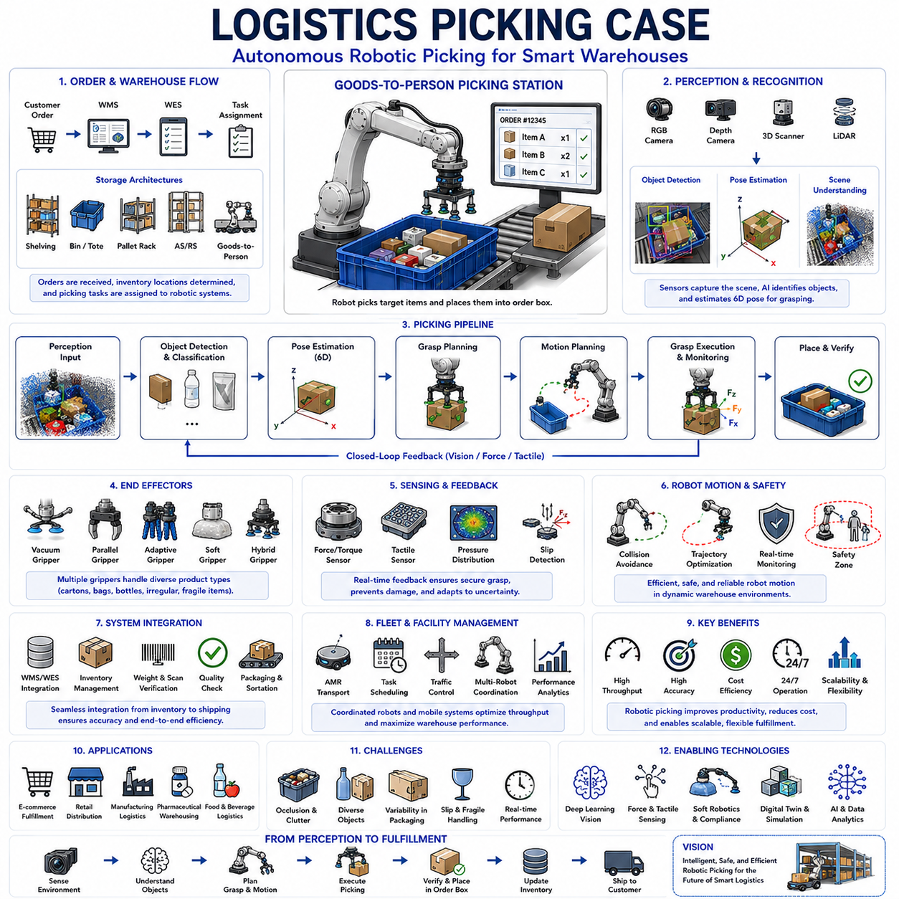
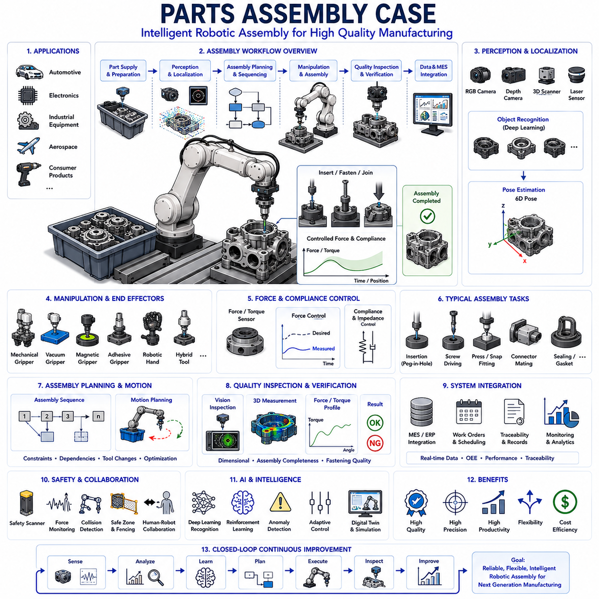
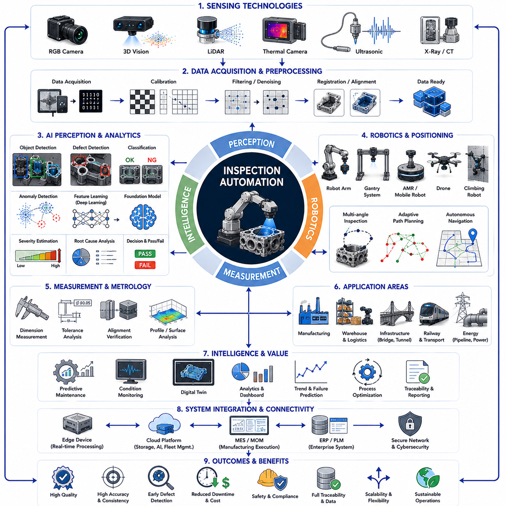
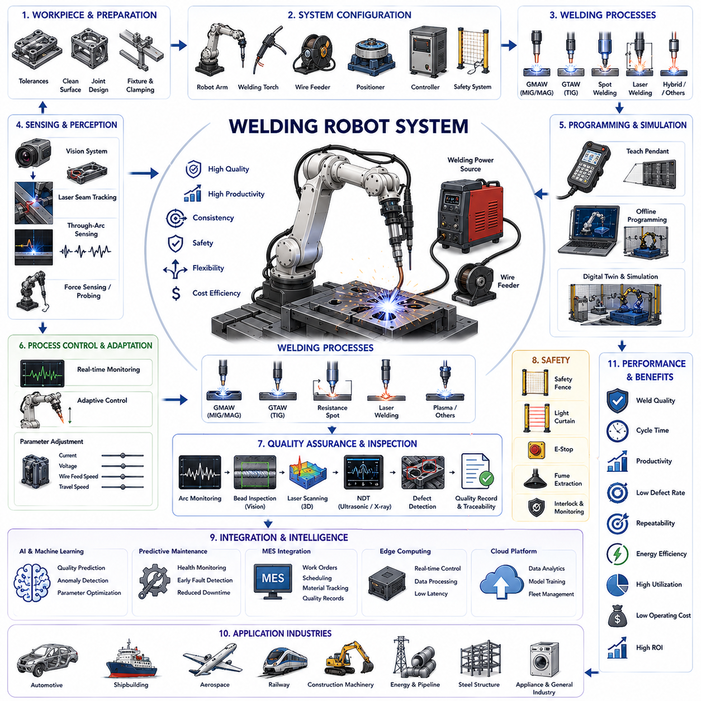
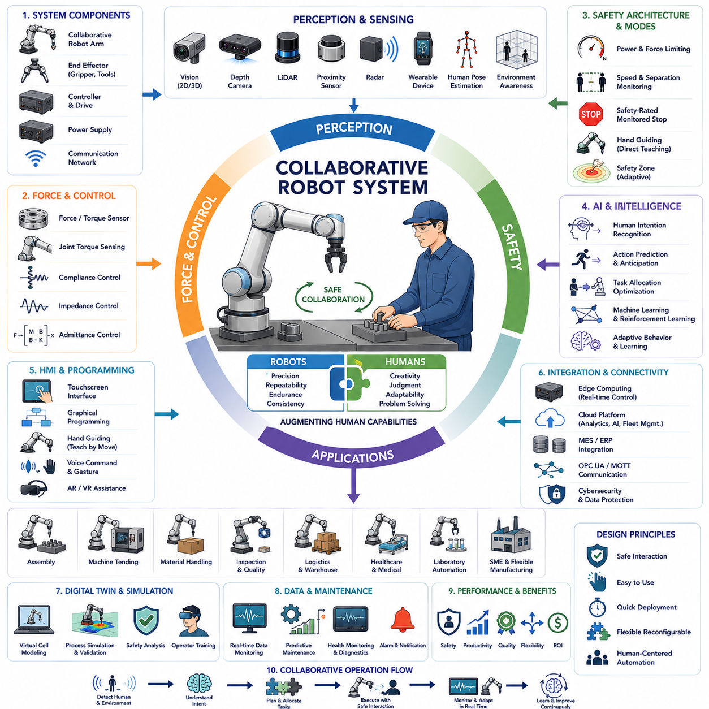

**Volume 14 Mobile Manipulator Architecture**

# Chapter 9. Industrial Case Studies

## 9.1 Logistics Picking Case

{width="7.268055555555556in" height="7.268055555555556in"}

Logistics Picking Case represents one of the most important and commercially valuable applications of robotic manipulation in modern warehouses, distribution centers, fulfillment facilities, e-commerce operations, manufacturing logistics environments, and automated supply chain systems. As global commerce increasingly depends on rapid order fulfillment, high inventory turnover, labor efficiency, and operational scalability, robotic picking systems have emerged as a critical technology for improving productivity, reducing costs, enhancing accuracy, and enabling twenty-four-hour warehouse operations.

Traditionally, logistics picking has been performed by human workers who navigate warehouse aisles, identify products, retrieve items from shelves, bins, totes, pallets, or containers, and place them into shipping boxes or transport systems. Human operators possess excellent perception, dexterity, adaptability, and decision-making capabilities. However, labor-intensive picking operations introduce limitations related to workforce availability, training requirements, fatigue, injury risks, operational costs, and throughput scalability.

The rapid growth of e-commerce has significantly increased demand for automated picking technologies. Modern fulfillment centers process millions of stock keeping units (SKU), ranging from standardized cartons and packaged goods to highly diverse consumer products with varying shapes, sizes, textures, weights, and packaging characteristics. Robotic picking systems must therefore operate in highly dynamic environments while maintaining speed, accuracy, and reliability.

A logistics picking system generally consists of several tightly integrated subsystems including perception, object recognition, localization, grasp planning, motion planning, robotic manipulation, inventory management, warehouse execution systems, fleet coordination, and operational analytics. These components work together to enable autonomous item retrieval and order fulfillment.

The picking workflow begins with order generation. Customer orders enter the Warehouse Management System (WMS), which determines required inventory items, storage locations, picking priorities, and fulfillment schedules. The WMS communicates with the Warehouse Execution System (WES) and robotic control infrastructure to initiate picking tasks.

Inventory storage architecture significantly influences robotic picking performance. Warehouses may utilize static shelving systems, carton flow racks, pallet storage systems, automated storage and retrieval systems (AS/RS), vertical lift modules, shuttle systems, micro-fulfillment systems, or goods-to-person architectures. Each storage strategy presents unique challenges and opportunities for robotic manipulation.

Goods-to-person systems have become particularly attractive because they reduce navigation complexity. Instead of sending robots throughout the warehouse, inventory containers are delivered to fixed robotic picking stations. This approach simplifies perception, improves throughput, and enables highly optimized picking environments.

Perception serves as the foundation of autonomous logistics picking. Before a robot can manipulate an object, it must understand the surrounding environment. Modern picking systems utilize RGB cameras, depth cameras, stereo vision systems, structured-light sensors, time-of-flight cameras, industrial 3D scanners, and LiDAR technologies to capture environmental information.

Vision systems generate data describing object appearance, shape, location, orientation, and surrounding context. However, warehouse environments present numerous perception challenges. Products may be stacked, overlapping, partially occluded, reflective, transparent, deformable, or visually similar to neighboring items. Lighting conditions may vary significantly across different locations.

Object detection algorithms identify individual products within sensor data. Traditional machine vision techniques relied heavily on handcrafted feature extraction and template matching. Modern logistics systems increasingly utilize deep learning approaches such as convolutional neural networks, transformer-based perception architectures, foundation models, and multimodal AI systems.

Deep learning enables robust recognition across thousands or even millions of product variations. Advanced models can identify objects despite changes in orientation, packaging design, partial occlusion, and environmental conditions. This capability is essential for large-scale fulfillment operations handling diverse inventories.

Object localization follows recognition. The robot must determine the precise three-dimensional position and orientation of the target item. Accurate localization is critical because manipulation success depends heavily on positional accuracy. Errors of only a few millimeters can cause grasp failures or collisions.

Pose estimation algorithms integrate visual information, geometric models, point-cloud processing, and machine learning techniques to estimate object poses. Advanced systems continuously update pose estimates as objects move or environmental conditions change.

Bin picking represents one of the most challenging logistics scenarios. In bin picking applications, multiple objects are randomly arranged within containers. Products may overlap, interlock, or partially obscure one another. Robots must identify graspable objects and select effective manipulation strategies despite significant uncertainty.

Grasp planning converts perception information into executable manipulation actions. The system analyzes object geometry, mass distribution, surface characteristics, accessibility, and environmental constraints to determine suitable grasp locations. Successful grasp planning balances stability, accessibility, safety, and operational efficiency.

Various end-effector technologies are employed in logistics picking systems. Vacuum grippers remain extremely popular due to their simplicity, reliability, speed, and compatibility with many packaged goods. Vacuum systems are particularly effective for cartons, envelopes, boxes, and smooth-surfaced products.

Mechanical grippers provide greater versatility for irregularly shaped objects. Two-finger grippers, parallel grippers, adaptive grippers, multi-finger hands, underactuated grippers, and soft robotic grippers can manipulate products that are unsuitable for vacuum-based approaches.

Soft robotics has gained considerable attention in logistics applications. Soft grippers utilize compliant materials that conform naturally to object surfaces. This compliance improves handling of fragile, deformable, and irregular products while reducing damage risk.

Some advanced picking systems combine multiple gripping technologies within a single end effector. Hybrid grippers may integrate vacuum suction, mechanical grasping, tactile sensing, and compliance control to maximize picking success across diverse inventories.

Force sensing plays a crucial role during manipulation. Force/Torque sensors enable robots to monitor interaction forces, detect unexpected contacts, identify grasp failures, and regulate gripping pressure. Delicate products require careful force management to prevent damage while maintaining secure handling.

Tactile sensing further improves manipulation robustness. Tactile sensors provide information regarding contact location, pressure distribution, object stability, and slip detection. These capabilities enable adaptive grasp adjustments during execution.

Motion planning determines how the robot moves between pick and place locations. Motion planners must generate collision-free trajectories while satisfying kinematic constraints, dynamic limits, safety requirements, and throughput objectives. Warehouse environments often contain densely packed inventory, shelving structures, neighboring robots, and human workers.

Modern planning systems frequently utilize sampling-based methods, optimization-based approaches, graph search algorithms, trajectory optimization techniques, and learning-based planning architectures. These methods enable efficient navigation through complex operational environments.

Collision avoidance is particularly important in logistics facilities. Robotic arms, mobile platforms, conveyors, storage systems, and human operators often coexist within shared workspaces. Real-time collision monitoring and predictive avoidance mechanisms help maintain safe operations.

Picking speed directly influences warehouse productivity. Fulfillment operations often measure performance in picks per hour. High-volume e-commerce facilities may require thousands of picks per hour from each robotic station. Achieving such throughput requires optimization across perception, planning, manipulation, communication, and control subsystems.

Cycle time optimization becomes a major engineering objective. Every phase of the picking operation contributes to overall performance. Image acquisition, object detection, pose estimation, grasp planning, motion execution, grasp verification, and placement must all be optimized to minimize delays.

Artificial intelligence increasingly drives warehouse picking innovation. Machine learning algorithms improve object recognition, grasp prediction, manipulation strategies, anomaly detection, inventory management, and operational forecasting. Reinforcement learning allows robots to refine manipulation skills through experience.

Foundation models and multimodal AI systems are beginning to transform logistics automation. These systems integrate vision, language, reasoning, and action capabilities into unified architectures. Such approaches may eventually enable robots to understand warehouse tasks at a higher semantic level rather than relying solely on predefined rules.

Warehouse environments are inherently dynamic. Inventory changes continuously as products are added, removed, relocated, and replenished. Successful picking systems must adapt to these changing conditions while maintaining reliable operation.

Inventory accuracy is another critical consideration. Picking robots must integrate closely with warehouse information systems to ensure that physical inventory matches digital records. Automated verification processes reduce inventory discrepancies and improve fulfillment accuracy.

Quality assurance mechanisms help ensure reliable order fulfillment. Vision systems may verify product identity before placement. Weight measurements can confirm order contents. Barcode scanners, RFID systems, and image-based validation techniques further improve operational reliability.

Mobile manipulation represents an emerging trend in logistics automation. Instead of fixed robotic stations, mobile manipulators combine autonomous navigation with robotic arms. These systems can travel throughout warehouses, retrieve products directly from storage locations, and perform flexible picking operations.

Autonomous Mobile Robots (AMR) increasingly cooperate with robotic picking stations. AMRs transport inventory containers, completed orders, pallets, and replenishment materials throughout the facility. This coordination creates highly efficient end-to-end fulfillment workflows.

Fleet management systems coordinate large numbers of robots operating simultaneously. Scheduling algorithms allocate tasks, optimize traffic flow, balance workloads, and maximize resource utilization. Effective fleet coordination significantly improves overall warehouse performance.

Human-robot collaboration remains important even in highly automated facilities. Humans continue to perform exception handling, system supervision, maintenance, quality control, and specialized manipulation tasks. Collaborative workflows combine robotic efficiency with human adaptability.

Safety systems are essential within logistics picking environments. Functional safety architectures monitor robot motion, interaction forces, environmental conditions, and system health. Emergency stop systems, safety scanners, protected zones, and collaborative operating modes help protect personnel and equipment.

Reliability represents a major business requirement. Warehouses often operate continuously with minimal downtime. Picking systems must maintain stable performance despite hardware wear, environmental variation, inventory changes, and operational disturbances.

Predictive maintenance techniques help improve system availability. Sensors continuously monitor motors, gearboxes, bearings, vacuum systems, cameras, controllers, and communication infrastructure. Machine learning algorithms identify early signs of degradation before failures occur.

Digital twins increasingly support logistics picking system development and operation. Virtual models replicate warehouse layouts, robot behavior, inventory flow, and operational processes. Engineers can evaluate design alternatives, optimize workflows, and validate new algorithms before deployment.

Simulation environments also support AI training. Millions of synthetic picking scenarios can be generated without requiring physical hardware. Sim-to-real methodologies accelerate development and improve generalization performance.

Performance evaluation typically considers pick success rate, picks per hour, grasp success rate, order accuracy, inventory accuracy, system uptime, mean time between failures, energy consumption, labor reduction, operational cost, and return on investment.

Future logistics picking systems are expected to incorporate increasingly sophisticated AI, foundation models, multimodal perception, advanced tactile sensing, soft robotic manipulation, autonomous reasoning, and cloud-edge collaborative computing architectures. Robots will become more capable of handling highly diverse inventories with minimal task-specific programming.

Within the broader Manipulation and Grasping Architecture, Logistics Picking Case serves as one of the most practical demonstrations of integrated robotic intelligence. It combines perception, object recognition, pose estimation, grasp planning, force control, motion planning, system integration, and warehouse intelligence into a unified operational framework. As global supply chains continue evolving and labor challenges increase, robotic logistics picking will remain one of the most important application domains driving the advancement of intelligent manipulation systems, autonomous robotics, and Physical AI technologies.

## 9.2 Parts Assembly Case

{width="7.268055555555556in" height="7.268055555555556in"}

Parts Assembly Case represents one of the most technically demanding and economically significant applications of robotic manipulation in modern manufacturing environments. Unlike simple pick-and-place operations, assembly tasks require robots to interact with multiple components, maintain precise positional relationships, regulate force and torque during contact, adapt to manufacturing tolerances, and ensure consistent product quality. As global industries move toward smart factories, flexible manufacturing systems, mass customization, and Industry 4.0 production environments, robotic assembly has become a cornerstone technology for achieving productivity, repeatability, quality assurance, and operational scalability.

Assembly operations are present across nearly every manufacturing sector. Automotive production lines assemble thousands of individual components into complete vehicles. Electronics manufacturers integrate miniature parts into smartphones, computers, servers, communication devices, and medical equipment. Industrial machinery producers combine mechanical, electrical, hydraulic, and pneumatic subsystems into complex products. Consumer goods industries assemble appliances, furniture, tools, and household products. Aerospace manufacturers perform high-precision assembly operations requiring extremely tight tolerances and rigorous quality standards.

The primary objective of robotic assembly is to transform individual components into functional products through a sequence of controlled manipulation actions. Unlike logistics picking, where the primary goal is retrieval and transportation, assembly requires physical interaction between components. This interaction often involves insertion, fastening, alignment, positioning, joining, sealing, pressing, screwing, welding, clipping, snapping, bonding, or other forms of component integration.

A modern robotic assembly system consists of multiple interconnected subsystems including perception, part identification, localization, pose estimation, assembly planning, motion planning, force control, compliance control, manipulation, quality inspection, manufacturing execution integration, and operational monitoring. These subsystems must operate in a coordinated manner to ensure successful assembly outcomes.

The assembly process typically begins during product design and process engineering stages. Engineers define assembly sequences, establish tolerance requirements, identify critical dimensions, determine fixture designs, select end-effectors, specify force and torque requirements, and create quality validation procedures. Computer-Aided Design models, Digital Twin environments, process simulations, and tolerance analyses are commonly used to optimize assembly workflows before deployment.

Component presentation plays a major role in assembly performance. Parts may arrive through feeders, trays, pallets, bins, conveyors, automated storage systems, or goods-delivery robots. Before assembly can occur, the robot must identify the correct component, verify its orientation, and determine its precise location.

Perception systems provide the information necessary for this process. High-resolution RGB cameras, depth sensors, stereo vision systems, structured-light scanners, laser triangulation sensors, Time-of-Flight cameras, and industrial 3D imaging systems are commonly employed. These technologies generate visual and geometric representations of parts and assembly environments.

Object recognition algorithms identify component types and distinguish them from neighboring objects. Modern assembly systems increasingly rely on deep learning models capable of recognizing thousands of component variations despite differences in lighting, orientation, packaging, surface textures, and partial occlusions. Convolutional Neural Networks, Vision Transformers, multimodal foundation models, and advanced machine vision architectures significantly improve recognition reliability.

After recognition, pose estimation determines the exact position and orientation of each component. Assembly operations frequently require sub-millimeter accuracy because even minor positional errors can result in insertion failures, component damage, excessive force generation, or quality defects. Pose estimation combines visual information, geometric models, point-cloud processing, feature extraction, and machine learning techniques to achieve high precision.

Localization accuracy becomes particularly important in precision assembly applications. Electronics manufacturing may require alignment tolerances measured in tens of micrometers. Automotive assembly often demands repeatable positioning under dynamic production conditions. Aerospace assembly may involve even stricter requirements due to safety and certification considerations.

Assembly planning determines the sequence of operations required to construct the final product. Components often exhibit dependency relationships. Certain parts must be installed before others. Fasteners may require specific torque sequences. Some operations may require intermediate inspections or tool changes. Assembly planning algorithms manage these constraints while optimizing productivity and minimizing cycle time.

Advanced assembly planning systems can adapt dynamically to changing conditions. Sensor feedback, component availability, quality inspection results, and production schedules may influence task execution. Adaptive planning increases system flexibility and supports mixed-model production environments where multiple product variants are assembled on the same line.

Manipulation represents the physical execution layer of assembly. Robotic manipulators retrieve components, transport them to assembly locations, align mating features, apply controlled forces, and complete assembly actions. Successful manipulation requires precise coordination among perception, planning, sensing, and control systems.

End-effector selection significantly influences assembly capability. Mechanical grippers remain widely used for handling rigid components. Vacuum grippers are effective for flat and lightweight parts. Magnetic grippers support ferromagnetic materials. Adhesive-based gripping systems provide alternative handling strategies. Hybrid end-effectors combine multiple gripping technologies to maximize versatility.

Multi-finger robotic hands provide advanced dexterity for complex assembly tasks. These systems can manipulate components within the hand, adjust grasp configurations, and perform fine alignment operations. Although more complex than conventional grippers, dexterous hands offer capabilities approaching human manipulation performance.

Force control is one of the most critical technologies in robotic assembly. Many assembly operations involve intentional contact between components. Insertion, connector mating, snap fitting, press fitting, screw driving, gasket installation, sealing, and cable routing all require controlled interaction forces. Position control alone is insufficient because environmental uncertainty and manufacturing tolerances inevitably create variations.

Force/Torque sensors enable robots to measure interaction forces during assembly. These measurements allow the control system to detect misalignment, jamming, excessive resistance, incomplete insertion, or unexpected contact. Force feedback improves reliability while reducing the risk of component damage.

Compliance control further enhances assembly performance by allowing robots to adapt dynamically to contact conditions. Rather than resisting all external forces, compliant systems yield appropriately when interaction occurs. This capability helps accommodate positional uncertainties and improves assembly robustness.

Impedance control and admittance control are frequently employed in assembly applications. These techniques regulate the relationship between force and motion, enabling controlled interactions with uncertain environments. Robots can maintain desired force levels while adjusting position automatically based on contact conditions.

Peg-in-hole insertion represents one of the most widely studied assembly problems. Although conceptually simple, successful insertion requires precise alignment and force regulation. Even small positional deviations can cause jamming or excessive contact forces. Impedance control, force sensing, and compliance strategies enable robust insertion despite uncertainty.

Connector assembly presents similar challenges. Electrical connectors often contain delicate features requiring precise alignment and controlled insertion forces. Excessive force can damage contacts, housings, or circuit boards. Advanced force-controlled assembly systems detect mating conditions and adapt accordingly.

Fastening operations represent another important assembly category. Screw driving, bolt tightening, riveting, clipping, and snap-fit assembly all require accurate force and torque control. Intelligent fastening systems monitor torque profiles, detect anomalies, verify completion, and ensure quality compliance.

Collaborative assembly environments are becoming increasingly common. Human operators and robots work together to complete complex products. Robots perform repetitive, physically demanding, or precision-intensive tasks while humans contribute adaptability, judgment, and problem-solving capabilities. Collaborative assembly requires safe interaction, force monitoring, collision detection, and responsive control architectures.

Mobile manipulators extend assembly capabilities beyond fixed workstations. These systems combine autonomous navigation with robotic manipulation, enabling assembly operations across distributed manufacturing environments. Mobile assembly platforms support flexible production layouts and reduce dependency on fixed infrastructure.

Artificial intelligence plays an increasingly important role in assembly automation. Machine learning algorithms improve perception, pose estimation, grasp planning, force control, anomaly detection, and process optimization. Reinforcement learning enables robots to discover effective assembly strategies through experience. Imitation learning allows robots to acquire skills from human demonstrations.

Foundation models and multimodal AI systems are beginning to influence assembly applications. These architectures integrate visual perception, language understanding, reasoning, and action generation within unified frameworks. Such capabilities may eventually allow robots to interpret assembly instructions, understand engineering documentation, and adapt to new products with minimal programming.

Quality assurance remains a fundamental requirement in assembly operations. Every assembled product must satisfy performance, reliability, safety, and regulatory standards. Automated inspection systems verify assembly completeness, dimensional accuracy, fastening quality, alignment, and functional correctness.

Vision-based inspection systems capture high-resolution images of completed assemblies and compare results against expected configurations. Three-dimensional measurement systems verify geometric tolerances. Force and torque signatures provide additional indicators of assembly quality. Data collected during assembly contributes to traceability and continuous improvement initiatives.

Manufacturing Execution Systems integrate robotic assembly operations with broader production workflows. These systems manage work orders, production schedules, inventory status, quality records, equipment utilization, and operational analytics. Integration ensures that assembly processes remain synchronized with overall manufacturing objectives.

Data analytics has become increasingly important within assembly environments. Sensor data, production metrics, quality records, maintenance information, and operational statistics provide valuable insights into process performance. Predictive analytics supports maintenance planning, quality optimization, and productivity improvement.

Digital Twins are widely used to develop and optimize assembly systems. Virtual models replicate products, equipment, robots, fixtures, and workflows. Engineers can evaluate assembly sequences, validate robot programs, analyze cycle times, assess ergonomics, and identify potential problems before physical deployment.

Simulation environments also support AI training and algorithm development. Large numbers of synthetic assembly scenarios can be generated to improve perception models, manipulation policies, and decision-making systems. Sim-to-real methodologies accelerate deployment while reducing development costs.

Safety remains a primary concern throughout robotic assembly operations. Industrial robots often operate near people, expensive equipment, and sensitive products. Functional safety systems monitor motion, force, environmental conditions, and system health. Emergency stop systems, safety scanners, collaborative modes, protected zones, and redundant monitoring architectures help ensure safe operation.

Performance evaluation typically includes assembly success rate, cycle time, force regulation accuracy, positional accuracy, defect rate, throughput, uptime, energy consumption, maintenance requirements, and return on investment. These metrics provide quantitative measures of system effectiveness and support continuous optimization.

Future assembly systems are expected to incorporate increasingly sophisticated AI, multimodal perception, advanced tactile sensing, adaptive force control, dexterous robotic hands, cloud-edge computing architectures, and autonomous reasoning capabilities. Robots will become more capable of understanding product intent, adapting to uncertainty, and collaborating seamlessly with human workers.

Within the broader Manipulation and Grasping Architecture, Parts Assembly Case represents one of the most comprehensive demonstrations of robotic intelligence. It integrates perception, localization, force control, compliance behavior, motion planning, quality assurance, system integration, and manufacturing intelligence into a unified operational framework. As industries continue pursuing higher levels of automation, flexibility, and product quality, robotic assembly will remain one of the most important application domains driving the advancement of intelligent manipulation systems, advanced manufacturing technologies, and Physical AI robotics.

## 9.3 Inspection Automation Case

{width="7.268055555555556in" height="7.268055555555556in"}

Inspection Automation Case represents one of the most important applications of robotic perception, computer vision, artificial intelligence, and intelligent manipulation within modern manufacturing, logistics, infrastructure management, energy systems, healthcare, transportation, and industrial maintenance environments. As production quality requirements become increasingly stringent and product complexity continues to increase, automated inspection systems have emerged as essential technologies for ensuring consistency, reliability, safety, traceability, and operational efficiency. Inspection automation transforms traditional manual quality control processes into highly repeatable, data-driven, and scalable operations capable of operating continuously with minimal human intervention.

Historically, inspection activities were performed by trained human operators who visually examined products, measured dimensions, evaluated surface conditions, verified assembly quality, and identified defects. Human inspectors possess remarkable cognitive flexibility and contextual understanding, but manual inspection introduces variability caused by fatigue, subjectivity, limited concentration, inconsistent judgment, and workforce availability constraints. As production volumes increase and quality standards become more demanding, manual inspection becomes increasingly difficult to scale while maintaining consistent performance.

Modern inspection automation systems address these limitations by combining advanced sensing technologies, artificial intelligence algorithms, robotic platforms, and industrial information systems. These technologies enable continuous inspection, objective evaluation, comprehensive data collection, and real-time decision making. Automated inspection not only improves product quality but also supports predictive maintenance, process optimization, regulatory compliance, and digital manufacturing initiatives.

Inspection requirements vary significantly across industries. Automotive manufacturing requires inspection of body panels, weld quality, paint finish, assembly integrity, dimensional accuracy, and electronic systems. Electronics manufacturing demands detection of microscopic defects, solder quality verification, component placement inspection, printed circuit board validation, and connector integrity analysis. Pharmaceutical production requires package verification, labeling accuracy, contamination detection, and regulatory compliance validation. Aerospace applications demand extremely high reliability through inspection of structural components, fasteners, composite materials, and safety-critical assemblies.

Industrial infrastructure inspection has become increasingly important as aging assets require continuous monitoring. Bridges, railways, pipelines, power transmission systems, factories, warehouses, tunnels, ports, airports, and utility networks all benefit from automated inspection technologies. Robotic inspection systems can access hazardous, remote, confined, or difficult-to-reach environments while collecting high-quality diagnostic information.

A modern inspection automation system typically consists of sensing subsystems, illumination systems, data acquisition infrastructure, robotic positioning mechanisms, perception algorithms, defect detection models, measurement systems, decision engines, reporting modules, and integration interfaces connecting inspection results with enterprise management systems. These components operate together to provide end-to-end inspection capability.

The inspection process begins with data acquisition. Sensors capture information describing the physical characteristics of the target object, environment, or structure. The quality of inspection outcomes depends heavily upon the quality of acquired data. Sensor selection therefore represents a critical engineering decision.

Machine vision systems form the foundation of most automated inspection solutions. High-resolution RGB cameras capture detailed visual information regarding appearance, color, texture, markings, assembly status, and surface conditions. Modern industrial cameras provide extremely high image quality while supporting real-time operation under demanding production conditions.

Lighting design plays a crucial role in inspection performance. Even the most advanced vision algorithms cannot compensate for poor illumination conditions. Structured illumination, ring lights, dome lights, backlighting systems, coaxial illumination, diffuse lighting, directional lighting, infrared lighting, ultraviolet illumination, and multispectral lighting are commonly used to highlight specific features and improve defect visibility.

Three-dimensional inspection technologies provide additional information beyond conventional imaging. Stereo vision systems estimate depth using multiple viewpoints. Structured-light scanners project known patterns onto objects and reconstruct three-dimensional geometry. Laser triangulation systems measure precise surface profiles. Time-of-Flight cameras estimate distance using light propagation time. These technologies enable dimensional inspection, surface reconstruction, volume measurement, and geometric validation.

LiDAR sensors have become increasingly important for large-scale inspection applications. Industrial facilities, warehouses, infrastructure assets, construction sites, and transportation systems can be mapped and analyzed using high-density point clouds. LiDAR-based inspection enables accurate measurement of structural deformation, clearance verification, asset condition assessment, and environmental monitoring.

Thermal imaging represents another powerful inspection modality. Infrared cameras visualize temperature distributions that are invisible to human vision. Thermal inspection can identify overheating components, electrical faults, insulation failures, bearing degradation, mechanical friction, fluid leaks, and energy inefficiencies. Predictive maintenance programs frequently rely on thermal imaging to detect problems before catastrophic failures occur.

Ultrasonic inspection provides visibility into internal structures that cannot be observed visually. High-frequency sound waves reveal cracks, voids, delamination, corrosion, material degradation, and structural defects. Ultrasonic systems are widely used in aerospace, energy, transportation, and heavy industrial sectors.

X-ray and computed tomography technologies enable non-destructive examination of internal assemblies. These techniques are particularly valuable for electronics manufacturing, battery inspection, casting evaluation, weld analysis, and safety-critical component validation. Internal defects that remain invisible to external inspection methods can often be identified through radiographic imaging.

Data acquired by inspection sensors undergoes extensive preprocessing before analysis. Noise reduction, image enhancement, geometric correction, normalization, calibration, segmentation, filtering, registration, and feature extraction improve data quality and prepare information for subsequent processing stages.

Object detection algorithms identify relevant inspection targets within acquired data. Before defects can be analyzed, the system must locate products, components, assemblies, structures, or regions of interest. Modern object detection systems increasingly rely on deep learning architectures capable of recognizing complex objects under varying environmental conditions.

Feature extraction transforms raw sensor measurements into meaningful representations suitable for analysis. Traditional inspection systems relied heavily on handcrafted features describing edges, textures, shapes, patterns, colors, and geometric characteristics. Contemporary systems increasingly employ deep neural networks that automatically learn optimal representations directly from training data.

Defect detection represents the core objective of many inspection systems. Defects may include scratches, dents, cracks, chips, contamination, corrosion, deformation, discoloration, missing components, incorrect assembly, dimensional deviations, surface imperfections, electrical anomalies, or material defects. Detection algorithms identify these abnormalities and classify their severity.

Machine learning has fundamentally transformed inspection automation. Conventional rule-based approaches often struggle to handle product variability and complex defect patterns. Deep learning models learn directly from examples and frequently outperform traditional techniques across a wide range of inspection tasks.

Convolutional Neural Networks have become particularly effective for image-based defect detection. These architectures automatically learn hierarchical visual features capable of distinguishing subtle anomalies from normal product variations. Modern inspection systems often achieve detection accuracies exceeding human performance in narrowly defined applications.

Anomaly detection represents an alternative approach when defect examples are limited. Instead of explicitly learning defect characteristics, anomaly detection systems learn normal product behavior. Deviations from learned normal patterns are classified as potential defects. This approach is valuable because collecting large datasets of rare defects can be difficult and expensive.

Autoencoders, Variational Autoencoders, Generative Adversarial Networks, Vision Transformers, and foundation models increasingly support advanced anomaly detection capabilities. These systems can identify subtle deviations that may not have been explicitly represented during training.

Measurement and metrology functions extend inspection beyond defect detection. Automated systems frequently perform dimensional verification, tolerance analysis, geometric validation, flatness measurement, gap analysis, alignment verification, volume estimation, and profile measurement. Precision metrology ensures that products satisfy engineering specifications and regulatory requirements.

Robotic positioning systems significantly enhance inspection flexibility. Fixed cameras are effective for repetitive tasks involving known viewpoints. However, many inspection applications require dynamic positioning. Robotic manipulators, gantry systems, mobile robots, drones, climbing robots, and autonomous inspection platforms enable sensors to access diverse viewpoints and challenging environments.

Robotic inspection systems can adapt inspection trajectories according to object geometry, inspection requirements, and detected anomalies. Adaptive inspection reduces cycle times while maximizing coverage and measurement quality.

Mobile inspection robots are increasingly deployed within industrial facilities. Autonomous Mobile Robots equipped with cameras, thermal sensors, LiDAR systems, acoustic sensors, and environmental monitoring devices perform routine inspections without human intervention. These systems continuously monitor equipment health and facility conditions.

Infrastructure inspection represents a rapidly growing application area. Bridges, tunnels, railways, power lines, pipelines, dams, ports, and transportation assets require regular condition assessment. Robotic inspection platforms reduce risk, improve coverage, and generate high-quality digital records supporting long-term asset management.

Inspection automation also plays a critical role within logistics environments. Automated systems verify package integrity, barcode readability, label accuracy, pallet condition, inventory status, shipment completeness, and warehouse infrastructure health. These capabilities improve operational efficiency and reduce errors throughout supply chains.

Artificial intelligence increasingly supports decision-making processes within inspection systems. Beyond simple defect detection, AI systems classify defect types, estimate severity, predict failure probabilities, recommend maintenance actions, and prioritize interventions. This evolution transforms inspection from passive observation into active operational intelligence.

Predictive maintenance represents a major benefit of automated inspection. Continuous monitoring enables early detection of degradation trends before failures occur. Maintenance activities can be scheduled proactively, reducing downtime and improving equipment availability.

Digital twins further enhance inspection value. Inspection data continuously updates virtual representations of physical assets. Engineers can evaluate condition changes, monitor degradation, simulate future scenarios, and optimize maintenance strategies using these digital models.

Cloud-edge computing architectures increasingly support inspection automation. Edge devices perform real-time processing near data sources, minimizing latency and bandwidth requirements. Cloud systems provide large-scale storage, advanced analytics, model training, fleet management, and enterprise-wide visibility.

Cybersecurity becomes increasingly important as inspection systems integrate with operational technology and enterprise networks. Inspection data often contains sensitive manufacturing information, infrastructure details, and operational metrics. Secure communication, authentication, encryption, and access control mechanisms are essential.

Performance evaluation typically considers defect detection accuracy, false positive rate, false negative rate, measurement precision, inspection coverage, throughput, latency, system availability, maintenance requirements, scalability, and return on investment. Comprehensive validation ensures that automated inspection systems satisfy operational and regulatory requirements.

Future inspection automation systems are expected to incorporate increasingly sophisticated AI models, multimodal sensing architectures, foundation models, autonomous reasoning systems, advanced robotics, distributed sensor networks, and self-improving learning frameworks. Inspection systems will evolve from simple quality-control tools into intelligent operational platforms capable of understanding complex environments, predicting failures, optimizing processes, and supporting autonomous decision making.

Within the broader Manipulation and Grasping Architecture, Inspection Automation Case demonstrates the integration of perception, sensing, robotics, artificial intelligence, measurement science, industrial automation, and digital intelligence into a unified operational framework. As manufacturing, logistics, infrastructure, and industrial operations continue to demand higher levels of quality, safety, efficiency, and traceability, automated inspection will remain one of the most important application domains driving the advancement of intelligent robotics, industrial AI, and Physical AI technologies.

## 9.4 Welding Robot Case

{width="7.268055555555556in" height="7.268055555555556in"}

Welding Robot Case represents one of the most mature, widely deployed, and economically significant applications of industrial robotics. Welding operations are fundamental to manufacturing industries including automotive production, shipbuilding, aerospace, railway transportation, heavy equipment manufacturing, construction machinery, energy infrastructure, steel fabrication, consumer appliances, and general industrial production. As modern manufacturing demands higher productivity, greater consistency, improved safety, reduced costs, and increased production flexibility, robotic welding systems have become essential components of advanced manufacturing environments.

Welding is a joining process that permanently combines materials through the application of heat, pressure, or both. The objective is to create a strong and durable connection between components while maintaining structural integrity, dimensional accuracy, and long-term reliability. Unlike assembly operations that may utilize mechanical fasteners, welding produces a metallurgical bond that often becomes stronger than the surrounding base material.

Historically, welding was performed manually by highly skilled operators. Human welders possess remarkable adaptability and can respond to variations in joint geometry, material conditions, and environmental factors. However, manual welding introduces challenges related to labor availability, operator fatigue, skill variability, productivity limitations, workplace safety, and quality consistency. As manufacturing volumes increased and product quality requirements became more demanding, robotic welding emerged as a powerful solution to address these challenges.

Modern welding robot systems combine robotic manipulators, welding power sources, sensing technologies, process monitoring systems, artificial intelligence, manufacturing execution systems, and quality assurance frameworks into integrated production platforms. These systems enable highly repeatable and efficient welding operations while reducing dependence on manual labor.

The welding process begins with part preparation. Components must be manufactured within specified tolerances and positioned correctly before welding can occur. Surface cleanliness, material condition, edge preparation, joint geometry, fixture design, and clamping methods significantly influence welding quality. Even highly advanced robotic systems depend upon consistent part presentation and proper process preparation.

Robotic welding cells typically consist of industrial robot arms, welding torches, wire feeders, welding power supplies, workpiece positioning systems, fixtures, safety systems, sensing devices, process controllers, and operator interfaces. These components work together to create a controlled environment for automated welding operations.

Industrial robot manipulators provide the motion platform for welding. Six-axis articulated robots are the most common configuration because they offer high flexibility and can access complex welding paths from multiple orientations. Additional external axes such as positioners, rotary tables, linear tracks, and gantry systems may be integrated to expand the robot\'s workspace and improve weld accessibility.

The welding torch serves as the primary process tool. The torch delivers heat, filler material, shielding gas, and electrical energy to the weld zone. Torch design influences accessibility, cooling performance, process stability, and weld quality. Depending on the application, air-cooled or water-cooled torches may be selected.

Various welding processes are used within robotic systems. Gas Metal Arc Welding (GMAW), commonly known as MIG/MAG welding, is among the most widely deployed robotic welding technologies. GMAW offers high productivity, relatively simple automation, and compatibility with numerous materials and thickness ranges. The process continuously feeds electrode wire into the weld zone while maintaining an electric arc between the wire and workpiece.

Gas Tungsten Arc Welding (GTAW), often referred to as TIG welding, provides exceptional weld quality and precision. GTAW is commonly used for aerospace components, stainless steel assemblies, medical devices, and applications requiring superior cosmetic appearance. Although generally slower than GMAW, GTAW offers greater control over heat input and weld characteristics.

Resistance Spot Welding remains a dominant technology within automotive body manufacturing. Large numbers of spot welds are used to join sheet metal structures efficiently. Automotive production facilities frequently deploy hundreds or even thousands of spot-welding robots operating simultaneously along assembly lines.

Laser welding has gained significant attention due to its high precision, low heat input, deep penetration capability, and suitability for automated manufacturing. Laser systems enable welding of complex geometries while minimizing distortion and post-processing requirements. Fiber lasers, diode lasers, and hybrid laser-arc systems are increasingly utilized in advanced manufacturing environments.

Plasma welding, friction stir welding, electron beam welding, and hybrid welding technologies also support specialized industrial applications. The selection of an appropriate welding process depends on material type, joint design, production volume, quality requirements, and economic considerations.

Robot programming represents a critical aspect of welding automation. Traditional robotic welding systems often relied on teach pendant programming, where operators manually guided the robot through desired welding paths. Although effective for repetitive applications, this approach can become time-consuming for complex products or frequent production changes.

Offline programming has become increasingly important. Engineers generate robot programs using CAD models, simulation software, and digital twin environments before deployment. Offline programming reduces production downtime and enables validation of welding paths, collision avoidance, accessibility, and cycle time optimization before physical implementation.

Digital twins provide virtual representations of welding cells, robots, fixtures, workpieces, and production processes. These models support process planning, performance optimization, operator training, and predictive maintenance. Simulation environments allow engineers to evaluate alternative welding strategies without disrupting production operations.

Perception systems significantly enhance robotic welding performance. Traditional welding automation often assumed perfectly positioned parts and fixtures. However, real-world manufacturing environments inevitably contain variations in part location, dimensional tolerances, fixture wear, and thermal distortion. Vision systems help compensate for these uncertainties.

Machine vision technologies identify workpiece locations, verify component orientation, measure dimensional variations, and guide robotic motion. Cameras may be mounted externally or integrated directly into welding tools. Structured-light systems, stereo vision, laser scanners, and three-dimensional imaging systems provide additional geometric information.

Seam tracking is one of the most important sensing applications in robotic welding. The robot must accurately follow the weld joint despite variations in part geometry. Laser seam tracking systems continuously monitor joint location and adjust robot trajectories in real time. This capability significantly improves weld quality and reduces sensitivity to manufacturing tolerances.

Through-arc sensing represents another widely used technique. Electrical characteristics of the welding arc provide indirect information regarding joint position and weld conditions. By analyzing arc voltage and current signals, the system can estimate weld geometry and compensate for positioning errors.

Force sensing may also be incorporated into robotic welding applications. Contact-based probing routines use force feedback to identify workpiece locations, establish coordinate frames, and verify fixture conditions before welding begins.

Artificial intelligence is increasingly transforming welding automation. Machine learning algorithms analyze process data, identify quality trends, optimize welding parameters, detect anomalies, and support adaptive control strategies. AI systems can learn relationships between welding conditions and final weld quality, enabling predictive process optimization.

Adaptive welding represents an important advancement in robotic welding technology. Traditional systems rely on predefined process parameters. Adaptive systems continuously monitor sensor inputs and dynamically adjust welding conditions. Travel speed, wire feed rate, current, voltage, torch orientation, and heat input may be modified in response to changing conditions.

Process monitoring systems continuously collect data regarding welding performance. Arc stability, heat input, current, voltage, gas flow, wire feed speed, torch position, and environmental conditions are monitored in real time. This information supports quality assurance, traceability, and predictive maintenance initiatives.

Quality assurance is a fundamental requirement in welding operations. Weld defects can compromise structural integrity, safety, and product reliability. Common defects include porosity, lack of fusion, incomplete penetration, cracking, undercut, spatter, distortion, inclusions, and dimensional deviations.

Inspection systems are therefore closely integrated with robotic welding operations. Machine vision, laser scanning, ultrasonic testing, radiographic inspection, thermographic analysis, and non-destructive evaluation techniques verify weld quality and detect potential defects. Automated inspection improves consistency while reducing inspection costs.

Dimensional control is another important consideration. Welding introduces thermal expansion and contraction, which can lead to distortion and residual stresses. Robotic welding systems often incorporate process planning techniques designed to minimize deformation and maintain dimensional accuracy.

Collaborative welding robots are becoming increasingly common in small and medium-sized manufacturing facilities. Collaborative robots combine force sensing, safe motion control, simplified programming, and user-friendly interfaces. These systems enable automation in environments where traditional industrial robots may be impractical due to cost, complexity, or production volume.

Mobile robotic welding platforms represent another emerging trend. Autonomous mobile manipulators combine robotic arms with navigation systems, enabling welding operations across large workpieces or distributed manufacturing environments. Applications include shipbuilding, heavy construction, infrastructure maintenance, and large-scale steel fabrication.

Cloud-edge computing architectures increasingly support welding automation. Edge controllers provide real-time process control and sensor processing, while cloud platforms support data analytics, fleet management, process optimization, and AI model training. This architecture enables scalable and connected manufacturing operations.

Manufacturing Execution Systems integrate robotic welding operations with broader production workflows. Work orders, production schedules, material tracking, quality records, equipment utilization, and maintenance activities are coordinated through enterprise information systems. This integration supports traceability and operational efficiency.

Predictive maintenance plays a crucial role in welding automation. Sensors continuously monitor robot joints, gearboxes, cables, torches, wire feeders, cooling systems, and power supplies. Machine learning algorithms identify early signs of wear and degradation, enabling maintenance before failures occur.

Safety remains one of the most important considerations within welding environments. Welding processes involve high temperatures, intense light radiation, electrical hazards, fumes, molten metal, and moving machinery. Robotic welding systems reduce direct human exposure to these hazards while improving workplace safety.

Functional safety architectures incorporate emergency stop systems, protective enclosures, safety scanners, light curtains, interlocks, collision monitoring, and redundant safety controllers. These mechanisms help ensure safe operation under all conditions.

Environmental sustainability has become an increasingly important objective. Advanced welding systems improve material utilization, reduce scrap generation, minimize energy consumption, and optimize resource usage. Intelligent process control contributes to more sustainable manufacturing operations.

Performance evaluation typically includes weld quality, cycle time, deposition rate, productivity, defect rate, equipment utilization, repeatability, energy efficiency, maintenance requirements, operational cost, and return on investment. Continuous monitoring of these metrics supports process improvement and long-term competitiveness.

Future welding robot systems are expected to incorporate increasingly sophisticated artificial intelligence, multimodal sensing technologies, autonomous process planning, advanced digital twins, adaptive process control, collaborative robotics, cloud-connected manufacturing platforms, and self-optimizing production architectures. These technologies will enable welding systems to operate with greater autonomy, flexibility, intelligence, and reliability.

Within the broader Manipulation and Grasping Architecture, Welding Robot Case represents a highly integrated application that combines robotic motion control, industrial sensing, artificial intelligence, process engineering, quality assurance, manufacturing execution, and digital intelligence into a unified production framework. As industries continue pursuing higher levels of automation, quality, efficiency, and flexibility, robotic welding will remain one of the most important application domains driving the advancement of intelligent manufacturing systems, industrial robotics, and Physical AI technologies.

## 9.5 Collaborative Robot Case

{width="7.268055555555556in" height="7.268055555555556in"}

Collaborative Robot Case represents one of the most transformative developments in modern robotics, enabling robots and humans to work together within shared environments without the extensive physical barriers traditionally required by industrial automation systems. Collaborative robots, commonly referred to as cobots, are designed to combine the precision, repeatability, endurance, and computational capabilities of robotic systems with the flexibility, creativity, judgment, and adaptability of human workers. As manufacturing, logistics, healthcare, service industries, laboratories, and small-to-medium enterprises increasingly pursue flexible automation strategies, collaborative robotics has emerged as a key technology supporting the next generation of human-centered industrial systems.

Traditional industrial robots were developed primarily for high-speed, high-force, and highly repetitive production tasks. These systems typically operate within fenced work cells separated from human workers due to safety concerns. Although such robots provide exceptional productivity, their deployment often requires extensive infrastructure, dedicated floor space, complex safety systems, and highly structured production environments. In contrast, collaborative robots are specifically designed to operate safely alongside people, enabling new forms of human-robot interaction and cooperation.

The emergence of collaborative robotics is closely tied to the broader evolution of Industry 4.0, smart manufacturing, digital transformation, and Physical AI. Modern production environments increasingly require flexibility, rapid product changes, mass customization, shorter production cycles, and dynamic workforce integration. Collaborative robots address these challenges by providing automation solutions that can be deployed quickly, reconfigured easily, and integrated directly into human workflows.

The fundamental principle of collaborative robotics is not the replacement of human workers but rather the augmentation of human capabilities. Humans remain responsible for tasks requiring complex reasoning, problem solving, contextual understanding, creativity, and adaptive decision-making. Robots contribute precision, endurance, consistency, force generation, repetitive motion execution, and continuous operation. Together, humans and robots form hybrid production systems capable of achieving performance levels beyond either technology alone.

A collaborative robotic system typically consists of robotic manipulators, sensing systems, safety architectures, force control mechanisms, perception systems, human-machine interfaces, task planning software, communication infrastructure, and enterprise integration platforms. These components work together to support safe and effective collaboration.

The mechanical design of collaborative robots differs significantly from traditional industrial robots. Cobots generally feature rounded surfaces, lightweight structures, enclosed mechanisms, and reduced pinch points to minimize injury risks during human interaction. Structural components are optimized to absorb impact energy and reduce hazards associated with accidental contact.

Actuation systems play a critical role in collaborative safety. Many collaborative robots incorporate torque-controlled actuators, Series Elastic Actuators, or integrated joint torque sensing systems. These technologies allow the robot to measure interaction forces directly and respond appropriately when contact occurs. Unlike conventional position-controlled robots that may continue moving despite obstacles, collaborative systems can detect unexpected forces and immediately modify behavior.

Force sensing forms one of the foundational technologies enabling collaboration. Force/Torque sensors provide measurements of interaction forces between the robot, the environment, and human operators. These measurements allow the control system to detect contact events, regulate applied forces, and maintain safe operation. Accurate force sensing is particularly important in assembly, material handling, machine tending, inspection, and human-assistance applications.

Joint torque sensing provides distributed awareness throughout the robot structure. By monitoring loads within each joint, the system can identify unexpected interactions even when dedicated force sensors are not present at the end effector. This capability improves safety coverage and enhances responsiveness.

Compliance control further contributes to safe collaboration. Traditional industrial robots are designed to maintain rigid positional accuracy. Collaborative robots instead employ compliance strategies that allow controlled motion deviations in response to external forces. This compliant behavior reduces impact forces and improves interaction quality.

Impedance control and admittance control are widely used within collaborative robotic systems. These control methods regulate the dynamic relationship between force and motion, enabling robots to behave more naturally when interacting with humans and uncertain environments. Virtual stiffness, damping, and mass parameters can be adjusted according to task requirements and safety considerations.

Perception systems provide environmental awareness essential for collaborative operation. Vision sensors, depth cameras, stereo vision systems, LiDAR, ultrasonic sensors, radar systems, proximity sensors, and wearable devices enable robots to monitor surrounding conditions continuously. These technologies help detect human presence, estimate motion trajectories, identify workspace occupancy, and predict potential interactions.

Computer vision has become increasingly important in collaborative robotics. Advanced perception algorithms identify people, tools, workpieces, obstacles, and environmental features. Human pose estimation techniques allow robots to understand body posture, arm movement, hand position, and operator intent. This information supports predictive safety and adaptive task coordination.

Artificial intelligence significantly enhances collaborative robot capabilities. Machine learning algorithms analyze sensor data, predict human actions, optimize task allocation, adapt robot behavior, and improve interaction efficiency. Reinforcement learning, imitation learning, and foundation models increasingly contribute to collaborative robotics research and deployment.

Human intention recognition represents an important area of development. Collaborative robots that understand operator goals can proactively assist with tasks rather than simply reacting to commands. By combining visual observation, force sensing, speech recognition, gesture interpretation, and contextual reasoning, robots can anticipate human needs and provide more intuitive assistance.

Safety is the defining characteristic of collaborative robotics. International standards such as ISO 10218 and ISO/TS 15066 establish guidelines for safe human-robot collaboration. These standards define acceptable force limits, speed restrictions, contact thresholds, safety architectures, and risk assessment procedures.

Several collaborative operating modes are commonly implemented. Safety-rated monitored stop allows robots to cease motion when humans enter designated areas. Hand guiding enables operators to physically move the robot for teaching or positioning. Speed and separation monitoring adjusts robot behavior based on human proximity. Power and force limiting ensures that interaction forces remain within safe limits.

Power and force limiting represents one of the most recognizable collaborative safety strategies. Robots continuously monitor torque, force, speed, acceleration, and contact conditions. If interaction forces exceed predefined thresholds, the robot immediately reduces power output or stops motion. This capability allows physical interaction without causing injury.

Speed and separation monitoring relies on perception systems to maintain safe distances between robots and people. As humans approach the robot, motion speed decreases automatically. If predefined safety boundaries are violated, the robot may stop completely. Dynamic safety zones adapt continuously according to current operating conditions.

Hand-guiding functionality simplifies robot programming and operation. Instead of writing code or using complex teach pendants, operators physically move the robot through desired trajectories. The robot records these motions and reproduces them during execution. This approach reduces deployment complexity and supports rapid task reconfiguration.

Collaborative robots have gained widespread adoption within manufacturing environments. Assembly operations represent one of the most common applications. Robots handle repetitive component placement, screw driving, adhesive dispensing, material positioning, and inspection tasks while humans perform quality evaluation, complex alignment, and exception handling.

Machine tending is another important collaborative application. Robots load and unload CNC machines, injection molding systems, stamping presses, and manufacturing equipment. Human operators supervise operations, perform setup activities, and manage production exceptions. This combination improves machine utilization while reducing operator workload.

Material handling tasks frequently benefit from collaborative automation. Cobots assist workers by lifting heavy components, transporting materials, organizing workstations, and reducing ergonomic strain. Such applications improve workplace safety while maintaining operational flexibility.

Quality inspection represents another valuable use case. Collaborative robots position sensors, cameras, measurement devices, and inspection tools while human experts evaluate results and make complex decisions. This partnership improves inspection consistency and throughput.

Healthcare applications demonstrate the broader potential of collaborative robotics. Medical cobots assist surgeons, support rehabilitation exercises, transport supplies, and interact directly with patients. Safe physical interaction is particularly important in these environments, making collaborative technologies highly relevant.

Laboratory automation increasingly employs collaborative robots. Cobots handle sample preparation, pipetting, equipment loading, material transport, and repetitive testing procedures while researchers focus on analysis and experimentation. Flexible deployment and user-friendly operation make collaborative systems attractive for laboratory environments.

Logistics and warehouse operations have also embraced collaborative robotics. Collaborative manipulators work alongside warehouse personnel performing picking, sorting, packaging, palletizing, and inventory management tasks. Human workers provide adaptability while robots contribute endurance and precision.

Small and medium-sized enterprises have become major adopters of collaborative robots. Traditional industrial automation often requires substantial investment, specialized expertise, and dedicated infrastructure. Collaborative systems typically offer lower deployment costs, simpler programming, smaller footprints, and faster return on investment. These characteristics make automation accessible to organizations previously unable to justify robotic investments.

Human-machine interfaces significantly influence collaborative robot usability. Touchscreen interfaces, graphical programming environments, voice commands, gesture recognition systems, augmented reality tools, and natural language interaction mechanisms simplify operation and reduce training requirements.

Cloud-edge architectures increasingly support collaborative robotics. Edge devices provide low-latency control, perception processing, and safety monitoring, while cloud platforms support analytics, fleet management, software updates, simulation, and AI model training. This architecture enables scalable deployment across distributed facilities.

Digital twins play an important role in collaborative robot development and operation. Virtual models simulate robot behavior, human interaction, workstation layouts, and production workflows. Engineers can evaluate safety scenarios, optimize task allocation, validate processes, and train operators before physical deployment.

Predictive maintenance supports long-term reliability. Sensors continuously monitor motors, gearboxes, bearings, force sensors, controllers, communication networks, and environmental conditions. Data analytics and machine learning algorithms identify degradation trends and recommend maintenance actions before failures occur.

Task allocation remains a central challenge within collaborative systems. Effective collaboration requires determining which activities should be performed by humans and which should be performed by robots. Factors including complexity, variability, ergonomics, safety, productivity, and skill requirements influence these decisions. Advanced planning systems dynamically optimize task assignments according to current conditions.

Future collaborative robots are expected to become increasingly intelligent, adaptive, and autonomous. Advances in multimodal perception, foundation models, large language models, cognitive architectures, tactile sensing, and embodied intelligence will enable more natural and effective human-robot cooperation. Robots will increasingly understand context, interpret instructions, reason about tasks, and adapt behavior without extensive programming.

Physical AI is expected to play a major role in the evolution of collaborative robotics. By combining perception, reasoning, memory, learning, and physical interaction capabilities, future collaborative systems may function as true robotic teammates rather than programmable tools. Such systems will participate actively in problem solving, process improvement, and operational decision-making.

Within the broader Manipulation and Grasping Architecture, Collaborative Robot Case represents one of the clearest examples of human-centered automation. It integrates robotics, force control, perception, artificial intelligence, safety engineering, human factors, and industrial operations into a unified framework. As industries continue pursuing flexible automation, workforce augmentation, and intelligent manufacturing, collaborative robotics will remain one of the most influential application domains driving the advancement of intelligent manipulation systems, adaptive industrial automation, and Physical AI technologies.
